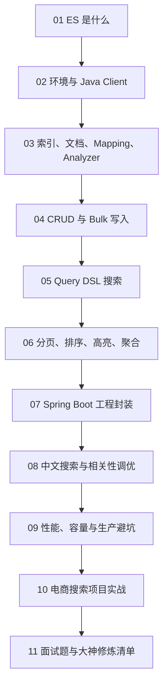

# Java Elasticsearch 从 0 基础到大神

> [!tip] 学习定位
> Elasticsearch 不是“会调一个 search API”这么简单。它更像一座图书馆：索引是书架，文档是书，倒排索引是目录卡片，分词器是把一句话拆成关键词的 librarian，相关性评分是“这本书到底像不像你想找的那本”。

> [!abstract] 彩色阅读导航
> - 蓝色 `info/tip`：概念、心智模型、学习路线。
> - 绿色 `success/example`：推荐写法、可复制模板、实战经验。
> - 黄色 `warning`：容易误解、版本差异、迁移提醒。
> - 红色 `danger`：线上高危坑，比如深分页、随手改 analyzer、无限 bulk、把 ES 当数据库。

> [!success] 推荐阅读顺序
> 零基础：`01 -> 02 -> 03 -> 04 -> 05`。  
> 想写业务搜索：`05 -> 06 -> 07 -> 08 -> 10`。  
> 想冲生产和面试：`03 -> 08 -> 09 -> 11`。

## 当前版本口径

- 官方推荐使用 `co.elastic.clients:elasticsearch-java` 这个 Java API Client，它提供强类型请求/响应、同步与异步客户端、Builder 风格 API，并把 HTTP 连接池、重试等传输细节委托给底层 HTTP client。
- 2026-06-10 查询 Maven Central / Sonatype，`co.elastic.clients:elasticsearch-java` 最新版本为 `9.4.2`。
- 实战建议：客户端大版本尽量和 Elasticsearch 服务端大版本保持一致；如果公司仍在 ES 8.x，就用 8.x 客户端，不要只追最新。

## 学习地图

## 模块目录

1. [[01-ES是什么与搜索思维]]
2. [[02-环境搭建与JavaClient连接]]
3. [[03-索引文档Mapping与Analyzer]]
4. [[04-CRUD与Bulk批量写入]]
5. [[05-QueryDSL搜索从入门到进阶]]
6. [[06-分页排序高亮与聚合]]
7. [[07-SpringBoot集成与工程封装]]
8. [[08-中文搜索同义词与相关性调优]]
9. [[09-性能容量与生产运维避坑]]
10. [[10-项目实战电商搜索API]]
11. [[11-面试题与大神修炼清单]]

## 最终你要掌握什么

零基础阶段：

1. 知道 ES 解决什么问题，不把它当 MySQL 替代品。
2. 能区分 index、document、mapping、field、shard、replica。
3. 会用 Java API Client 连接 ES，完成新增、查询、更新、删除。
4. 能写 `match`、`term`、`bool`、`range`、`multi_match`。
5. 知道 `text` 和 `keyword` 的区别。

进阶阶段：

1. 能设计业务索引 Mapping。
2. 会用 Bulk 批量写入并处理局部失败。
3. 能做分页、排序、高亮、聚合统计。
4. 能在 Spring Boot 中封装搜索服务。
5. 能解释中文分词、同义词、拼音、相关性评分。

大神阶段：

1. 能根据业务设计索引、别名、生命周期、重建索引方案。
2. 能识别深分页、热点 shard、mapping 爆炸、refresh 太频繁等生产问题。
3. 能设计搜索体验：召回、过滤、排序、权重、纠错、推荐词。
4. 能把 ES 和数据库、消息队列、缓存组合成稳定架构。
5. 能在面试里讲清楚“为什么这么设计”，不是只背 API。

## 官方资料入口

- Elastic Java API Client: https://www.elastic.co/docs/reference/elasticsearch/clients/java
- Java API Client usage: https://www.elastic.co/docs/reference/elasticsearch/clients/java/usage
- Index fundamentals: https://www.elastic.co/docs/manage-data/data-store/index-basics
- Analyzer mapping parameter: https://www.elastic.co/docs/reference/elasticsearch/mapping-reference/analyzer
- Doc values: https://www.elastic.co/docs/reference/elasticsearch/mapping-reference/doc-values
- Query string query: https://www.elastic.co/docs/reference/query-languages/query-dsl/query-dsl-query-string-query
- Maven Central / Sonatype: https://central.sonatype.com/artifact/co.elastic.clients/elasticsearch-java

