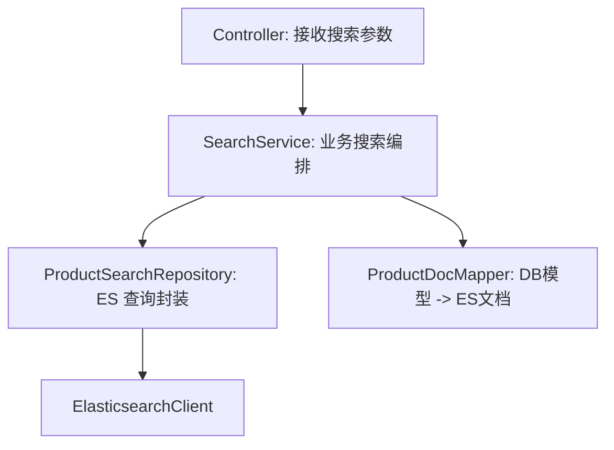

# Spring Boot 集成与工程封装

> [!tip] 本章目标
> 你要把 ES 代码从 demo 变成工程里能长期维护的结构。

## 推荐分层



## 配置类

```java
@Configuration
public class ElasticsearchConfig {

    @Bean
    ElasticsearchClient elasticsearchClient(
            @Value("${app.elasticsearch.scheme:http}") String scheme,
            @Value("${app.elasticsearch.host:localhost}") String host,
            @Value("${app.elasticsearch.port:9200}") int port
    ) {
        Rest5Client restClient = Rest5Client
                .builder(new HttpHost(scheme, host, port))
                .build();
        ElasticsearchTransport transport = new Rest5ClientTransport(
                restClient,
                new JacksonJsonpMapper()
        );
        return new ElasticsearchClient(transport);
    }
}
```

## 搜索请求对象

```java
public record ProductSearchRequest(
        String keyword,
        String category,
        Double minPrice,
        Double maxPrice,
        Integer page,
        Integer size
) {}
```

## Repository 封装

```java
@Repository
public class ProductSearchRepository {

    private final ElasticsearchClient client;

    public ProductSearchRepository(ElasticsearchClient client) {
        this.client = client;
    }

    public SearchResponse<ProductDoc> search(ProductSearchRequest req) throws IOException {
        int page = req.page() == null || req.page() < 1 ? 1 : req.page();
        int size = req.size() == null || req.size() < 1 ? 20 : Math.min(req.size(), 100);

        return client.search(s -> s
                .index("products_v1")
                .from((page - 1) * size)
                .size(size)
                .query(q -> q.bool(b -> {
                    if (req.keyword() != null && !req.keyword().isBlank()) {
                        b.must(m -> m.multiMatch(mm -> mm
                                .query(req.keyword())
                                .fields("name^3", "brand", "category")
                        ));
                    }
                    if (req.category() != null && !req.category().isBlank()) {
                        b.filter(f -> f.term(t -> t.field("category").value(req.category())));
                    }
                    if (req.minPrice() != null || req.maxPrice() != null) {
                        b.filter(f -> f.range(r -> r.number(n -> {
                            n.field("price");
                            if (req.minPrice() != null) n.gte(req.minPrice());
                            if (req.maxPrice() != null) n.lte(req.maxPrice());
                            return n;
                        })));
                    }
                    return b;
                })), ProductDoc.class);
    }
}
```

> [!warning] Lambda Builder 可读性
> Java Client 的 Builder 很强，但复杂查询全写在一个 lambda 里会变成面条。真实项目可以拆成 `buildKeywordQuery`、`buildFilters` 等小方法。

## Service 输出 DTO

```java
public record SearchResult<T>(
        long total,
        List<T> items
) {}
```

```java
@Service
public class ProductSearchService {

    private final ProductSearchRepository repository;

    public ProductSearchService(ProductSearchRepository repository) {
        this.repository = repository;
    }

    public SearchResult<ProductDoc> search(ProductSearchRequest request) throws IOException {
        SearchResponse<ProductDoc> response = repository.search(request);
        List<ProductDoc> items = response.hits().hits().stream()
                .map(Hit::source)
                .filter(Objects::nonNull)
                .toList();
        long total = response.hits().total() == null ? items.size() : response.hits().total().value();
        return new SearchResult<>(total, items);
    }
}
```

## Controller

```java
@RestController
@RequestMapping("/api/products/search")
public class ProductSearchController {

    private final ProductSearchService service;

    public ProductSearchController(ProductSearchService service) {
        this.service = service;
    }

    @GetMapping
    public SearchResult<ProductDoc> search(ProductSearchRequest request) throws IOException {
        return service.search(request);
    }
}
```

## 本章小结

> [!success] 工程化标准
> Controller 不碰 ES DSL，Service 管业务语义，Repository 管 ES 细节，DocMapper 管模型转换。这样以后换索引、换权重、换同步策略时不会牵一发动全身。
