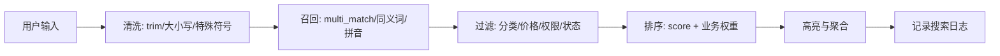

# 中文搜索、同义词与相关性调优

> [!tip] 本章目标
> 你要从“能搜到”进化到“搜得准、排得对、体验像个正常产品”。

## 中文为什么麻烦

英文天然有空格，中文没有。`小米手机保护壳` 到底要拆成：

```text
小米 / 手机 / 保护壳
```

还是：

```text
小米手机 / 手机保护壳 / 保护 / 壳
```

分词不同，召回结果就不同。

> [!info] 召回和排序
> 召回：哪些文档有资格进入候选集。  
> 排序：候选集中谁排前面。  
> 搜索体验差，通常不是一个 API 能救，而是召回、字段权重、排序规则、数据质量一起出问题。

## 字段权重

商品搜索常见权重：

```java
client.search(s -> s
        .index("products_v1")
        .query(q -> q.multiMatch(m -> m
                .query("苹果手机")
                .fields("name^5", "brand^3", "category^2", "description")
        )), ProductDoc.class);
```

> [!success] 权重直觉
> 用户搜“苹果手机”，商品名命中比描述命中更重要，品牌命中也很重要。权重就是把这种业务直觉写进搜索排序。

## 同义词

同义词解决的是“用户说 A，商品写 B”。

| 用户搜 | 可能同义 |
|---|---|
| 手机 | 移动电话、智能机 |
| 笔记本 | 电脑、手提电脑 |
| T恤 | 短袖、体恤 |

> [!warning] 同义词不是越多越好
> 同义词会扩大召回，也可能引入噪声。生产里要从搜索日志、无结果词、点击率里迭代，不要凭感觉堆词库。

## 拼音与首字母

中文站内搜索常见需求：

1. 搜 `xiaomi` 能出“小米”。
2. 搜 `xm` 能出“小米”。
3. 搜错别字或近音词也能给建议。

这类能力一般通过插件、额外字段、搜索建议服务或专门的召回链路实现。

## 相关性调优常见手段

1. 字段 boost：`name^5`。
2. 业务排序：销量、库存、上架时间、评分。
3. 过滤低质量数据：下架、无库存、违规内容。
4. 短语匹配：完整命中短语加分。
5. 同义词：扩大召回。
6. 搜索日志：根据真实用户行为调权。

## 常见搜索链路



> [!danger] 不要只盯 score
> `_score` 代表文本相关性，不代表业务价值。商品搜索通常需要 `_score + 销量 + 库存 + 新品 + 个性化` 的综合排序。

## 本章小结

> [!success] 大神思维
> 初学者问“这个 DSL 怎么写”；高手问“用户为什么搜不到、为什么点错、为什么排错、如何用数据验证改进”。

