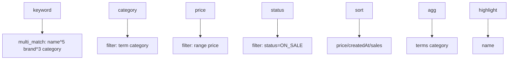
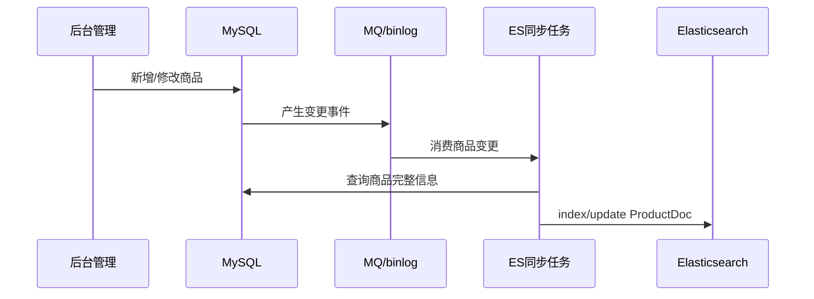

# 项目实战：电商搜索 API

> [!tip] 本章目标
> 用一个完整项目把前面的知识串起来：商品搜索、分类筛选、价格过滤、排序、高亮、聚合。

## 需求

搜索接口支持：

1. 关键词搜索商品名、品牌、分类。
2. 按分类过滤。
3. 按价格区间过滤。
4. 按价格、上架时间排序。
5. 返回分类聚合。
6. 返回商品名高亮。

## 索引设计

```text
products_v1
```

字段：

| 字段 | 类型 | 用途 |
|---|---|---|
| id | keyword | 商品 ID |
| name | text + keyword | 全文搜索 + 精确排序 |
| brand | keyword | 品牌筛选 |
| category | keyword | 分类筛选与聚合 |
| price | double | 价格过滤与排序 |
| stock | integer | 库存过滤 |
| status | keyword | 上下架 |
| sales | long | 销量排序 |
| createdAt | date | 新品排序 |

## 搜索接口

```http
GET /api/products/search?keyword=Java&category=book&minPrice=10&maxPrice=100&page=1&size=20
```

## 查询构造思路



## 返回结构

```java
public record ProductSearchView(
        String id,
        String name,
        String highlightedName,
        String brand,
        String category,
        double price,
        int stock
) {}

public record ProductSearchResponse(
        long total,
        List<ProductSearchView> items,
        Map<String, Long> categoryCounts
) {}
```

## 同步链路



> [!warning] 为什么同步任务要回查 DB
> 变更事件里可能只有商品 ID 或局部字段。构建 ES 文档时最好拿完整商品快照，避免文档缺字段或状态不一致。

## MVP 开发顺序

1. 建索引和 mapping。
2. 写 20 条测试数据。
3. 完成关键词搜索。
4. 加分类和价格 filter。
5. 加分页、排序、高亮。
6. 加分类聚合。
7. 封装 Controller。
8. 加参数限制和异常处理。
9. 再做同步链路。

> [!success] 做项目的正确姿势
> 先把搜索体验跑通，再优化同步链路和生产细节。否则很容易写了一堆同步代码，最后发现字段设计根本不支持需求。

## 本章小结

> [!info] 项目验收标准
> 用户搜得到，结果排得像人话，筛选项准确，接口有边界保护，数据同步可补偿，这才算一个能交付的 ES 搜索功能。

