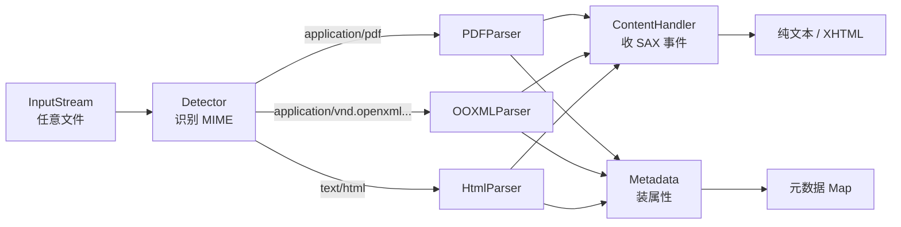

# 01 · Tika 简介与核心概念

> [!info] 上一篇 / 下一篇
> ← [[00 - Apache Tika 教程总览]]　|　→ [[02 - 安装与环境配置]]

## 1. Tika 是什么

Apache Tika 是一个 **Java 写的内容分析工具包**。它做三件事：

1. **检测**（Detection）— 这是个什么文件？（PDF？DOCX？还是改了后缀的 EXE？）
2. **解析**（Parsing）— 把文件里的"文字"和"结构"抽出来
3. **元数据提取**（Metadata extraction）— 作者、创建时间、相机型号、GPS …

它的口号是：

> "**One parser to rule them all**" — 一套 API，一千多种格式。

## 2. 为什么需要它

不用 Tika 的话，你得自己集成：

| 格式 | 要用的库 |
|------|--------|
| PDF | PDFBox / iText |
| .doc / .xls / .ppt | POI HSSF/HSLF |
| .docx / .xlsx / .pptx | POI XSSF/XWPF/XSLF |
| HTML | jsoup / TagSoup |
| EML / MSG | mime4j / poi-scratchpad |
| ZIP / 7z / TAR | commons-compress |
| 图片 EXIF | metadata-extractor |
| 音视频 | jaudiotagger / 自己写 |

每种 API 都不一样，错误处理也不一样。Tika **把它们全部封装在一个 `Parser` 接口后面**，你只关心"输入流进去，文本出来"。

## 3. 三大核心抽象

> [!important] 必须烂熟于心
> Parser、ContentHandler、Metadata —— Tika 任何代码都绕不开这三个。

### 3.1 Parser（解析器）

```java
public interface Parser {
    void parse(InputStream stream,
               ContentHandler handler,
               Metadata metadata,
               ParseContext context)
        throws IOException, SAXException, TikaException;
}
```

- 一个 `Parser` 对应一类文件（PDFParser、OOXMLParser …）
- `AutoDetectParser` 是"调度员"，先检测再委派给具体 Parser
- 详见 [[05 - 解析器 Parser 详解]]

### 3.2 ContentHandler（内容处理器）

Tika 把解析过程**当成 SAX 事件流**：每遇到一个段落、标题、表格行就发一个事件。你给它一个 `ContentHandler` 来收事件。

常用的几种：

| Handler | 输出 |
|---|---|
| `BodyContentHandler` | 纯文本（HTML body 里的字） |
| `ToXMLContentHandler` | 带结构的 XHTML |
| `ToTextContentHandler` | 极简文本 |
| `LinkContentHandler` | 只收 `<a>` 链接 |
| `RecursiveParserWrapperHandler` | 递归收集嵌入文档 |

详见 [[06 - 内容处理器 ContentHandler]]

### 3.3 Metadata（元数据）

一个 `Map<String, String[]>`，键来自标准命名空间：

```java
metadata.get("Content-Type");          // "application/pdf"
metadata.get(TikaCoreProperties.TITLE); // "2025 财报"
metadata.get(TikaCoreProperties.CREATOR);
metadata.get(PDF.DOC_INFO_CREATOR_TOOL);
```

详见 [[07 - 元数据 Metadata]]

## 4. 一张图理清整体流程



## 5. Tika 的发行物（搞清楚谁是谁）

| 发行物 | 用途 | 你需要的场景 |
|---|---|---|
| **tika-core** | 接口 + 检测器，**不含**任何具体解析器 | 自己挑选解析器，避免依赖膨胀 |
| **tika-parsers-standard-package** | 一个全家桶 jar，含所有"安全"的解析器 | 99% 项目用这个 |
| **tika-app** | 可执行 jar，含 CLI + Swing GUI | 命令行用、临时测试 |
| **tika-server** | 可执行 jar，启动 HTTP 服务 | 跨语言调用、微服务化 |
| **tika-pipes** / **tika-eval** | 批量管道 / 效果评估 | 大规模处理、做对比试验 |

> [!warning] 别一上来就引 tika-app
> `tika-app` 把 GUI、CLI、所有解析器、所有依赖全塞进一个 100MB+ 的 fat jar。生产项目应该用 `tika-parsers-standard-package`（见 [[02 - 安装与环境配置]]）。

## 6. 适用场景

- ✅ 搜索引擎建索引前的"内容抽取"
- ✅ RAG / 知识库导入
- ✅ 合规扫描（找隐藏的作者名、修订历史）
- ✅ 数据治理（统计企业网盘里都有什么类型的文件）
- ✅ 邮件归档（解 EML / PST 附件）
- ✅ 电子取证（forensics）

## 7. 不适合做什么

- ❌ 高保真渲染（要看 PDF 长啥样 → 用 PDFBox/PDF.js）
- ❌ 修改文件（Tika 只读不写 → 用 POI / PDFBox 写）
- ❌ 重度 OCR 流水线（Tika 集成 Tesseract，但大批量建议直接用 Tesseract）

---

下一步：[[02 - 安装与环境配置]] —— 把 Tika 装进你的项目。
