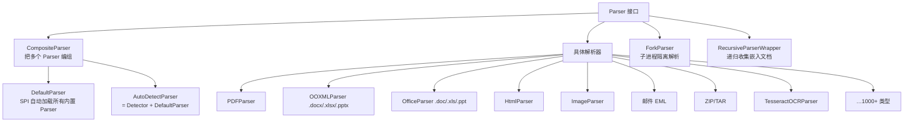

# 05 · 解析器 Parser 详解

> [!info] 上一篇 / 下一篇
> ← [[04 - Java API 入门]]　|　→ [[06 - 内容处理器 ContentHandler]]

## 1. Parser 接口

只有一个方法：

```java
public interface Parser {
    Set<MediaType> getSupportedTypes(ParseContext context);

    void parse(InputStream stream,
               ContentHandler handler,
               Metadata metadata,
               ParseContext context)
        throws IOException, SAXException, TikaException;
}
```

`getSupportedTypes()` 告诉 Tika "我能处理哪些 MIME"；`parse()` 真正干活。

## 2. 解析器家谱



## 3. 三个核心 Parser 实现

### 3.1 `AutoDetectParser` — 99% 的场景就用它

> 自动检测 MIME → 选对应 Parser → 解析。

```java
Parser parser = new AutoDetectParser();
// 等价于:
Parser parser2 = new AutoDetectParser(TikaConfig.getDefaultConfig());
```

带配置版本：

```java
TikaConfig config = new TikaConfig("/path/to/tika-config.xml");
Parser parser = new AutoDetectParser(config);
```

### 3.2 `CompositeParser` — 手挑解析器

```java
Map<MediaType, Parser> map = new HashMap<>();
map.put(MediaType.application("pdf"), new PDFParser());
map.put(MediaType.text("html"), new HtmlParser());
CompositeParser parser = new CompositeParser(new MediaTypeRegistry(), map);
```

适合**严格控制依赖**的场景（比如服务只允许处理 PDF + HTML）。

### 3.3 直接用具体 Parser

```java
Parser parser = new org.apache.tika.parser.pdf.PDFParser();
parser.parse(in, handler, metadata, ctx);
```

绕过 detector，**性能略好**；但失去了"格式被错误识别也能兜底"的能力。

## 4. ParseContext — 给 Parser 传配置的"信箱"

```java
ParseContext ctx = new ParseContext();

// 1) 让嵌入文档复用 parser（必须！否则附件/嵌图不会解）
ctx.set(Parser.class, parser);

// 2) PDF 解析配置
PDFParserConfig pdfCfg = new PDFParserConfig();
pdfCfg.setExtractAnnotationText(true);
pdfCfg.setExtractInlineImages(false);
pdfCfg.setOcrStrategy(PDFParserConfig.OCR_STRATEGY.OCR_AND_TEXT_EXTRACTION);
ctx.set(PDFParserConfig.class, pdfCfg);

// 3) OCR 配置
TesseractOCRConfig ocrCfg = new TesseractOCRConfig();
ocrCfg.setLanguage("eng+chi_sim");
ctx.set(TesseractOCRConfig.class, ocrCfg);

// 4) Office 配置
OfficeParserConfig officeCfg = new OfficeParserConfig();
officeCfg.setExtractMacros(false);
ctx.set(OfficeParserConfig.class, officeCfg);

parser.parse(in, handler, metadata, ctx);
```

> [!important] `ctx.set(Parser.class, parser)` 是新手最常忘的一行
> 没设的话，PDF 里的内嵌附件、ZIP 里的子文件、邮件里的附件**都不会被解析**，只会留个空壳元数据。

## 5. RecursiveParserWrapper — 把"嵌入文档"打散成列表

默认 `parse()` 把 ZIP/邮件/嵌图全**拼成一坨文本**。如果你想**每个子文档单独有自己的 metadata 和 text**：

```java
import org.apache.tika.parser.RecursiveParserWrapper;
import org.apache.tika.sax.BasicContentHandlerFactory;
import org.apache.tika.sax.RecursiveParserWrapperHandler;
import org.apache.tika.parser.AutoDetectParser;

Parser p = new AutoDetectParser();
RecursiveParserWrapper wrapper = new RecursiveParserWrapper(p);

RecursiveParserWrapperHandler handler = new RecursiveParserWrapperHandler(
    new BasicContentHandlerFactory(
        BasicContentHandlerFactory.HANDLER_TYPE.TEXT, -1));

wrapper.parse(in, handler, new Metadata(), new ParseContext());

List<Metadata> docs = handler.getMetadataList();
// docs[0] 是外层文档；docs[1..n] 是每个嵌入文档
for (Metadata m : docs) {
    System.out.println("=== " + m.get("Content-Type"));
    System.out.println(m.get(RecursiveParserWrapperHandler.TIKA_CONTENT));
}
```

详见 [[12 - 嵌入式文档与递归解析]]。

## 6. ForkParser — 防爆进程隔离

某些"坏"文档会让解析器 OOM / 死循环 / 进入死锁，这会拖垮你的整个 JVM。`ForkParser` 把每次解析**放在子进程里**，崩了也不影响主进程：

```java
import org.apache.tika.fork.ForkParser;

ForkParser fork = new ForkParser(
    ClassLoader.getSystemClassLoader(),
    new AutoDetectParser());

fork.setJavaCommand(List.of("java", "-Xmx512m"));
fork.setServerPulseMillis(5000);

try {
    fork.parse(in, handler, metadata, ctx);
} finally {
    fork.close();
}
```

> [!warning] 性能成本
> 每次 fork 一个 JVM 子进程，启动 0.5–1s。**只对不可信文件**（用户上传、外部源）这么干，可信文件直接 `AutoDetectParser`。

## 7. 解析器超时

> 在 Tika 3.x 推荐用 **ParseRecord + 超时机制**，但最简单的方式是**线程包一层**：

```java
ExecutorService es = Executors.newSingleThreadExecutor();
Future<?> future = es.submit(() -> {
    parser.parse(in, handler, metadata, ctx);
    return null;
});
try {
    future.get(30, TimeUnit.SECONDS);
} catch (TimeoutException e) {
    future.cancel(true);
    throw new RuntimeException("parse timeout");
}
```

更彻底的方案：用 `ForkParser` 配合子进程 kill。生产实战见 [[15 - 性能调优与最佳实践]]。

## 8. 自己写一个 Parser

实现 `Parser` 接口，做 SPI 注册。详见 [[19 - 大神进阶 - 自定义解析器开发]]。

## 9. 速查：常用 Parser 类

| 格式 | 类 |
|---|---|
| 自动 | `org.apache.tika.parser.AutoDetectParser` |
| 默认组合 | `org.apache.tika.parser.DefaultParser` |
| PDF | `org.apache.tika.parser.pdf.PDFParser` |
| .doc/.xls/.ppt | `org.apache.tika.parser.microsoft.OfficeParser` |
| .docx/.xlsx/.pptx | `org.apache.tika.parser.microsoft.ooxml.OOXMLParser` |
| HTML | `org.apache.tika.parser.html.HtmlParser` |
| 邮件 EML | `org.apache.tika.parser.mail.RFC822Parser` |
| Outlook .msg | `org.apache.tika.parser.microsoft.OutlookExtractor` |
| 图片 | `org.apache.tika.parser.image.ImageParser` / `JempboxExtractor` |
| OCR | `org.apache.tika.parser.ocr.TesseractOCRParser` |
| ZIP/TAR/7z | `org.apache.tika.parser.pkg.PackageParser` |
| 音视频 | `org.apache.tika.parser.mp3.Mp3Parser` / `Mp4Parser` |
| RDF/XML | `org.apache.tika.parser.xml.XMLParser` |

---

下一步：[[06 - 内容处理器 ContentHandler]] —— 控制"输出长什么样"。
