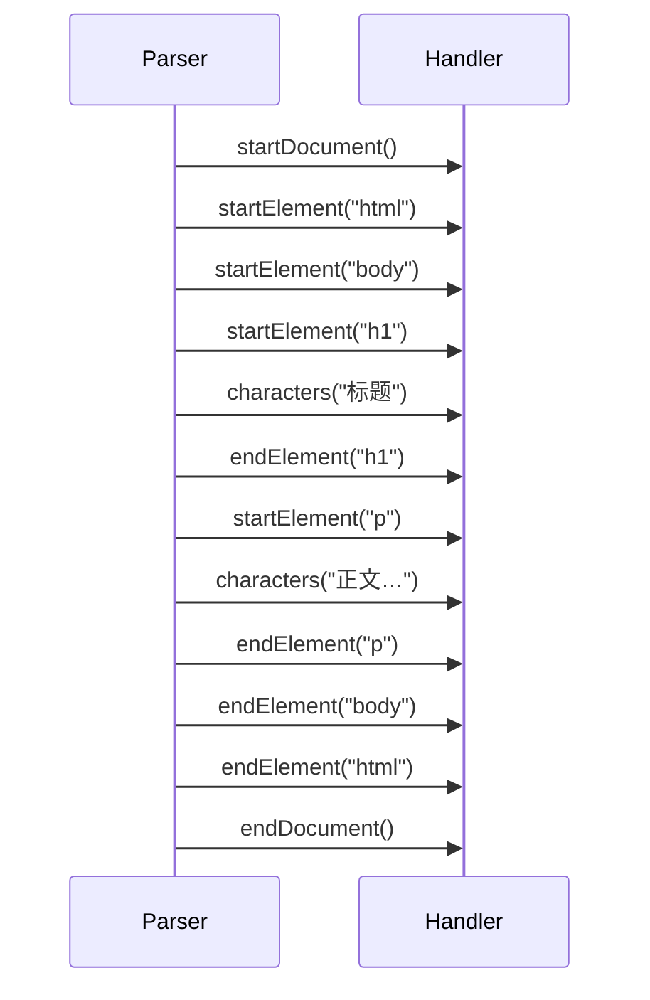

# 06 · 内容处理器 ContentHandler

> [!info] 上一篇 / 下一篇
> ← [[05 - 解析器 Parser 详解]]　|　→ [[07 - 元数据 Metadata]]

Tika 解析过程实际上是**把文档转成 XHTML，再以 SAX 事件流的形式发出**。`ContentHandler` 是 SAX 标准接口，你给 Tika 一个 Handler，Tika 把事件发给你。



## 1. 常用 Handler 一览

| Handler                         | 给你什么                   | 场景           |
| ------------------------------- | ---------------------- | ------------ |
| `BodyContentHandler`            | 纯文本（去 HTML 标签）         | 99% 场景       |
| `ToXMLContentHandler`           | XHTML 字符串              | 保留段落/标题/表格结构 |
| `ToHTMLContentHandler`          | HTML 字符串               | 渲染或调试        |
| `ToTextContentHandler`          | 文本（不去章节，但更"贴近 SAX 原始"） | 极简流式         |
| `LinkContentHandler`            | 仅 `<a href>` 列表        | 链接挖掘         |
| `PhoneExtractingContentHandler` | 文本中的电话号码               | 数据脱敏/挖掘      |
| `BoilerpipeContentHandler`      | 仅"正文"，去导航/侧栏（HTML）     | 新闻抓取         |
| `MatchingContentHandler`        | 只发往匹配特定 XPath 的元素      | 精准抽取         |
| `RecursiveParserWrapperHandler` | 把每个嵌入文档单独装             | 邮件/ZIP       |
| `DefaultHandler`（自己继承）          | 完全自定义                  | 进阶           |

## 2. BodyContentHandler — 最常用

```java
new BodyContentHandler();              // 默认 100_000 字符上限
new BodyContentHandler(-1);            // 无上限（注意内存）
new BodyContentHandler(5_000_000);     // 自定义上限
new BodyContentHandler(writer);        // 流式写到 Writer/OutputStream
```

> [!warning] 上限触发抛 `SAXException`
> 实际是 `WriteOutContentHandler.WriteLimitReachedException`。要么放大 limit，要么捕获后**继续读 metadata**。

```java
try {
    parser.parse(in, handler, meta, ctx);
} catch (SAXException e) {
    if (e.getCause() instanceof WriteLimitReachedException) {
        // 是字符数到顶；text 是已经截断的；meta 可以照常用
    } else throw e;
}
```

## 3. ToXMLContentHandler — 保留结构

```java
ToXMLContentHandler handler = new ToXMLContentHandler("UTF-8");
parser.parse(in, handler, meta, ctx);
String xhtml = handler.toString();
// <?xml version="1.0" encoding="UTF-8"?>
// <html xmlns="http://www.w3.org/1999/xhtml">
//   <head><title>报告</title></head>
//   <body><h1>第一章</h1><p>...</p></body>
// </html>
```

适合：**导入到 Elasticsearch 时保留段落分隔**、**渲染预览**、**喂给 LLM 做 chunking**（按 `<p>` / `<h2>` 切片更准）。

## 4. LinkContentHandler — 抽链接

```java
LinkContentHandler handler = new LinkContentHandler();
parser.parse(in, handler, meta, ctx);
List<Link> links = handler.getLinks();
links.forEach(l -> System.out.println(l.getUri()));
```

## 5. 多 Handler 组合 — TeeContentHandler

> 想同时拿"纯文本"和"所有链接"？两次 parse？不必，用 `TeeContentHandler`：

```java
BodyContentHandler body = new BodyContentHandler(-1);
LinkContentHandler links = new LinkContentHandler();
TeeContentHandler handler = new TeeContentHandler(body, links);

parser.parse(in, handler, meta, ctx);
System.out.println(body.toString());
System.out.println(links.getLinks());
```

## 6. XPath 精准抽取 — MatchingContentHandler

只抽 `<h1>`：

```java
import org.apache.tika.sax.xpath.*;

XPathParser xpathParser = new XPathParser("xhtml", "http://www.w3.org/1999/xhtml");
Matcher matcher = xpathParser.parse("/xhtml:html/xhtml:body//xhtml:h1//text()");

BodyContentHandler innerH1 = new BodyContentHandler(-1);
MatchingContentHandler handler = new MatchingContentHandler(innerH1, matcher);

parser.parse(in, handler, meta, ctx);
System.out.println("All h1: " + innerH1.toString());
```

## 7. 自定义 SAX Handler

继承 `DefaultHandler`（或 `org.xml.sax.helpers.DefaultHandler`）。**真·流式**，不占内存：

```java
import org.xml.sax.Attributes;
import org.xml.sax.helpers.DefaultHandler;

public class ParagraphCollector extends DefaultHandler {
    private final List<String> paragraphs = new ArrayList<>();
    private StringBuilder current = null;

    @Override
    public void startElement(String uri, String localName, String qName, Attributes atts) {
        if ("p".equals(localName)) current = new StringBuilder();
    }

    @Override
    public void characters(char[] ch, int start, int length) {
        if (current != null) current.append(ch, start, length);
    }

    @Override
    public void endElement(String uri, String localName, String qName) {
        if ("p".equals(localName) && current != null) {
            paragraphs.add(current.toString().trim());
            current = null;
        }
    }

    public List<String> getParagraphs() { return paragraphs; }
}
```

用法：

```java
ParagraphCollector handler = new ParagraphCollector();
parser.parse(in, handler, meta, ctx);
handler.getParagraphs().forEach(System.out::println);
```

> [!tip] LLM / RAG 用这种最香
> 直接拿到结构化段落列表，可以按段聚合做 chunking，比对纯文本切分准得多。

## 8. 流式输出到磁盘 / 网络

```java
try (Writer writer = Files.newBufferedWriter(Path.of("out.txt"), StandardCharsets.UTF_8)) {
    parser.parse(in, new BodyContentHandler(writer), meta, ctx);
}
```

或者写到 `ServletOutputStream`：

```java
try (PrintWriter w = response.getWriter()) {
    parser.parse(in, new BodyContentHandler(w), meta, ctx);
}
```

## 9. 嵌入文档每个独立 — RecursiveParserWrapperHandler

详见 [[12 - 嵌入式文档与递归解析]]。简版：

```java
RecursiveParserWrapper wrapper = new RecursiveParserWrapper(new AutoDetectParser());
RecursiveParserWrapperHandler handler = new RecursiveParserWrapperHandler(
    new BasicContentHandlerFactory(BasicContentHandlerFactory.HANDLER_TYPE.XML, -1));

wrapper.parse(in, handler, new Metadata(), new ParseContext());

for (Metadata m : handler.getMetadataList()) {
    System.out.println(m.get(RecursiveParserWrapperHandler.TIKA_CONTENT));
}
```

## 10. 速记表

```java
// 纯文本
new BodyContentHandler(-1)

// XHTML 字符串
new ToXMLContentHandler()

// 只要链接
new LinkContentHandler()

// 流式到文件
new BodyContentHandler(new FileWriter("out.txt"))

// 同时收两种
new TeeContentHandler(handlerA, handlerB)

// 嵌入文档单独装
new RecursiveParserWrapperHandler(new BasicContentHandlerFactory(...))
```

---

下一步：[[07 - 元数据 Metadata]] —— 文件背后的"数据"。
