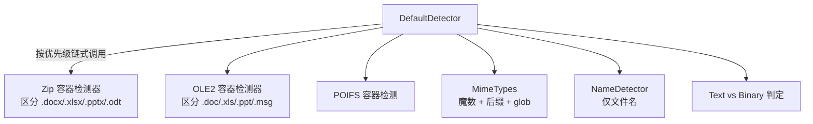

# 08 · 文件类型检测 Detector

> [!info] 上一篇 / 下一篇
> ← [[07 - 元数据 Metadata]]　|　→ [[09 - 语言检测]]

`Detector` 解决一个问题："**这个字节流到底是什么文件？**" — 不能只看后缀（用户随便改），也不能只看魔数（很多格式没有）。

## 1. 用 Facade 一行检测

```java
Tika tika = new Tika();

String t1 = tika.detect(new File("mystery.bin"));      // 看魔数 + 后缀
String t2 = tika.detect(inputStream);                  // 仅看流前 N 字节
String t3 = tika.detect(bytes);                        // 字节数组
String t4 = tika.detect("xxx.pdf");                    // 仅看后缀
String t5 = tika.detect(url);                          // 下载头 + 内容
```

返回的是 MIME 字符串，如 `application/pdf`、`image/png`、`application/zip`。

## 2. Detector 接口

```java
public interface Detector extends Serializable {
    MediaType detect(InputStream input, Metadata metadata) throws IOException;
}
```

要求 `InputStream` 必须支持 `mark/reset`，否则会破坏后续解析。**推荐**统一包一层：

```java
import org.apache.tika.io.TikaInputStream;

try (TikaInputStream tis = TikaInputStream.get(originalInputStream)) {
    MediaType mt = detector.detect(tis, new Metadata());
    System.out.println(mt);
    // tis 仍然可以接着用，detector 内部会 reset
}
```

`TikaInputStream` 自动处理 mark/reset 与缓存。

## 3. 内置检测器家谱



**`DefaultDetector` 已经按优先级把它们组合好了**，平时直接用它。

```java
Detector detector = new DefaultDetector();
```

或带配置：

```java
TikaConfig cfg = TikaConfig.getDefaultConfig();
Detector detector = cfg.getDetector();
```

## 4. MimeTypes — Tika 的"魔数字典"

Tika 自带 `tika-mimetypes.xml`，里面定义了上千种 MIME，每个有：

- **魔数（magic）**：文件头的字节序列
- **glob**：文件名模式（`*.pdf`、`*.tar.gz`）
- **父子关系**：`image/svg+xml` 继承 `application/xml`

加载：

```java
import org.apache.tika.mime.MimeTypes;

MimeTypes types = MimeTypes.getDefaultMimeTypes();
MediaType mt = types.detect(stream, new Metadata());
System.out.println(mt.toString());        // "application/zip"
```

## 5. 区分"穿了 ZIP 外套"的文件

`.docx`、`.xlsx`、`.pptx`、`.odt`、`.jar`、`.apk`、`.epub` 全是 ZIP 容器，魔数都是 `PK\x03\x04`。光看魔数只能识别成 `application/zip`。

**Tika 的容器检测器**会读 ZIP 里的关键路径再决定：

| 路径包含 | 识别为 |
|---|---|
| `word/document.xml` | DOCX |
| `xl/workbook.xml` | XLSX |
| `ppt/presentation.xml` | PPTX |
| `META-INF/MANIFEST.MF` | JAR |
| `AndroidManifest.xml` | APK |
| `META-INF/container.xml` | EPUB |
| `mimetype` 文件 | ODF |

这就是为什么强烈推荐用 `DefaultDetector` 而不是单独的 `MimeTypes`。

## 6. 检测 vs 后缀名 — 谁优先

`MimeTypes#detect` 内部会同时考虑：

1. **魔数命中？** → 用魔数结果
2. **没魔数但后缀命中？** → 用后缀结果
3. **冲突？**（魔数说是 PDF，后缀 .jpg）→ 优先**更具体的**类型

如果你**信任**用户传的文件名，可以预先在 metadata 里设：

```java
Metadata meta = new Metadata();
meta.set(TikaCoreProperties.RESOURCE_NAME_KEY, originalFileName);
MediaType mt = detector.detect(in, meta);
```

## 7. 列出 Tika 支持的所有 MIME

```java
MimeTypes types = MimeTypes.getDefaultMimeTypes();
for (MediaType mt : types.getMediaTypeRegistry().getTypes()) {
    System.out.println(mt);
}
```

或命令行：

```bash
java -jar tika-app.jar --list-supported-types
```

## 8. 自定义 MIME 类型

新建 `src/main/resources/org/apache/tika/mime/custom-mimetypes.xml`：

```xml
<?xml version="1.0" encoding="UTF-8"?>
<mime-info>
    <mime-type type="application/x-my-format">
        <magic priority="60">
            <match value="MYFMT" type="string" offset="0"/>
        </magic>
        <glob pattern="*.myfmt"/>
        <sub-class-of type="application/octet-stream"/>
    </mime-type>
</mime-info>
```

Tika 启动时会自动合并 classpath 里所有 `org/apache/tika/mime/custom-mimetypes.xml`。

## 9. 仅按文件名检测（性能极快）

不读内容，只看后缀：

```java
import org.apache.tika.detect.NameDetector;
import java.util.regex.Pattern;

NameDetector nd = new NameDetector(Map.of(
    Pattern.compile(".*\\.pdf$", Pattern.CASE_INSENSITIVE), MediaType.application("pdf"),
    Pattern.compile(".*\\.html?$", Pattern.CASE_INSENSITIVE), MediaType.text("html")
));

Metadata m = new Metadata();
m.set(TikaCoreProperties.RESOURCE_NAME_KEY, "foo.PDF");
MediaType mt = nd.detect(null, m);   // application/pdf
```

适合：**网关/CDN 上根据文件名做粗筛**，不需要真的读字节。

## 10. 字符编码检测

Tika 集成了 ICU 的字符编码检测器：

```java
import org.apache.tika.parser.txt.CharsetDetector;
import org.apache.tika.parser.txt.CharsetMatch;

CharsetDetector cd = new CharsetDetector();
cd.setText(bytes);
CharsetMatch match = cd.detect();
System.out.println(match.getName());        // UTF-8 / GB18030 / Big5 …
System.out.println(match.getConfidence());  // 0-100
String text = match.getString();
```

## 11. 实战：上传时校验文件类型

```java
public boolean isAllowed(InputStream in, String declaredName, Set<String> allowedMimes)
        throws IOException {
    try (TikaInputStream tis = TikaInputStream.get(in)) {
        Metadata m = new Metadata();
        m.set(TikaCoreProperties.RESOURCE_NAME_KEY, declaredName);
        MediaType mt = new DefaultDetector().detect(tis, m);
        return allowedMimes.contains(mt.getBaseType().toString());
    }
}

// 用法
isAllowed(upload, "report.pdf", Set.of(
    "application/pdf",
    "application/vnd.openxmlformats-officedocument.wordprocessingml.document"));
```

> [!warning] 安全
> 永远 **不要只信任前端传的 MIME / 扩展名**。把上传文件交给 Tika 检测，再决定是否接受。

---

下一步：[[09 - 语言检测]] —— 这段文字是中文还是英文？
