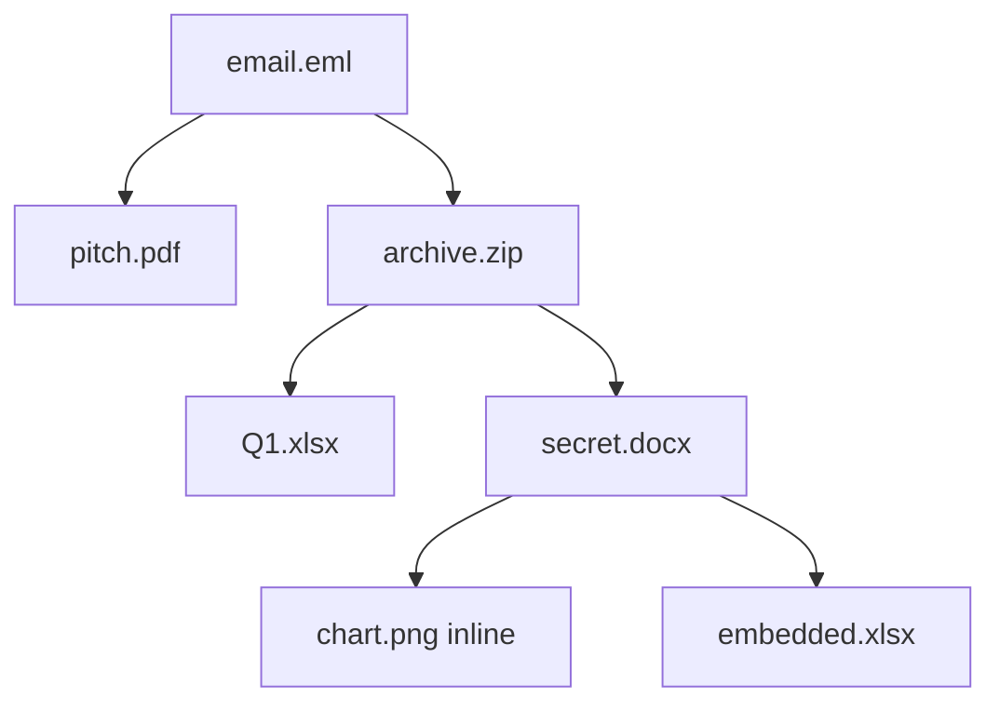

# 12 · 嵌入式文档与递归解析

> [!info] 上一篇 / 下一篇
> ← [[11 - tika-config.xml 配置]]　|　→ [[13 - tika-server REST API]]

很多文件是"套娃"：

- 一封 EML 邮件里有 3 个 PDF 附件
- 一个 DOCX 里嵌了 Excel 图表 + 2 张图片
- 一个 PowerPoint 里贴了 Word 段落
- 一个 ZIP 里又有一个 ZIP
- 一封 Outlook .msg 里有 EML 转发 → 又有附件

Tika 把这些**嵌入文档（embedded documents）**视为一等公民。

## 1. 默认行为

只要在 `ParseContext` 里设置了 `Parser`，外层解析时**会递归调进每个嵌入文档**：

```java
ParseContext ctx = new ParseContext();
ctx.set(Parser.class, parser);    // ★ 关键这一行
parser.parse(in, handler, meta, ctx);
```

**默认输出**是把所有嵌入文档的文字**拼接**到外层 ContentHandler 里，附件文件名作为元数据 `embeddedResourceType` / `resourceName` 记录。

## 2. 想"每个嵌入文档单独成一份" — RecursiveParserWrapper

```java
import org.apache.tika.parser.AutoDetectParser;
import org.apache.tika.parser.RecursiveParserWrapper;
import org.apache.tika.parser.ParseContext;
import org.apache.tika.metadata.Metadata;
import org.apache.tika.sax.BasicContentHandlerFactory;
import org.apache.tika.sax.RecursiveParserWrapperHandler;

Parser base = new AutoDetectParser();
RecursiveParserWrapper wrapper = new RecursiveParserWrapper(base);

RecursiveParserWrapperHandler handler = new RecursiveParserWrapperHandler(
    new BasicContentHandlerFactory(
        BasicContentHandlerFactory.HANDLER_TYPE.TEXT, -1));

ParseContext ctx = new ParseContext();
ctx.set(Parser.class, wrapper);

try (InputStream in = Files.newInputStream(file)) {
    wrapper.parse(in, handler, new Metadata(), ctx);
}

List<Metadata> docs = handler.getMetadataList();
// docs[0] 是外层；后续每个都是一个嵌入文档
for (int i = 0; i < docs.size(); i++) {
    Metadata m = docs.get(i);
    System.out.println("--- doc " + i + " ---");
    System.out.println("Type: " + m.get("Content-Type"));
    System.out.println("Name: " + m.get(TikaCoreProperties.RESOURCE_NAME_KEY));
    System.out.println(m.get(RecursiveParserWrapperHandler.TIKA_CONTENT));
}
```

> [!tip] RAG 场景首选
> 邮件分附件、压缩包分文件，**每个嵌入文档单独索引**才能给出准确的 source 引用。

## 3. 想"控制要不要解某个嵌入文档" — EmbeddedDocumentExtractor

实现这个接口可以**拒收某些类型**、**改文件名**、**跳过**或**只统计不解析**：

```java
import org.apache.tika.extractor.EmbeddedDocumentExtractor;

class MyExtractor implements EmbeddedDocumentExtractor {
    private final Parser delegate = new AutoDetectParser();

    @Override
    public boolean shouldParseEmbedded(Metadata metadata) {
        String type = metadata.get("Content-Type");
        return type == null || !type.startsWith("image/");   // 跳过所有图
    }

    @Override
    public void parseEmbedded(InputStream stream, ContentHandler handler,
                              Metadata metadata, boolean outputHtml)
            throws SAXException, IOException {
        try {
            delegate.parse(stream, handler, metadata, new ParseContext());
        } catch (TikaException e) {
            // 静默吃掉单个嵌入文档错误
        }
    }
}

ParseContext ctx = new ParseContext();
ctx.set(EmbeddedDocumentExtractor.class, new MyExtractor());
parser.parse(in, handler, meta, ctx);
```

## 4. 想"把嵌入文件保存到磁盘"

经典需求：**邮件附件落盘**：

```java
class AttachmentExtractor implements EmbeddedDocumentExtractor {
    private final Path outDir;
    private int counter = 0;

    AttachmentExtractor(Path outDir) { this.outDir = outDir; }

    @Override
    public boolean shouldParseEmbedded(Metadata metadata) { return true; }

    @Override
    public void parseEmbedded(InputStream stream, ContentHandler handler,
                              Metadata metadata, boolean outputHtml)
            throws SAXException, IOException {

        String name = metadata.get(TikaCoreProperties.RESOURCE_NAME_KEY);
        if (name == null || name.isBlank()) {
            name = "attachment-" + (++counter);
        }
        Path target = outDir.resolve(name);
        Files.copy(stream, target, StandardCopyOption.REPLACE_EXISTING);
    }
}
```

## 5. 递归深度 / 资源数限制（防爆）

`autoDetectParserConfig` 提供保护：

```xml
<properties>
    <autoDetectParserConfig>
        <maxEmbeddedResources>200</maxEmbeddedResources>
    </autoDetectParserConfig>
</properties>
```

或代码里：

```java
import org.apache.tika.parser.AutoDetectParserConfig;
import org.apache.tika.metadata.Metadata;

AutoDetectParserConfig cfg = new AutoDetectParserConfig();
cfg.setMaxEmbeddedResources(200L);

ParseContext ctx = new ParseContext();
ctx.set(AutoDetectParserConfig.class, cfg);
```

> [!danger] Zip Bomb
> 一个 100KB 的 ZIP 可以解压出 10GB 内容。**生产必加**：
> - `maxEmbeddedResources`
> - 全局超时（`ForkParser` + 子进程超时 kill）
> - 输出大小上限（`BodyContentHandler(maxChars)`）
> - 在防火墙层做文件大小过滤

## 6. 看一个嵌入文档的"身份"

每个嵌入文档的 Metadata 会有：

| 键 | 含义 |
|---|---|
| `X-TIKA:embedded_resource_path` | 内部路径，如 `/embedded.zip/inner/secret.docx` |
| `X-TIKA:embedded_resource_type` | 来源（如 `ATTACHMENT`、`INLINE`） |
| `X-TIKA:embedded_depth` | 嵌套深度 |
| `resourceName` | 文件名 |
| `Content-Type` | MIME |

用这些字段在 RecursiveParserWrapper 输出里**重建文档树**：

```java
for (Metadata m : handler.getMetadataList()) {
    int depth = Integer.parseInt(
        Optional.ofNullable(m.get("X-TIKA:embedded_depth")).orElse("0"));
    String path = m.get("X-TIKA:embedded_resource_path");
    System.out.printf("%s[%s] %s%n",
        "  ".repeat(depth), m.get("Content-Type"), path);
}
```

## 7. JSON 输出（命令行）

```bash
java -jar tika-app.jar -J email.eml > out.json
```

`-J` 是 `--jsonRecursive`，输出**数组**，每个对象是一个嵌入文档。**做数据管道时这是最方便的格式**，不必写 Java。

## 8. 把嵌入文档当成一棵树



RecursiveParserWrapper 输出会有 6 个 Metadata（含根 1 个）。

## 9. 常见嵌入解析场景

| 文件 | 嵌入物 | 触发的 Parser |
|---|---|---|
| `.eml` / `.msg` | 附件 | RFC822Parser / OutlookExtractor → 子 AutoDetectParser |
| `.zip` / `.7z` / `.tar` / `.tar.gz` | 子文件 | PackageParser |
| `.docx` / `.xlsx` / `.pptx` | 嵌图、嵌 Excel、嵌音频 | OOXMLParser |
| `.doc` / `.xls` / `.ppt` | OLE 嵌入 | OfficeParser |
| `.pdf` | 附件（AcroForm/EmbeddedFiles）、嵌图 | PDFParser |
| `.epub` / `.cbz` | 内部 HTML、章节 | EpubParser |
| `.mbox` | 多封邮件 | MboxParser |

---

下一步：[[13 - tika-server REST API]] —— 让 Tika 跑成 HTTP 微服务。
