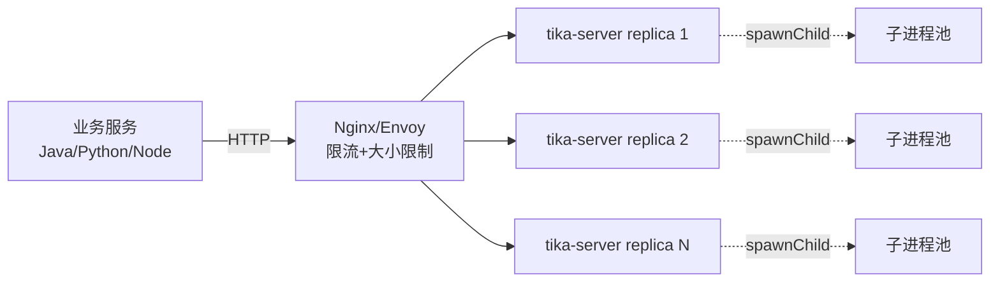

# 15 · 性能调优与最佳实践

> [!info] 上一篇 / 下一篇
> ← [[14 - 各格式解析详解 PDF Office HTML]]　|　→ [[16 - Spring Boot 集成]]

Tika 在跑生产时四大头号杀手：**OOM、卡死、Zip Bomb、SAX/POI 异常**。本篇是把它们驯服的清单。

## 1. 第一原则

> **Tika 解析是 CPU + 内存密集型的不可信操作。**
> 把它当成"会爆炸的下水道"，永远做隔离 + 限额 + 超时。

## 2. 限制资源（必加）

### 2.1 文本输出上限

```java
new BodyContentHandler(10_000_000);   // 1000 万字符上限
```

或全局：

```xml
<autoDetectParserConfig>
    <writeLimit>10000000</writeLimit>
</autoDetectParserConfig>
```

### 2.2 嵌入文档数上限

```xml
<autoDetectParserConfig>
    <maxEmbeddedResources>200</maxEmbeddedResources>
</autoDetectParserConfig>
```

### 2.3 解析超时

最简单是线程包：

```java
Future<?> f = executor.submit(() -> parser.parse(in, h, m, ctx));
try { f.get(30, TimeUnit.SECONDS); }
catch (TimeoutException e) {
    f.cancel(true);
    in.close();   // 防止悬挂的解析继续读
    throw new RuntimeException("parse timeout");
}
```

更彻底用 `ForkParser`，下一节。

## 3. ForkParser 子进程隔离

> 解析"陌生人上传的文件"必须用。

```java
ForkParser fork = new ForkParser(
    Thread.currentThread().getContextClassLoader(),
    new AutoDetectParser());
fork.setJavaCommand(List.of("java",
    "-Xmx512m",
    "-XX:MaxMetaspaceSize=128m",
    "-Dfile.encoding=UTF-8"));
fork.setServerPulseMillis(5000);
fork.setServerParseTimeoutMillis(60000);
fork.setServerWaitTimeoutMillis(60000);

try {
    fork.parse(in, handler, metadata, ctx);
} finally {
    fork.close();   // 关子进程
}
```

代价：

- 启动 fork 约 **500ms – 1s**
- 文件大小走 pipe，吞吐略降
- 每次都要重启没效率

→ 复用：`ForkParser.setPool(...)`（旧 API），或在你自己的池里复用 ForkParser 实例（线程安全的，可以并发用同一个）。

> 生产推荐：**tika-server 模式 + `--spawnChild`**（见 [[13 - tika-server REST API]]）。让 Tika 自己管子进程。

## 4. 内存使用要点

| 场景 | 内存特征 | 应对 |
|---|---|---|
| 大 PDF + OCR | 高（每页渲染为图） | `ocrDPI` 降到 200，关闭无用页 |
| 大 Excel | 中（共享字符串表） | 用 `useSAXDocxExtractor=true` |
| ZIP 嵌套 | 不可控 | 设 `maxEmbeddedResources` + ForkParser |
| 全文进 `String` | 高 | 用 `BodyContentHandler(Writer)` 流式输出 |
| 嵌入图片 | 高 | `extractInlineImages=false` |

### 4.1 流式输出

不要：

```java
String text = handler.toString();   // 全文进堆
```

要：

```java
try (Writer w = Files.newBufferedWriter(out, UTF_8)) {
    parser.parse(in, new BodyContentHandler(w), m, ctx);
}
```

## 5. 并行批处理

```java
ExecutorService es = Executors.newFixedThreadPool(
    Runtime.getRuntime().availableProcessors());

List<Future<ExtractResult>> futures = files.stream()
    .map(f -> es.submit(() -> extractor.extract(f)))
    .toList();

for (Future<ExtractResult> fut : futures) {
    try { handle(fut.get(60, TimeUnit.SECONDS)); }
    catch (Exception e) { log.warn("failed", e); }
}
es.shutdown();
```

**线程数 ≈ CPU 核数**（OCR 场景设为核数 - 1，留点给 IO）。

> [!tip] 真正大规模 → tika-pipes
> Apache Tika 自带 `tika-pipes`，支持：S3 / 文件系统输入 → 多线程并发 → JSON / Solr / ES 输出。比自己拼线程池稳得多。

```bash
java -jar tika-pipes-3.2.3.jar -c tika-pipes-config.xml
```

## 6. 输入流的姿势

### 6.1 用 `TikaInputStream`

```java
try (TikaInputStream tis = TikaInputStream.get(originalInputStream)) {
    parser.parse(tis, handler, metadata, ctx);
}
```

好处：

- 自动 mark/reset
- 大文件落临时磁盘文件（POI 等需要 `seek`）
- 自动清理临时文件

### 6.2 给文件流用 `TikaInputStream.get(Path)`

```java
try (TikaInputStream tis = TikaInputStream.get(path)) { ... }
```

比 `Files.newInputStream(path)` 更优 — 避免不必要的复制。

## 7. 重复构造 vs 复用

`AutoDetectParser` 实例是**线程安全的**，可以全局复用：

```java
public class TikaHolder {
    public static final Parser PARSER = new AutoDetectParser();
}
```

但 `ContentHandler` 和 `Metadata` **不是**，每次解析新建。

## 8. 不可信文件防护清单

| 防护 | 怎么做 |
|---|---|
| 文件大小 | 网关层（Nginx `client_max_body_size`） |
| MIME 白名单 | 用 Detector 先校验，再决定要不要解 |
| 字符上限 | `BodyContentHandler(N)` |
| 嵌入数上限 | `maxEmbeddedResources` |
| 进程隔离 | `ForkParser` 或 tika-server `--spawnChild` |
| 超时 | 应用层 + 子进程层双重 |
| 关危险解析器 | tika-config.xml `parser-exclude` ExecutableParser、SQLite3Parser、NetCdfParser |
| 限内存 | `-Xmx`、Docker `--memory` |
| 限 CPU | Docker `--cpus`、K8s requests/limits |

## 9. 性能参考数据

> 在 4 vCPU / 4 GB 容器上，仅供量级参考：

| 文件 | 时间 | 备注 |
|---|---|---|
| 10 页文本 PDF | 50–200 ms | |
| 100 页文本 PDF | 1–3 s | |
| 10 页扫描件 PDF + OCR | 5–30 s | DPI、语言决定 |
| 50 行 Excel | 30–100 ms | |
| 10 万行 Excel | 5–30 s | SAX 模式 |
| DOCX 1MB | 100–500 ms | |
| 1MB HTML | 50–200 ms | |
| 1KB EML 含小附件 | 30–100 ms | |

OCR 才是真大头，能跳过就跳过。

## 10. 监控指标（生产必埋）

- 每文档解析耗时（分 MIME 看分布）
- 失败率（按异常类型分桶）
- OOM / Timeout 次数
- ForkParser 子进程死亡率
- tika-server 内存 / 队列长度（`/status`）

## 11. 反模式 ❌

- **不要**把 `parseToString()` 用于大文件 — 全文进堆
- **不要**忘了 `ParseContext.set(Parser.class, parser)` — 嵌入文档不会被解
- **不要**在主线程里裸调 `parse()` — 没超时
- **不要**直接暴露 tika-server 到公网 — 没鉴权 + 没限速
- **不要**对每个请求 new `AutoDetectParser` — 浪费 SPI 扫描
- **不要**信任客户端给的 MIME — 自己用 `Detector` 校验

## 12. 推荐部署形态



业务无状态调 tika-server，水平扩 N 个副本，每个内部用 `--spawnChild` 隔离。

---

下一步：[[16 - Spring Boot 集成]] —— 在 Spring 项目里优雅地用。
