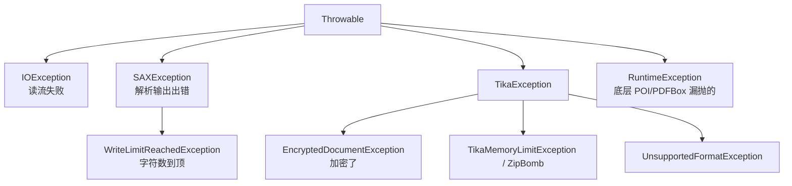

# 17 · 异常处理与故障排查

> [!info] 上一篇 / 下一篇
> ← [[16 - Spring Boot 集成]]　|　→ [[18 - 高级实战 - 全文检索集成]]

## 1. 异常分类



## 2. 必须 catch 的几个

```java
try {
    parser.parse(in, handler, meta, ctx);
}
catch (EncryptedDocumentException e) {
    // 加密文档没给密码 / 密码错
    log.info("encrypted: {}", filename);
}
catch (SAXException e) {
    if (e.getCause() instanceof WriteLimitReachedException) {
        // 字符上限到了，meta 已经填好，text 是截断版
        log.info("truncated to limit");
    } else throw e;
}
catch (TikaException e) {
    // 解析逻辑失败：损坏文件、不支持的子格式、内嵌爆炸 …
    log.warn("parse failed for {}", filename, e);
}
catch (IOException e) {
    // 读流失败：网络断、磁盘满
    throw e;
}
```

## 3. 加密文档

### 3.1 提供密码

```java
ctx.set(PasswordProvider.class, metadata -> "secret123");
parser.parse(in, handler, meta, ctx);
```

带回调取密码（多文件场景）：

```java
ctx.set(PasswordProvider.class, metadata -> {
    String name = metadata.get(TikaCoreProperties.RESOURCE_NAME_KEY);
    return passwordVault.lookup(name);    // 你自己的查表
});
```

### 3.2 没密码就跳过

```java
try {
    parser.parse(in, handler, meta, ctx);
} catch (EncryptedDocumentException e) {
    meta.set("custom:encrypted", "true");
    // 至少把 Metadata 留下
}
```

PDF 是否加密可以提前看：

```java
String enc = meta.get("pdf:encrypted");   // "true" / "false"
```

## 4. WriteLimitReachedException — 不是错

`BodyContentHandler` 满了会以 `SAXException` 抛 `WriteLimitReachedException`。两种姿势：

```java
// 1) 放大 limit
new BodyContentHandler(-1);

// 2) 截断也接受
try {
    parser.parse(in, h, m, ctx);
} catch (SAXException e) {
    if (!(e.getCause() instanceof WriteLimitReachedException)) throw e;
    // meta 仍然可信
}
```

## 5. 损坏 / 截断文件

POI 抛的常见：

- `org.apache.poi.openxml4j.exceptions.InvalidFormatException` — 文件不是有效 OOXML
- `org.apache.poi.EmptyFileException` — 0 字节
- `org.apache.poi.poifs.filesystem.NotOLE2FileException` — 改了后缀

PDFBox 抛：

- `org.apache.pdfbox.pdmodel.encryption.InvalidPasswordException`
- `IOException: Error: End-of-File`

**全部都会被 Tika 包成 `TikaException`** 抛出来（少数情况会逸出）。统一：

```java
catch (TikaException | RuntimeException e) {
    log.warn("parse failed", e);
}
```

## 6. ZipBomb / OOM 防御

```java
try {
    parser.parse(in, h, m, ctx);
} catch (OutOfMemoryError e) {
    // 主进程都 OOM 了几乎无救
    // 唯一办法：用 ForkParser，让子进程 OOM
    throw new RuntimeException("oom");
}
```

`OutOfMemoryError` **不能可靠 catch**，因为可能其他线程也在崩。**唯一靠谱方案是 [[15 - 性能调优与最佳实践#3 ForkParser 子进程隔离|ForkParser]]**。

## 7. 解析超时

线程包：

```java
Future<?> f = es.submit(() -> { parser.parse(in, h, m, ctx); return null; });
try { f.get(30, SECONDS); }
catch (TimeoutException e) {
    f.cancel(true);
    throw new RuntimeException("parse timeout");
}
```

> [!warning] cancel(true) 不一定有效
> Tika 内部循环不响应中断时，子线程会继续跑。**真要可靠中断必须 fork 子进程**。

## 8. 字符编码问题

文本变乱码常见原因：

- HTML 没声明 charset 又是非 UTF-8
- TXT 是 GB18030 但被当 UTF-8 读

强行指定：

```java
meta.set(Metadata.CONTENT_TYPE, "text/html; charset=GB18030");
parser.parse(in, h, m, ctx);
```

或换 Detector：

```java
ctx.set(EncodingDetector.class, new Icu4jEncodingDetector());
```

## 9. PDF / Office 抛"看不懂的栈" — 排错三板斧

```bash
# 1) CLI 试一下，看是不是文件本身坏
java -jar tika-app.jar -v --text bad.pdf 2>&1 | head -100

# 2) 试别的工具
pdfinfo bad.pdf
poppler   bad.pdf
exiftool  bad.pdf

# 3) 升级到最新 Tika（PDFBox / POI 经常修 bug）
```

## 10. SLF4J 日志开 DEBUG

`logback.xml`：

```xml
<logger name="org.apache.tika" level="DEBUG"/>
<logger name="org.apache.pdfbox" level="WARN"/>
<logger name="org.apache.poi" level="WARN"/>
```

PDFBox/POI 在 INFO 太吵，单独压到 WARN。

## 11. 常见报错对照表

| 报错 | 原因 | 解决 |
|---|---|---|
| `EncryptedDocumentException` | 文档加密 | 提供 `PasswordProvider` |
| `WriteLimitReachedException` | 字符上限 | 放大 limit 或捕获 |
| `TikaException: Unsupported file type` | 没对应 Parser | 引模块或自写 Parser |
| `Could not run Tesseract` | OCR 没装 | 装 tesseract + 设 path |
| `org.xml.sax.SAXParseException: Premature end of file` | 文件截断 | 文件已损坏 |
| `InvalidFormatException: Package should contain a content type part` | 假 docx | 用 detector 检验 MIME |
| `EmptyFileException` | 0 字节 | 上传层就过滤 |
| `OutOfMemoryError: Java heap space` | 大 PDF / 嵌套 ZIP | ForkParser + 限额 |
| `RecognitionException`（语言检测） | 文本太短 | `hasEnoughText()` 先判 |
| `NoSuchMethodError` | 依赖冲突，POI 版本不对 | 全部用 Tika 测试过的版本 |
| `SLF4J: No SLF4J providers were found` | 没绑 logger 实现 | 加 logback-classic |

## 12. 安全相关异常

| 异常 | 含义 |
|---|---|
| `TikaMemoryLimitException` | 文件解出来超过预设内存 |
| `TikaSecurityException` | XML 外部实体引用被拦（XXE 防护） |
| `ZipBombException` (Apache Commons Compress) | 压缩比异常高 |

Tika 默认就有反 XXE 配置，**不要关**。

## 13. 调试小技巧

### 13.1 看 Parser 链

```java
String type = new Tika().detect(file);
System.out.println(type);

CompositeParser cp = (CompositeParser) parser;
Parser concrete = cp.getParsers().get(MediaType.parse(type));
System.out.println("用了: " + concrete);
```

### 13.2 跑通就成功？再看 Metadata 字数

抽出的字数为 0 但文件 10MB？大概率是：

- 扫描件 PDF → 开 OCR
- 加密 → 提供密码
- HTML 全是 `<script>` → 用 BoilerpipeContentHandler

### 13.3 抓某个 Parser 的具体行为

```java
Parser pdfOnly = new org.apache.tika.parser.pdf.PDFParser();
pdfOnly.parse(in, h, m, ctx);
```

绕过 detector 直接调，问题缩小到 PDFBox 本身。

---

下一步：[[18 - 高级实战 - 全文检索集成]] —— Tika 喂搜索引擎的标准姿势。
