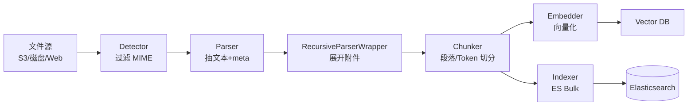

# 18 · 高级实战：全文检索 / RAG 集成

> [!info] 上一篇 / 下一篇
> ← [[17 - 异常处理与故障排查]]　|　→ [[19 - 大神进阶 - 自定义解析器开发]]

Tika 的天然搭档是全文检索。无论 **Solr / Elasticsearch / OpenSearch / Lucene / 向量库**，套路都是：

1. **Tika 抽内容** → 纯文本 + 元数据
2. **切分** → 按段或按 token
3. **写入索引** → BM25 倒排 / 向量

## 1. 基础 Pipeline



## 2. Elasticsearch — Ingest Attachment 插件（最快）

ES 自带 `ingest-attachment` 插件**内嵌 Tika**，最少代码量：

```bash
elasticsearch-plugin install ingest-attachment
```

定义 pipeline：

```bash
curl -X PUT "localhost:9200/_ingest/pipeline/attachment" \
  -H "Content-Type: application/json" \
  -d '{
    "description": "Extract attachment information",
    "processors": [
      { "attachment": { "field": "data", "remove_binary": true } }
    ]
  }'
```

用 pipeline 索引：

```bash
curl -X PUT "localhost:9200/files/_doc/1?pipeline=attachment" \
  -H "Content-Type: application/json" \
  -d "{ \"data\": \"$(base64 -w 0 report.pdf)\" }"
```

ES 会自动生成 `attachment.content`、`attachment.content_type`、`attachment.author` 等字段。

> [!warning] 限制
> - **必须 base64 编码**整个文件，10MB 文件 → 13MB 请求体 → ES 集群压力大
> - 集成的 Tika 版本由 ES 决定，**通常落后主线**
> - OCR 功能弱
> - 不支持递归（嵌入文档拼成一坨）
>
> 大规模生产建议用下面的"应用层方案"。

## 3. 应用层方案（推荐）

把 Tika 跑在你的应用 / 独立 tika-server 里，处理完只把**文本和 metadata** 写进 ES。

### 3.1 索引文档结构

```json
{
  "doc_id": "uuid",
  "source": "s3://bucket/2025/report.pdf",
  "file_name": "report.pdf",
  "content_type": "application/pdf",
  "language": "zh",
  "title": "2025 Q1 财报",
  "author": "Alice",
  "created": "2025-04-10T08:23:15Z",
  "size_bytes": 1234567,
  "page_count": 17,
  "text": "全文…",
  "chunks": [
    { "ord": 0, "text": "第一段…", "embedding": [0.01, ...] },
    { "ord": 1, "text": "第二段…", "embedding": [0.03, ...] }
  ]
}
```

### 3.2 Java 索引器骨架

```java
@Service
public class IndexingPipeline {

    private final ExtractionService extractor;        // 见 [[16 - Spring Boot 集成]]
    private final ElasticsearchClient es;
    private final Chunker chunker;

    public void index(String source, InputStream in, String name) throws IOException {
        var r = extractor.extract(in, name);
        String text = r.text();
        Map<String, Object> meta = r.metadata();

        IndexedDoc doc = IndexedDoc.builder()
            .source(source)
            .fileName(name)
            .contentType((String) meta.get("Content-Type"))
            .language((String) meta.getOrDefault("language", "und"))
            .title((String) meta.get("dc:title"))
            .author((String) meta.get("dc:creator"))
            .text(text)
            .chunks(chunker.split(text, 800, 100))   // 800 字 / 100 字 overlap
            .build();

        es.index(req -> req.index("files").id(doc.id()).document(doc));
    }
}
```

## 4. 切分（Chunking）—— RAG 关键

> 直接把全文塞进向量库会让召回变烂。常用切分策略：

| 策略 | 描述 | 何时用 |
|---|---|---|
| **固定字数** | 800 字一段，100 字 overlap | 简单、通用 |
| **按段落** | 用 `ToXMLContentHandler` 的 `<p>` 边界 | 文本结构清晰（Word/PDF） |
| **按页** | PDF 每页一个 chunk | 法律 / 合同 |
| **按句** | 用 NLP 句子分割 | 短文档、对话 |
| **语义** | LLM 判断分割点 | 高质量 RAG，贵 |

### 利用 Tika 的 XHTML 输出按段切

```java
ToXMLContentHandler h = new ToXMLContentHandler("UTF-8");
parser.parse(in, h, m, ctx);

Document dom = Jsoup.parse(h.toString());
List<String> paragraphs = dom.select("p,h1,h2,h3,li").eachText();
```

按 PowerPoint 分页：

```java
List<String> slides = dom.select("div.slide-content").eachText();
```

## 5. 与 LangChain4j / Spring AI 集成

### Spring AI

```xml
<dependency>
    <groupId>org.springframework.ai</groupId>
    <artifactId>spring-ai-tika-document-reader</artifactId>
</dependency>
```

```java
TikaDocumentReader reader = new TikaDocumentReader("file:report.pdf");
List<Document> docs = reader.get();              // 已含 content + metadata

TextSplitter splitter = new TokenTextSplitter(800, 100, 5, 10000, true);
List<Document> chunks = splitter.apply(docs);

vectorStore.add(chunks);
```

### LangChain4j

```java
DocumentParser parser = new ApacheTikaDocumentParser();
Document doc = FileSystemDocumentLoader.loadDocument(
    Path.of("report.pdf"), parser);

List<TextSegment> segments = DocumentSplitters
    .recursive(800, 100)
    .split(doc);

embeddingStore.addAll(embeddingModel.embedAll(segments).content(), segments);
```

## 6. Solr — ExtractingRequestHandler

```bash
curl 'http://localhost:8983/solr/files/update/extract?literal.id=doc1&commit=true' \
    -F "myfile=@report.pdf"
```

Solr 5+ 自带 Tika。**官方已不推荐**（Tika 版本落后、不安全），新项目走应用层。

## 7. 大批量场景 — tika-pipes

`tika-pipes` 把 Tika 做成"批处理引擎"：

```yaml
# tika-pipes-config.xml (示意)
<properties>
    <pipesIterator>
        <fileListPipesIterator>
            <fileList>files.txt</fileList>
        </fileListPipesIterator>
    </pipesIterator>
    <fetchers>
        <fileSystemFetcher basePath="/data"/>
    </fetchers>
    <emitters>
        <opensearchEmitter url="https://es:9200" indexName="files"/>
    </emitters>
    <numClients>16</numClients>
</properties>
```

```bash
java -jar tika-pipes-3.2.3.jar -c tika-pipes-config.xml
```

支持的 fetcher / emitter：S3、GCS、Azure、HTTP、文件系统、Kafka、Solr、ES、OpenSearch、CSV、JSON Lines …

> [!tip] 真大规模就用它
> 比自己拼线程池稳得多：自动重试、断点续传、JSON 输出、指标埋点。

## 8. 反索引常见字段 / 映射

```json
PUT /files
{
  "mappings": {
    "properties": {
      "doc_id":       { "type": "keyword" },
      "source":       { "type": "keyword" },
      "file_name":    { "type": "keyword" },
      "content_type": { "type": "keyword" },
      "language":     { "type": "keyword" },
      "title":        { "type": "text",
                        "fields": { "kw": { "type": "keyword" } } },
      "author":       { "type": "keyword" },
      "created":      { "type": "date" },
      "size_bytes":   { "type": "long" },
      "page_count":   { "type": "integer" },
      "text":         { "type": "text", "analyzer": "ik_smart" },
      "chunks":       { "type": "nested",
        "properties": {
          "ord":       { "type": "integer" },
          "text":      { "type": "text", "analyzer": "ik_smart" },
          "embedding": { "type": "dense_vector", "dims": 1024 }
        }
      }
    }
  }
}
```

## 9. RAG 实战清单

- ✅ 用 `RecursiveParserWrapper` 拆嵌入文档，**每个嵌入物单独入库**
- ✅ 用 `ToXMLContentHandler` 按 `<p>` 切分而不是字节切
- ✅ 用语言检测做语言路由（中英文 / 不同 embedding model）
- ✅ 元数据进 `keyword` 字段做过滤（按作者 / 部门 / 时间）
- ✅ 保留 `source` 字段做引用回溯
- ✅ 大文件先做 detect，不在白名单的直接拒
- ✅ OCR 后存 OCR 置信度（看 hOCR），低质量内容标记不索引

## 10. 一段最小可用代码（Spring AI + Pgvector）

```java
@RestController
@RequestMapping("/api/rag")
public class RagController {

    private final VectorStore store;
    private final TextSplitter splitter = new TokenTextSplitter(800, 100, 5, 10000, true);

    @PostMapping("/ingest")
    public void ingest(@RequestParam MultipartFile file) throws IOException {
        try (InputStream in = file.getInputStream()) {
            TikaDocumentReader reader =
                new TikaDocumentReader(new InputStreamResource(in));
            List<Document> chunks = splitter.apply(reader.get());
            store.add(chunks);
        }
    }
}
```

---

下一步：[[19 - 大神进阶 - 自定义解析器开发]] —— 实现你自己的 Parser，加入 Tika 体系。
