# JVM 内存模型与运行时数据区

这是 JVM 面试的**第一个问题**，几乎 100% 会问。先把这张图刻进脑子里。

## 五大运行时数据区

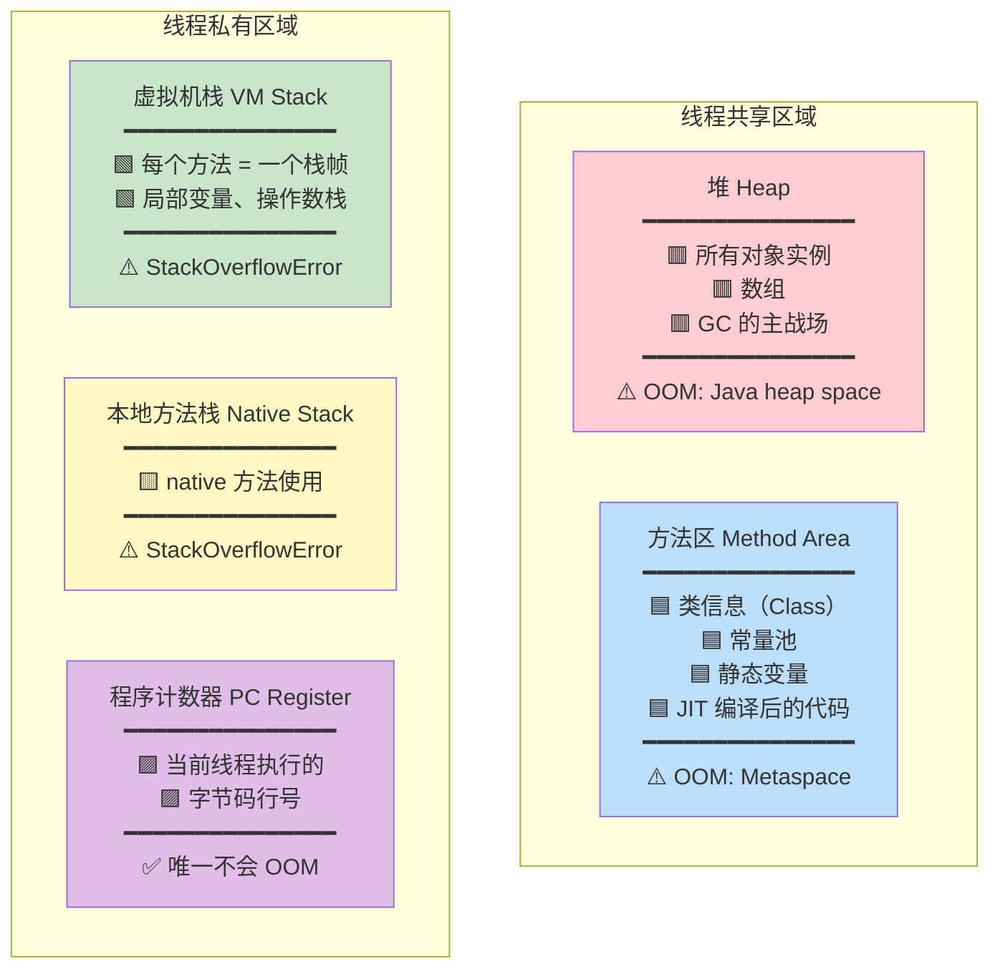

### 一句话记忆

| 区域 | 线程 | 存什么 | 异常 |
|------|------|--------|------|
| **程序计数器** | 私有 | 当前字节码行号 | **无**（唯一不会 OOM） |
| **虚拟机栈** | 私有 | 栈帧（方法调用） | StackOverflowError / OOM |
| **本地方法栈** | 私有 | native 方法 | StackOverflowError / OOM |
| **堆** | **共享** | 对象实例、数组 | OutOfMemoryError |
| **方法区** | **共享** | 类信息、常量池、静态变量 | OutOfMemoryError |

---

## 程序计数器（PC Register）

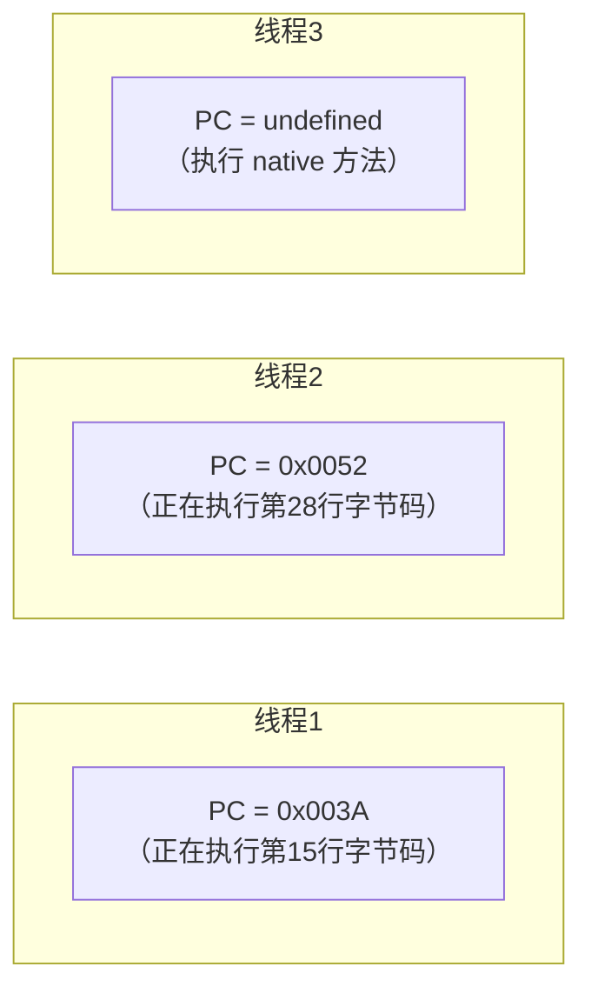

- 每个线程一个 PC，互不影响
- 执行 Java 方法时，记录**字节码指令地址**
- 执行 native 方法时，值为 **undefined**
- **唯一不会内存溢出**的区域

> [!tip] 为什么需要 PC？
> 线程切换后需要恢复到正确的执行位置。PC 就是记录"执行到哪里了"。

---

## 虚拟机栈（VM Stack）

每个线程一个栈，每调用一个方法就压入一个**栈帧**。

### 栈帧结构

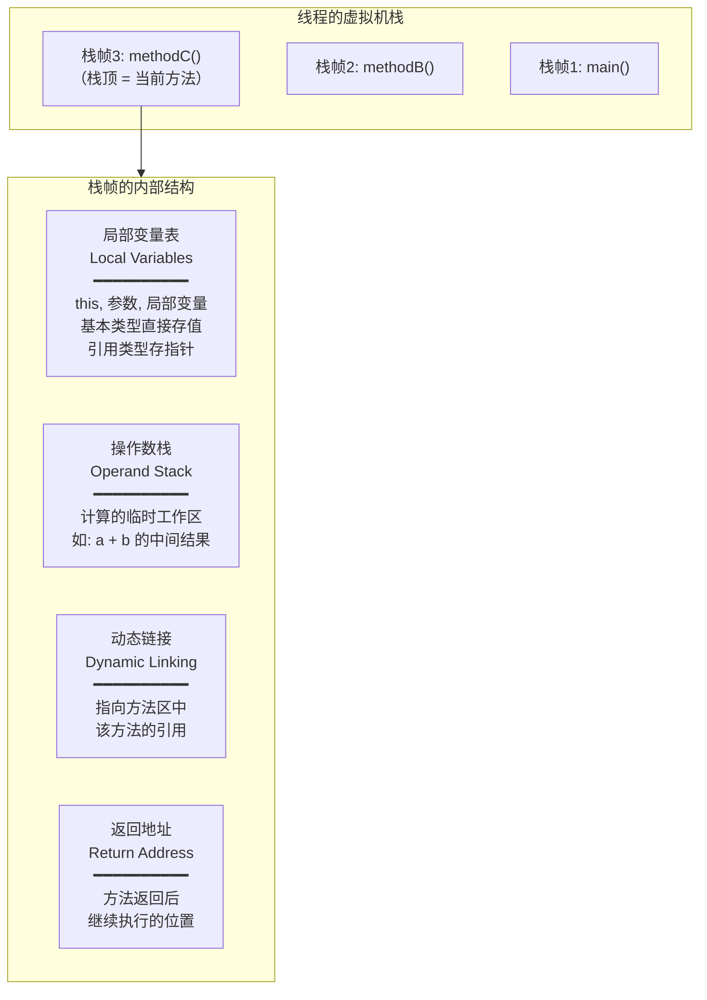

### 方法调用过程（图解）

```java
public static void main(String[] args) {
    int result = add(1, 2);
}

public static int add(int a, int b) {
    int sum = a + b;
    return sum;
}
```

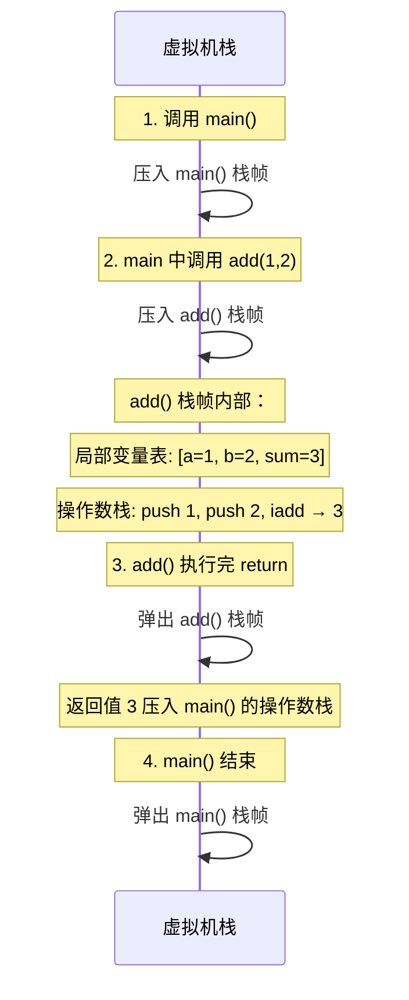

### 操作数栈运算过程

`int c = a + b` 在操作数栈中的执行：

```
步骤1: iload_1 (加载 a=1)     步骤2: iload_2 (加载 b=2)
┌─────┐                       ┌─────┐
│     │                       │  2  │ ← 栈顶
│     │                       ├─────┤
│  1  │ ← 栈顶                │  1  │
└─────┘                       └─────┘

步骤3: iadd (弹出两个,相加)    步骤4: istore_3 (存入 c)
┌─────┐                       ┌─────┐
│     │                       │     │
│     │                       │     │
│  3  │ ← 结果压栈             │     │ ← 弹出存入局部变量表 c=3
└─────┘                       └─────┘
```

### 栈溢出

```java
// StackOverflowError - 递归没有终止条件
public void recursive() {
    recursive();  // 无限压栈帧 → 栈溢出！
}
```

```
-Xss256k    // 设置每个线程的栈大小（默认 1MB 或 512KB，取决于系统）
```

---

## 堆（Heap）

**JVM 最大的内存区域**，也是 GC 的主战场。

### 堆的分代结构

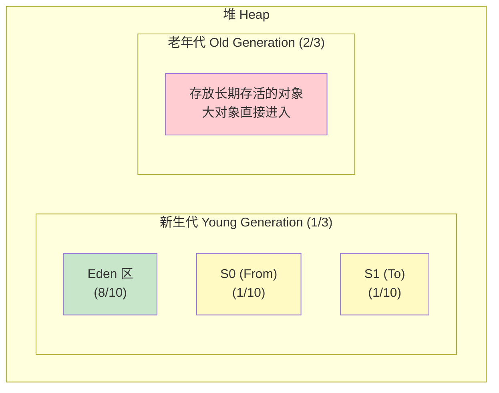

### 默认比例

```
堆总大小
├── 新生代（Young）= 1/3
│   ├── Eden = 8/10
│   ├── Survivor 0 (From) = 1/10
│   └── Survivor 1 (To) = 1/10
└── 老年代（Old）= 2/3

JVM 参数：
-Xms256m        堆初始大小
-Xmx512m        堆最大大小（建议 Xms == Xmx，避免动态扩缩）
-Xmn128m        新生代大小
-XX:NewRatio=2  老年代:新生代 = 2:1
-XX:SurvivorRatio=8  Eden:S0:S1 = 8:1:1
```

### 对象在堆中的流转过程

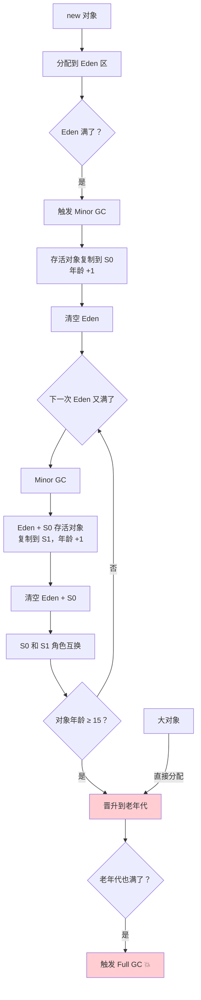

> [!important] 关键数字：15
> 默认对象年龄阈值 = **15**（`-XX:MaxTenuringThreshold=15`）
> 每经过一次 Minor GC 且存活，年龄 +1，达到 15 晋升老年代。
> CMS 默认是 6，G1 默认也是 15。

### 动态年龄判断

不一定非要等到 15 岁！

```
如果 Survivor 区中，年龄 1 + 年龄 2 + ... + 年龄 N 的对象总大小
超过 Survivor 区的 50%（-XX:TargetSurvivorRatio=50）
则年龄 ≥ N 的对象直接晋升老年代

Survivor区是年轻代的一部分，存放 Minor GC 后依然存活的对象。通常有两个（S0/S1），交替使用。

```


1. GC 将 Eden + 存活对象复制到 Survivor 区，并计算每个年龄段的对象总大小。
2. 从 **年龄=1** 开始累加大小：
    - 累加到年龄 `N` 时，检查：`年龄1~N的对象总大小 > Survivor区总容量 × 50%` ？
3. **如果超过**：
    - 本次 GC 的**实际晋升阈值**动态设为 `N`
    - 所有 `年龄 ≥ N` 的对象直接晋升老年代
    - 剩余 `年龄 < N` 的对象留在 Survivor 区，保证 Survivor 使用率 ≈ 50%
4. **如果一直没超过**：
	- 晋升阈值保持默认值（或 `-XX:MaxTenuringThreshold`），对象继续留在年轻代长大
	  
### 大对象直接进老年代

```java
// 大于此阈值的对象直接在老年代分配
-XX:PretenureSizeThreshold=1048576  // 1MB

// 为什么？避免大对象在 Eden 和 Survivor 之间来回复制
```

---

## 方法区（Method Area）

### 不同 JDK 版本的实现

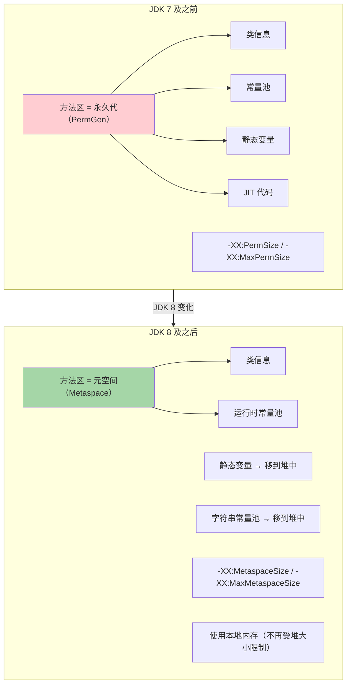

> [!warning] 面试重点
> - JDK 7：方法区 = **永久代**（PermGen），在 JVM 堆内
> - JDK 8：方法区 = **元空间**（Metaspace），使用**本地内存**（Native Memory）
> - 字符串常量池：JDK 7 从永久代移到**堆**中
> - 静态变量：JDK 8 从永久代移到**堆**中

### 为什么废弃永久代？

1. 永久代大小固定，难以调优，容易 OOM
2. 元空间使用本地内存，可以自动扩展
3. 为 JRockit 和 HotSpot 合并铺路（JRockit 没有永久代）

### 字符串常量池

```java
String s1 = "hello";         // 字面量 → 字符串常量池
String s2 = "hello";         // 直接引用常量池中已有的
String s3 = new String("hello"); // 堆中新建对象

System.out.println(s1 == s2); // true（同一个引用）
System.out.println(s1 == s3); // false（不同对象）

String s4 = s3.intern();     // intern() → 返回常量池中的引用
System.out.println(s1 == s4); // true
```

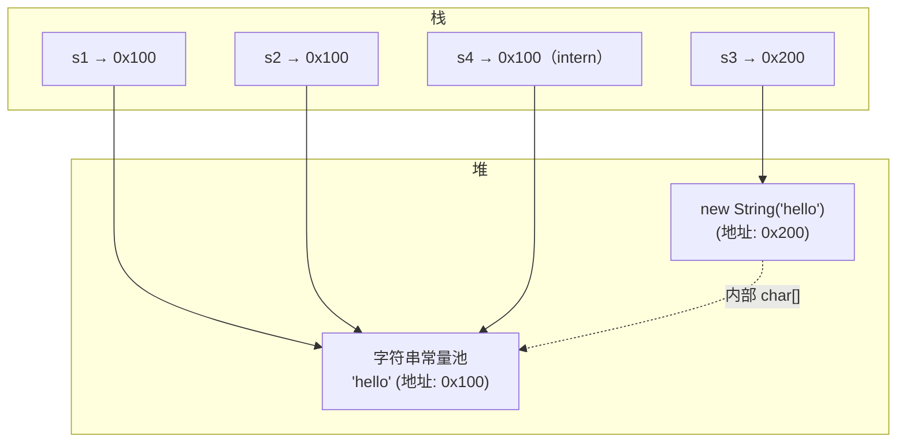

---

## 直接内存（Direct Memory）

不属于 JVM 运行时数据区，但经常被问到。

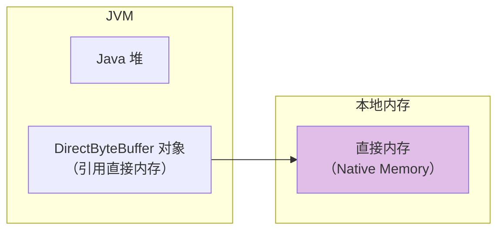

- 通过 `ByteBuffer.allocateDirect()` 分配
- NIO 使用，避免了堆内存和本地内存之间的数据拷贝
- 不受 `-Xmx` 限制，但受 `-XX:MaxDirectMemorySize` 限制
- 也可能导致 OOM

---

## 栈 vs 堆 对比

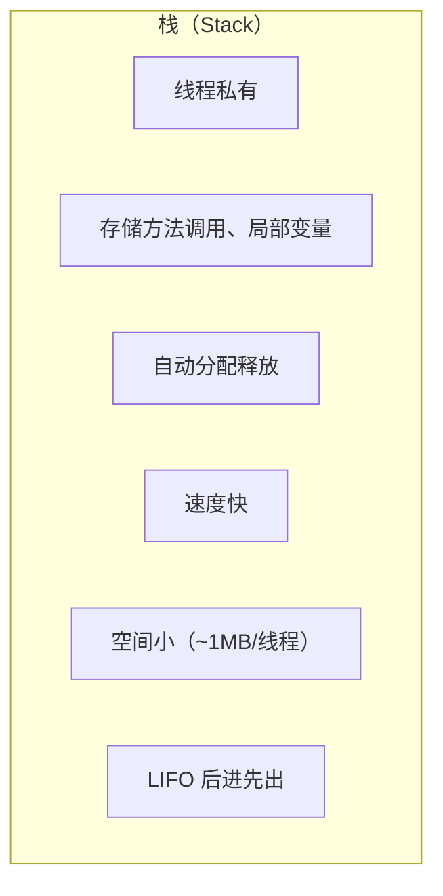
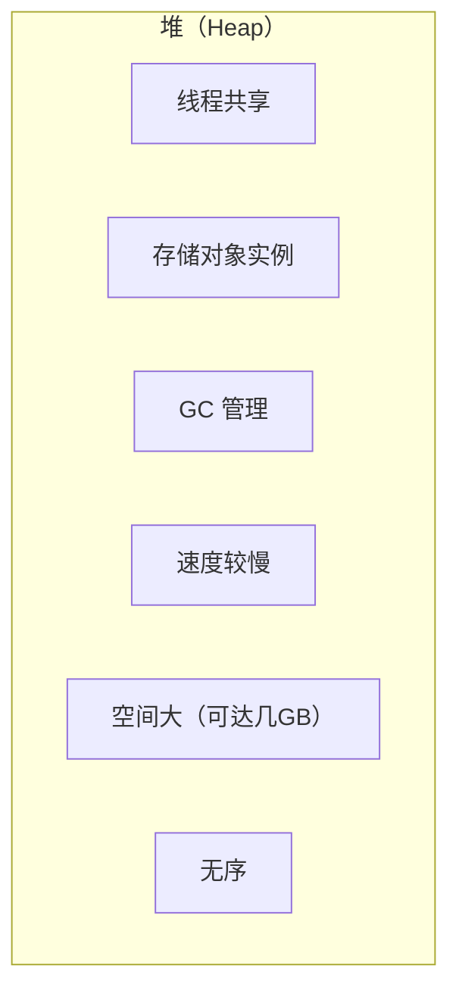
```java
public void example() {
    int a = 10;              // 栈：基本类型值直接存在栈帧的局部变量表
    String name = "hello";   // 栈：引用存在栈，字符串在堆的常量池
    Object obj = new Object(); // 栈：引用存在栈，对象在堆
}
```

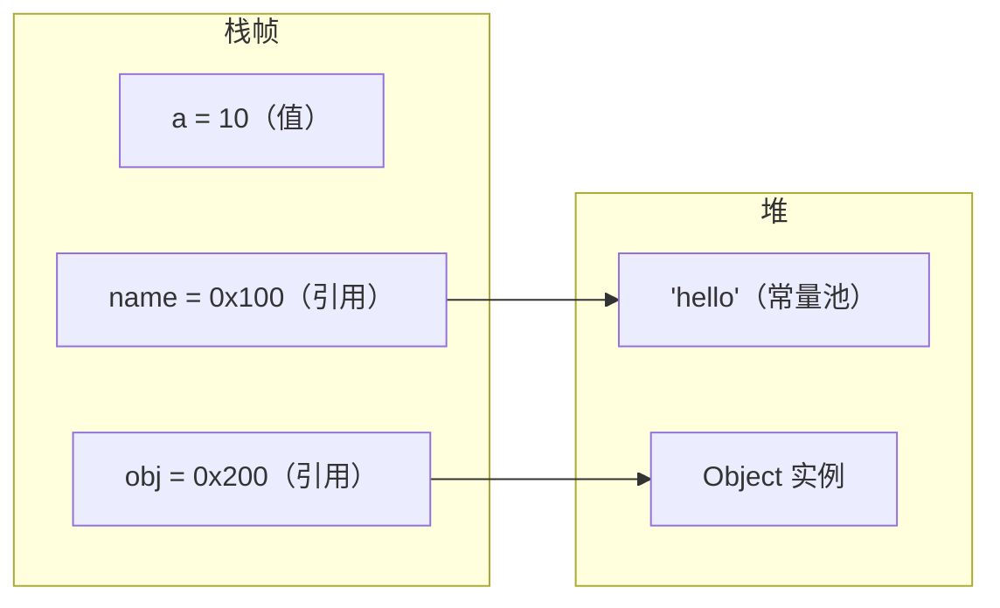

---

## 面试高频问题

### Q1：JVM 运行时数据区有哪些？

5 个区域：程序计数器、虚拟机栈、本地方法栈（线程私有），堆、方法区（线程共享）。

### Q2：堆和栈的区别？

栈是线程私有的、存方法调用和局部变量、自动管理；堆是线程共享的、存对象实例、由 GC 管理。

### Q3：方法区在 JDK 7 和 JDK 8 有什么变化？

JDK 7 方法区由永久代实现（堆内），JDK 8 改为元空间（本地内存）。字符串常量池在 JDK 7 移到堆中，静态变量在 JDK 8 移到堆中。

### Q4：什么情况下会栈溢出？

递归调用没有终止条件导致无限压栈帧；线程请求的栈深度超过 `-Xss` 设定的大小。

### Q5：堆为什么要分代？

不同对象的生命周期不同。**大部分对象朝生夕灭**（IBM 研究：98% 的对象在新生代就会被回收），分代后可以针对性使用不同的 GC 算法：新生代用复制算法（高效），老年代用标记-整理（节约空间）。
