# JVM 垃圾回收算法

GC 是 JVM 面试的**绝对核心**，必须深入掌握。

## 对象存活判断

### 引用计数法（Reference Counting）

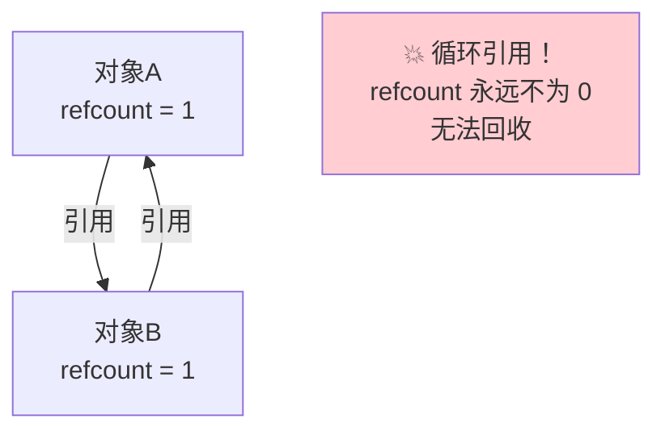

- 每个对象维护一个引用计数器
- 被引用 +1，引用失效 -1
- 计数为 0 可回收
- **❌ JVM 不使用！** 无法解决循环引用

### 可达性分析（Reachability Analysis）✅

**JVM 实际使用的算法。**

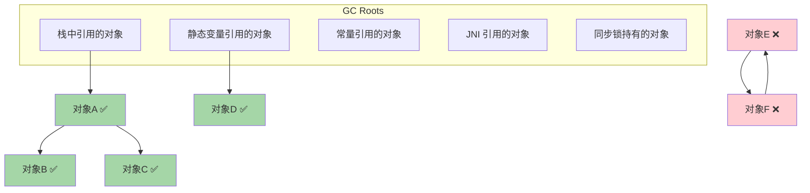

**核心思想**：从 GC Roots 出发，沿引用链遍历。能到达的对象 = 存活，不可达的对象 = 可回收。

### GC Roots 有哪些？

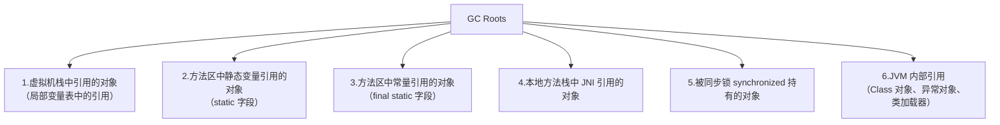

> [!important] 面试必背
> GC Roots 记忆口诀：**栈引用、静态变量、常量、JNI、锁对象**

### finalize() 拯救机制

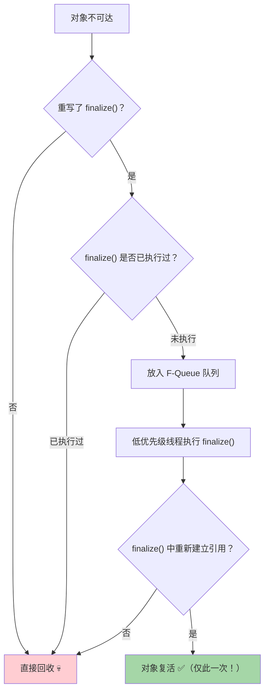

> [!danger] 不推荐使用 finalize()
> 1. 执行不确定（不保证一定会执行）
> 2. 只能拯救一次
> 3. 性能差
> 4. Java 9+ 已标记为 `@Deprecated`

---

## 四种引用类型

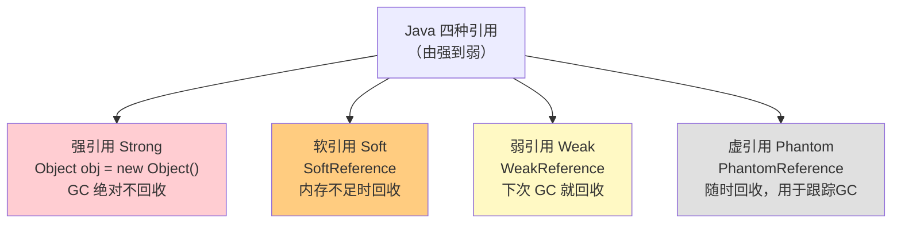

| 引用类型 | 回收时机 | 用途 |
|----------|----------|------|
| **强引用** | 永不回收（只要可达） | 普通引用 |
| **软引用** | 内存不足时回收 | **缓存**（内存敏感的缓存） |
| **弱引用** | 下次 GC 一定回收 | **ThreadLocalMap**、WeakHashMap |
| **虚引用** | 随时回收 | 跟踪对象被 GC 的时机（NIO DirectBuffer 回收） |

```java
// 软引用
SoftReference<byte[]> cache = new SoftReference<>(new byte[1024 * 1024]);
cache.get(); // 内存足够返回对象，内存不足返回 null

// 弱引用
WeakReference<Object> weak = new WeakReference<>(new Object());
weak.get(); // 下次 GC 前可以获取，GC 后返回 null
```

---

## 三大垃圾回收算法

### 1. 标记-清除（Mark-Sweep）

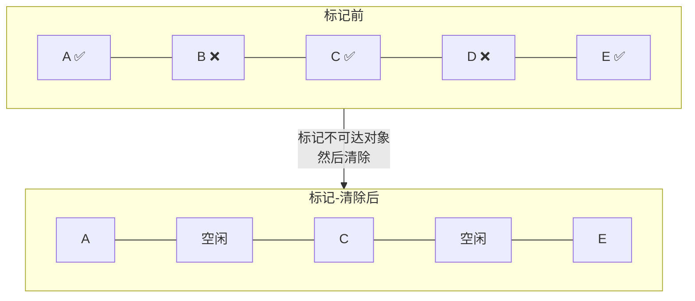

```
标记阶段: 从 GC Roots 遍历，标记所有存活对象
清除阶段: 遍历堆，回收未标记的对象

✅ 优点: 实现简单
❌ 缺点: 
  1. 效率不高（两次遍历）
  2. 产生大量内存碎片！
```

### 2. 标记-复制（Copying）

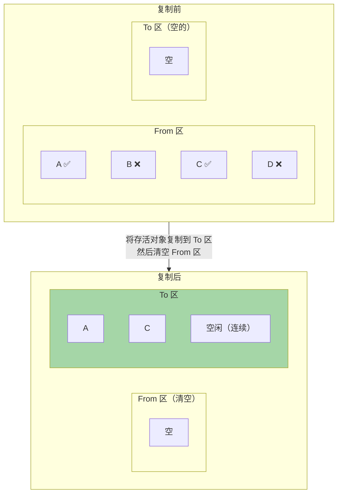

```
将内存分为两块，每次只用一块
GC 时把存活对象复制到另一块
然后清空当前块

✅ 优点:
  1. 没有碎片（复制后连续排列）
  2. 效率高（只需遍历存活对象）
❌ 缺点:
  1. 浪费一半内存空间！
  2. 对象存活率高时复制开销大
```

> [!tip] 新生代使用的就是复制算法
> 但不是 1:1 分区，而是 Eden:S0:S1 = 8:1:1
> 只浪费 10% 空间（一个 Survivor）

### 3. 标记-整理（Mark-Compact）

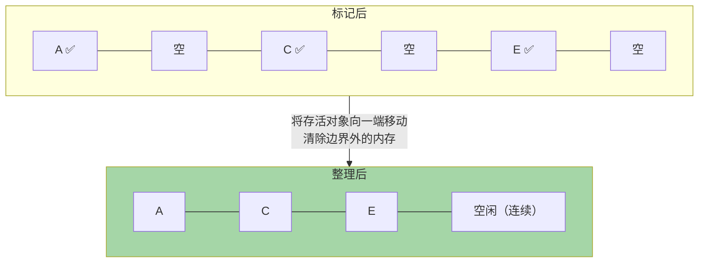

```
标记后不直接清除，而是让存活对象向内存一端移动
然后清理边界以外的内存

✅ 优点: 没有碎片
❌ 缺点: 移动对象成本高（需要更新所有引用）
```

### 三种算法对比

| 算法 | 碎片 | 空间利用率 | 效率 | 适用场景 |
|------|------|-----------|------|----------|
| **标记-清除** | ❌ 有碎片 | 高 | 中等 | CMS 老年代 |
| **标记-复制** | ✅ 无碎片 | 低（浪费一半） | **最高** | **新生代** |
| **标记-整理** | ✅ 无碎片 | 高 | 低（移动） | **老年代** |

---

## 分代收集理论

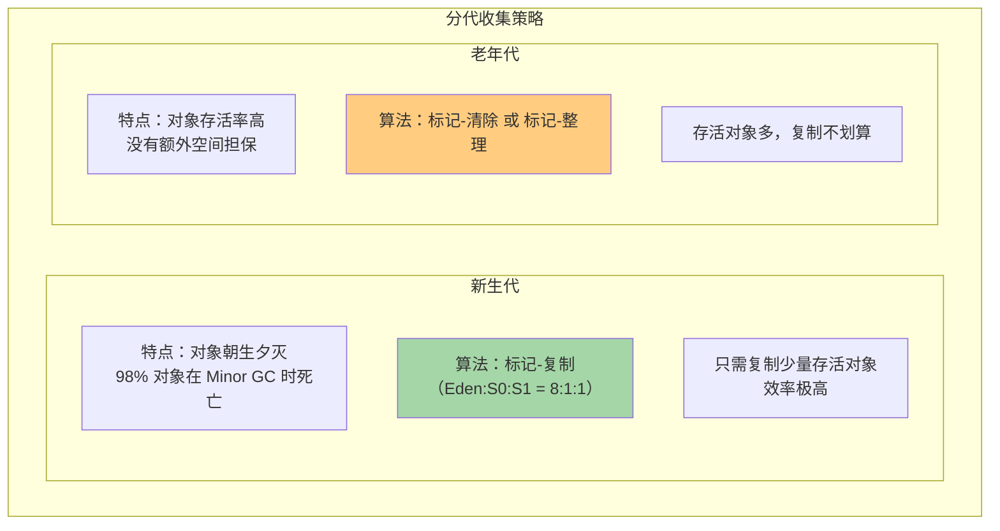

### 分代假说

| 假说         | 内容                |
| ---------- | ----------------- |
| **弱分代假说**  | 绝大多数对象都是朝生夕灭的     |
| **强分代假说**  | 熬过越多次 GC 的对象越难被回收 |
| **跨代引用假说** | 跨代引用相对于同代引用仅占少数   |

---

## Minor GC vs Major GC vs Full GC

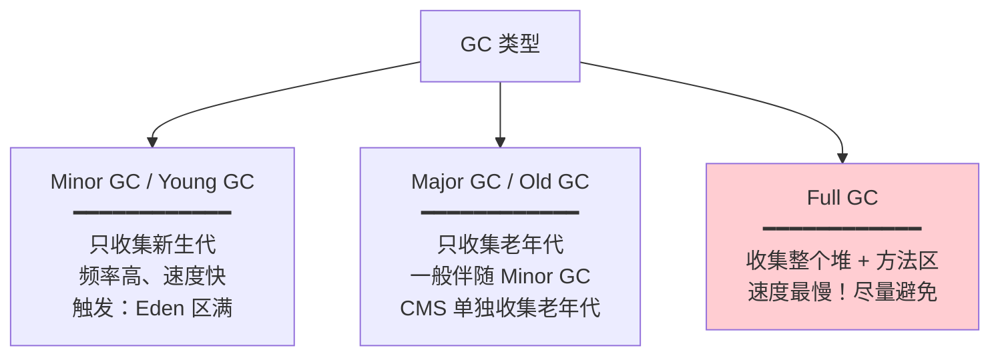

### 触发 Full GC 的条件

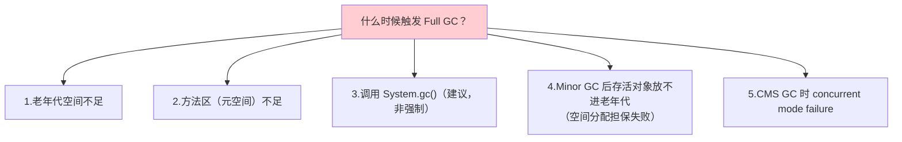

### 空间分配担保机制

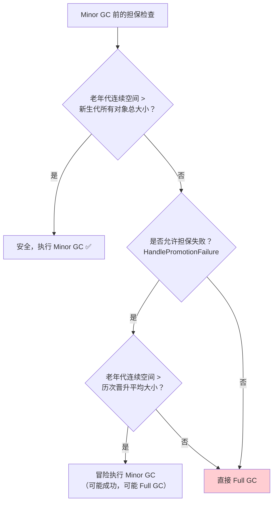

---

## 记忆集与写屏障

### 跨代引用问题

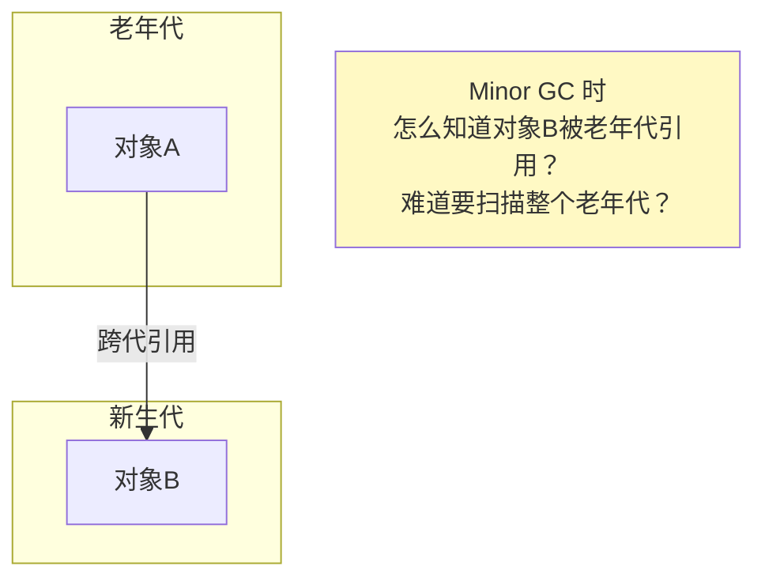

### 记忆集（Remembered Set）

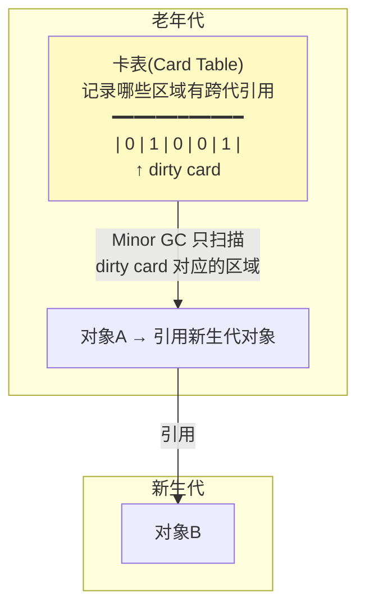

- **卡表**是记忆集的具体实现
- 将老年代划分为 512 字节一个的 Card
- 有跨代引用的 Card 标记为 dirty
- Minor GC 时只扫描 dirty card → 避免扫描整个老年代

### 写屏障（Write Barrier）

在引用赋值时自动维护卡表：

```java
// 伪代码
void oop_store(oop* field, oop value) {
    *field = value;                    // 实际赋值
    card_table[field >> 9] = dirty;   // 写屏障：更新卡表
}
```

---

## 面试高频问题

### Q1：怎么判断对象可以被回收？

JVM 使用**可达性分析**：从 GC Roots 出发，不可达的对象可回收。GC Roots 包括栈引用、静态变量、常量、JNI 引用、锁对象。

### Q2：垃圾回收算法有哪些？

标记-清除（有碎片）、标记-复制（无碎片但浪费空间）、标记-整理（无碎片但要移动对象）。新生代用复制算法，老年代用标记-清除或标记-整理。

### Q3：什么时候触发 Full GC？

老年代空间不足、元空间不足、空间分配担保失败、CMS 并发失败、System.gc()。

### Q4：为什么新生代用复制算法？

因为新生代对象存活率低（98% 会死），复制算法只需要复制少量存活对象，效率极高。Eden:S0:S1 = 8:1:1 只浪费 10% 空间。
