# JVM 垃圾收集器

垃圾收集器是垃圾回收算法的**具体实现**。面试中 CMS 和 G1 是重中之重。

## 收集器全景图

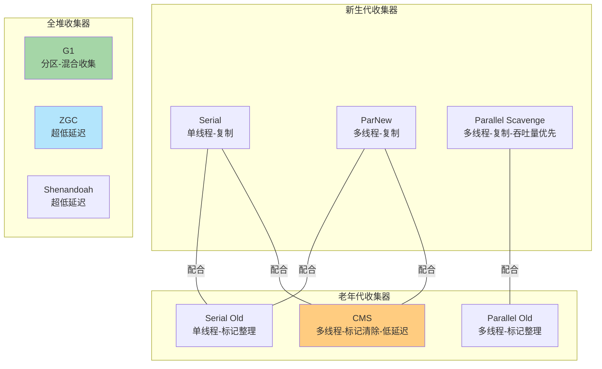

### 收集器对比速查表

| 收集器 | 区域 | 算法 | 线程 | 特点 | 适用场景 |
|--------|------|------|------|------|----------|
| **Serial** | 新生代 | 复制 | 单线程 | 简单高效 | 客户端、嵌入式 |
| **ParNew** | 新生代 | 复制 | 多线程 | Serial 多线程版 | 配合 CMS |
| **Parallel Scavenge** | 新生代 | 复制 | 多线程 | **吞吐量优先** | 后台计算 |
| **Serial Old** | 老年代 | 标记-整理 | 单线程 | | 客户端/CMS 备选 |
| **Parallel Old** | 老年代 | 标记-整理 | 多线程 | **吞吐量优先** | 后台计算 |
| **CMS** | 老年代 | 标记-清除 | 多线程 | **低延迟** | Web 服务 |
| **G1** | 全堆 | 分区复制+整理 | 多线程 | **可控停顿** | **JDK 9+ 默认** |
| **ZGC** | 全堆 | 染色指针 | 多线程 | **超低延迟** | 大堆、低延迟 |

---

## Stop The World

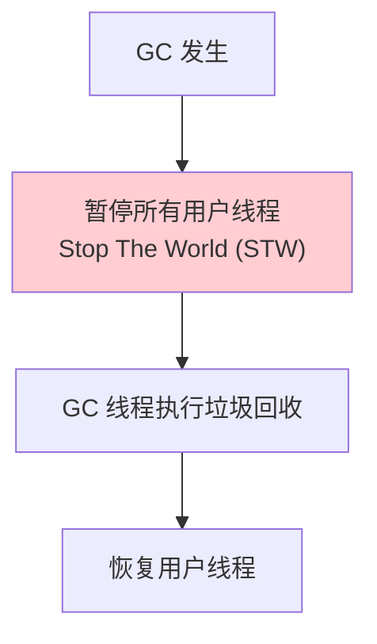

> [!danger] STW 是性能杀手
> 所有 GC 都有 STW，区别在于**停顿时间长短**。
> 优化方向：减少 STW 时间、让 GC 尽量和用户线程并发执行。

### 安全点（Safepoint）

- GC 不是随时都能发生，需要等线程到达**安全点**
- 安全点通常在：方法调用、循环跳转、异常跳转
- 线程主动检查安全点标记，到达后暂停

---

## Serial / Serial Old

```mermaid
gantt
    title Serial GC 执行过程
    dateFormat X
    axisFormat %s
    
    section 用户线程
    运行        :a1, 0, 3
    STW暂停     :crit, a2, 3, 5
    恢复运行    :a3, 5, 8
    
    section GC线程
    空闲        :b1, 0, 3
    单线程GC    :active, b2, 3, 5
    空闲        :b3, 5, 8
```

- **单线程**收集，GC 期间完全 STW
- 简单高效，没有多线程开销
- 适合客户端应用、小堆（几百MB）
- `-XX:+UseSerialGC`

---

## ParNew

```mermaid
gantt
    title ParNew GC 执行过程
    dateFormat X
    axisFormat %s
    
    section 用户线程
    运行        :a1, 0, 3
    STW暂停     :crit, a2, 3, 5
    恢复运行    :a3, 5, 8
    
    section GC线程1
    多线程GC    :active, b2, 3, 5
    
    section GC线程2
    多线程GC    :active, c2, 3, 5
    
    section GC线程3
    多线程GC    :active, d2, 3, 5
```

- Serial 的**多线程版本**
- 唯一能配合 CMS 的新生代收集器
- `-XX:+UseParNewGC`

---

## CMS（Concurrent Mark Sweep）

**目标：最短停顿时间。** 是第一个真正意义上的**并发收集器**。

### CMS 四个阶段

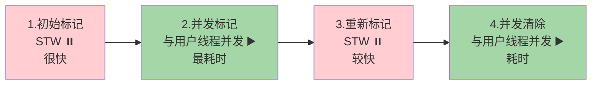

```mermaid
gantt
    title CMS GC 执行过程
    dateFormat X
    axisFormat %s
    
    section 用户线程
    运行      :a1, 0, 2
    STW       :crit, a2, 2, 3
    并发运行   :a3, 3, 7
    STW       :crit, a4, 7, 8
    并发运行   :a5, 8, 12
    
    section GC线程
    初始标记   :active, b1, 2, 3
    并发标记   :active, b2, 3, 7
    重新标记   :active, b3, 7, 8
    并发清除   :active, b4, 8, 12
```

| 阶段 | STW？ | 做什么 | 耗时 |
|------|-------|--------|------|
| **初始标记** | ⏸️ 是 | 标记 GC Roots 直接关联的对象 | 很快 |
| **并发标记** | ▶️ 否 | 从 GC Roots 遍历整个对象图 | **最耗时** |
| **重新标记** | ⏸️ 是 | 修正并发标记期间变化的引用（增量更新） | 较快 |
| **并发清除** | ▶️ 否 | 清除不可达对象 | 耗时 |

### CMS 的三大问题

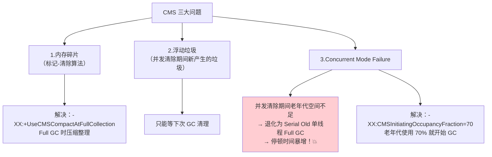

> [!warning] CMS 已在 JDK 9 标记为废弃，JDK 14 正式移除

---

## G1（Garbage First）

**JDK 9+ 默认收集器。** 面试**最高频**的收集器。

### G1 的 Region 分区

G1 将堆划分为大小相等的 **Region**（默认 2048 个，每个 1-32MB）：

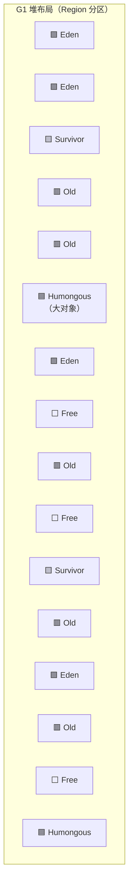

```
🟩 Eden Region    → 新对象分配
🟨 Survivor Region → 存活对象暂存
🟥 Old Region     → 长期存活对象
🟦 Humongous Region → 大对象（超过 Region 50%）
⬜ Free Region    → 空闲
```

> [!important] G1 vs 传统分代
> - 传统：物理上连续的 Young/Old 区域
> - G1：逻辑上分代，物理上**不连续**的 Region

### G1 收集过程

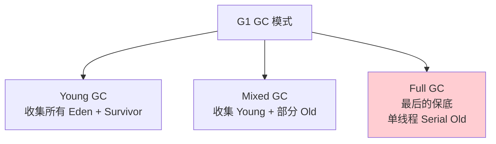

### G1 Mixed GC 四个阶段

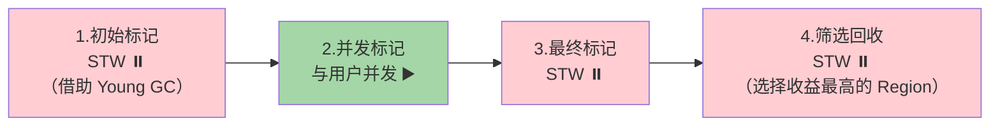

```mermaid
gantt
    title G1 Mixed GC 执行过程
    dateFormat X
    axisFormat %s
    
    section 用户线程
    运行     :a1, 0, 2
    STW      :crit, a2, 2, 3
    并发运行  :a3, 3, 8
    STW      :crit, a4, 8, 9
    STW      :crit, a5, 9, 11
    恢复     :a6, 11, 14
    
    section GC线程
    初始标记  :active, b1, 2, 3
    并发标记  :active, b2, 3, 8
    最终标记  :active, b3, 8, 9
    筛选回收  :active, b4, 9, 11
```

### G1 的核心特性

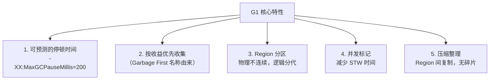

**G1 的停顿时间控制：**
- 用户设定目标停顿时间（如 200ms）
- G1 根据每个 Region 的**回收价值**排序
- 在停顿时间内优先回收**垃圾最多**的 Region
- 这就是 "Garbage First" 的含义！

### G1 关键参数

```bash
-XX:+UseG1GC                    # 使用 G1（JDK 9+ 默认）
-XX:MaxGCPauseMillis=200        # 目标最大停顿时间（默认 200ms）
-XX:G1HeapRegionSize=4m         # Region 大小（1-32MB，2的幂）
-XX:G1NewSizePercent=5          # 新生代最小比例
-XX:G1MaxNewSizePercent=60      # 新生代最大比例
-XX:InitiatingHeapOccupancyPercent=45  # 堆使用 45% 触发并发标记
-XX:G1MixedGCCountTarget=8     # Mixed GC 目标次数
```

---

## CMS vs G1 对比

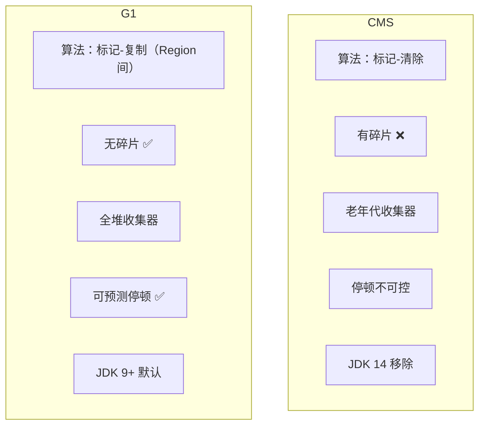

| 对比 | CMS | G1 |
|------|-----|-----|
| **算法** | 标记-清除 | 标记-复制（Region 间） |
| **碎片** | ❌ 有 | ✅ 无 |
| **范围** | 老年代 | **全堆** |
| **停顿控制** | 不可控 | ✅ `-XX:MaxGCPauseMillis` |
| **适用堆大小** | < 8GB | **4GB ~ 数十 GB** |
| **浮动垃圾** | 有 | 有（但影响小） |
| **并发失败** | Serial Old 兜底 | Full GC 兜底 |
| **状态** | JDK 14 移除 | **JDK 9+ 默认** |

---

## ZGC（Z Garbage Collector）

JDK 11 引入，JDK 15 正式可用。**超低延迟收集器**。

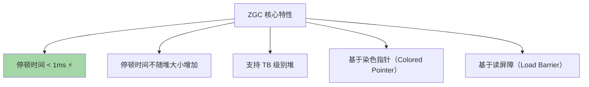

### ZGC vs G1 vs CMS 延迟对比

```
停顿时间:
CMS:    50-200ms
G1:     50-200ms（可控）
ZGC:    < 1ms ⚡⚡⚡
```

### 染色指针（Colored Pointer）

```
64位指针中拿出 4 位作为标记位：

|  未使用(18位) | Finalizable | Remapped | Marked1 | Marked0 | 对象地址(42位) |
                      ↑            ↑          ↑         ↑
                   终结标记      重映射      GC标记    GC标记

42位地址 → 可寻址 4TB 内存
```

> ZGC 将 GC 状态信息存在指针中，而不是对象头中。通过读屏障在访问对象时自动修正指针。

```bash
-XX:+UseZGC                # 使用 ZGC
-XX:+ZGenerational         # JDK 21+ 分代 ZGC（推荐）
```

---

## 收集器选择指南

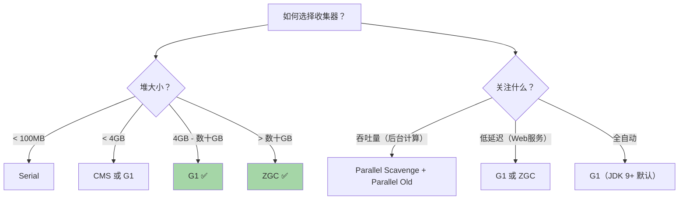

---

## 面试高频问题

### Q1：CMS 的工作流程？有什么缺点？

四个阶段：初始标记(STW) → 并发标记 → 重新标记(STW) → 并发清除。
缺点：内存碎片、浮动垃圾、Concurrent Mode Failure。

### Q2：G1 为什么能做到可预测停顿？

G1 将堆分为大量 Region，每次 GC 不需要回收全部区域，而是根据每个 Region 的回收价值排序，在用户设定的停顿时间内优先回收垃圾最多的 Region。

### Q3：CMS 和 G1 的主要区别？

从算法（标记清除 vs 复制）、碎片（有 vs 无）、范围（老年代 vs 全堆）、停顿控制（不可控 vs 可控）四个维度回答。

### Q4：什么是 ZGC？特点是什么？

ZGC 是超低延迟收集器，停顿时间 < 1ms，不随堆大小增加。基于染色指针和读屏障实现，支持 TB 级别堆。
