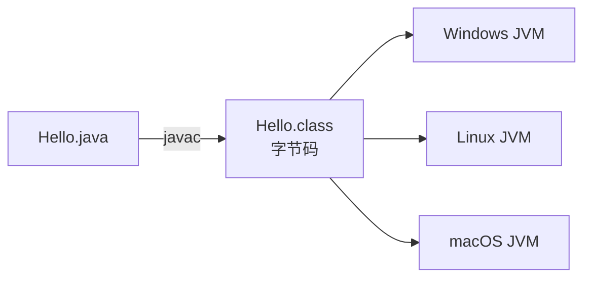
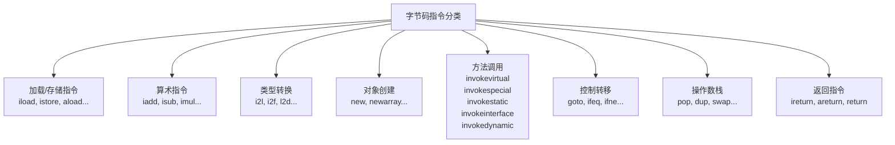
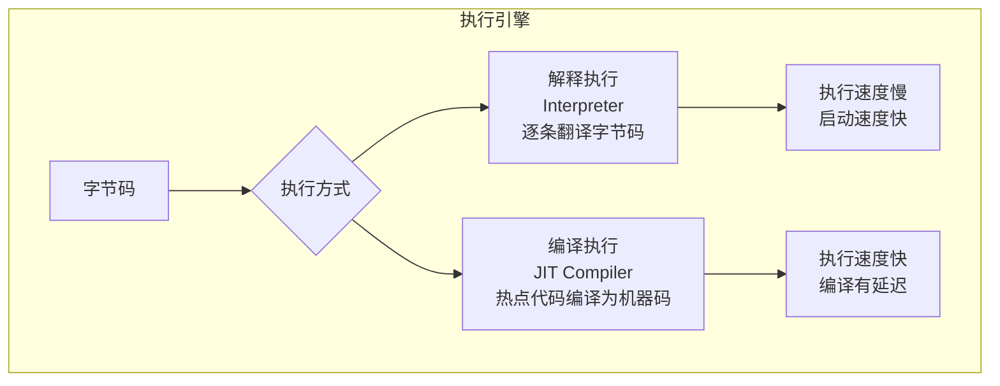
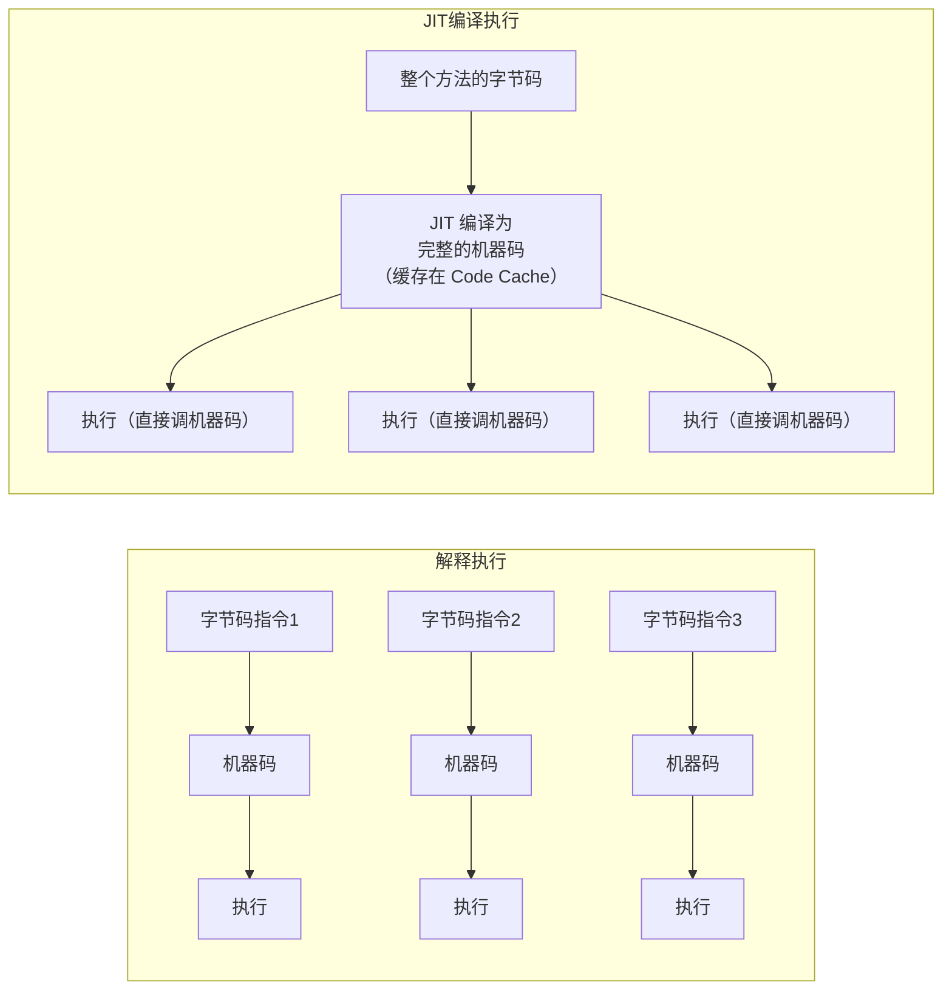
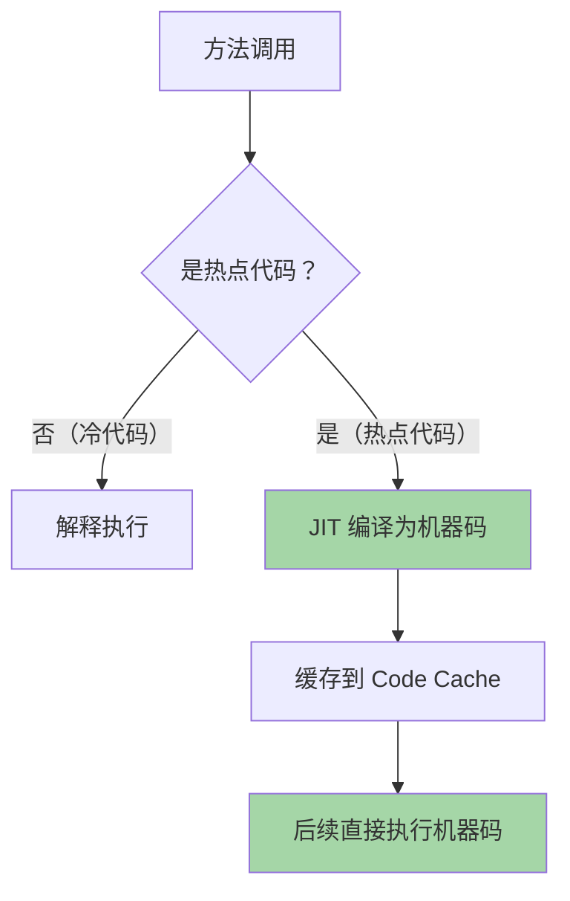
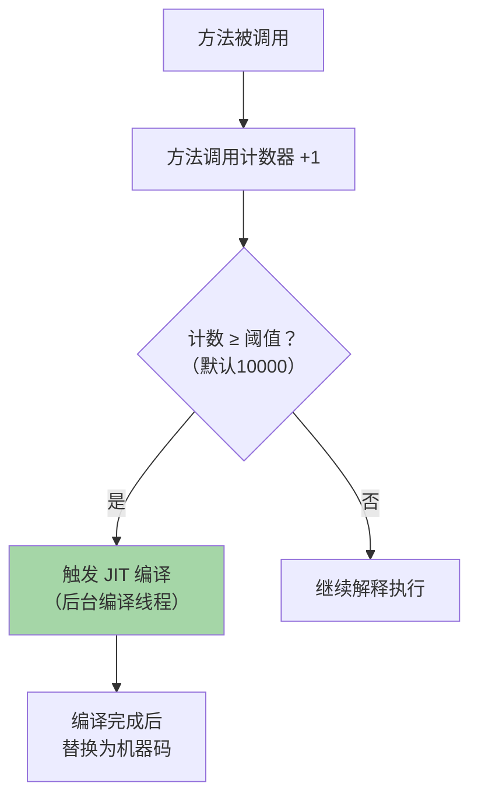
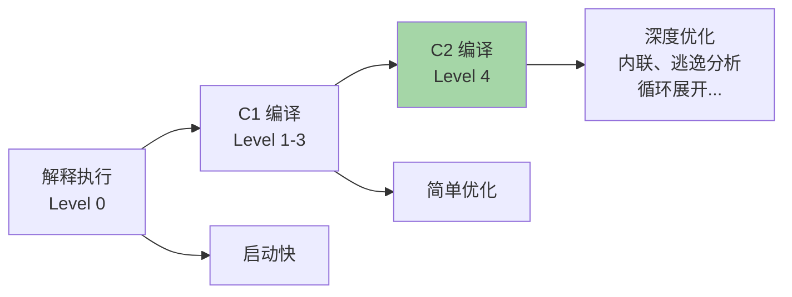
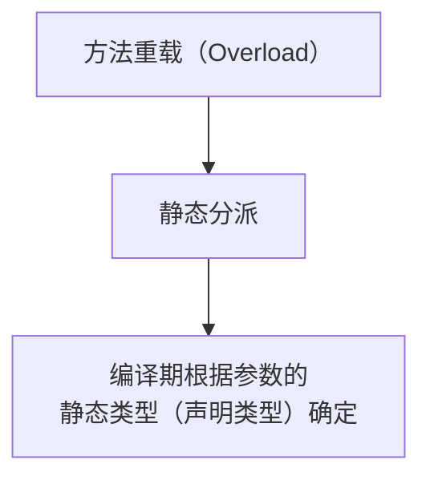
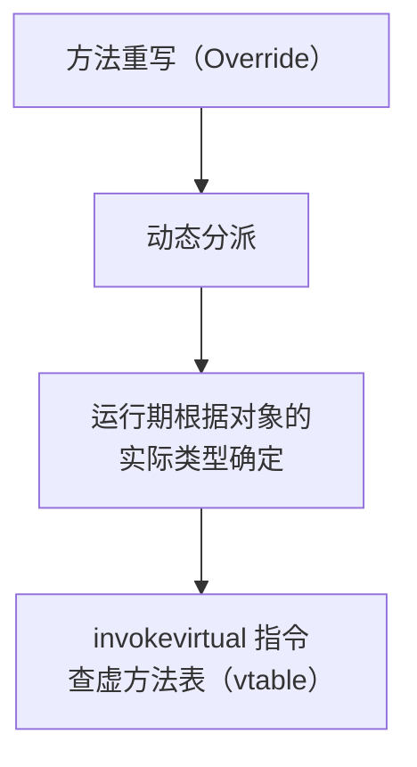

# JVM 字节码与执行引擎

## Class 文件结构

Java 跨平台的秘密：一次编译，到处运行 = **Class 字节码 + JVM**。



### Class 文件组成

```
┌─────────────────────────────────────────────────┐
│ Magic Number: 0xCAFEBABE (4字节，标识Class文件)    │
├─────────────────────────────────────────────────┤
│ 版本号: minor_version + major_version (4字节)      │
├─────────────────────────────────────────────────┤
│ 常量池 (constant_pool)                            │
│ 字面量（字符串、数值）+ 符号引用（类名、方法名、字段名）  │
├─────────────────────────────────────────────────┤
│ 访问标志 (access_flags): public, final, abstract  │
├─────────────────────────────────────────────────┤
│ 类索引 + 父类索引 + 接口索引                        │
├─────────────────────────────────────────────────┤
│ 字段表 (fields)                                   │
├─────────────────────────────────────────────────┤
│ 方法表 (methods)                                  │
│ → 每个方法包含 Code 属性（字节码指令）                │
├─────────────────────────────────────────────────┤
│ 属性表 (attributes)                               │
└─────────────────────────────────────────────────┘
```

> `0xCAFEBABE` 是 Class 文件的魔数（Magic Number），每个 Class 文件开头都是这 4 个字节。

### 查看字节码

```bash
# 反编译查看字节码
javap -c -v Hello.class
```

---

## 常见字节码指令

### 指令分类



### 方法调用指令（面试考点）

| 指令 | 调用对象 | 示例 |
|------|----------|------|
| **invokestatic** | 静态方法 | `Math.max()` |
| **invokespecial** | 构造方法、私有方法、super | `new Object()`, `super.method()` |
| **invokevirtual** | 虚方法（动态分派） | `obj.method()`（多态！） |
| **invokeinterface** | 接口方法 | `list.add()` |
| **invokedynamic** | 动态调用（Lambda） | Lambda 表达式 |

### i++ vs ++i 字节码分析

```java
int i = 0;
int a = i++;  // a = 0, i = 1
int b = ++i;  // b = 2, i = 2
```

```
// i++ 的字节码
iload_1        // 先把 i 的值压栈（0）
iinc 1, 1      // i 自增（i=1），但栈上还是旧值 0
istore_2       // 栈顶 0 存入 a → a=0

// ++i 的字节码
iinc 1, 1      // i 先自增（i=2）
iload_1        // 再把 i 的值压栈（2）
istore_3       // 栈顶 2 存入 b → b=2
```

> 关键区别：i++ 先 load 再 inc，++i 先 inc 再 load。

---

## 执行引擎



### 解释器 vs JIT 编译器



### HotSpot 的混合模式



### 热点代码检测

| 热点类型 | 计数器 | 阈值 |
|----------|--------|------|
| **热点方法** | 方法调用计数器 | 10000 次（Server 模式） |
| **热点循环** | 回边计数器 | 循环体执行次数 |



### JIT 编译器类型

| 编译器 | 别名 | 特点 |
|--------|------|------|
| **C1 编译器** | Client Compiler | 编译快，优化少 |
| **C2 编译器** | Server Compiler | 编译慢，**深度优化** |
| **分层编译** | Tiered Compilation | 先 C1 再 C2（**默认模式**） |



### JIT 常见优化

| 优化 | 说明 |
|------|------|
| **方法内联** | 小方法直接展开到调用处，消除方法调用开销 |
| **逃逸分析** | 不逃逸对象栈上分配、标量替换、锁消除 |
| **循环展开** | 减少循环判断次数 |
| **空值检查消除** | 确认不为 null 后去掉 null 检查 |
| **公共子表达式消除** | 相同计算只算一次 |

---

## 方法分派

### 静态分派（编译期确定）

```java
public class Dispatch {
    static void say(Object obj) { System.out.println("Object"); }
    static void say(String str) { System.out.println("String"); }
    
    public static void main(String[] args) {
        Object obj = new String("hello");
        say(obj);  // 输出 "Object" → 编译期根据声明类型 Object 选择
    }
}
```



### 动态分派（运行期确定）

```java
public class Dispatch {
    static class Father {
        void say() { System.out.println("Father"); }
    }
    static class Son extends Father {
        void say() { System.out.println("Son"); }
    }
    
    public static void main(String[] args) {
        Father f = new Son();
        f.say();  // 输出 "Son" → 运行期根据实际类型 Son 确定
    }
}
```



> [!important] 面试答案
> - **重载** = 静态分派（编译期，看声明类型）
> - **重写** = 动态分派（运行期，看实际类型）→ **多态的本质**

---

## 面试高频问题

### Q1：JVM 是解释执行还是编译执行？

**混合模式。** 默认解释执行，热点代码（调用超过 10000 次）通过 JIT 编译为机器码缓存执行。使用分层编译（先 C1 简单优化，再 C2 深度优化）。

### Q2：什么是 JIT 编译？

Just-In-Time 编译，将频繁执行的热点代码在运行时编译为本地机器码，避免每次都解释执行。编译后的代码缓存在 Code Cache 中。

### Q3：重载和重写在 JVM 层面的区别？

重载是静态分派，编译期根据声明类型确定调用哪个方法。重写是动态分派，运行期根据对象的实际类型，通过虚方法表确定调用哪个方法。

### Q4：invokedynamic 是什么？

JDK 7 引入的动态方法调用指令，支持在运行时绑定方法。JDK 8 的 Lambda 表达式底层就是用 invokedynamic 实现的。
