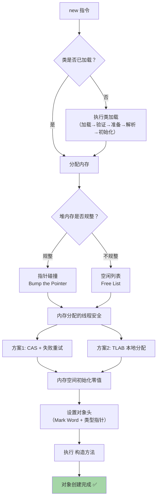
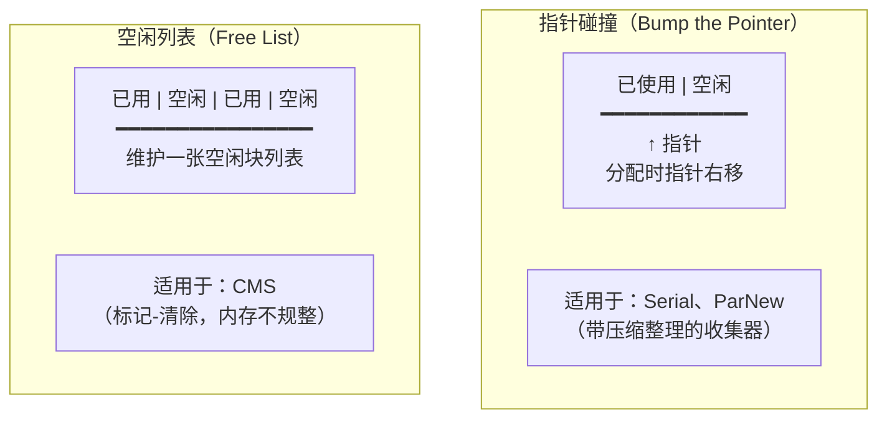
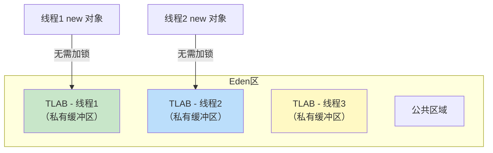
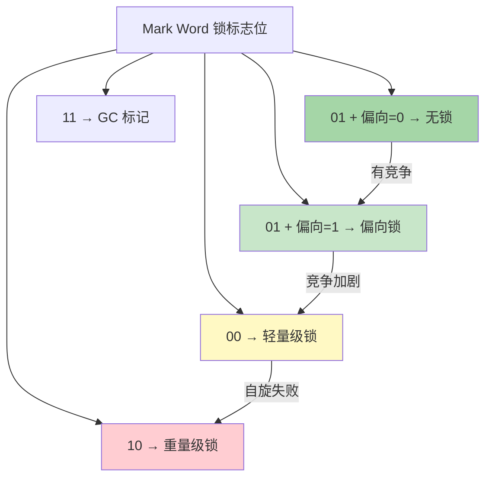
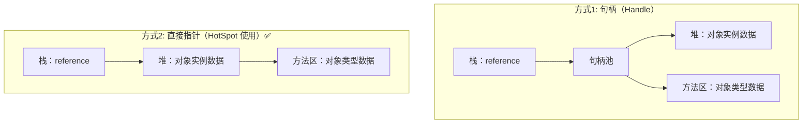
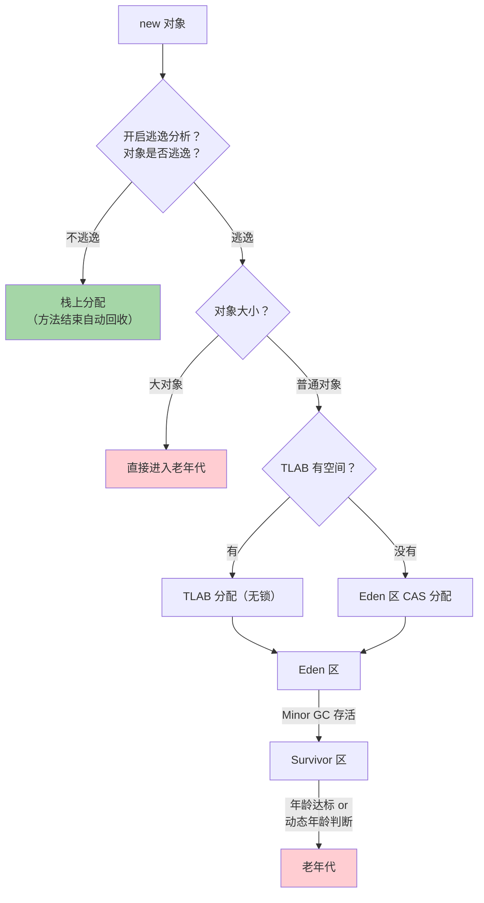

# JVM 对象创建与内存布局

## 对象创建全流程

当 JVM 遇到 `new` 指令时：



### 内存分配方式



### TLAB（Thread Local Allocation Buffer）



- 每个线程在 Eden 区有一块**私有缓冲区**
- 对象优先在 TLAB 中分配，**无需同步操作**
- TLAB 满了才使用 CAS 在公共区域分配
- `-XX:+UseTLAB`（默认开启）
- TLAB 大小约 Eden 区的 1%

---

## 对象内存布局

一个 Java 对象在堆中的存储结构分为三部分：

```
┌──────────────────────────────────────────────┐
│                 对象头 Header                  │
│ ┌──────────────────────────────────────────┐ │
│ │ Mark Word (8字节/64位)                    │ │
│ │ 哈希码、GC年龄、锁状态、线程ID...          │ │
│ ├──────────────────────────────────────────┤ │
│ │ 类型指针 Klass Pointer (4/8字节)          │ │
│ │ 指向方法区的类元信息                       │ │
│ ├──────────────────────────────────────────┤ │
│ │ 数组长度 (4字节，仅数组对象)               │ │
│ └──────────────────────────────────────────┘ │
├──────────────────────────────────────────────┤
│                 实例数据 Instance Data         │
│ 字段内容（按分配策略排列）                      │
│ long/double → int/float → short/char →       │
│ byte/boolean → 引用类型                       │
├──────────────────────────────────────────────┤
│                 对齐填充 Padding               │
│ 补齐到 8 字节的整数倍                          │
└──────────────────────────────────────────────┘
```

### Mark Word 详细结构（64 位 JVM）

```
┌────────────────────────────────────────────────────────────┐
│                        Mark Word (64 bits)                  │
├──────────────────────┬─────────┬──────┬──────┬─────────────┤
│       内容            │ unused  │ 分代  │ 偏向  │ 锁标志位    │
│                      │         │ 年龄  │ 锁位  │ (2 bits)   │
├──────────────────────┼─────────┼──────┼──────┼─────────────┤
│ 无锁                  │ hashcode(31) unused(25) │ age(4) │ 0  │ 01     │
│ 偏向锁                │ threadId(54) epoch(2)   │ age(4) │ 1  │ 01     │
│ 轻量级锁              │ 指向栈中锁记录的指针(62)           │    │ 00     │
│ 重量级锁              │ 指向 monitor 的指针(62)            │    │ 10     │
│ GC 标记               │ 空(62)                             │    │ 11     │
└──────────────────────┴─────────────────────────────────────┘
```



> [!important] Mark Word 的核心价值
> Mark Word 是**复用的**：根据锁状态不同，同一块空间存储不同内容。这是 JVM 节省内存的精妙设计。

### 指针压缩

```
开启指针压缩（默认，堆 < 32GB）:
  类型指针: 8字节 → 4字节
  对象引用: 8字节 → 4字节
  
-XX:+UseCompressedOops     // 压缩普通对象指针
-XX:+UseCompressedClassPointers  // 压缩类型指针
```

### 对象大小计算示例

```java
public class MyObject {
    int a;        // 4 字节
    long b;       // 8 字节
    byte c;       // 1 字节
    Object ref;   // 4 字节（压缩指针）
}
```

```
对象头:
  Mark Word = 8 字节
  Klass Pointer = 4 字节（压缩）
实例数据:
  long b = 8 字节（先分配大的）
  int a = 4 字节
  byte c = 1 字节
  Object ref = 4 字节（压缩）
  padding = 3 字节（补齐到 8 的倍数）
━━━━━━━━━━━━━━━━
总计 = 8 + 4 + 8 + 4 + 1 + 4 + 3 = 32 字节
```

---

## 对象访问定位

栈中的引用如何找到堆中的对象？



| 方式 | 优点 | 缺点 |
|------|------|------|
| **句柄** | 对象移动时只改句柄，reference 不变 | 多一次间接寻址 |
| **直接指针** ✅ | 访问速度快（少一次间接寻址） | 对象移动时需更新 reference |

> HotSpot 使用**直接指针**方式，追求极致的访问速度。

---

## 对象分配策略总结



### 逃逸分析

```java
// 不逃逸 → 可以栈上分配
public void method() {
    Point p = new Point(1, 2);  // p 不会逃出方法
    System.out.println(p.x + p.y);
    // 方法结束，p 自动销毁，不需要 GC
}

// 逃逸 → 必须堆上分配
public Point createPoint() {
    Point p = new Point(1, 2);  
    return p;  // p 逃出了方法！
}
```

逃逸分析带来的优化：

| 优化 | 说明 |
|------|------|
| **栈上分配** | 不逃逸的对象在栈上分配，方法结束自动销毁 |
| **标量替换** | 把对象拆成基本类型，直接用局部变量代替 |
| **锁消除** | 不逃逸的对象不可能被其他线程访问，去掉同步锁 |

```
-XX:+DoEscapeAnalysis      // 开启逃逸分析（默认开启）
-XX:+EliminateAllocations  // 开启标量替换
-XX:+EliminateLocks        // 开启锁消除
```

---

## 面试高频问题

### Q1：对象的创建过程？

1. 检查类是否已加载
2. 分配内存（指针碰撞/空闲列表）
3. 处理并发安全（CAS/TLAB）
4. 初始化零值
5. 设置对象头
6. 执行 `<init>` 构造方法

### Q2：对象在内存中的布局？

对象头（Mark Word + 类型指针）+ 实例数据 + 对齐填充。

### Q3：什么是逃逸分析？

分析对象的作用域是否逃逸出方法或线程。不逃逸的对象可以栈上分配、标量替换、锁消除，减少 GC 压力。

### Q4：对象一定分配在堆上吗？

不一定！开启逃逸分析后，不逃逸的小对象可以**栈上分配**或**标量替换**。
