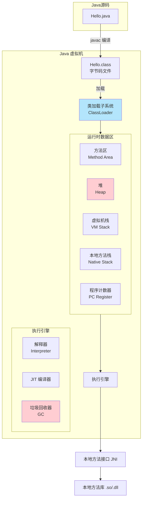
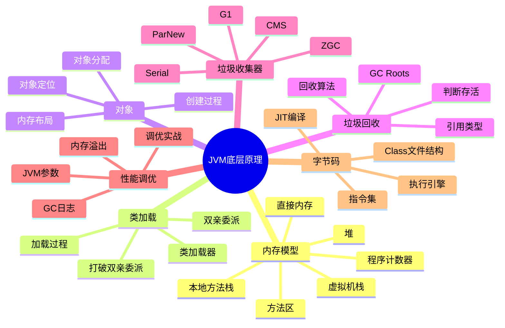

# JVM 底层原理 - 完整知识体系

> [!tip] 使用指南
> JVM 是 Java 面试中**最难、最抽象**的部分。本系列笔记用**大量图解**替代文字描述，帮助你建立直觉。建议按顺序阅读，每篇都有面试标准答案。

## JVM 全景架构图

![[Pasted image 20260417202425.png]]

![[Pasted image 20260417203109.png]]

![[Pasted image 20260417225600.png]]
## 知识地图

## 模块导航

| 序号  | 模块                 | 核心内容                       | 面试热度  |
| --- | ------------------ | -------------------------- | ----- |
| 1   | [[JVM内存模型与运行时数据区]] | 5 大内存区域、栈帧结构、堆分代           | ⭐⭐⭐⭐⭐ |
| 2   | [[JVM类加载机制]]       | 加载过程、双亲委派、打破双亲委派           | ⭐⭐⭐⭐⭐ |
| 3   | [[JVM对象创建与内存布局]]   | 对象创建流程、内存布局、对象定位、逃逸分析      | ⭐⭐⭐⭐  |
| 4   | [[JVM垃圾回收算法]]      | 可达性分析、标记清除/复制/整理、分代收集      | ⭐⭐⭐⭐⭐ |
| 5   | [[JVM垃圾收集器]]       | Serial、CMS、G1、ZGC 原理与对比    | ⭐⭐⭐⭐⭐ |
| 6   | [[JVM字节码与执行引擎]]    | Class 文件、字节码指令、解释/编译执行、JIT | ⭐⭐⭐⭐  |
| 7   | [[JVM性能调优与故障排查]]   | JVM 参数、GC 日志、OOM 排查、调优实战   | ⭐⭐⭐⭐⭐ |

## 面试高频 Top 10 问题速查

1. **JVM 内存模型/运行时数据区有哪些？** → [[JVM内存模型与运行时数据区#五大运行时数据区]]
2. **堆内存怎么分代的？为什么要分代？** → [[JVM内存模型与运行时数据区#堆的分代结构]]
3. **什么是双亲委派？为什么要打破？** → [[JVM类加载机制#双亲委派模型]]
4. **对象是怎么创建的？内存怎么分配？** → [[JVM对象创建与内存布局#对象创建全流程]]
5. **怎么判断对象可以被回收？** → [[JVM垃圾回收算法#对象存活判断]]
6. **垃圾回收算法有哪些？** → [[JVM垃圾回收算法#三大垃圾回收算法]]
7. **CMS 和 G1 的区别？** → [[JVM垃圾收集器#CMS vs G1 对比]]
8. **什么情况下会发生 Full GC？** → [[JVM垃圾回收算法#Minor GC vs Major GC vs Full GC]]
9. **什么是 STW？怎么减少 STW 时间？** → [[JVM垃圾收集器#Stop The World]]
10. **线上 OOM 怎么排查？** → [[JVM性能调优与故障排查#OOM 排查实战]]
