# JVM 性能调优与故障排查

这是面试中**最实战**的部分，面试官喜欢问"你有没有实际调优过JVM"。

## JVM 参数分类

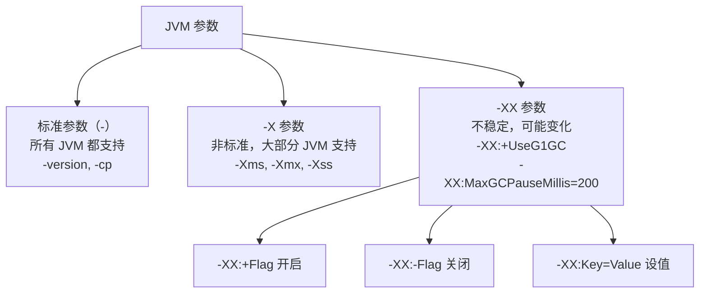

## 核心 JVM 参数速查

### 内存相关

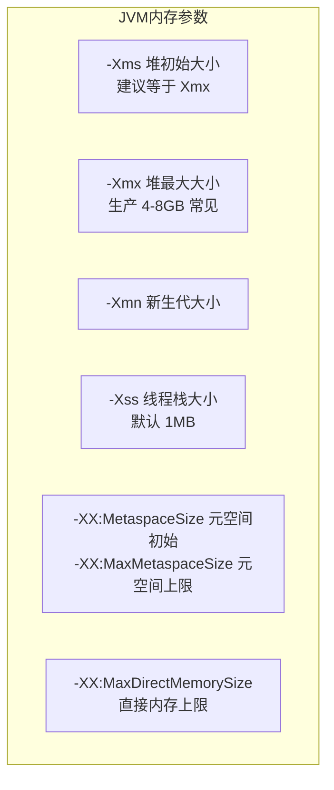

### 完整参数模板（生产环境参考）

```bash
# 堆内存
-Xms4g -Xmx4g          # 堆大小（初始=最大，避免动态扩缩）
-Xmn2g                  # 新生代 2G（一般为堆的 1/3 ~ 1/2）
-Xss512k                # 线程栈 512KB

# 元空间
-XX:MetaspaceSize=256m
-XX:MaxMetaspaceSize=512m

# 收集器（G1）
-XX:+UseG1GC
-XX:MaxGCPauseMillis=200
-XX:G1HeapRegionSize=8m

# GC 日志（JDK 9+）
-Xlog:gc*:file=gc.log:time,uptime,level,tags:filecount=5,filesize=100m

# OOM 时 dump 堆
-XX:+HeapDumpOnOutOfMemoryError
-XX:HeapDumpPath=/tmp/heapdump.hprof
```

---

## OOM 排查实战

### OOM 类型全景

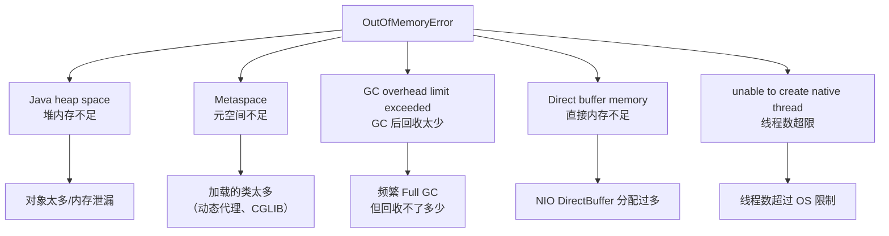

### 排查流程

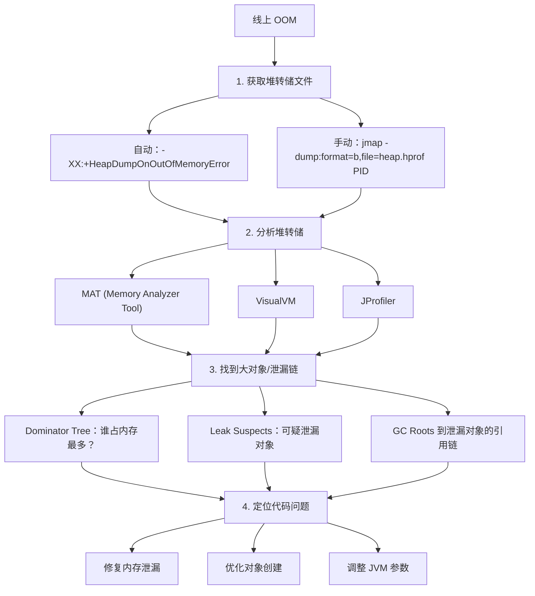

### 常见内存泄漏场景

| 场景 | 原因 | 解决方案 |
|------|------|----------|
| **静态集合** | `static List` 不断 add | 用弱引用或定期清理 |
| **未关闭资源** | Connection、Stream 未 close | try-with-resources |
| **ThreadLocal** | 线程池中 ThreadLocal 未 remove | 用完后 `threadLocal.remove()` |
| **监听器/回调** | 注册后忘记取消注册 | 及时 removeListener |
| **缓存** | 无限增长的缓存 | 使用 LRU 缓存（如 Caffeine） |
| **内部类** | 非静态内部类持有外部类引用 | 改为静态内部类 |

---

## JVM 排查工具

### 命令行工具

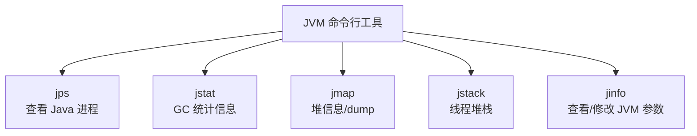

#### jps - 查看进程

```bash
jps -l
# 12345 com.example.Application
```

#### jstat - GC 统计

```bash
# 每 1000ms 输出一次 GC 统计，共 10 次
jstat -gcutil PID 1000 10

#  S0     S1     E      O      M     YGC   YGCT   FGC   FGCT    GCT
#  0.00  52.38  45.67  23.45  96.23  125   0.845   3    0.312   1.157
#  ↑      ↑      ↑      ↑      ↑      ↑     ↑      ↑     ↑       ↑
#  S0使用 S1使用 Eden  Old   Meta  YGC次数 YGC耗时 FGC次数 FGC耗时 总耗时
```

#### jmap - 堆信息

```bash
# 堆使用概况
jmap -heap PID

# 对象统计（按大小排序）
jmap -histo PID | head -20

# 堆转储（线上慎用！会 STW）
jmap -dump:format=b,file=heap.hprof PID
```

#### jstack - 线程堆栈

```bash
# 打印线程堆栈
jstack PID

# 常见用途：
# 1. 排查死锁
# 2. 找到 CPU 高的线程在执行什么
# 3. 排查线程阻塞
```

### CPU 飙高排查流程

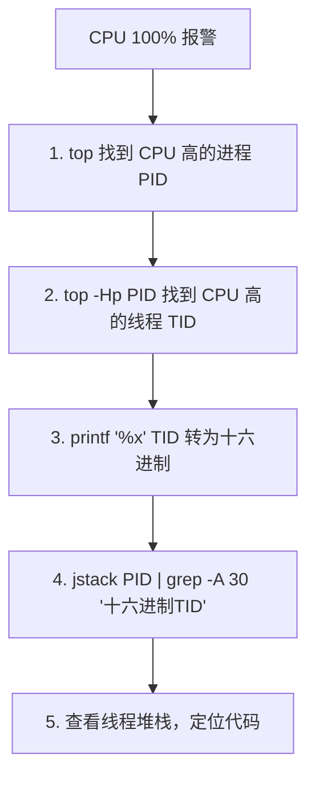

```bash
# 实操命令
top                           # 找到 Java 进程 PID=12345
top -Hp 12345                 # 找到 CPU 高的线程 TID=12367
printf '%x\n' 12367           # 转16进制 → 0x304f
jstack 12345 | grep -A 30 '0x304f'  # 查看该线程在干什么
```

### 死锁排查

```bash
jstack PID
# 输出末尾会直接提示：
# Found one Java-level deadlock:
# =============================
# "Thread-1":
#   waiting to lock monitor 0x... (object 0x...)
#   which is held by "Thread-0"
# "Thread-0":
#   waiting to lock monitor 0x... (object 0x...)
#   which is held by "Thread-1"
```

---

## GC 日志分析

### JDK 8 GC 日志格式

```
# 开启 GC 日志
-XX:+PrintGCDetails -XX:+PrintGCDateStamps -Xloggc:gc.log
```

```
Young GC 日志示例:
2026-04-07T10:30:15.123+0800: [GC (Allocation Failure)
  [PSYoungGen: 524288K->43520K(611840K)]  ← 新生代: 回收前→回收后(总大小)
  524288K->43520K(2010112K),              ← 堆: 回收前→回收后(总大小)
  0.0234567 secs]                         ← GC 耗时

Full GC 日志示例:
2026-04-07T10:35:20.456+0800: [Full GC (Metadata GC Threshold)
  [PSYoungGen: 1024K->0K(611840K)]
  [ParOldGen: 410234K->305678K(1398272K)] ← 老年代
  411258K->305678K(2010112K),
  [Metaspace: 256000K->256000K(1298432K)] ← 元空间
  0.5678901 secs]
```

### JDK 9+ 统一日志

```bash
# 输出到文件，5个文件轮转，每个100MB
-Xlog:gc*:file=gc.log:time,uptime,level,tags:filecount=5,filesize=100m
```

### GC 日志关注指标

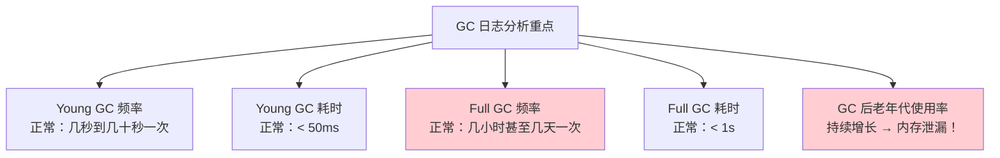

---

## 调优实战案例

### 案例1：频繁 Full GC

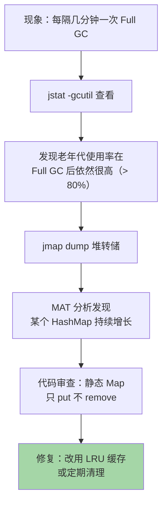

### 案例2：Young GC 时间长

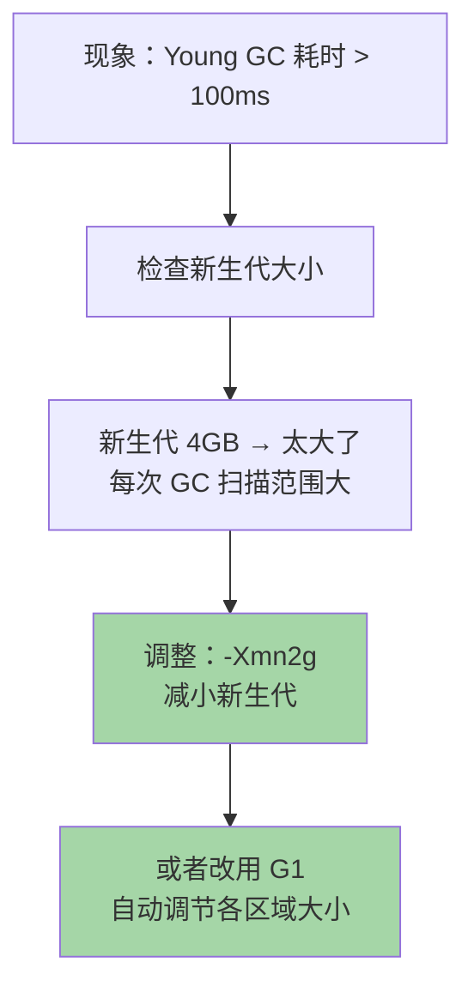

### 案例3：Metaspace OOM

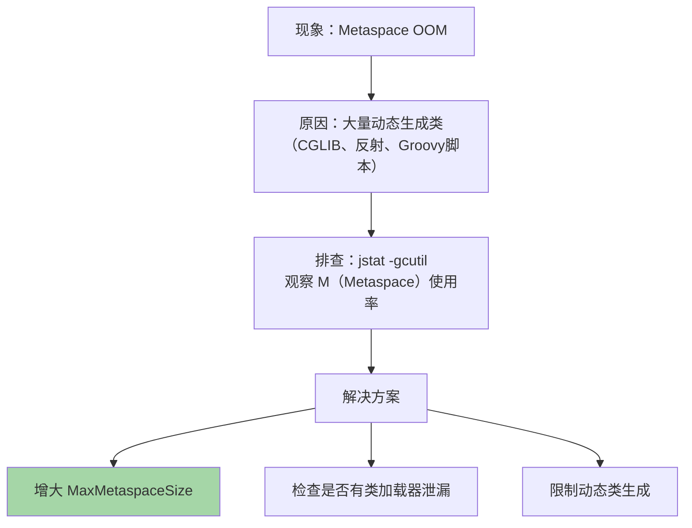

---

## 调优原则

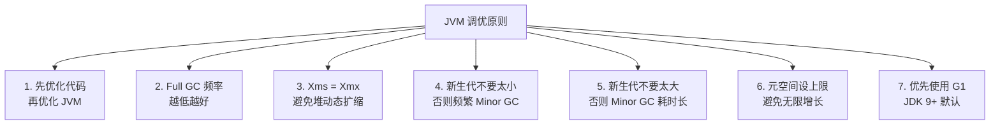

---

## 面试高频问题

### Q1：线上 OOM 怎么排查？

1. 确保开启 `-XX:+HeapDumpOnOutOfMemoryError`
2. 获取堆转储文件
3. 用 MAT 分析大对象和引用链
4. 找到泄漏代码修复

### Q2：线上 CPU 100% 怎么排查？

1. `top` 找到 CPU 高的 Java 进程
2. `top -Hp PID` 找到 CPU 高的线程
3. `printf '%x'` 转十六进制
4. `jstack` 查看该线程堆栈

### Q3：常用的 JVM 参数有哪些？

`-Xms/-Xmx`（堆大小）、`-Xmn`（新生代）、`-Xss`（栈大小）、`-XX:MetaspaceSize`（元空间）、`-XX:+UseG1GC`（收集器）、`-XX:+HeapDumpOnOutOfMemoryError`（OOM dump）。

### Q4：你做过哪些 JVM 调优？

回答模板：
1. **问题现象**：频繁 Full GC / 响应时间长 / OOM
2. **排查过程**：用什么工具（jstat/jmap/MAT）发现了什么
3. **根因分析**：内存泄漏 / 参数不合理 / 大对象
4. **解决方案**：修复代码 / 调整参数 / 更换收集器
5. **优化效果**：Full GC 频率从 X 降到 Y，响应时间从 A 降到 B
