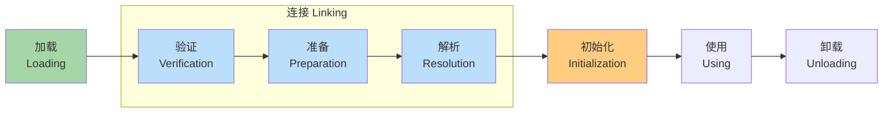
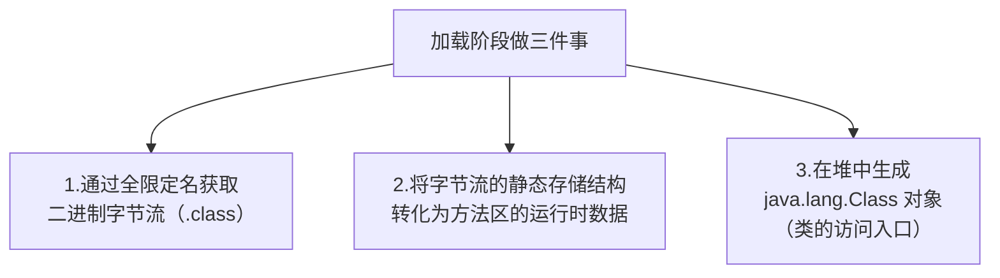
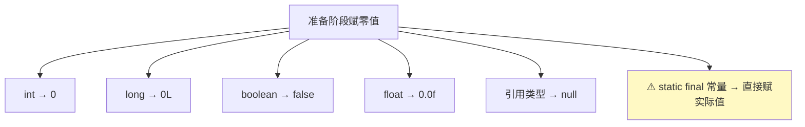
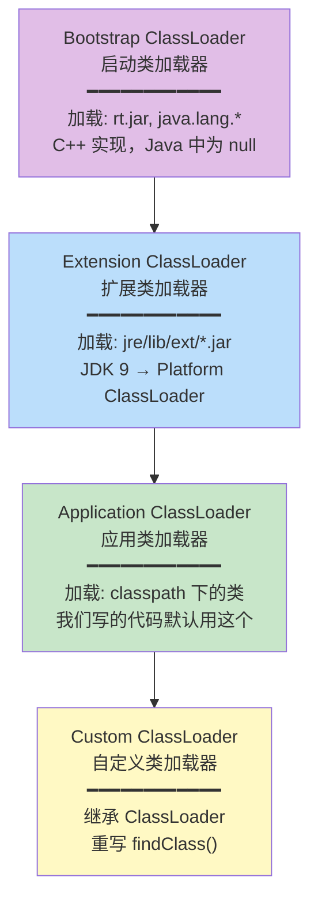
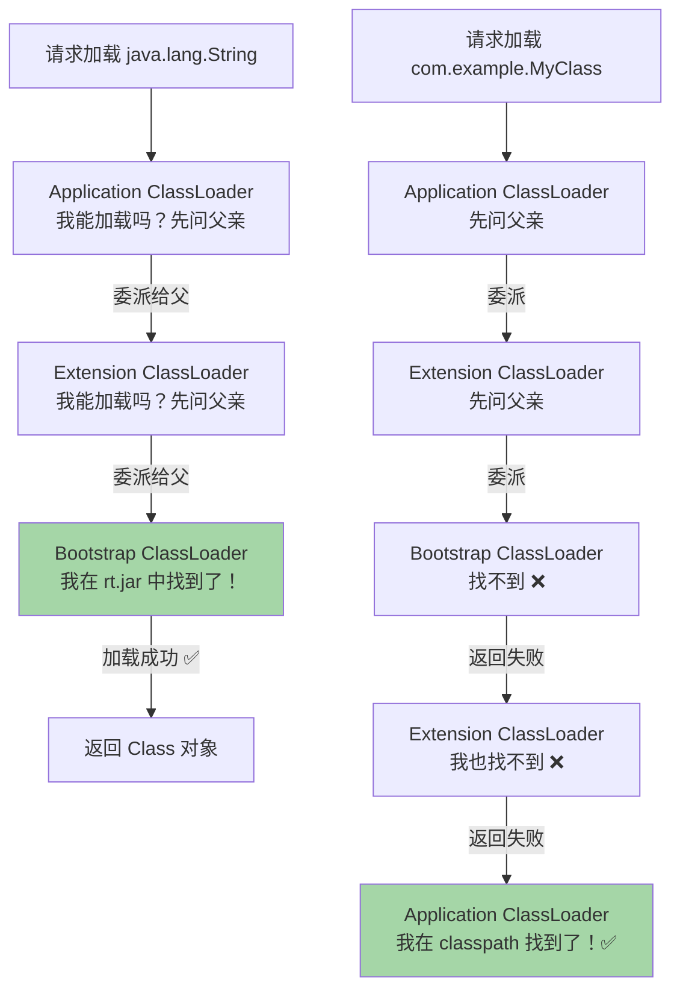
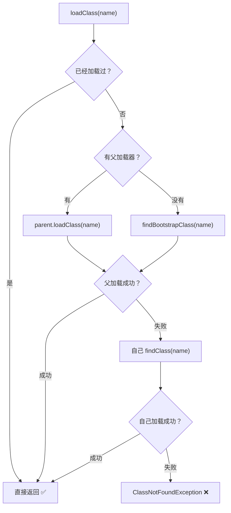
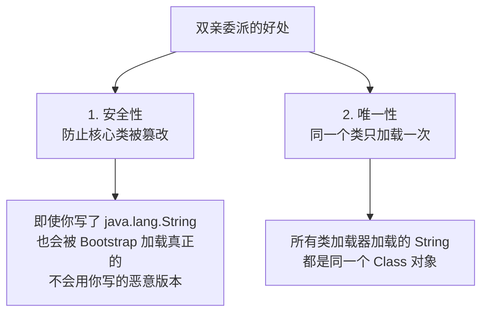
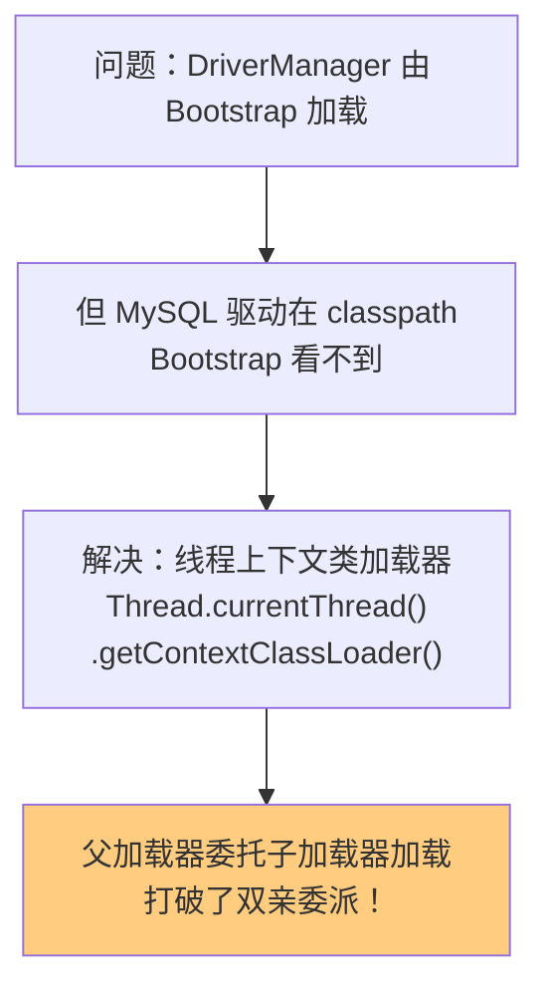
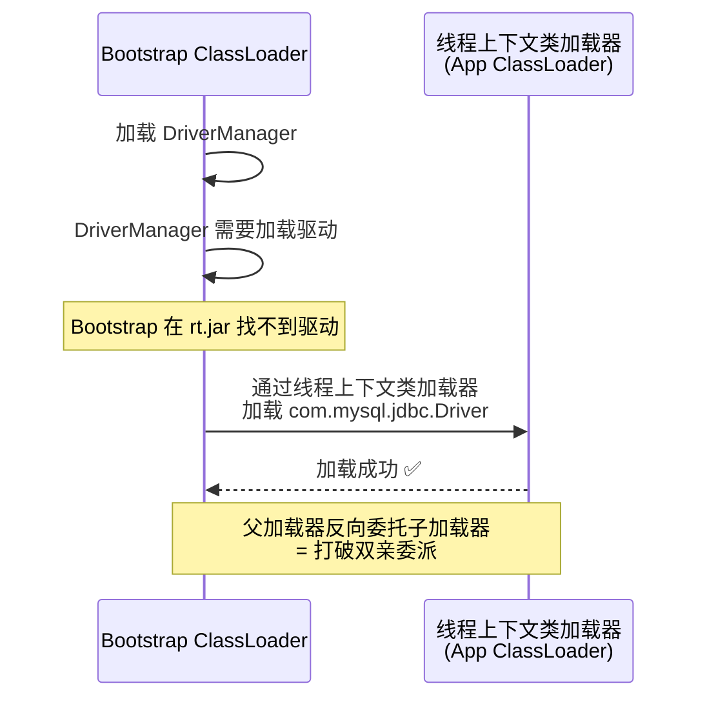
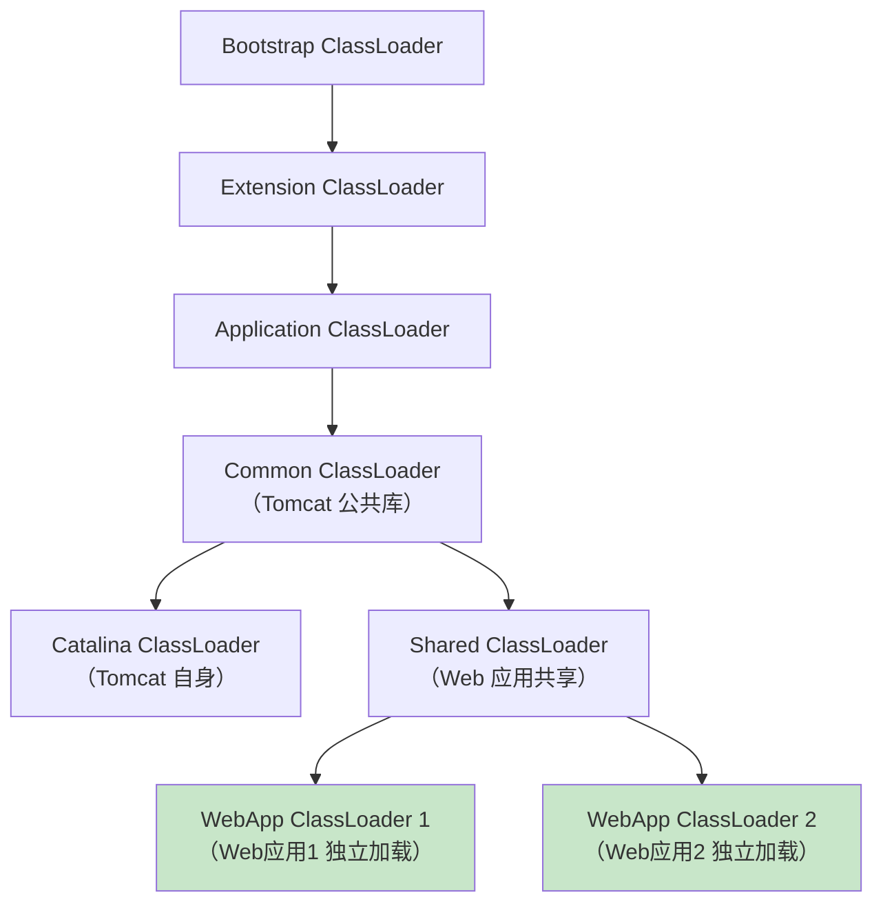

# JVM 类加载机制

## 类的生命周期



### 各阶段详解

#### 1. 加载（Loading）



字节流来源可以是：
- `.class` 文件
- JAR / WAR 包
- 网络传输
- 运行时动态生成（动态代理）

#### 2. 验证（Verification）

确保 Class 文件符合 JVM 规范，不会危害虚拟机安全。

```
✅ 文件格式验证：魔数 0xCAFEBABE、版本号
✅ 元数据验证：父类是否存在、是否继承了 final 类
✅ 字节码验证：指令合法性、类型安全
✅ 符号引用验证：引用的类/方法/字段是否存在
```

#### 3. 准备（Preparation）

为**类变量**（static 变量）分配内存并设置**零值**。

```java
// 准备阶段：
public static int value = 123;  // value = 0（零值！不是123）
public static final int CONST = 456;  // CONST = 456（final 是常量，直接赋值）
```



#### 4. 解析（Resolution）

将常量池中的**符号引用**替换为**直接引用**（内存地址）。

```
符号引用：  "java/lang/Object"（文本描述）
     ↓ 解析
直接引用：  0x7F3A2B00（实际内存地址/偏移量）
```

#### 5. 初始化（Initialization）

执行类的 `<clinit>()` 方法（编译器自动生成），真正执行 static 变量赋值和 static 代码块。

```java
public class Example {
    static int a = 10;        // <clinit>() 中：a = 10
    static {
        System.out.println("静态代码块");  // <clinit>() 中执行
    }
}
```

> [!important] 触发类初始化的 6 种场景（主动引用）
> 1. `new` 对象、读写静态字段（非 final）、调用静态方法
> 2. 反射调用 `Class.forName()`
> 3. 初始化子类时，父类先初始化
> 4. main 方法所在的类
> 5. JDK 7 `MethodHandle` 解析结果
> 6. JDK 8 接口中的 default 方法

**不会触发初始化的场景（被动引用）：**

```java
// ❌ 不会触发 SubClass 初始化（通过子类引用父类的静态字段）
System.out.println(SubClass.parentStaticField);

// ❌ 不会触发初始化（数组定义）
SuperClass[] arr = new SuperClass[10];

// ❌ 不会触发初始化（引用常量）
System.out.println(ConstClass.FINAL_VALUE);
```

---

## 类加载器



---

## 双亲委派模型

### 核心流程



### 源码级理解

```java
protected Class<?> loadClass(String name, boolean resolve) {
    // 1. 先检查类是否已经被加载
    Class<?> c = findLoadedClass(name);
    if (c == null) {
        try {
            if (parent != null) {
                // 2. 委派给父加载器
                c = parent.loadClass(name, false);
            } else {
                // 3. 没有父加载器，用 Bootstrap
                c = findBootstrapClassOrNull(name);
            }
        } catch (ClassNotFoundException e) {
            // 父加载器加载失败
        }
        if (c == null) {
            // 4. 父加载器都失败了，自己尝试加载
            c = findClass(name);
        }
    }
    return c;
}
```



### 双亲委派的好处



> [!important] 面试标准答案
> **双亲委派的好处：**
> 1. **避免类的重复加载**：父加载器已加载的类，子加载器不会重复加载
> 2. **保护核心类库安全**：防止自定义类覆盖核心 API（如自定义 `java.lang.String`）

---

## 打破双亲委派

### 什么时候需要打破？

| 场景 | 说明 |
|------|------|
| **SPI 机制** | DriverManager（Bootstrap）需要加载用户的 JDBC 驱动（App ClassLoader） |
| **热部署** | Tomcat 不同 Web 应用需要加载不同版本的同名类 |
| **模块化** | OSGi、JDK 9 Module System |

### SPI 打破双亲委派





### Tomcat 的类加载器



**Tomcat 的 WebAppClassLoader 打破双亲委派：**
1. 先在自己的 `/WEB-INF/classes` 和 `/WEB-INF/lib` 中查找
2. 找不到才委派给父加载器
3. 这样不同 Web 应用可以使用**不同版本**的同名类（如 Spring 4 和 Spring 5）

---

## 面试高频问题

### Q1：什么是双亲委派？

收到类加载请求时，先委派给父类加载器加载，父类加载器找不到再自己加载。保证了类的唯一性和核心类库的安全性。

### Q2：什么时候会打破双亲委派？怎么打破？

1. **SPI 机制**：通过线程上下文类加载器，让父加载器委托子加载器加载
2. **Tomcat**：自定义 WebAppClassLoader，优先加载自己目录下的类
3. **热部署**：每次部署用新的 ClassLoader 加载

打破方式：重写 `loadClass()` 方法（双亲委派的逻辑在这个方法里）。

### Q3：类的加载过程？

加载 → 验证 → 准备 → 解析 → 初始化。准备阶段赋零值，初始化阶段赋真正的值。

### Q4：JVM 判断两个类是否相同的条件？

**全限定名相同 + 类加载器相同**。同一个 class 文件被不同的 ClassLoader 加载，被视为不同的类。
