# MySQL · Redis · 锁 · JVM 底层全景图

> **阅读指南**：本文用 **4 张核心架构图 + 6 张专题细节图** 串联四大知识域。  
> 记忆口诀贯穿全文，配合图形辅助回忆。

---

## 🧠 一、JVM 全景架构

> **记忆口诀**：「**堆栈方程计**」= 堆 + 栈 + 方法区 + 程序计数器

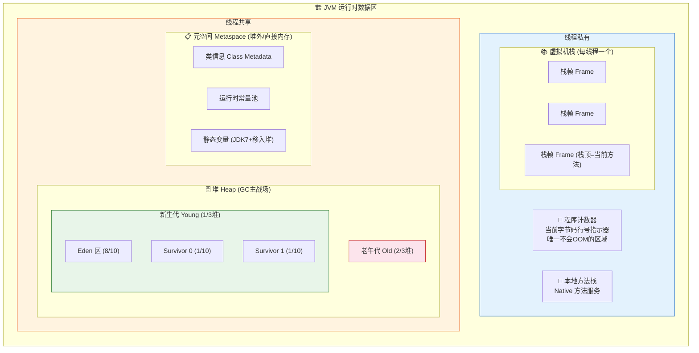

### 1.1 栈帧结构 (每次方法调用创建一个)

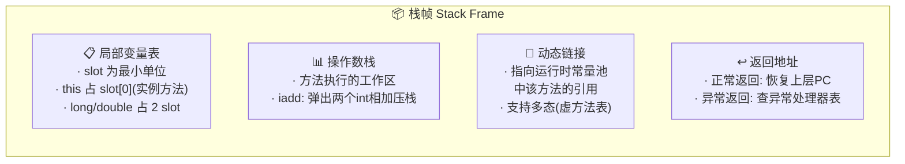

### 1.2 对象头 — 锁升级的物理基础

> **记忆口诀**：「**无偏轻重**」= 无锁 → 偏向锁 → 轻量级锁 → 重量级锁

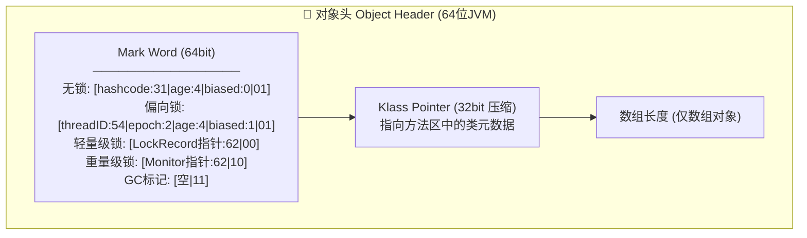

### 1.3 GC 体系

> **记忆口诀**：「**标复整分**」= 标记-清除 / 复制 / 标记-整理 / 分代收集

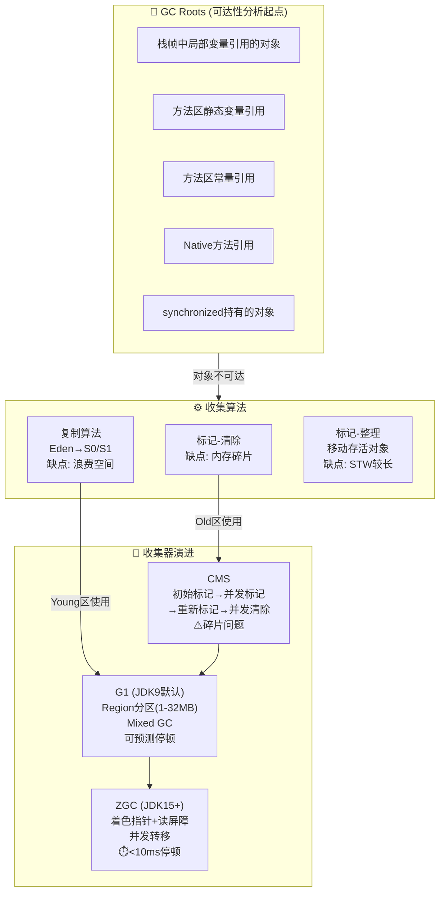

### 1.4 类加载机制

> **记忆口诀**：「**加验准解初**」= 加载 → 验证 → 准备 → 解析 → 初始化

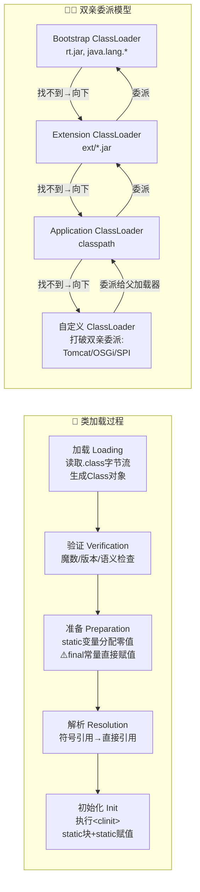

---

## 🗄️ 二、MySQL (InnoDB) 全景架构

> **记忆口诀**：「**缓改自日**」= Buffer Pool + Change Buffer + Adaptive Hash + Log Buffer

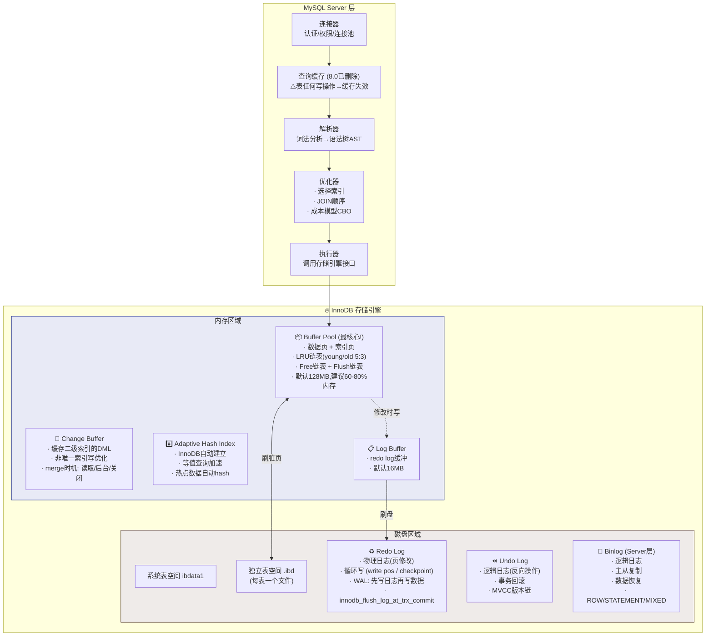

### 2.1 B+树索引结构

> **记忆口诀**：「**聚二覆下**」= 聚簇索引 + 二级索引 + 覆盖索引 + 索引下推

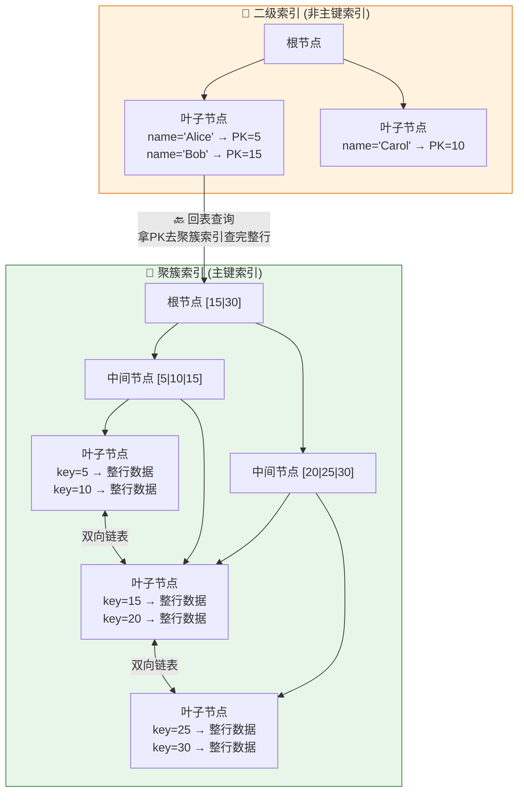

**索引优化三剑客：**

| 技术 | 原理 | 效果 |
|------|------|------|
| **覆盖索引** | 查询列全在索引中 | 避免回表，Using index |
| **索引下推 ICP** | WHERE条件在引擎层过滤 | 减少回表次数 |
| **最左前缀** | 联合索引`(a,b,c)`匹配最左列 | `a`✅ `a,b`✅ `b,c`❌ |

### 2.2 MVCC 多版本并发控制

> **记忆口诀**：「**版链视图四比较**」= Undo版本链 + Read View + 4个比较字段

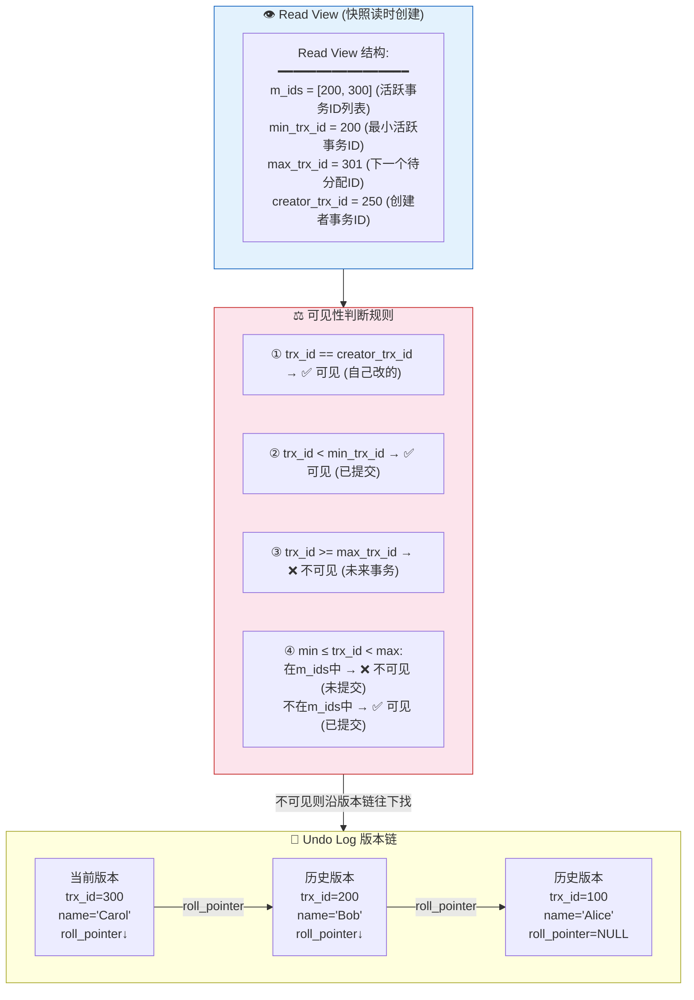

**隔离级别与 Read View：**

| 隔离级别 | Read View 创建时机 | 效果 |
|----------|-------------------|------|
| **READ COMMITTED** | 每次 SELECT 都创建新的 | 能读到其他事务已提交的 |
| **REPEATABLE READ** | 事务第一次 SELECT 时创建 | 整个事务看到同一快照 |

### 2.3 一条 UPDATE 的完整旅程

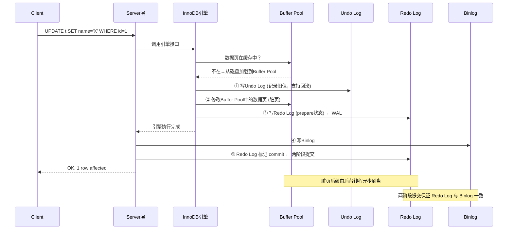

---

## 🔴 三、Redis 全景架构

> **记忆口诀**：「**单线复用，五型九底**」= 单线程 + IO多路复用 + 5种数据类型 + 9种底层编码

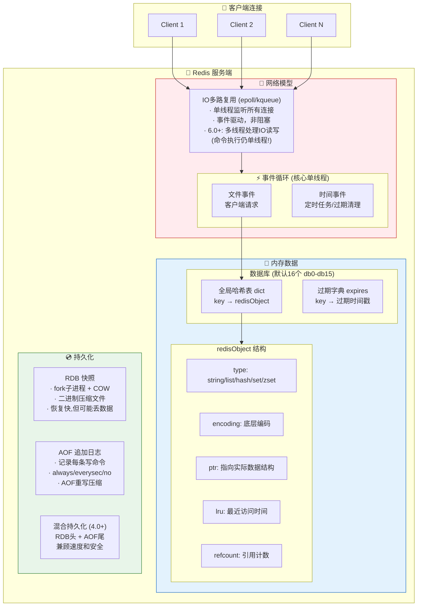

### 3.1 数据类型与底层编码映射

> **记忆口诀**：「**字列哈集有，SDS快跳整哈**」

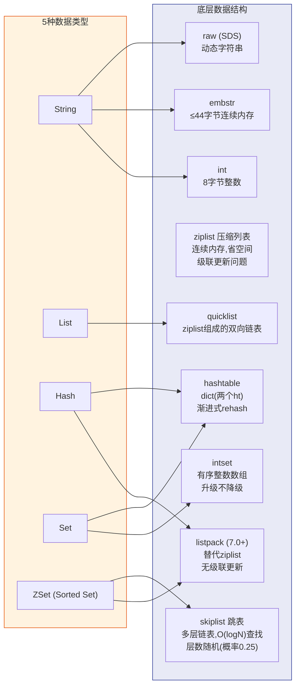

### 3.2 Redis 为什么这么快？

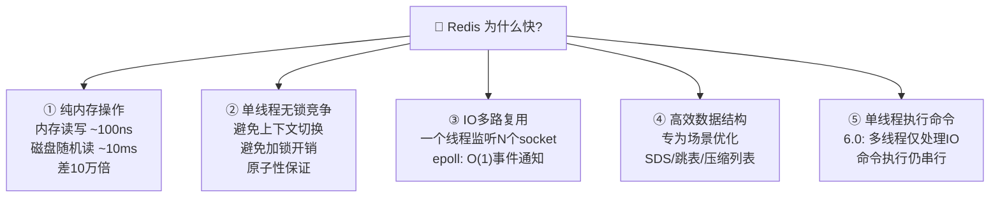

### 3.3 内存淘汰策略

> **记忆口诀**：「**八策三维**」= 8种策略 × 全键/过期键/不淘汰 三个维度

| 策略 | 范围 | 算法 |
|------|------|------|
| `volatile-lru` | 有过期时间的key | 近似LRU |
| `volatile-lfu` | 有过期时间的key | LFU(访问频率) |
| `volatile-ttl` | 有过期时间的key | TTL最小的先淘汰 |
| `volatile-random` | 有过期时间的key | 随机 |
| `allkeys-lru` | 所有key | 近似LRU |
| `allkeys-lfu` | 所有key | LFU |
| `allkeys-random` | 所有key | 随机 |
| `noeviction` | — | 不淘汰，写操作返回OOM |

**过期删除策略**：惰性删除(访问时检查) + 定期删除(每100ms随机抽样检查)

---

## 🔒 四、锁的统一全景图 — JVM / MySQL / Redis

> **记忆口诀**：「**线事分**」= JVM线程级锁 → MySQL事务级锁 → Redis分布式锁

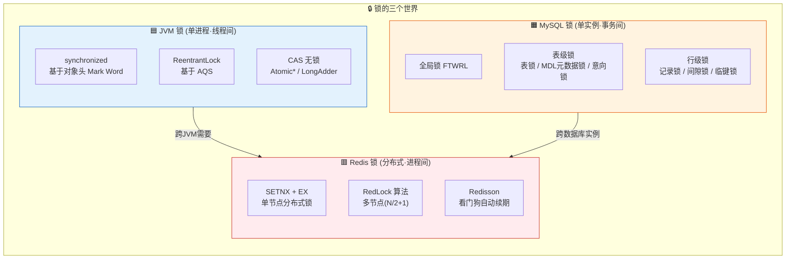

### 4.1 JVM synchronized 锁升级全过程

> **核心**：锁升级不可逆（偏向锁→轻量级锁→重量级锁）

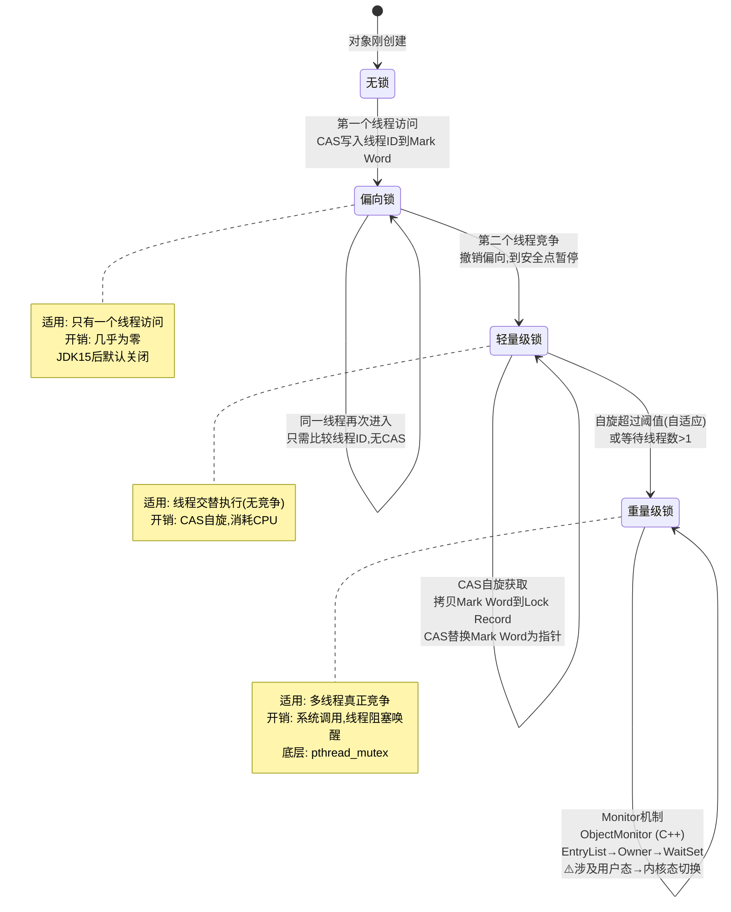

### 4.2 AQS (AbstractQueuedSynchronizer)

> **ReentrantLock / Semaphore / CountDownLatch 的底层骨架**

```mermaid
graph TB
    subgraph AQS["🏛️ AQS 核心结构"]
        STATE["volatile int state<br/>━━━━━━━━━━━━━<br/>ReentrantLock: 0=无锁, ≥1=持有(可重入)<br/>Semaphore: 剩余许可数<br/>CountDownLatch: 剩余计数"]
        
        subgraph CLH["CLH 变体队列 (双向链表)"]
            HEAD["Head (哨兵节点)<br/>当前持有锁的线程"]
            N1["Node1<br/>thread=T1<br/>waitStatus=SIGNAL<br/>prev←→next"]
            N2["Node2<br/>thread=T2<br/>waitStatus=0"]
            
            HEAD <--> N1 <--> N2
        end
        
        OWNER["exclusiveOwnerThread<br/>当前持有锁的线程"]
    end
    
    subgraph FLOW["🔄 获取锁流程"]
        F1["① CAS尝试修改state"]
        F2["② 失败→包装成Node入队"]
        F3["③ 自旋+park等待"]
        F4["④ 前驱释放→unpark唤醒"]
        F5["⑤ CAS获取成功→出队"]
        
        F1 -->|"失败"| F2 --> F3 --> F4 --> F5
        F1 -->|"成功"| DONE["获取锁"]
    end
    
    subgraph FAIR["公平 vs 非公平"]
        FAIR_L["公平锁: 新线程必须排队<br/>hasQueuedPredecessors()"]
        UNFAIR_L["非公平锁(默认): 新线程先CAS抢<br/>失败再排队→吞吐量更高"]
    end
```

### 4.3 MySQL 行级锁详解

> **记忆口诀**：「**记间临**」= Record Lock + Gap Lock + Next-Key Lock

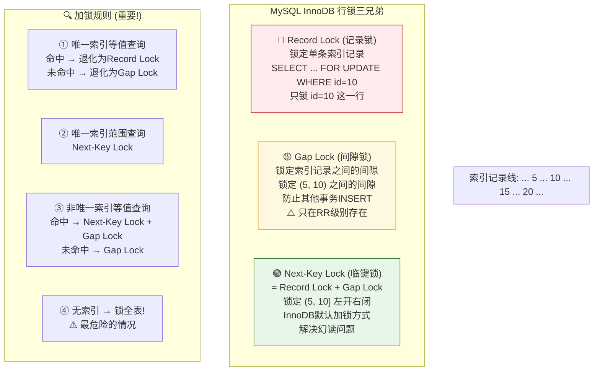

### 4.4 Redis 分布式锁演进

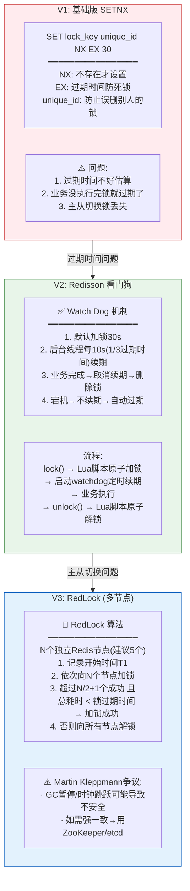

### 4.5 Redis 删除锁为什么要用 Lua?

```lua
-- 原子性: 判断+删除 在一个Lua脚本中执行
-- 防止: 判断是自己的锁 → 此时锁过期 → 别人加了新锁 → 删了别人的锁
if redis.call("get", KEYS[1]) == ARGV[1] then
    return redis.call("del", KEYS[1])
else
    return 0
end
```

---

## 🎯 五、横向对比总结

### 5.1 锁的对比表

| 维度 | JVM synchronized | JVM ReentrantLock | MySQL 行锁 | Redis 分布式锁 |
|------|-----------------|-------------------|-----------|---------------|
| **粒度** | 对象/类 | 自定义 | 行/间隙 | key |
| **范围** | 单JVM进程 | 单JVM进程 | 单MySQL实例 | 跨进程跨机器 |
| **实现** | Monitor(C++) | AQS(Java) | Lock Manager | SETNX+Lua |
| **可重入** | ✅ 计数器 | ✅ state计数 | ✅ 同事务 | ✅ Redisson hash |
| **公平性** | ❌ 非公平 | ✅ 可选 | ❌ | ❌ |
| **死锁处理** | JVM不处理 | tryLock超时 | 死锁检测回滚 | 过期时间兜底 |
| **性能** | 偏向锁极快 | 略慢于sync | 依赖索引 | 网络RTT开销 |

### 5.2 三者协作场景

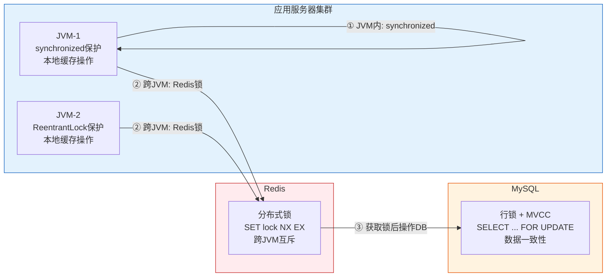

---

## 📝 记忆速查卡

| 主题 | 口诀 | 含义 |
|------|------|------|
| JVM内存 | **堆栈方程计** | 堆、栈、方法区、程序计数器 |
| GC算法 | **标复整分** | 标记清除、复制、标记整理、分代 |
| 类加载 | **加验准解初** | 加载→验证→准备→解析→初始化 |
| 锁升级 | **无偏轻重** | 无锁→偏向→轻量级→重量级 |
| InnoDB | **缓改自日** | Buffer Pool、Change Buffer、Adaptive Hash、Log Buffer |
| 索引 | **聚二覆下** | 聚簇、二级、覆盖、索引下推 |
| MVCC | **版链视图四比较** | Undo版本链 + ReadView 4字段判断 |
| 行锁 | **记间临** | Record Lock、Gap Lock、Next-Key Lock |
| Redis | **单线复用五型九底** | 单线程+IO复用, 5种类型9种编码 |
| 淘汰 | **八策三维** | 8种策略: LRU/LFU/TTL/Random × 全键/过期键 + noeviction |
| 分布式锁 | **设看红** | SETNX、看门狗、RedLock |
| 三层锁 | **线事分** | JVM线程锁→MySQL事务锁→Redis分布式锁 |

---

> 💡 **学习建议**：先看全景图建立框架 → 再深入每个专题图 → 最后用口诀反向回忆整张图
