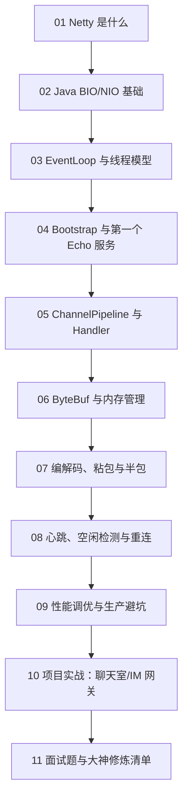

# Java Netty 从 0 基础到大神

> [!tip] 学习定位
> Netty 是 Java 网络编程的“发动机工厂”。如果说 Spring MVC 帮你写 HTTP 接口，Netty 则让你能亲手搭一台高性能网络服务器：连接怎么进来、字节怎么流动、线程怎么调度、协议怎么拆包，全部看得见。

> [!abstract] 彩色阅读导航
> - 蓝色 `info/tip`：概念、心智模型、学习路线。
> - 绿色 `success/example`：推荐写法、可复制代码、实战模板。
> - 黄色 `warning`：容易误解、迁移差异、调试提醒。
> - 红色 `danger`：线上高危点，比如阻塞 EventLoop、ByteBuf 泄漏、粘包半包、无限制连接。

> [!success] 推荐阅读顺序
> 零基础：`01 -> 02 -> 03 -> 04 -> 05`。  
> 想做 TCP/IM/网关：`04 -> 05 -> 06 -> 07 -> 10`。  
> 想冲源码和面试：`03 -> 08 -> 09 -> 11`。

## 当前版本口径

- Netty 官方介绍：Netty 是异步、事件驱动的网络应用框架，用于快速开发可维护、高性能的协议服务器和客户端。
- 2026-06-10 查询 Maven Central / Sonatype，`io.netty:netty-all` 当前版本为 `4.2.15.Final`。
- 4.2 大体兼容 4.1，但迁移时要关注最低 Java 版本、TLS 主机名校验、内存分配器默认策略和依赖版本统一。
- 实战建议：公司项目如果仍在 Netty 4.1，先升级到最新 4.1.x 并压测，再规划 4.2，不要一把梭。

## 学习地图

## 模块目录

1. [[01-Netty是什么与网络编程思维]]
2. [[02-Java-BIO-NIO与Reactor基础]]
3. [[03-EventLoop线程模型与Channel]]
4. [[04-Bootstrap第一个Echo服务器]]
5. [[05-ChannelPipeline与Handler机制]]
6. [[06-ByteBuf内存管理与泄漏排查]]
7. [[07-编解码粘包半包与自定义协议]]
8. [[08-心跳空闲检测重连与连接管理]]
9. [[09-性能调优监控与生产避坑]]
10. [[10-项目实战Netty聊天室与IM网关]]
11. [[11-Netty面试题与大神修炼清单]]

## 最终你要掌握什么

零基础阶段：

1. 知道 Netty 解决什么问题。
2. 能解释 BIO、NIO、Reactor 的区别。
3. 会写一个 TCP Echo 服务端和客户端。
4. 能看懂 `Bootstrap`、`ServerBootstrap`、`EventLoopGroup`、`ChannelHandler`。
5. 知道粘包、半包为什么一定会发生。

进阶阶段：

1. 能设计 ChannelPipeline。
2. 能写自定义协议编解码器。
3. 能正确使用 ByteBuf，避免内存泄漏。
4. 能实现心跳、断线重连、连接认证。
5. 能把业务线程池和 I/O 线程隔离。

大神阶段：

1. 能解释 EventLoop 单线程模型为什么减少锁竞争。
2. 能排查 direct memory、连接暴涨、写缓冲积压、EventLoop 阻塞。
3. 能设计 IM、网关、RPC、游戏服、物联网长连接架构。
4. 能根据 Linux 环境选择 epoll / io_uring 等 native transport。
5. 能在面试里讲清楚“为什么 Netty 快”，而不是只背“异步非阻塞”。

## 官方资料入口

- Netty 官网: https://netty.io/
- Netty 4.x User Guide: https://netty.io/wiki/user-guide-for-4.x.html
- Netty 4.2 Migration Guide: https://github.com/netty/netty/wiki/Netty-4.2-Migration-Guide
- ByteBuf Javadoc: https://netty.io/4.1/api/io/netty/buffer/ByteBuf.html
- Maven Central netty-all: https://central.sonatype.com/artifact/io.netty/netty-all

