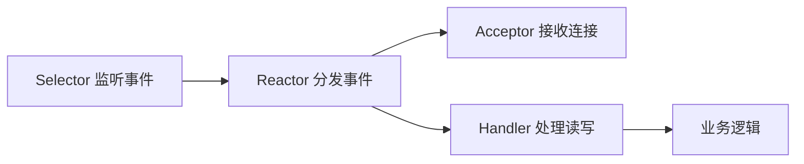

# Java BIO、NIO 与 Reactor 基础

> [!tip] 本章目标
> 你要知道 Netty 为什么不是简单封装 Socket，而是站在 Java NIO 和 Reactor 模型之上。

## BIO：一连接一线程

BIO 代码直觉很简单：

```java
ServerSocket serverSocket = new ServerSocket(8080);
while (true) {
    Socket socket = serverSocket.accept();
    new Thread(() -> handle(socket)).start();
}
```

优点：容易理解。  
缺点：连接多了线程爆炸，空闲连接也占线程。

> [!warning] BIO 适合学习，不适合高并发长连接
> 几百个连接还能撑，几万长连接就很难受了。线程不是免费的。

## NIO：一个线程看很多连接

Java NIO 的核心：

| 概念 | 作用 |
|---|---|
| Channel | 连接通道 |
| Buffer | 数据缓冲区 |
| Selector | 多路复用器，监听多个 Channel 的事件 |
| SelectionKey | 某个 Channel 上发生了什么事件 |

事件包括：

1. `OP_ACCEPT`：有新连接。
2. `OP_CONNECT`：连接完成。
3. `OP_READ`：可读。
4. `OP_WRITE`：可写。

## Reactor 模型

Reactor 像一个事件分发中心：



常见形态：

1. 单 Reactor 单线程：简单，但所有事一个线程做。
2. 单 Reactor 多线程：I/O 一个线程，业务丢线程池。
3. 主从 Reactor 多线程：Boss 接连接，Worker 处理读写。

Netty 常见服务端就是 BossGroup + WorkerGroup 的主从 Reactor 思路。

## Netty 对 NIO 做了什么

1. 隐藏 Selector 复杂细节。
2. 封装 Channel 和事件循环。
3. 用 Pipeline/Handler 组织协议逻辑。
4. 提供更好用的 ByteBuf。
5. 提供常见编解码器、超时、SSL、HTTP/WebSocket 支持。

> [!success] 心智模型
> NIO 是发动机零件，Reactor 是发动机工作原理，Netty 是可以装到车上的完整发动机。

## 本章小结

> [!info] 面试表达
> BIO 是阻塞的一连接一线程；NIO 使用 Selector 让少量线程管理大量连接；Netty 基于 NIO 和 Reactor 模型，封装了线程、事件、缓冲区和协议处理。

