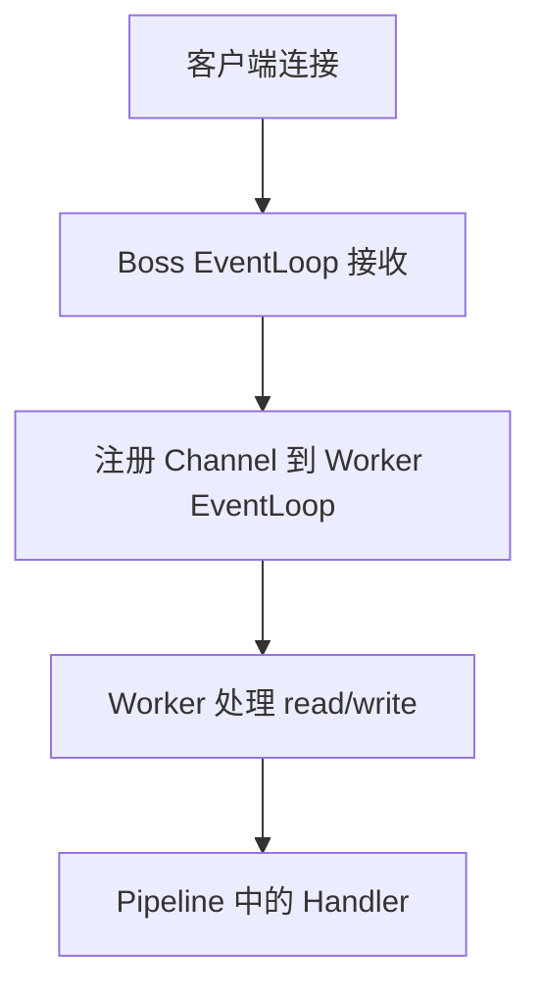

# EventLoop 线程模型与 Channel

> [!tip] 本章目标
> 你要看懂 Netty 服务端为什么通常有两个线程组，以及为什么不要阻塞 EventLoop。

## BossGroup 和 WorkerGroup

```text
BossGroup：负责接收新连接
WorkerGroup：负责处理连接上的读写事件
```



## EventLoop 的特点

官方 4.x 文档提到，Channel 注册到 EventLoopGroup 后，实际会注册到其中一个 EventLoop；EventLoop 可执行和调度任务。Handler 方法通常由关联 Channel 所属的 EventLoop 调用，并保持单线程语义。

这意味着：

1. 同一个 Channel 的 I/O 事件通常在同一个 EventLoop 线程中执行。
2. Handler 里少了很多锁。
3. EventLoop 一旦被阻塞，它管理的一批连接都会受影响。

> [!danger] EventLoop 不能干重活
> 不要在 Handler 里直接做慢 SQL、远程 HTTP、文件大读写、复杂计算。要么异步化，要么投递到业务线程池。

## Channel 是什么

Channel 是连接抽象。

常见 Channel：

| Channel | 场景 |
|---|---|
| `NioServerSocketChannel` | NIO TCP 服务端监听 |
| `NioSocketChannel` | NIO TCP 客户端连接 |
| `EpollServerSocketChannel` | Linux epoll 服务端 |
| `EpollSocketChannel` | Linux epoll 客户端 |

## Channel 生命周期

常见事件：

1. `channelRegistered`
2. `channelActive`
3. `channelRead`
4. `channelReadComplete`
5. `exceptionCaught`
6. `channelInactive`
7. `channelUnregistered`

> [!example] 连接上线下线
> IM 系统里，`channelActive` 可以登记连接，`channelInactive` 可以清理用户连接映射，`exceptionCaught` 可以记录异常并关闭异常连接。

## 从别的线程写 Channel

Netty 支持从业务线程调用：

```java
channel.writeAndFlush(message);
```

Netty 会把任务调度到对应 EventLoop 上执行。

> [!success] 推荐习惯
> 连接状态表可以保存 `Channel`，业务线程想推消息时直接 `writeAndFlush`。但要处理 Channel 已关闭、写缓冲积压、用户多端连接等情况。

## 本章小结

> [!info] 一句话
> EventLoop 是 Netty 的心跳。它让连接事件按序、高效地跑起来；你要做的是别让这颗心脏被阻塞。

