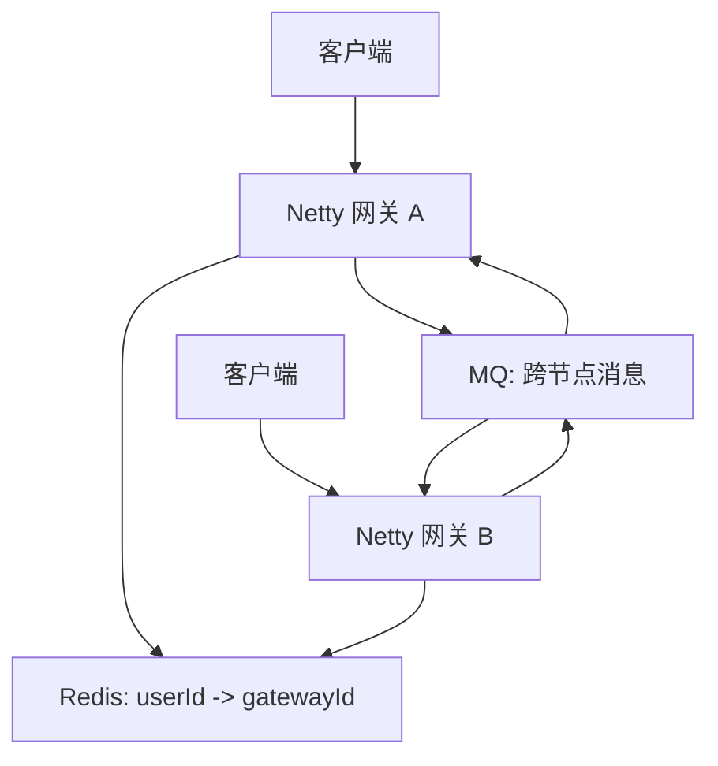
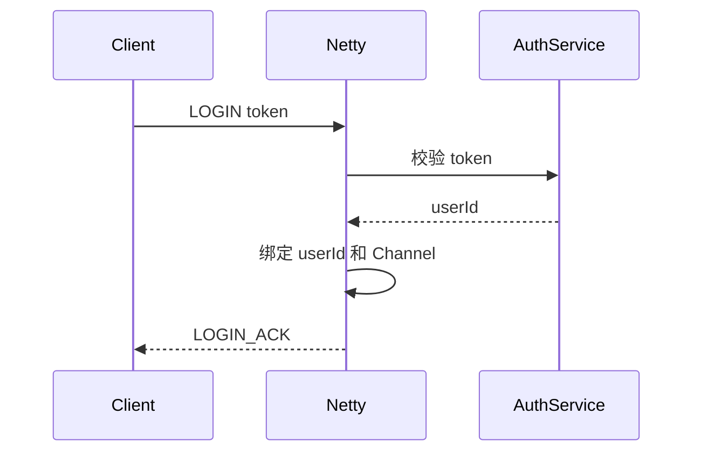

# 项目实战：Netty 聊天室与 IM 网关

> [!tip] 本章目标
> 用一个聊天室项目把 Netty 的连接、协议、编解码、心跳、业务线程和生产问题串起来。

## MVP 功能

1. 客户端连接服务端。
2. 登录认证。
3. 心跳保活。
4. 单聊消息。
5. 群聊广播。
6. 断线下线。
7. 离线消息补偿。

## 消息类型

```java
public enum MessageType {
    LOGIN,
    LOGIN_ACK,
    PING,
    PONG,
    SINGLE_CHAT,
    GROUP_CHAT,
    ACK,
    ERROR
}
```

## 协议结构

```text
magic      4 bytes
version    1 byte
type       1 byte
requestId  8 bytes
length     4 bytes
body       JSON bytes
```

## Pipeline

```java
ch.pipeline()
        .addLast("idle", new IdleStateHandler(60, 30, 0))
        .addLast("frame", new LengthFieldBasedFrameDecoder(1024 * 1024, 14, 4, 0, 0))
        .addLast("decoder", new ImMessageDecoder())
        .addLast("encoder", new ImMessageEncoder())
        .addLast("heartbeat", new HeartbeatHandler())
        .addLast("auth", new LoginAuthHandler())
        .addLast("chat", new ChatMessageHandler());
```

## 连接表

单节点：

```java
Map<Long, Set<ChannelId>> userChannels;
Map<ChannelId, Long> channelUsers;
```

多节点：



> [!warning] 单节点聊天室很简单，多节点 IM 才开始真实
> 多节点要处理用户在哪个网关、消息如何路由、网关宕机如何清理在线状态、离线消息如何补偿。

## 登录流程



## 单聊流程

1. A 发送消息给 B。
2. 服务端校验 A 已登录。
3. 生成 messageId。
4. 如果 B 在线，推送到 B 的 Channel。
5. 如果 B 不在线，写离线消息。
6. 给 A 返回 ACK。

## 本章小结

> [!success] 项目验收标准
> 能跑通不是终点。真正可用的 IM 网关要有认证、心跳、限流、ACK、离线补偿、监控、灰度和容量规划。

