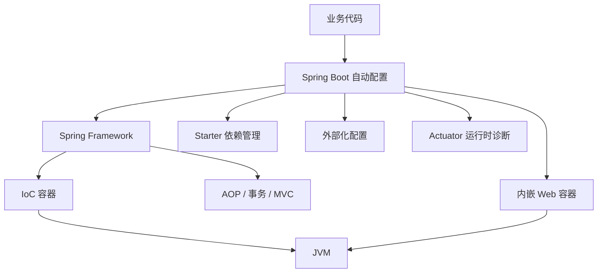
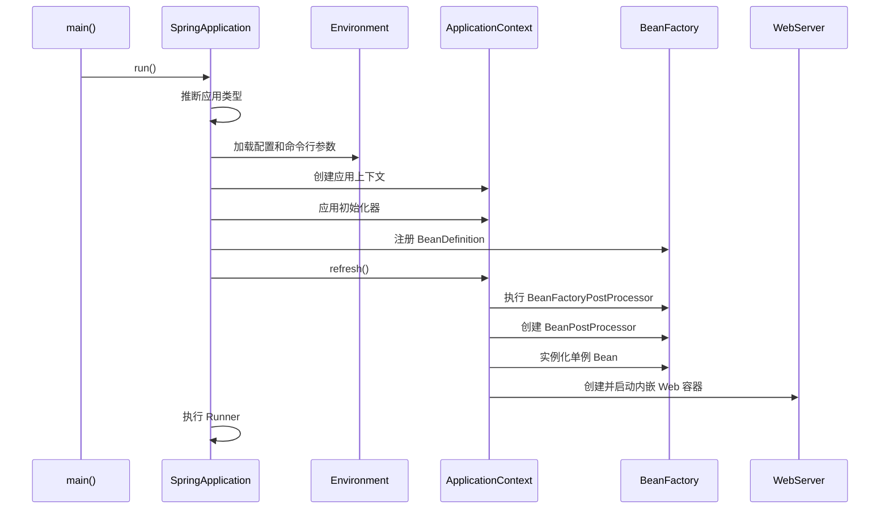
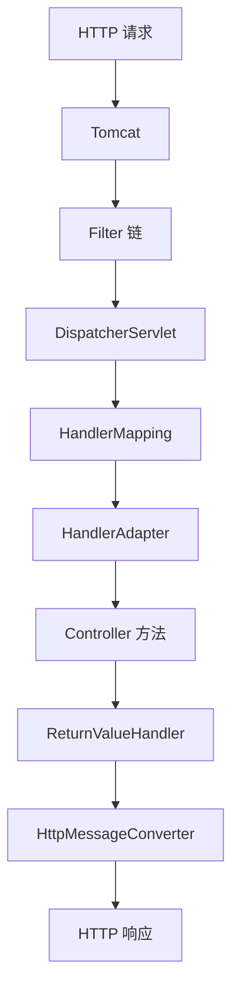

# SpringBoot框架原理篇

> [!tip] 阅读定位
> 这篇笔记偏“原理篇”，重点不是怎么写一个 Controller，而是理解 Spring Boot 为什么能少写配置、为什么应用能直接启动、自动配置如何生效、Bean 和 Web 容器什么时候创建、线上问题应该从哪里排查。底层 Java 运行机制可以结合 [[JVM类加载机制]]、[[JVM字节码与执行引擎]]、[[线程池原理]]、[[Java异步编程使用用法]] 一起看。

## 1. Spring Boot 解决的核心问题

Spring Framework 本身已经提供了 IoC、AOP、事务、MVC、数据访问等能力，但传统 Spring 项目通常有几个痛点：

1. XML 或 Java Config 配置量大。
2. 第三方库版本需要自己组合，容易出现依赖冲突。
3. Web 应用依赖外部 Tomcat、Jetty 等 Servlet 容器，部署链路较重。
4. 同一个能力反复写模板配置，比如数据源、MVC、JSON、事务、监控。
5. 项目启动以后，不容易知道哪些配置生效、哪些 Bean 被创建、为什么某个自动配置没有命中。

Spring Boot 的核心思路是：

1. 通过 starter 管理一组功能相关依赖。
2. 通过自动配置为常见场景提供默认 Bean。
3. 通过条件注解决定默认配置是否生效。
4. 通过外部化配置统一管理环境差异。
5. 通过内嵌 Web 容器把应用打成可直接运行的 jar。
6. 通过 Actuator 暴露运行时诊断信息。

一句话概括：

> Spring Boot 不是替代 Spring，而是在 Spring 之上加了一套“约定优于配置”的启动、依赖、自动装配和运行时管理机制。

## 2. Spring Boot 总体架构

Spring Boot 可以理解成几层能力叠加：



各层职责：

| 层级 | 作用 | 典型内容 |
|---|---|---|
| 业务代码 | 实现具体业务 | Controller、Service、Repository、配置类 |
| Spring Boot | 简化启动和默认装配 | starter、auto-configuration、condition、actuator |
| Spring Framework | 提供基础容器能力 | BeanFactory、ApplicationContext、AOP、事务、MVC |
| Web 容器 | 处理 HTTP 请求 | Tomcat、Jetty、Undertow |
| JVM | 运行字节码和管理内存 | 类加载、JIT、GC、线程 |

## 3. 一个最小应用背后发生了什么

最常见入口：

```java
@SpringBootApplication
public class DemoApplication {
    public static void main(String[] args) {
        SpringApplication.run(DemoApplication.class, args);
    }
}
```

这几行代码背后发生的事情很多：

1. 识别主启动类 `DemoApplication`。
2. 推断应用类型，是普通应用、Servlet Web 应用，还是 Reactive Web 应用。
3. 加载环境变量、配置文件、命令行参数。
4. 创建 `ApplicationContext`。
5. 扫描组件，注册 BeanDefinition。
6. 加载自动配置类。
7. 根据条件注解决定哪些自动配置生效。
8. 创建并初始化单例 Bean。
9. 如果是 Web 应用，创建并启动内嵌 Servlet 容器。
10. 发布启动完成事件，执行 `ApplicationRunner` 和 `CommandLineRunner`。

所以 `SpringApplication.run()` 不是简单 new 一个对象，它是整个应用启动生命周期的总入口。

## 4. `@SpringBootApplication` 的本质

`@SpringBootApplication` 是一个组合注解，核心由三部分组成：

```java
@SpringBootConfiguration
@EnableAutoConfiguration
@ComponentScan
public @interface SpringBootApplication {
}
```

### 4.1 `@SpringBootConfiguration`

它本质上是 `@Configuration` 的特殊版本，表示当前类是 Spring Boot 应用的主配置类。

```java
@Configuration
public @interface SpringBootConfiguration {
}
```

关键点：

1. 启动类本身会作为配置类参与容器构建。
2. 启动类所在包通常是组件扫描的根包。
3. 不建议把启动类放在太深的子包，否则同级或上级包下的组件可能扫描不到。

### 4.2 `@ComponentScan`

`@ComponentScan` 负责扫描组件，把下面这些注解标记的类注册为 Bean：

1. `@Component`
2. `@Service`
3. `@Repository`
4. `@Controller`
5. `@RestController`
6. `@Configuration`

默认扫描范围是启动类所在包及其子包。

例如：

```text
com.example.demo
├── DemoApplication.java
├── controller
│   └── UserController.java
├── service
│   └── UserService.java
└── repository
    └── UserRepository.java
```

这个结构能被默认扫描到。

如果结构是：

```text
com.example
├── common
│   └── CommonService.java
└── demo
    └── DemoApplication.java
```

`com.example.common` 默认不会被 `com.example.demo.DemoApplication` 扫描到，需要调整启动类位置或显式配置扫描范围。

### 4.3 `@EnableAutoConfiguration`

这是 Spring Boot 的灵魂之一。它负责根据 classpath、配置属性、已有 Bean、Web 环境等条件，自动导入大量配置类。

例如：

1. classpath 中有 Spring MVC，就尝试配置 MVC。
2. classpath 中有 Jackson，就尝试配置 JSON 序列化。
3. classpath 中有 DataSource 相关依赖，就尝试配置数据源。
4. classpath 中有 Tomcat，就尝试配置内嵌 Tomcat。
5. 用户自己定义了某个 Bean，默认自动配置就会退让。

自动配置的核心不是“强行替你配置”，而是“在条件满足且你没有显式接管时，提供合理默认值”。

## 5. SpringApplication 启动流程

可以把启动流程拆成两大阶段：

1. 构造 `SpringApplication` 对象。
2. 执行 `run()` 方法。

### 5.1 构造阶段

伪代码：

```java
SpringApplication application = new SpringApplication(primarySources);
application.run(args);
```

构造阶段大致做这些事：

1. 保存主启动类。
2. 推断 Web 应用类型。
3. 加载初始化器 `ApplicationContextInitializer`。
4. 加载监听器 `ApplicationListener`。
5. 推断 main 方法所在类。

Web 应用类型通常有三种：

| 类型 | 说明 |
|---|---|
| `NONE` | 非 Web 应用 |
| `SERVLET` | Spring MVC、Tomcat 这一类 Servlet 应用 |
| `REACTIVE` | WebFlux、Reactor Netty 这一类响应式应用 |

### 5.2 run 阶段

`run()` 的主线可以概括成：

```text
准备监听器
准备环境 Environment
创建 ApplicationContext
准备 ApplicationContext
刷新 ApplicationContext
启动 Web 容器
执行 Runner
发布启动完成事件
```

更细一点：



## 6. ApplicationContext 与 BeanFactory

Spring Boot 最终还是依赖 Spring 容器工作。最核心的两个概念是：

| 概念 | 作用 |
|---|---|
| `BeanFactory` | Bean 创建和依赖注入的底层工厂 |
| `ApplicationContext` | BeanFactory 的增强版，增加事件、国际化、资源加载、环境配置等能力 |

平时使用的容器通常是 `ApplicationContext`，它内部持有 `BeanFactory`。

常见上下文类型：

| 上下文 | 场景 |
|---|---|
| `AnnotationConfigApplicationContext` | 普通注解应用 |
| `AnnotationConfigServletWebServerApplicationContext` | Servlet Web 应用 |
| `ReactiveWebServerApplicationContext` | Reactive Web 应用 |

Spring Boot 会根据应用类型选择合适的 `ApplicationContext`。

## 7. `refresh()` 是容器启动的核心

Spring 容器真正启动的核心方法是 `ApplicationContext.refresh()`。Spring Boot 的大量能力最终都会落到这个流程里。

典型步骤：

1. 准备刷新上下文。
2. 获取或创建 `BeanFactory`。
3. 准备 `BeanFactory`，设置类加载器、表达式解析器等。
4. 执行 `BeanFactoryPostProcessor`。
5. 注册 `BeanPostProcessor`。
6. 初始化消息源。
7. 初始化事件广播器。
8. 初始化特殊 Bean，Web 应用会在这里准备 WebServer。
9. 注册监听器。
10. 实例化非懒加载单例 Bean。
11. 发布容器刷新完成事件。

两个扩展点很重要：

| 扩展点 | 执行时机 | 用途 |
|---|---|---|
| `BeanFactoryPostProcessor` | Bean 实例化之前 | 修改 BeanDefinition、解析配置 |
| `BeanPostProcessor` | Bean 实例化前后 | AOP 代理、注解处理、初始化增强 |

很多框架能力都建立在这些扩展点上，比如：

1. `@Autowired` 注入。
2. `@ConfigurationProperties` 绑定。
3. AOP 代理创建。
4. 事务代理创建。
5. `@Async` 代理创建。
6. `@Value` 解析。

## 8. Bean 生命周期

一个普通 Bean 从被扫描到可用，大致经历这些阶段：

```text
扫描类
注册 BeanDefinition
实例化对象
属性填充
Aware 回调
BeanPostProcessor 前置处理
初始化方法
BeanPostProcessor 后置处理
进入单例池
容器关闭时销毁
```

对应到细节：

| 阶段 | 说明 |
|---|---|
| BeanDefinition | 描述 Bean 的元数据，还不是对象 |
| 实例化 | 调用构造器创建对象 |
| 属性填充 | 处理依赖注入 |
| Aware 回调 | 注入容器、环境、BeanName 等上下文对象 |
| 初始化 | 执行 `@PostConstruct`、`InitializingBean`、`initMethod` |
| 后置处理 | 可能生成代理对象 |
| 销毁 | 执行 `@PreDestroy`、`DisposableBean`、`destroyMethod` |

示例：

```java
@Service
public class OrderService implements InitializingBean, DisposableBean {

    public OrderService() {
        System.out.println("1. construct");
    }

    @PostConstruct
    public void postConstruct() {
        System.out.println("2. @PostConstruct");
    }

    @Override
    public void afterPropertiesSet() {
        System.out.println("3. afterPropertiesSet");
    }

    @PreDestroy
    public void preDestroy() {
        System.out.println("4. @PreDestroy");
    }

    @Override
    public void destroy() {
        System.out.println("5. destroy");
    }
}
```

需要特别注意：

1. AOP、事务、异步等能力经常在 Bean 生命周期后期生成代理对象。
2. 从容器里拿到的 Bean 可能不是原始对象，而是代理对象。
3. 自调用会绕过代理，例如同一个类里 `this.method()` 调用带事务的方法，事务通常不会生效。

## 9. Starter 的原理

starter 本质上是一组依赖的集合，不是神秘机制。

例如：

```xml
<dependency>
    <groupId>org.springframework.boot</groupId>
    <artifactId>spring-boot-starter-web</artifactId>
</dependency>
```

它通常会带来：

1. Spring MVC。
2. Jackson。
3. Validation。
4. 内嵌 Tomcat。
5. 日志相关依赖。
6. 对应的自动配置触发条件。

starter 的价值：

| 价值 | 说明 |
|---|---|
| 降低依赖选择成本 | 不需要自己拼一堆 jar |
| 统一版本管理 | 通过 Spring Boot 依赖管理控制兼容版本 |
| 触发自动配置 | classpath 中有依赖后，自动配置条件可能命中 |
| 形成场景化入口 | web、jdbc、data-jpa、redis、security 都是一类场景 |

一个自定义 starter 通常包含两部分：

1. `xxx-spring-boot-autoconfigure`，放自动配置代码。
2. `xxx-spring-boot-starter`，聚合依赖。

## 10. 自动配置的加载机制

自动配置的关键目标是：

> 把一批候选配置类导入容器，再通过条件注解决定哪些真正生效。

在 Spring Boot 2.x 中，自动配置常见入口是 `spring.factories`。

在 Spring Boot 3.x 中，主流入口是：

```text
META-INF/spring/org.springframework.boot.autoconfigure.AutoConfiguration.imports
```

文件内容类似：

```text
com.example.demo.autoconfigure.DemoAutoConfiguration
com.example.demo.autoconfigure.DemoWebAutoConfiguration
```

Spring Boot 会读取这些候选自动配置类，然后结合条件注解过滤。

### 10.1 自动配置类示例

```java
@AutoConfiguration
@ConditionalOnClass(DemoClient.class)
@EnableConfigurationProperties(DemoProperties.class)
public class DemoAutoConfiguration {

    @Bean
    @ConditionalOnMissingBean
    public DemoClient demoClient(DemoProperties properties) {
        return new DemoClient(properties.getEndpoint(), properties.getTimeout());
    }
}
```

这段配置表达的意思是：

1. classpath 中有 `DemoClient`，才考虑生效。
2. 启用 `DemoProperties` 配置属性绑定。
3. 如果用户没有自己定义 `DemoClient`，就创建一个默认的。
4. 如果用户已经定义了 `DemoClient`，自动配置退让。

## 11. 条件装配的核心注解

自动配置是否生效，主要靠 `@Conditional` 家族注解。

常见注解：

| 注解 | 含义 |
|---|---|
| `@ConditionalOnClass` | classpath 中存在某个类时生效 |
| `@ConditionalOnMissingClass` | classpath 中不存在某个类时生效 |
| `@ConditionalOnBean` | 容器中存在某个 Bean 时生效 |
| `@ConditionalOnMissingBean` | 容器中不存在某个 Bean 时生效 |
| `@ConditionalOnProperty` | 指定配置属性满足条件时生效 |
| `@ConditionalOnWebApplication` | Web 应用环境下生效 |
| `@ConditionalOnNotWebApplication` | 非 Web 应用环境下生效 |
| `@ConditionalOnResource` | 指定资源存在时生效 |
| `@ConditionalOnExpression` | SpEL 表达式满足时生效 |

示例：

```java
@Bean
@ConditionalOnProperty(
    prefix = "demo.cache",
    name = "enabled",
    havingValue = "true",
    matchIfMissing = false
)
public DemoCache demoCache() {
    return new DemoCache();
}
```

配置：

```yaml
demo:
  cache:
    enabled: true
```

这个 Bean 只有在 `demo.cache.enabled=true` 时才会创建。

## 12. 为什么用户配置优先

Spring Boot 的一个重要设计原则是：

> 默认配置只在用户没有明确接管时生效。

最常见体现是 `@ConditionalOnMissingBean`。

自动配置：

```java
@Bean
@ConditionalOnMissingBean
public ObjectMapper objectMapper() {
    return new ObjectMapper();
}
```

用户配置：

```java
@Configuration
public class JacksonConfig {

    @Bean
    public ObjectMapper objectMapper() {
        return JsonMapper.builder()
            .findAndAddModules()
            .build();
    }
}
```

如果用户定义了 `ObjectMapper`，自动配置中的默认 `ObjectMapper` 就不会创建。

这就是 Spring Boot “约定优于配置，但允许覆盖约定”的关键。

## 13. 外部化配置原理

Spring Boot 把配置统一抽象到 `Environment` 里。配置来源可以很多：

1. 命令行参数。
2. Java 系统属性。
3. 操作系统环境变量。
4. `application.properties`。
5. `application.yml`。
6. profile 配置文件。
7. 配置中心。
8. 测试注解中的属性。

读取配置时，并不是只读某一个文件，而是从一组 `PropertySource` 中按优先级查找。

示例：

```yaml
server:
  port: 8080

spring:
  application:
    name: order-service
```

使用：

```java
@Component
public class AppInfo {

    @Value("${spring.application.name}")
    private String appName;
}
```

更推荐复杂配置使用 `@ConfigurationProperties`：

```java
@ConfigurationProperties(prefix = "payment")
public class PaymentProperties {

    private String endpoint;
    private Duration timeout = Duration.ofSeconds(3);
    private int maxRetries = 3;

    public String getEndpoint() {
        return endpoint;
    }

    public void setEndpoint(String endpoint) {
        this.endpoint = endpoint;
    }

    public Duration getTimeout() {
        return timeout;
    }

    public void setTimeout(Duration timeout) {
        this.timeout = timeout;
    }

    public int getMaxRetries() {
        return maxRetries;
    }

    public void setMaxRetries(int maxRetries) {
        this.maxRetries = maxRetries;
    }
}
```

配置：

```yaml
payment:
  endpoint: https://pay.example.com
  timeout: 2s
  max-retries: 2
```

注册：

```java
@Configuration
@EnableConfigurationProperties(PaymentProperties.class)
public class PaymentConfig {
}
```

`@ConfigurationProperties` 的优势：

1. 类型安全。
2. 支持嵌套对象。
3. 支持默认值。
4. 易于校验。
5. 适合被自动配置使用。

## 14. Profile 的原理和用法

Profile 用来区分环境：

```yaml
spring:
  profiles:
    active: dev
```

常见文件：

```text
application.yml
application-dev.yml
application-test.yml
application-prod.yml
```

使用场景：

1. 本地环境使用本地数据库。
2. 测试环境使用测试 Redis。
3. 生产环境打开更严格的安全策略。
4. 不同环境启用不同 Bean。

示例：

```java
@Bean
@Profile("dev")
public MailSender mockMailSender() {
    return new MockMailSender();
}

@Bean
@Profile("prod")
public MailSender smtpMailSender() {
    return new SmtpMailSender();
}
```

注意：

1. 不要把敏感生产密钥直接写进仓库。
2. profile 不是权限系统，只是配置选择机制。
3. profile 过多会让配置难以维护，应该控制环境分支数量。

## 15. 内嵌 Web 容器原理

传统 Java Web 应用通常是：

```text
打 war 包 -> 放到外部 Tomcat -> Tomcat 启动应用
```

Spring Boot 常见方式是：

```text
打 jar 包 -> java -jar app.jar -> 应用内部启动 Tomcat
```

当引入 `spring-boot-starter-web` 时，默认会引入内嵌 Tomcat。Spring Boot 在启动 Servlet Web 应用时，会创建 `ServletWebServerApplicationContext`，并在上下文刷新过程中启动 WebServer。

关键对象：

| 对象 | 作用 |
|---|---|
| `ServletWebServerApplicationContext` | Servlet Web 应用上下文 |
| `ServletWebServerFactory` | 创建 WebServer 的工厂 |
| `TomcatServletWebServerFactory` | 创建内嵌 Tomcat |
| `WebServer` | 对运行中 Web 容器的抽象 |
| `DispatcherServlet` | Spring MVC 前端控制器 |

简化流程：

```text
创建 ApplicationContext
刷新容器
查找 ServletWebServerFactory
创建 WebServer
注册 Servlet、Filter、Listener
启动 Tomcat
应用开始监听端口
```

配置端口：

```yaml
server:
  port: 8081
  servlet:
    context-path: /api
```

替换 Tomcat 为 Undertow 的思路是排除 Tomcat starter，再加入 Undertow starter：

```xml
<dependency>
    <groupId>org.springframework.boot</groupId>
    <artifactId>spring-boot-starter-web</artifactId>
    <exclusions>
        <exclusion>
            <groupId>org.springframework.boot</groupId>
            <artifactId>spring-boot-starter-tomcat</artifactId>
        </exclusion>
    </exclusions>
</dependency>

<dependency>
    <groupId>org.springframework.boot</groupId>
    <artifactId>spring-boot-starter-undertow</artifactId>
</dependency>
```

## 16. Spring MVC 在 Boot 中如何工作

一个 HTTP 请求进入 Spring Boot Web 应用，大致流程是：

```text
客户端
-> Tomcat Connector
-> Filter 链
-> DispatcherServlet
-> HandlerMapping 找 Controller 方法
-> HandlerAdapter 调用方法
-> 参数解析
-> 业务方法执行
-> 返回值处理
-> HttpMessageConverter 序列化 JSON
-> 响应客户端
```

Mermaid 图：



常见自动配置：

| 能力 | 说明 |
|---|---|
| `DispatcherServlet` | MVC 请求入口 |
| `RequestMappingHandlerMapping` | 解析 `@RequestMapping` |
| `RequestMappingHandlerAdapter` | 调用 Controller 方法 |
| `HttpMessageConverter` | JSON、字符串、字节流转换 |
| `ExceptionHandlerExceptionResolver` | 处理 `@ExceptionHandler` |
| 静态资源映射 | 处理 static、public 等资源目录 |

Controller 示例：

```java
@RestController
@RequestMapping("/orders")
public class OrderController {

    private final OrderService orderService;

    public OrderController(OrderService orderService) {
        this.orderService = orderService;
    }

    @GetMapping("/{id}")
    public OrderDetail getOrder(@PathVariable Long id) {
        return orderService.getOrder(id);
    }
}
```

参数和返回值的处理都不是 Controller 自己完成的，而是 MVC 框架通过一组策略对象完成的。

## 17. AOP 与代理机制

Spring Boot 常见的事务、异步、缓存、监控切面，很多都依赖 Spring AOP。

AOP 的核心是代理：

```text
调用方 -> 代理对象 -> 切面逻辑 -> 目标对象
```

代理方式主要有两种：

| 方式 | 条件 | 特点 |
|---|---|---|
| JDK 动态代理 | 目标类实现接口 | 基于接口代理 |
| CGLIB 代理 | 目标类没有接口或强制使用类代理 | 基于子类代理 |

示例：

```java
@Aspect
@Component
public class LogAspect {

    @Around("@annotation(org.springframework.web.bind.annotation.GetMapping)")
    public Object around(ProceedingJoinPoint joinPoint) throws Throwable {
        long start = System.currentTimeMillis();
        try {
            return joinPoint.proceed();
        } finally {
            long cost = System.currentTimeMillis() - start;
            System.out.println("cost=" + cost);
        }
    }
}
```

常见坑：

1. 同类方法自调用绕过代理。
2. `final` 类或 `final` 方法不适合 CGLIB 增强。
3. private 方法不能被 Spring AOP 正常增强。
4. 代理只拦截 Spring 容器管理的 Bean。
5. 切面顺序不清晰会导致事务、日志、鉴权嵌套关系混乱。

## 18. 事务自动配置原理

引入 JDBC、JPA、MyBatis 等数据访问能力后，Spring Boot 通常会自动配置事务管理器。

核心对象：

| 对象 | 作用 |
|---|---|
| `PlatformTransactionManager` | 事务管理统一接口 |
| `DataSourceTransactionManager` | JDBC 事务管理器 |
| `JpaTransactionManager` | JPA 事务管理器 |
| `TransactionInterceptor` | 事务拦截器 |
| `@Transactional` | 声明事务边界 |

事务方法调用流程：

```text
调用方
-> 事务代理
-> TransactionInterceptor
-> 开启事务
-> 执行业务方法
-> 成功提交
-> 异常回滚
```

示例：

```java
@Service
public class OrderService {

    private final OrderRepository orderRepository;

    public OrderService(OrderRepository orderRepository) {
        this.orderRepository = orderRepository;
    }

    @Transactional
    public void createOrder(CreateOrderCommand command) {
        Order order = new Order(command.getUserId(), command.getAmount());
        orderRepository.save(order);
    }
}
```

事务常见失效原因：

| 原因 | 说明 |
|---|---|
| 自调用 | `this.createOrder()` 绕过代理 |
| 方法不是 public | Spring AOP 默认更适合 public 方法 |
| 异常被吞掉 | 异常没有抛出，事务拦截器不知道失败 |
| 默认不回滚 checked exception | 默认主要回滚运行时异常和 Error |
| 方法不在 Spring Bean 中 | 代理对象没有参与调用 |
| 多线程异步执行 | 新线程不自动继承原事务上下文 |

需要回滚 checked exception：

```java
@Transactional(rollbackFor = Exception.class)
public void importOrders(List<OrderImportRow> rows) throws Exception {
    // import rows
}
```

异步和事务结合时要格外小心，可参考 [[Java异步编程使用用法]] 中关于事务边界的部分。

## 19. 数据源自动配置

引入数据源相关依赖，并配置连接信息：

```yaml
spring:
  datasource:
    url: jdbc:mysql://localhost:3306/demo
    username: root
    password: root
    driver-class-name: com.mysql.cj.jdbc.Driver
```

Spring Boot 会尝试自动配置：

1. `DataSourceProperties`
2. `DataSource`
3. 连接池
4. `JdbcTemplate`
5. 事务管理器
6. SQL 初始化器

常见连接池是 HikariCP。自动配置通常会优先选择 classpath 中存在且推荐的连接池实现。

自定义数据源：

```java
@Configuration
public class DataSourceConfig {

    @Bean
    @ConfigurationProperties(prefix = "app.datasource")
    public DataSource dataSource() {
        return DataSourceBuilder.create().build();
    }
}
```

一旦用户自己定义了 `DataSource`，很多默认数据源自动配置会退让。

## 20. 日志系统原理

Spring Boot 默认使用 Commons Logging 作为内部日志门面，starter 默认通常组合 Logback。

常见配置：

```yaml
logging:
  level:
    root: info
    com.example.demo: debug
  file:
    name: logs/demo.log
```

日志初始化发生得比较早，因为启动过程本身也需要输出日志。

排查建议：

1. 临时把业务包日志调到 `debug`。
2. 自动配置排查时启用 `debug=true`。
3. SQL 问题分别看 ORM 日志、连接池日志、数据库慢查询。
4. 生产环境不要长期打开过细 debug 日志。

## 21. 事件机制

Spring Boot 启动过程中会发布很多事件。事件机制让框架和业务可以在不同生命周期阶段插入逻辑。

常见事件：

| 事件 | 说明 |
|---|---|
| `ApplicationStartingEvent` | 应用刚启动 |
| `ApplicationEnvironmentPreparedEvent` | 环境准备完成 |
| `ApplicationContextInitializedEvent` | 上下文初始化 |
| `ApplicationPreparedEvent` | BeanDefinition 加载后、刷新前 |
| `ApplicationStartedEvent` | 上下文刷新后 |
| `ApplicationReadyEvent` | 应用准备接收请求 |
| `ApplicationFailedEvent` | 启动失败 |

监听应用就绪：

```java
@Component
public class ReadyListener {

    @EventListener(ApplicationReadyEvent.class)
    public void onReady() {
        System.out.println("application is ready");
    }
}
```

注意：

1. 不要在 `ApplicationReadyEvent` 中执行长时间阻塞任务。
2. 需要后台任务时应该交给线程池、调度任务或消息队列。
3. 初始化失败应该尽早暴露，而不是吞掉异常让服务“假启动成功”。

## 22. Runner 机制

Spring Boot 提供两个常见启动后回调：

| 接口 | 参数 |
|---|---|
| `CommandLineRunner` | 原始命令行参数 |
| `ApplicationRunner` | 封装后的 `ApplicationArguments` |

示例：

```java
@Component
public class CacheWarmupRunner implements ApplicationRunner {

    @Override
    public void run(ApplicationArguments args) {
        // warm up cache
    }
}
```

适合做：

1. 启动后轻量预热。
2. 检查关键配置。
3. 注册运行时信息。
4. 本地开发环境初始化测试数据。

不适合做：

1. 长时间阻塞任务。
2. 没有超时控制的外部调用。
3. 大批量数据迁移。
4. 复杂业务流程补偿。

## 23. Actuator 原理和常用端点

Actuator 是 Spring Boot 的运行时监控和诊断模块。

引入：

```xml
<dependency>
    <groupId>org.springframework.boot</groupId>
    <artifactId>spring-boot-starter-actuator</artifactId>
</dependency>
```

常见配置：

```yaml
management:
  endpoints:
    web:
      exposure:
        include: health,info,metrics,beans,conditions,env,loggers
  endpoint:
    health:
      show-details: when_authorized
```

常用端点：

| 端点 | 用途 |
|---|---|
| `/actuator/health` | 健康检查 |
| `/actuator/info` | 应用信息 |
| `/actuator/metrics` | 指标 |
| `/actuator/beans` | 查看 Bean |
| `/actuator/conditions` | 查看自动配置命中和未命中原因 |
| `/actuator/env` | 查看环境属性 |
| `/actuator/loggers` | 查看或调整日志级别 |

其中 `/actuator/conditions` 对理解自动配置特别有用。它能告诉你：

1. 哪些自动配置匹配了。
2. 哪些自动配置没匹配。
3. 没匹配的条件是什么。

生产环境注意：

1. 不要无鉴权暴露敏感端点。
2. `/env`、`/beans`、`/configprops` 可能泄露敏感信息。
3. 健康检查可以暴露给网关或编排系统，但细节要控制。

## 24. 自动配置排查方法

如果某个 Bean 没有创建，或者自动配置不符合预期，可以按这个顺序查：

1. classpath 里有没有相关依赖。
2. 配置属性是否正确。
3. 是否存在 `@ConditionalOnMissingBean` 被用户 Bean 覆盖。
4. 是否被 profile 排除了。
5. 是否包扫描不到。
6. 是否自动配置被 exclude。
7. 是否配置文件优先级被命令行或环境变量覆盖。
8. 是否引入了多个相互冲突的 starter。

打开自动配置报告：

```yaml
debug: true
```

或者看 Actuator：

```text
GET /actuator/conditions
```

典型问题：

| 现象 | 可能原因 |
|---|---|
| Controller 404 | 包扫描不到、路径不对、context-path 配置了 |
| Bean 找不到 | 没有组件注解、没被扫描、条件不满足 |
| 自动配置没生效 | 缺依赖、配置关闭、已有同类型 Bean |
| 端口启动失败 | 端口被占用、server.port 配置冲突 |
| JSON 格式不对 | ObjectMapper 被自定义、消息转换器顺序变化 |
| 事务不生效 | 自调用、异常被吞、不是 Spring Bean |

## 25. 自定义自动配置实践

假设要做一个简单 SDK starter，让业务只要加依赖和配置就能使用 `SmsClient`。

### 25.1 属性类

```java
@ConfigurationProperties(prefix = "sms")
public class SmsProperties {

    private String endpoint;
    private String accessKey;
    private Duration timeout = Duration.ofSeconds(3);

    public String getEndpoint() {
        return endpoint;
    }

    public void setEndpoint(String endpoint) {
        this.endpoint = endpoint;
    }

    public String getAccessKey() {
        return accessKey;
    }

    public void setAccessKey(String accessKey) {
        this.accessKey = accessKey;
    }

    public Duration getTimeout() {
        return timeout;
    }

    public void setTimeout(Duration timeout) {
        this.timeout = timeout;
    }
}
```

### 25.2 客户端

```java
public class SmsClient {

    private final String endpoint;
    private final String accessKey;
    private final Duration timeout;

    public SmsClient(String endpoint, String accessKey, Duration timeout) {
        this.endpoint = endpoint;
        this.accessKey = accessKey;
        this.timeout = timeout;
    }

    public void send(String phone, String content) {
        // call remote sms service
    }
}
```

### 25.3 自动配置类

```java
@AutoConfiguration
@ConditionalOnClass(SmsClient.class)
@EnableConfigurationProperties(SmsProperties.class)
public class SmsAutoConfiguration {

    @Bean
    @ConditionalOnMissingBean
    @ConditionalOnProperty(prefix = "sms", name = "enabled", havingValue = "true")
    public SmsClient smsClient(SmsProperties properties) {
        return new SmsClient(
            properties.getEndpoint(),
            properties.getAccessKey(),
            properties.getTimeout()
        );
    }
}
```

### 25.4 注册自动配置

Spring Boot 3.x 常见方式：

```text
META-INF/spring/org.springframework.boot.autoconfigure.AutoConfiguration.imports
```

内容：

```text
com.example.sms.autoconfigure.SmsAutoConfiguration
```

业务项目配置：

```yaml
sms:
  enabled: true
  endpoint: https://sms.example.com
  access-key: test-key
  timeout: 2s
```

业务使用：

```java
@Service
public class NotifyService {

    private final SmsClient smsClient;

    public NotifyService(SmsClient smsClient) {
        this.smsClient = smsClient;
    }

    public void notifyUser(String phone) {
        smsClient.send(phone, "Your order has been created.");
    }
}
```

这个例子体现了 Spring Boot 自动配置的几个核心原则：

1. 有依赖才配置。
2. 有开关才启用。
3. 用户自己定义 Bean 时自动配置退让。
4. 配置属性类型安全绑定。
5. starter 负责把依赖和自动配置打包给业务方。

## 26. 启动性能和懒加载

Spring Boot 默认会在启动时创建大多数单例 Bean，这样能尽早发现配置错误。

如果开启懒加载：

```yaml
spring:
  main:
    lazy-initialization: true
```

优点：

1. 启动更快。
2. 没用到的 Bean 不会马上创建。

缺点：

1. 错误可能延后到第一次请求才暴露。
2. 首次请求延迟可能变高。
3. 依赖问题不容易在发布时发现。

实际建议：

1. 生产服务不要只为了启动速度盲目开启全局懒加载。
2. 本地开发或特殊管理任务可以考虑。
3. 真正需要优化启动时间，应先分析 Bean 创建耗时、类路径扫描、外部连接初始化、日志和配置中心耗时。

## 27. Spring Boot 与 Spring Cloud 的边界

Spring Boot 关注单个应用怎么启动、配置、运行和监控。

Spring Cloud 关注分布式系统里的通用问题：

1. 服务注册与发现。
2. 配置中心。
3. 负载均衡。
4. 熔断限流。
5. 网关。
6. 链路追踪。
7. 消息驱动。

关系可以理解为：

```text
Spring Framework 提供基础容器
Spring Boot 简化单体应用和微服务应用的开发运行
Spring Cloud 在 Boot 应用之上解决分布式治理问题
```

## 28. 常见面试题整理

### 28.1 Spring Boot 为什么能做到自动配置

回答要点：

1. `@SpringBootApplication` 包含 `@EnableAutoConfiguration`。
2. Boot 会从约定位置加载自动配置候选类。
3. 自动配置类本质上也是配置类。
4. 自动配置类通过 `@ConditionalOnClass`、`@ConditionalOnMissingBean`、`@ConditionalOnProperty` 等条件注解决定是否生效。
5. 用户自定义 Bean 通常优先，默认配置会退让。

### 28.2 starter 和自动配置是什么关系

starter 是依赖聚合，自动配置是 Bean 装配逻辑。

starter 负责把相关依赖带进来，classpath 条件满足后，自动配置才可能生效。

如果只有 starter 没有自动配置，仍然需要自己写配置。如果只有自动配置但依赖没引入，条件通常不会命中。

### 28.3 Spring Boot 启动流程怎么说

可以按这条主线回答：

```text
main 方法
-> SpringApplication.run
-> 准备 Environment
-> 创建 ApplicationContext
-> 加载 BeanDefinition
-> 加载自动配置
-> refresh 容器
-> 创建 Bean
-> 启动内嵌 Web 容器
-> 执行 Runner
-> 发布应用就绪事件
```

重点补充：

1. 真正的容器启动核心是 `refresh()`。
2. Web 容器是在 Web 类型的 ApplicationContext 刷新过程中创建并启动的。
3. 自动配置不是直接创建所有东西，而是受条件注解控制。

### 28.4 为什么 `@Transactional` 有时不生效

常见原因：

1. 方法自调用，绕过代理。
2. 方法不是 public。
3. 异常被 catch 后没有继续抛出。
4. checked exception 没配置 `rollbackFor`。
5. 对象不是 Spring 容器管理的 Bean。
6. 异步线程中执行，事务上下文没有自动传过去。

本质是：事务依赖代理拦截方法调用，调用没有经过代理，事务逻辑就不会执行。

### 28.5 `@ConfigurationProperties` 和 `@Value` 怎么选

简单单值可以用 `@Value`。

一组有结构的业务配置优先用 `@ConfigurationProperties`。

原因：

1. 类型安全。
2. 支持复杂结构。
3. 便于校验。
4. 适合 IDE 提示和配置元数据。
5. 更适合自动配置模块。

### 28.6 Spring Boot 和 Spring MVC 的关系

Spring MVC 是 Web MVC 框架，提供 `DispatcherServlet`、HandlerMapping、HandlerAdapter、消息转换器等能力。

Spring Boot 不替代 Spring MVC，而是自动配置 Spring MVC，并提供内嵌 Web 容器和默认参数。

## 29. 排障清单

启动失败：

1. 看第一个 `Caused by`，不要只看最后一行。
2. 检查端口是否占用。
3. 检查配置文件语法。
4. 检查 Bean 是否重复。
5. 检查循环依赖。
6. 检查数据库、Redis、配置中心是否可达。

Bean 注入失败：

1. 目标类是否被扫描。
2. 是否有组件注解。
3. 是否存在多个同类型 Bean。
4. 是否需要 `@Qualifier`。
5. 条件装配是否没有命中。
6. profile 是否正确。

接口 404：

1. Controller 是否被扫描。
2. 请求路径是否包含 `server.servlet.context-path`。
3. 方法注解是否写错。
4. 网关或反向代理是否改写路径。
5. 应用是否启动在预期端口。

自动配置异常：

1. 打开 `debug=true`。
2. 查看 `/actuator/conditions`。
3. 搜索具体自动配置类。
4. 看条件注解未命中的原因。
5. 检查依赖版本和 starter 冲突。

事务问题：

1. 确认调用经过代理。
2. 确认异常会抛出。
3. 确认回滚异常类型。
4. 确认数据库表引擎支持事务。
5. 确认没有跨线程误用事务。

性能问题：

1. 看接口耗时分布。
2. 看线程池是否耗尽。
3. 看数据库慢查询。
4. 看连接池等待时间。
5. 看 GC 日志。
6. 看日志是否过量。
7. 看外部依赖超时配置。

## 30. 学习路线

建议按这个顺序理解 Spring Boot：

1. 先理解 Spring IoC：BeanDefinition、BeanFactory、ApplicationContext。
2. 再理解 Bean 生命周期：实例化、注入、初始化、后置处理、代理。
3. 再理解 `@SpringBootApplication` 三件事：配置类、组件扫描、自动配置。
4. 再理解 starter 和自动配置：依赖进入 classpath，条件注解决定配置是否生效。
5. 再理解 Web 请求链路：Tomcat、Filter、DispatcherServlet、Controller、消息转换器。
6. 再理解 AOP、事务、异步、缓存这些代理能力。
7. 最后学习 Actuator、配置管理、启动优化和线上排障。

## 31. 核心总结

Spring Boot 的底层主线可以压缩成下面几句话：

1. 它以 `SpringApplication.run()` 作为启动入口。
2. 它通过 `ApplicationContext` 承接 Spring 容器能力。
3. 它通过 `@EnableAutoConfiguration` 导入自动配置候选类。
4. 它通过条件注解决定哪些配置真正生效。
5. 它通过 starter 降低依赖组合成本。
6. 它通过外部化配置把环境差异从代码里抽出去。
7. 它通过内嵌 Web 容器让应用可以直接运行。
8. 它通过 AOP 代理承载事务、异步、缓存等横切能力。
9. 它通过 Actuator 帮助观察运行状态和自动配置结果。
10. 它的本质不是“魔法”，而是一套建立在 Spring 容器扩展点上的默认装配规则。

真正掌握 Spring Boot，不是记住几个注解，而是能回答这几个问题：

1. 这个 Bean 是谁注册的？
2. 这个配置为什么生效或没生效？
3. 这个请求经过了哪些组件？
4. 这个事务、异步或切面有没有经过代理？
5. 这个默认行为应该保留、覆盖，还是排除？

能沿着这些问题排查，就已经从“会用 Spring Boot”进入“理解 Spring Boot 原理”的层次。
