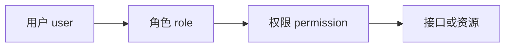

# 01-安全基础与学习路线

## 1. Spring Security 解决什么问题

任何 Web 系统都会遇到三类问题：

1. 访问者是谁：这叫认证，也就是 Authentication。
2. 访问者能做什么：这叫授权，也就是 Authorization。
3. 请求是否存在常见攻击风险：例如 CSRF、会话固定、点击劫持、缓存敏感数据等。

Spring Security 的价值不是替你设计业务权限，而是提供一套标准基础设施：

1. 把请求接入安全过滤器链。
2. 支持用户名密码、HTTP Basic、表单登录、OAuth2 Login、JWT Resource Server 等认证方式。
3. 提供 URL 级别和方法级别授权。
4. 提供密码加密、会话管理、CSRF、安全响应头等保护。
5. 提供测试支持，让你能模拟登录用户和权限。

## 2. 认证 Authentication

认证回答的是：你是谁？

常见认证方式：

| 方式 | 典型场景 | 说明 |
|---|---|---|
| 用户名密码 | 后台管理系统、传统 Web | 用户提交账号密码，后端校验 |
| HTTP Basic | 内部工具、简单接口 | 请求头携带 Base64 编码的用户名密码，不适合公网裸用 |
| 表单登录 | 服务端渲染页面 | 登录成功后通常用 Session 维持状态 |
| 短信验证码 | 移动端、国内业务系统 | 本质仍是自定义认证凭证 |
| JWT Bearer Token | 前后端分离、微服务 API | 请求头携带 `Authorization: Bearer <token>` |
| OAuth2 Login | 第三方登录 | 例如 GitHub、Google、企业 SSO 登录 |
| OAuth2 Resource Server | API 资源服务 | 当前服务不负责登录，只验证授权服务器签发的访问令牌 |

Spring Security 中，认证成功后会得到一个 `Authentication` 对象。它通常包含：

1. `principal`：当前用户主体，可能是用户名、`UserDetails`、`Jwt` 等。
2. `credentials`：凭证，通常认证后会清理。
3. `authorities`：权限集合。
4. `authenticated`：是否已认证。

## 3. 授权 Authorization

授权回答的是：你能不能访问这个资源？

授权不是登录。登录成功只说明“你是谁”；是否能访问 `/admin/users` 还要看权限规则。

常见授权模型：

| 模型 | 含义 | 适合场景 |
|---|---|---|
| RBAC | 用户拥有角色，角色拥有权限 | 后台系统、企业管理系统 |
| ABAC | 根据属性决策，例如部门、时间、数据归属 | 复杂业务系统 |
| ACL | 对单个资源配置访问控制列表 | 文档、工单、网盘 |
| Scope | OAuth2 中令牌携带的权限范围 | API 授权、第三方开放平台 |

最常见的 RBAC 结构：



示例：

| 用户 | 角色 | 权限 |
|---|---|---|
| alice | ADMIN | `user:read`, `user:write`, `order:refund` |
| bob | USER | `order:read`, `order:create` |

## 4. Cookie、Session 和 Token

### 4.1 Cookie

Cookie 是浏览器保存并自动带回服务器的小段数据。服务器可以通过响应头 `Set-Cookie` 写入 Cookie，浏览器后续请求同域名时会带上。

安全相关属性：

| 属性 | 作用 |
|---|---|
| `HttpOnly` | 禁止 JS 读取，降低 XSS 窃取风险 |
| `Secure` | 只在 HTTPS 下发送 |
| `SameSite` | 限制跨站请求携带 Cookie，缓解 CSRF |
| `Max-Age` / `Expires` | 控制过期时间 |
| `Path` / `Domain` | 控制 Cookie 生效范围 |

### 4.2 Session

Session 是服务端保存用户状态的一种方式。浏览器一般只保存 `JSESSIONID`，服务端根据这个 ID 找到对应用户状态。

优点：

1. 服务端可主动让 Session 失效。
2. 浏览器只保存随机 ID，不保存完整身份信息。
3. 适合服务端渲染页面和传统管理后台。

缺点：

1. 服务端需要保存状态。
2. 多实例部署要考虑 Session 共享或粘性会话。
3. 前后端分离时如果跨域使用 Cookie，会牵涉 SameSite、CORS、CSRF。

### 4.3 JWT

JWT 是一种自包含令牌，常见于前后端分离和微服务 API。

一个 JWT 通常由三段组成：

```text
header.payload.signature
```

常见字段：

| 字段 | 含义 |
|---|---|
| `sub` | 用户主体 |
| `iss` | 签发者 |
| `aud` | 接收方 |
| `exp` | 过期时间 |
| `nbf` | 生效时间 |
| `scope` / `scp` | OAuth2 权限范围 |

关键点：

1. JWT 不是加密，默认只是 Base64URL 编码，不要放密码、身份证号等敏感信息。
2. JWT 的可信度来自签名验证和声明校验。
3. JWT 一旦签发，短期内很难主动失效，除非引入黑名单、版本号或短期访问令牌配合刷新令牌。
4. 对 Resource Server 来说，推荐配置 `issuer-uri` 或 `jwk-set-uri`，让 Spring Security 使用标准方式验证 JWT。

## 5. CSRF 和 XSS 的区别

### 5.1 CSRF

CSRF 是跨站请求伪造。攻击者诱导已登录用户访问恶意页面，恶意页面让浏览器自动带着目标站点 Cookie 发起请求。

核心条件：

1. 用户在目标站点已登录。
2. 目标站点依赖 Cookie 表示身份。
3. 危险操作没有额外校验 CSRF Token。

典型防护：

1. 使用 CSRF Token。
2. Cookie 设置 `SameSite`。
3. 对危险操作使用非简单请求和自定义头。
4. 关键操作二次确认。

### 5.2 XSS

XSS 是跨站脚本攻击。攻击者让恶意脚本在你的站点上下文执行。

典型防护：

1. 输出编码。
2. 前端避免直接插入不可信 HTML。
3. 设置 Content Security Policy。
4. Cookie 设置 `HttpOnly`。
5. 后端不要信任前端输入。

一句话区分：

| 攻击 | 攻击者想利用什么 |
|---|---|
| CSRF | 利用浏览器自动带 Cookie 的行为 |
| XSS | 利用页面执行恶意脚本的能力 |

## 6. CORS

CORS 是跨域资源共享。它不是认证机制，而是浏览器的安全限制。

跨域指协议、域名、端口任一不同：

```text
http://localhost:3000  ->  http://localhost:8080
```

就是跨域，因为端口不同。

常见误区：

1. Postman 不报 CORS，不代表浏览器不会报。
2. 后端接口 200，不代表浏览器允许前端读取响应。
3. 带 Cookie 的跨域请求必须同时配置 `allowCredentials(true)` 和具体 origin，不能用 `*`。
4. CORS 预检请求是 `OPTIONS`，安全配置要允许它通过。

## 7. 学习路线

建议按这个顺序学：

1. 先懂 HTTP、Cookie、Session、登录状态。
2. 再用 Spring Boot 加 `spring-boot-starter-security` 看默认行为。
3. 学 `SecurityFilterChain` 和请求匹配规则。
4. 学 `UserDetailsService`、`PasswordEncoder`、`AuthenticationProvider`。
5. 学 `authorizeHttpRequests` 和 `@PreAuthorize`。
6. 学 Session、CSRF、CORS、异常处理。
7. 学 JWT Resource Server。
8. 学 OAuth2 Login 和授权服务器的职责边界。
9. 学测试、日志、排障和生产最佳实践。

## 8. 记忆口诀

1. 登录是认证，权限是授权。
2. 请求先进过滤器链，再进 Controller。
3. 当前用户在 `SecurityContext`。
4. 密码永远存哈希，不存明文。
5. 有 Cookie 状态就认真考虑 CSRF。
6. JWT 不等于加密，签名只保证没被篡改。
7. 401 是没认证，403 是认证了但没权限。

