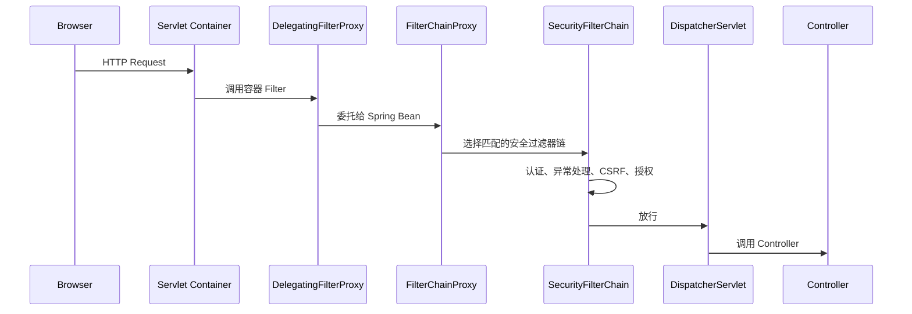

# 03-核心架构-过滤器链与SecurityContext

## 1. 为什么先学过滤器链

很多人学 Spring Security 卡住，是因为只盯着 Controller 和注解，却不知道请求进入 Controller 之前已经经过了一串 Servlet Filter。

Spring Security 的 Servlet 支持建立在标准 Servlet `Filter` 之上。也就是说，它不是 Controller 拦截器，而是更早的一层。

请求大致流程：



## 2. DelegatingFilterProxy

Servlet 容器只认识标准 Filter，不认识 Spring Bean。`DelegatingFilterProxy` 的作用是：

1. 自己注册到 Servlet 容器。
2. 从 Spring 容器里找到真正处理安全逻辑的 Bean。
3. 把请求委托给 Spring Bean。

它解决了“Servlet 容器生命周期”和“Spring Bean 生命周期”之间的桥接问题。

## 3. FilterChainProxy

`FilterChainProxy` 是 Spring Security Servlet 支持的核心入口。它内部管理多个 `SecurityFilterChain`。

你写的这个 Bean：

```java
@Bean
SecurityFilterChain securityFilterChain(HttpSecurity http) throws Exception {
    http
        .authorizeHttpRequests(authorize -> authorize
            .anyRequest().authenticated()
        );
    return http.build();
}
```

最终会构建出一个 `SecurityFilterChain`，交给 `FilterChainProxy` 使用。

## 4. SecurityFilterChain

`SecurityFilterChain` 决定两个问题：

1. 当前请求是否匹配这条链。
2. 匹配后要执行哪些安全过滤器。

多条过滤器链示例：

```java
@Bean
@Order(1)
SecurityFilterChain apiSecurity(HttpSecurity http) throws Exception {
    http
        .securityMatcher("/api/**")
        .authorizeHttpRequests(authorize -> authorize
            .anyRequest().authenticated()
        )
        .oauth2ResourceServer(oauth2 -> oauth2.jwt(Customizer.withDefaults()));
    return http.build();
}

@Bean
SecurityFilterChain webSecurity(HttpSecurity http) throws Exception {
    http
        .authorizeHttpRequests(authorize -> authorize
            .requestMatchers("/login", "/assets/**").permitAll()
            .anyRequest().authenticated()
        )
        .formLogin(Customizer.withDefaults());
    return http.build();
}
```

解释：

1. `/api/**` 走 JWT Resource Server。
2. 其他 Web 页面走表单登录。
3. `@Order(1)` 让 API 链优先匹配。

## 5. 常见过滤器职责

不同配置会启用不同过滤器，但常见职责如下：

| 过滤器                                    | 作用                      |
| -------------------------------------- | ----------------------- |
| `SecurityContextHolderFilter`          | 加载和清理 `SecurityContext` |
| `CsrfFilter`                           | 校验 CSRF Token           |
| `LogoutFilter`                         | 处理登出请求                  |
| `UsernamePasswordAuthenticationFilter` | 处理表单登录提交                |
| `BasicAuthenticationFilter`            | 处理 HTTP Basic           |
| `BearerTokenAuthenticationFilter`      | 处理 Bearer Token         |
| `AnonymousAuthenticationFilter`        | 给未登录请求放入匿名认证            |
| `ExceptionTranslationFilter`           | 把认证和授权异常转换成 401 或 403   |
| `AuthorizationFilter`                  | 执行请求级授权决策               |

不需要死记完整顺序，但要理解几个关键点：

1. 认证过滤器在授权之前。
2. 异常处理过滤器包住后续安全流程。
3. 授权通常靠后执行。
4. 自定义过滤器位置必须谨慎选择。

## 6. SecurityContextHolder

`SecurityContextHolder` 保存当前请求的安全上下文。默认模式下，它使用 `ThreadLocal`。

获取当前用户：

```java
Authentication authentication = SecurityContextHolder.getContext().getAuthentication();
```

在 Controller 里也可以直接注入：

```java
@GetMapping("/me")
public Map<String, Object> me(Authentication authentication) {
    return Map.of(
        "name", authentication.getName(),
        "authorities", authentication.getAuthorities()
    );
}
```

或者：

```java
@GetMapping("/me")
public String me(@AuthenticationPrincipal UserDetails user) {
    return user.getUsername();
}
```

## 7. Authentication

`Authentication` 既表示认证请求，也表示认证结果。

登录前的用户名密码：

```java
UsernamePasswordAuthenticationToken unauthenticated =
    UsernamePasswordAuthenticationToken.unauthenticated(username, password);
```

登录后的认证结果：

```java
UsernamePasswordAuthenticationToken authenticated =
    UsernamePasswordAuthenticationToken.authenticated(
        userDetails,
        null,
        userDetails.getAuthorities()
    );
```

核心字段：

| 方法 | 含义 |
|---|---|
| `getPrincipal()` | 用户主体 |
| `getCredentials()` | 凭证 |
| `getAuthorities()` | 权限集合 |
| `isAuthenticated()` | 是否认证成功 |
| `getName()` | 用户名或主体名 |

## 8. GrantedAuthority

`GrantedAuthority` 是权限的最小表达。

```java
new SimpleGrantedAuthority("user:read")
new SimpleGrantedAuthority("ROLE_ADMIN")
```

角色和权限的区别更多是约定：

| 写法 | 实际检查 |
|---|---|
| `hasRole("ADMIN")` | 检查 `ROLE_ADMIN` |
| `hasAuthority("ROLE_ADMIN")` | 检查 `ROLE_ADMIN` |
| `hasAuthority("user:read")` | 检查 `user:read` |

建议：

1. 角色用于粗粒度分组，例如 `ROLE_ADMIN`。
2. 权限用于细粒度动作，例如 `user:create`。
3. 业务系统里最好统一一种命名规范。

## 9. ExceptionTranslationFilter

它处理两类异常：

| 异常 | 转换结果 |
|---|---|
| `AuthenticationException` | 触发认证入口，通常返回 401 或跳登录页 |
| `AccessDeniedException` | 已登录但无权限时返回 403 |

前后端分离项目通常需要自定义：

```java
http.exceptionHandling(exceptions -> exceptions
    .authenticationEntryPoint((request, response, ex) -> {
        response.setStatus(HttpServletResponse.SC_UNAUTHORIZED);
        response.setContentType("application/json;charset=UTF-8");
        response.getWriter().write("{\"code\":401,\"message\":\"未登录或登录已过期\"}");
    })
    .accessDeniedHandler((request, response, ex) -> {
        response.setStatus(HttpServletResponse.SC_FORBIDDEN);
        response.setContentType("application/json;charset=UTF-8");
        response.getWriter().write("{\"code\":403,\"message\":\"没有权限\"}");
    })
);
```

## 10. 自定义过滤器

自定义 JWT 过滤器常见写法：

```java
public class JwtAuthenticationFilter extends OncePerRequestFilter {

    @Override
    protected void doFilterInternal(
            HttpServletRequest request,
            HttpServletResponse response,
            FilterChain filterChain
    ) throws ServletException, IOException {
        String header = request.getHeader(HttpHeaders.AUTHORIZATION);

        if (header != null && header.startsWith("Bearer ")) {
            String token = header.substring(7);
            // 1. 校验 token
            // 2. 加载用户和权限
            // 3. 构造 Authentication
            // 4. 放入 SecurityContextHolder
        }

        filterChain.doFilter(request, response);
    }
}
```

注册位置：

```java
http.addFilterBefore(jwtAuthenticationFilter, UsernamePasswordAuthenticationFilter.class);
```

进阶提醒：

1. 如果使用标准 OAuth2 Resource Server，优先用 `oauth2ResourceServer().jwt()`，不要重复手写 JWT 过滤器。
2. 自定义过滤器里发生异常时，要考虑是否交给 Spring Security 异常处理链。
3. 每次请求结束后不要自己乱保留 ThreadLocal 状态。

## 11. permitAll 和 ignoring 的区别

`permitAll()`：

1. 请求仍然经过 Spring Security 过滤器链。
2. 只是授权阶段允许访问。
3. 安全响应头、CSRF 等机制仍可能生效。

`web.ignoring()`：

1. 请求直接绕过 Spring Security。
2. 不执行任何 Spring Security 过滤器。
3. 通常只适合静态资源，且现代配置里很多静态资源用 `permitAll()` 也足够。

优先使用：

```java
.requestMatchers("/assets/**", "/favicon.ico").permitAll()
```

谨慎使用绕过：

```java
@Bean
WebSecurityCustomizer webSecurityCustomizer() {
    return web -> web.ignoring().requestMatchers("/assets/**");
}
```

## 12. 本章小结

必须记住这条链路：

```text
请求 -> DelegatingFilterProxy -> FilterChainProxy -> SecurityFilterChain -> 认证 -> SecurityContext -> 授权 -> Controller
```

排查 Spring Security 问题时，不要先猜 Controller。先问：

1. 请求匹配了哪条 `SecurityFilterChain`？
2. 哪个过滤器处理了认证？
3. `SecurityContext` 里有没有 `Authentication`？
4. `Authentication` 里有哪些 `GrantedAuthority`？
5. 是 401 认证失败，还是 403 授权失败？

