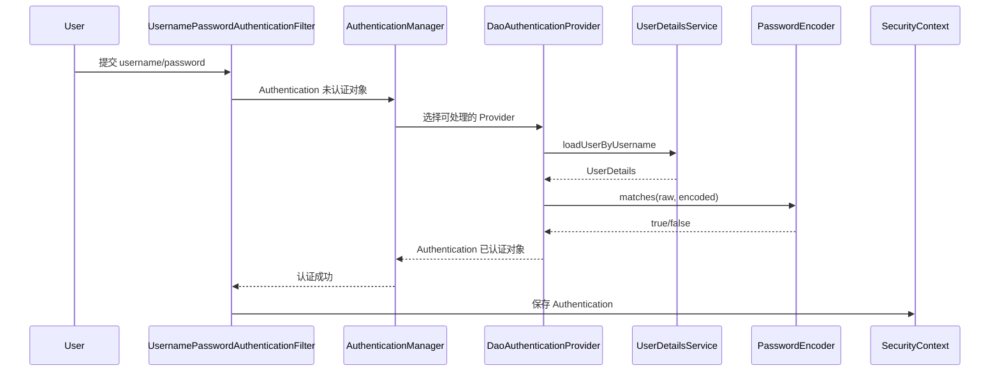

# 04-认证体系-UserDetailsService-AuthenticationProvider-PasswordEncoder

## 1. 认证主流程

用户名密码认证的典型流程：



一句话：

> Filter 负责从请求中取凭证，AuthenticationManager 负责调度，AuthenticationProvider 负责真正认证，UserDetailsService 负责查用户，PasswordEncoder 负责验密码。

## 2. UserDetails

`UserDetails` 是 Spring Security 眼中的用户。

关键方法：

| 方法 | 作用 |
|---|---|
| `getUsername()` | 用户名 |
| `getPassword()` | 已编码密码 |
| `getAuthorities()` | 权限集合 |
| `isAccountNonExpired()` | 账号是否未过期 |
| `isAccountNonLocked()` | 账号是否未锁定 |
| `isCredentialsNonExpired()` | 凭证是否未过期 |
| `isEnabled()` | 是否启用 |

最简单可以直接使用框架提供的 `User`：

```java
UserDetails user = User.builder()
    .username("alice")
    .password(passwordEncoder.encode("123456"))
    .authorities("user:read", "order:create")
    .build();
```

实际项目通常会封装自己的登录用户：

```java
public class LoginUser implements UserDetails {

    private final Long id;
    private final String username;
    private final String password;
    private final boolean enabled;
    private final Collection<? extends GrantedAuthority> authorities;

    public LoginUser(
            Long id,
            String username,
            String password,
            boolean enabled,
            Collection<? extends GrantedAuthority> authorities
    ) {
        this.id = id;
        this.username = username;
        this.password = password;
        this.enabled = enabled;
        this.authorities = authorities;
    }

    public Long getId() {
        return id;
    }

    @Override
    public Collection<? extends GrantedAuthority> getAuthorities() {
        return authorities;
    }

    @Override
    public String getPassword() {
        return password;
    }

    @Override
    public String getUsername() {
        return username;
    }

    @Override
    public boolean isEnabled() {
        return enabled;
    }
}
```

## 3. UserDetailsService

`UserDetailsService` 只有一个核心方法：

```java
UserDetails loadUserByUsername(String username) throws UsernameNotFoundException;
```

示例：

```java
@Service
public class DatabaseUserDetailsService implements UserDetailsService {

    private final UserRepository userRepository;
    private final PermissionRepository permissionRepository;

    public DatabaseUserDetailsService(
            UserRepository userRepository,
            PermissionRepository permissionRepository
    ) {
        this.userRepository = userRepository;
        this.permissionRepository = permissionRepository;
    }

    @Override
    public UserDetails loadUserByUsername(String username) {
        UserEntity user = userRepository.findByUsername(username)
            .orElseThrow(() -> new UsernameNotFoundException("用户不存在"));

        List<String> permissions = permissionRepository.findPermissionsByUserId(user.getId());
        List<GrantedAuthority> authorities = permissions.stream()
            .map(SimpleGrantedAuthority::new)
            .toList();

        return new LoginUser(
            user.getId(),
            user.getUsername(),
            user.getPassword(),
            user.isEnabled(),
            authorities
        );
    }
}
```

注意：

1. 这里返回的 password 是数据库里的密文，不是明文。
2. 权限应该在登录时加载，或使用缓存降低数据库压力。
3. 用户不存在时抛 `UsernameNotFoundException`。
4. 是否暴露“用户名不存在”和“密码错误”的区别，要根据安全策略决定。

## 4. PasswordEncoder

密码不能明文存储。Spring Security 使用 `PasswordEncoder` 对密码做单向哈希和匹配。

推荐：

```java
@Bean
PasswordEncoder passwordEncoder() {
    return PasswordEncoderFactories.createDelegatingPasswordEncoder();
}
```

它会创建 `DelegatingPasswordEncoder`，密码格式大致如下：

```text
{bcrypt}$2a$10$xxxxxxxxxxxxxxxxxxxxxxxxxxxxxxxxxxxxxxxxxxxxxxxxxxxxx
```

`{bcrypt}` 表示使用哪个算法验证。

为什么需要 `{id}`：

1. 支持老密码格式迁移。
2. 支持未来算法升级。
3. 不同用户的密码可以使用不同算法。

## 5. 注册用户时怎么存密码

错误做法：

```java
user.setPassword(request.getPassword());
```

正确做法：

```java
@Service
public class UserRegisterService {

    private final PasswordEncoder passwordEncoder;
    private final UserRepository userRepository;

    public UserRegisterService(PasswordEncoder passwordEncoder, UserRepository userRepository) {
        this.passwordEncoder = passwordEncoder;
        this.userRepository = userRepository;
    }

    public Long register(RegisterRequest request) {
        UserEntity user = new UserEntity();
        user.setUsername(request.username());
        user.setPassword(passwordEncoder.encode(request.password()));
        user.setEnabled(true);
        userRepository.save(user);
        return user.getId();
    }
}
```

登录时不需要你手动查密码再比对，`DaoAuthenticationProvider` 会调用 `PasswordEncoder#matches`。

## 6. AuthenticationManager

如果你做自定义登录接口，可能需要注入 `AuthenticationManager`。

配置：

```java
@Bean
AuthenticationManager authenticationManager(AuthenticationConfiguration configuration) throws Exception {
    return configuration.getAuthenticationManager();
}
```

登录接口：

```java
@RestController
@RequestMapping("/auth")
public class AuthController {

    private final AuthenticationManager authenticationManager;

    public AuthController(AuthenticationManager authenticationManager) {
        this.authenticationManager = authenticationManager;
    }

    @PostMapping("/login")
    public LoginResponse login(@RequestBody LoginRequest request) {
        Authentication unauthenticated =
            UsernamePasswordAuthenticationToken.unauthenticated(
                request.username(),
                request.password()
            );

        Authentication authenticated = authenticationManager.authenticate(unauthenticated);

        return new LoginResponse(authenticated.getName());
    }
}
```

如果是 JWT 登录，通常在认证成功后签发 token：

```java
Authentication authenticated = authenticationManager.authenticate(unauthenticated);
String token = tokenService.createToken(authenticated);
return new LoginResponse(token);
```

## 7. AuthenticationProvider

`AuthenticationProvider` 是真正执行认证的组件。

常见内置 Provider：

| Provider | 用途 |
|---|---|
| `DaoAuthenticationProvider` | 用户名密码 + `UserDetailsService` |
| `JwtAuthenticationProvider` | OAuth2 Resource Server 验证 JWT |
| `AnonymousAuthenticationProvider` | 匿名认证 |
| `RememberMeAuthenticationProvider` | Remember-me |

自定义短信验证码认证时，通常会做：

1. 自定义 `Authentication`，例如 `SmsCodeAuthenticationToken`。
2. 自定义 Filter，从请求中提取手机号和验证码。
3. 自定义 `AuthenticationProvider`，校验验证码并加载用户。
4. 成功后返回已认证的 `Authentication`。

骨架：

```java
public class SmsCodeAuthenticationProvider implements AuthenticationProvider {

    @Override
    public Authentication authenticate(Authentication authentication) throws AuthenticationException {
        String phone = authentication.getName();
        String code = (String) authentication.getCredentials();

        // 1. 校验验证码
        // 2. 根据手机号加载用户
        // 3. 返回已认证 Authentication

        return UsernamePasswordAuthenticationToken.authenticated(
            phone,
            null,
            List.of(new SimpleGrantedAuthority("ROLE_USER"))
        );
    }

    @Override
    public boolean supports(Class<?> authentication) {
        return SmsCodeAuthenticationToken.class.isAssignableFrom(authentication);
    }
}
```

## 8. 账号状态

`UserDetails` 的状态方法会影响登录结果：

| 状态 | false 时可能触发 |
|---|---|
| `isEnabled()` | `DisabledException` |
| `isAccountNonLocked()` | `LockedException` |
| `isAccountNonExpired()` | `AccountExpiredException` |
| `isCredentialsNonExpired()` | `CredentialsExpiredException` |

业务表可以设计字段：

| 字段 | 含义 |
|---|---|
| `enabled` | 是否启用 |
| `locked` | 是否锁定 |
| `password_expired_at` | 密码过期时间 |
| `deleted` | 逻辑删除 |

## 9. 权限加载策略

登录时加载权限有两种主流方案：

### 9.1 登录时加载并放入 Authentication

优点：

1. 授权判断快。
2. 不用每次查数据库。

缺点：

1. 权限变更后，已登录用户可能不会立即生效。
2. Session 或 Token 中权限可能变旧。

### 9.2 每次授权时查询

优点：

1. 权限变更及时生效。
2. 更适合复杂资源级授权。

缺点：

1. 性能压力更大。
2. 需要缓存和失效策略。

实践建议：

1. 普通后台系统：登录时加载角色和权限，权限变更后强制用户重新登录或刷新权限缓存。
2. 高敏感资源：方法授权里调用权限服务实时判断。
3. 微服务：把粗粒度 scope 放入 token，细粒度权限由服务端策略系统判断。

## 10. 本章小结

认证体系关键词：

```text
UsernamePasswordAuthenticationFilter
  -> AuthenticationManager
  -> AuthenticationProvider
  -> UserDetailsService
  -> PasswordEncoder
  -> Authentication
  -> SecurityContext
```

要避免的坑：

1. 数据库存明文密码。
2. 忘记给密码加 `{bcrypt}` 等编码 id，却使用 `DelegatingPasswordEncoder` 匹配。
3. 数据库权限是 `ADMIN`，代码用 `hasRole("ADMIN")`，却不知道实际检查的是 `ROLE_ADMIN`。
4. 自定义登录接口认证成功后没有保存 Session 或签发 Token。
5. 自定义过滤器里认证成功却没有设置 `SecurityContextHolder`。

