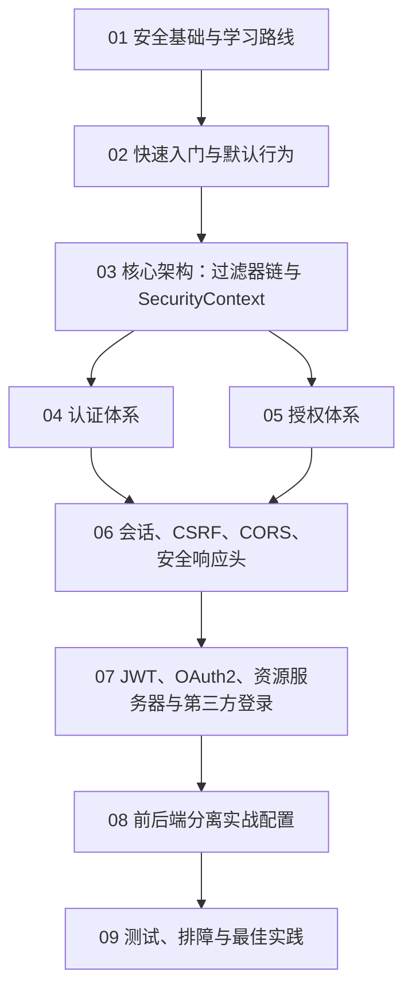

# Spring Security 从0基础到进阶

> [!tip] 学习定位
> Spring Security 不是“只加一个登录页”的库，而是 Spring 生态里负责认证、授权和常见攻击防护的安全框架。学习它要先分清“谁在访问系统”“这个人能不能访问这个资源”“请求在进入 Controller 前经历了哪些过滤器”“状态保存在 Session 还是 Token 里”。

## 当前版本快照

本文按 2026-05-09 查询到的官方文档编写。Spring Security 官方文档当前稳定线显示为 `7.0.5` 与 `6.5.10`。多数 Spring Boot 3.x 项目仍会接触 Spring Security 6.x 的配置风格；Spring Security 7.x 延续了 `SecurityFilterChain`、Lambda DSL、`AuthorizationManager`、`@EnableMethodSecurity` 等现代写法。实际项目以你项目的 Spring Boot 版本管理结果为准。

## 学习地图

## 模块目录

1. [[01-安全基础与学习路线]]
2. [[02-快速入门与默认行为]]
3. [[03-核心架构-过滤器链与SecurityContext]]
4. [[04-认证体系-UserDetailsService-AuthenticationProvider-PasswordEncoder]]
5. [[05-授权体系-请求授权与方法授权]]
6. [[06-会话-CSRF-CORS-安全响应头]]
7. [[07-JWT-OAuth2-资源服务器与第三方登录]]
8. [[08-前后端分离实战配置]]
9. [[09-测试-排障与最佳实践]]

## 你最终应该掌握什么

初级阶段要能做到：

1. 知道认证、授权、Session、Cookie、JWT、CSRF、CORS 的基本概念。
2. 能给 Spring Boot 项目加上 `spring-boot-starter-security`。
3. 能看懂默认用户名、默认密码、默认登录页、默认拦截行为。
4. 能写出一个最小 `SecurityFilterChain`。
5. 能区分 `permitAll()`、`authenticated()`、`hasRole()`、`hasAuthority()`。

中级阶段要能做到：

1. 能解释请求为什么还没进入 Controller 就被拦截。
2. 能解释 `SecurityContextHolder`、`Authentication`、`GrantedAuthority` 的作用。
3. 能用数据库中的用户表实现登录。
4. 能正确使用 `PasswordEncoder`，不存明文密码。
5. 能设计 URL 级别授权和方法级别授权。
6. 能处理前后端分离里的登录、登出、跨域、CSRF、401/403 返回。

进阶阶段要能做到：

1. 能设计 Session 方案、JWT 方案、OAuth2 Login 方案、Resource Server 方案。
2. 能说明什么时候应该关 CSRF，什么时候不能随手关。
3. 能调试过滤器顺序、认证失败、授权失败、跨域失败。
4. 能写 `spring-security-test` 单元测试和集成测试。
5. 能把安全规则从“写死在配置里”演进到权限模型、策略服务或资源级授权。

## 最重要的主线

Spring Security 的核心主线可以压缩成一句话：

> HTTP 请求进入应用后，先经过 Spring Security 的过滤器链；过滤器尝试完成认证，把认证结果放进 `SecurityContext`；授权组件根据当前用户、权限和请求目标决定是否放行；放行后才进入 Controller。

对应到代码世界：

| 概念 | 你需要记住的对象 | 作用 |
|---|---|---|
| 过滤器链 | `SecurityFilterChain` | 定义哪些请求经过哪些安全规则 |
| 认证结果 | `Authentication` | 表示当前请求是谁、是否已认证、拥有哪些权限 |
| 安全上下文 | `SecurityContextHolder` | 当前线程里保存认证结果的位置 |
| 用户加载 | `UserDetailsService` | 按用户名加载用户信息 |
| 密码校验 | `PasswordEncoder` | 对明文密码和数据库密文做安全匹配 |
| 请求授权 | `authorizeHttpRequests` | 判断 URL 请求是否允许访问 |
| 方法授权 | `@PreAuthorize` | 判断 Service 方法是否允许调用 |
| Token 资源服务 | `oauth2ResourceServer().jwt()` | 验证 Bearer JWT 并转换权限 |

## 官方资料入口

- Spring Security Overview: https://docs.spring.io/spring-security/reference/index.html
- Getting Spring Security: https://docs.spring.io/spring-security/reference/getting-spring-security.html
- Servlet Applications: https://docs.spring.io/spring-security/reference/servlet/index.html
- Request Authorization: https://docs.spring.io/spring-security/reference/servlet/authorization/authorize-http-requests.html
- Method Security: https://docs.spring.io/spring-security/reference/servlet/authorization/method-security.html
- Password Storage: https://docs.spring.io/spring-security/reference/features/authentication/password-storage.html
- CSRF: https://docs.spring.io/spring-security/reference/servlet/exploits/csrf.html
- OAuth2 Resource Server JWT: https://docs.spring.io/spring-security/reference/servlet/oauth2/resource-server/jwt.html

