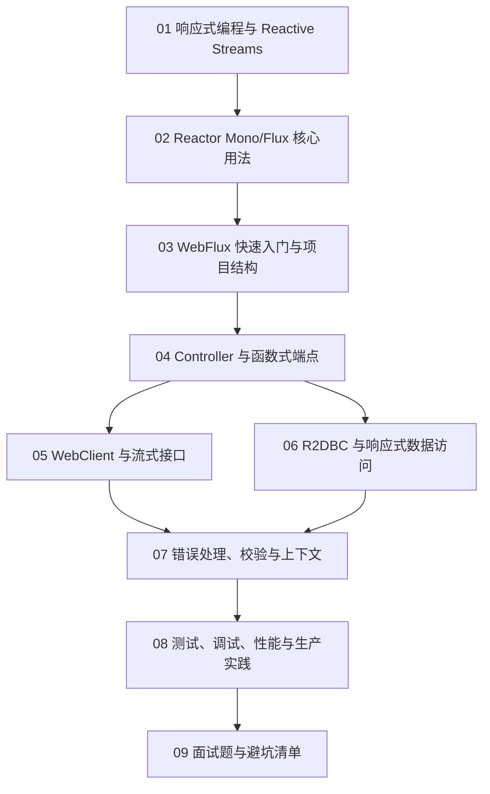

# Java WebFlux 从0基础到大神

> [!tip] 学习定位
> WebFlux 不是“把 Controller 返回值改成 Mono/Flux”这么简单。它是一套基于 Reactive Streams 的非阻塞 Web 技术栈，适合高并发 I/O、流式响应、网关、长连接、实时推送、服务编排等场景。学 WebFlux 的主线是：先懂响应式思想，再懂 Reactor，再懂 WebFlux 如何把 HTTP 请求变成一条响应式流水线，最后懂生产环境里如何避免阻塞、调试链路和做容量规划。

> [!abstract] 彩色阅读导航
> - 蓝色信息块：概念、定义、学习定位。
> - 绿色实践块：推荐写法、生产经验、可直接套用的模板。
> - 黄色提醒块：容易误解、迁移时需要谨慎的地方。
> - 红色危险块：线上事故高发点，比如 `block()`、无限重试、无上限 `collectList()`。

> [!success] 推荐阅读顺序
> 先读 `01 -> 02 -> 03 -> 04` 建立完整心智模型；如果你已经会写接口，优先看 `05 WebClient`、`06 R2DBC`、`08 生产实践`；准备面试时直接刷 `09`，再回头补薄弱模块。

## 当前版本快照

本文按 2026-06-09 查询到的官方文档整理。Spring Framework 官方文档显示 WebFlux 是 Spring Framework 5.0 引入的响应式 Web 框架，支持非阻塞、Reactive Streams 背压，并可运行在 Netty 和 Servlet 容器上。Spring Boot 官方文档说明：添加 `spring-boot-starter-webflux` 后会启用 WebFlux 自动配置；如果同时引入 `spring-boot-starter-web` 和 `spring-boot-starter-webflux`，默认会配置成 Spring MVC，而不是 WebFlux。

实际项目以你的 Spring Boot 版本管理结果为准。Spring Boot 3.x 常见组合是 Java 17+、Spring Framework 6.x、Reactor 3.5/3.6+；新项目建议优先 Java 21 LTS。

## 学习路线

## 模块目录

1. [[01-响应式编程与ReactiveStreams]]
2. [[02-Reactor-Mono-Flux核心用法]]
3. [[03-WebFlux快速入门与项目结构]]
4. [[04-Controller与函数式端点]]
5. [[05-WebClient与SSE-WebSocket流式接口]]
6. [[06-数据访问R2DBC与ReactiveRepository]]
7. [[07-错误处理参数校验与上下文]]
8. [[08-测试调试性能与生产实践]]
9. [[09-WebFlux面试题与避坑清单]]

## 你最终要掌握什么

零基础阶段：

1. 知道 WebFlux 和 Spring MVC 的区别。
2. 能解释 `Mono` 表示 0 或 1 个结果，`Flux` 表示 0 到 N 个结果。
3. 能写出最小 WebFlux REST API。
4. 能用 `WebClient` 调外部接口。
5. 知道“不能随手 `block()`”。

进阶阶段：

1. 能用 `map`、`flatMap`、`zip`、`concatMap`、`switchIfEmpty`、`onErrorResume` 组织业务流程。
2. 能区分 `publishOn` 和 `subscribeOn`。
3. 能处理请求参数校验、全局异常、超时、重试、限流。
4. 能用 R2DBC 或响应式 MongoDB 做数据访问。
5. 能写 `WebTestClient` 和 `StepVerifier` 测试。

大神阶段：

1. 能识别阻塞调用，并把无法避免的阻塞隔离到 `boundedElastic`。
2. 能判断什么时候该用 WebFlux，什么时候继续用 MVC 或虚拟线程。
3. 能设计 SSE、WebSocket、网关转发、流式 AI 响应、实时日志等场景。
4. 能排查线程被阻塞、背压失效、连接池耗尽、重试风暴、内存上涨等线上问题。
5. 能从“技术炫技”回到“业务适配”：只在 WebFlux 真能带来收益的地方使用它。

## 一句话总纲

> Spring MVC 的典型模型是“一个请求占用一个工作线程，线程阻塞等待 I/O 完成”；WebFlux 的典型模型是“少量事件循环线程处理大量连接，I/O 等待期间不占用业务线程，请求结果通过异步信号继续向下游传播”。

## WebFlux 适合什么

| 场景 | 是否适合 | 原因 |
|---|---:|---|
| 调多个远程 HTTP 服务并聚合结果 | 适合 | I/O 等待多，非阻塞组合收益明显 |
| SSE 实时推送、AI 流式输出 | 很适合 | `Flux` 天然表达连续事件 |
| WebSocket 长连接 | 很适合 | 大量连接不适合一连接一线程 |
| API Gateway | 很适合 | 转发、过滤、限流、熔断多为 I/O 密集 |
| 简单 CRUD + JPA | 通常不适合 | JPA 是阻塞模型，混用会抵消收益 |
| CPU 密集计算 | 不适合 | WebFlux 不会让 CPU 计算变快 |
| 团队还不熟 Reactor | 谨慎 | 学习曲线和排障成本真实存在 |

> [!warning] 选型提醒
> WebFlux 的收益来自“整条链路尽量非阻塞”。如果 Controller 是 WebFlux，但数据库、缓存、HTTP 客户端、文件读写全是阻塞式，系统复杂度会上升，收益却不一定出现。

## 官方资料入口

- Spring Framework WebFlux: https://docs.spring.io/spring-framework/reference/web/webflux.html
- Spring Boot Reactive Web Applications: https://docs.spring.io/spring-boot/reference/web/reactive.html
- Reactor Reference Guide: https://projectreactor.io/docs/core/release/reference/
- Reactor Schedulers: https://projectreactor.io/docs/core/release/reference/coreFeatures/schedulers.html
