# Java IO 从0基础到精通

> [!tip] 使用指南
> 这篇笔记按 **0 基础入门 -> 核心 API -> 设计思想 -> 底层机制 -> 高阶实战 -> 面试速查** 的顺序组织。
> 如果你是初学者，建议先看：
> 1. `IO 到底是什么`
> 2. `字节流与字符流`
> 3. `InputStream / OutputStream`
> 4. `Reader / Writer`
> 5. `NIO 核心三件套`

## 一张图先建立全局认知

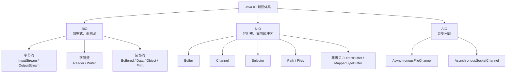

---

## 1. IO 到底是什么

### 1.1 IO 的本质

IO，`Input/Output`，本质就是 **程序和外部世界交换数据**。

这里的“外部世界”包括：

- 磁盘文件
- 网络连接
- 键盘输入
- 屏幕输出
- 进程之间的管道
- 数据库连接底层的 socket

如果把 CPU 理解成“大脑”，内存理解成“短期记忆”，那么 IO 就是大脑和外部设备之间的数据搬运过程。

### 1.2 为什么需要 IO

Java 程序运行时，很多数据不可能永远只放在内存里：

- 需要把日志写到文件
- 需要读取配置文件
- 需要下载网络数据
- 需要把对象持久化
- 需要向客户端返回响应

所以，IO 是一切业务程序绕不开的基础设施。

### 1.3 IO 的两个核心矛盾

1. **数据从哪里来，到哪里去**
2. **数据以什么形式流动**

Java IO 所有 API，几乎都围绕这两个问题展开。

---

## 2. 先理解几个最基础概念

### 2.1 什么是“流”

流，`Stream`，可以理解成 **数据流动的管道**。

你可以把它想成水流：

- 输入流：水流进来，程序负责读取
- 输出流：水流出去，程序负责写出

在 Java 里：

- `InputStream` 表示输入字节流
- `OutputStream` 表示输出字节流
- `Reader` 表示输入字符流
- `Writer` 表示输出字符流

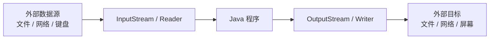

### 2.2 输入和输出是相对谁而言

这点初学者非常容易混淆。

**输入/输出永远是相对于当前程序而言的。**

例如：

- 程序读取文件，文件 -> 程序，这是输入
- 程序写文件，程序 -> 文件，这是输出
- 程序接收 HTTP 请求，请求数据 -> 程序，这是输入
- 程序给浏览器返回响应，程序 -> 浏览器，这是输出

### 2.3 为什么要区分字节和字符

计算机底层只认识字节，不认识“字符”。

字符是人类可读概念，例如：

- `A`
- `中`
- `。`

而它们真正存储时，都要编码成字节。

所以 Java 把 IO 分成两套体系：

- **字节流**：处理所有类型数据，最基础
- **字符流**：专门处理文本，自动帮你处理编码/解码

> [!important] 一句话记忆
> **一切文件最终都是字节。文本只是“按某种编码解释后的字节”。**

---

## 3. Java IO 的整体分类

### 3.1 按传输单位分

| 分类 | 代表类 | 适合场景 |
|------|------|------|
| 字节流 | `InputStream` / `OutputStream` | 图片、视频、压缩包、任意二进制、文本也可以 |
| 字符流 | `Reader` / `Writer` | 文本文件、配置、日志、JSON、XML |

### 3.2 按数据流向分

| 分类 | 说明 |
|------|------|
| 输入流 | 从外部读取到程序 |
| 输出流 | 从程序写到外部 |

### 3.3 按功能分

| 分类 | 代表类 | 作用 |
|------|------|------|
| 节点流 | `FileInputStream`、`FileReader` | 直接连接数据源 |
| 处理流 / 装饰流 | `BufferedInputStream`、`DataInputStream`、`ObjectInputStream` | 对节点流进行功能增强 |

### 3.4 按阻塞模型分

| 模型 | 特点 |
|------|------|
| BIO | 阻塞式，简单直接 |
| NIO | 非阻塞，支持多路复用 |
| AIO | 异步回调，完成通知 |

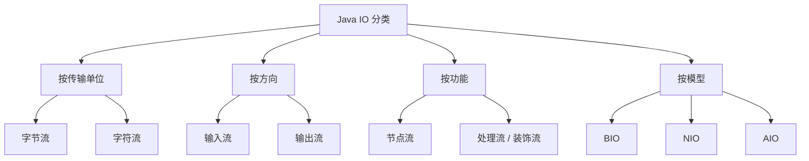

---

## 4. 字节流体系：InputStream / OutputStream

### 4.1 InputStream 是什么

`InputStream` 是所有 **输入字节流** 的抽象父类。

最核心的方法：

```java
int read() throws IOException;
int read(byte[] b) throws IOException;
int read(byte[] b, int off, int len) throws IOException;
void close() throws IOException;
```

#### `read()` 返回值为什么是 `int`

因为要用 `-1` 表示“读到流末尾”。

如果返回 `byte`，那 `-1` 可能和正常数据冲突。

### 4.2 OutputStream 是什么

`OutputStream` 是所有 **输出字节流** 的抽象父类。

最核心的方法：

```java
void write(int b) throws IOException;
void write(byte[] b) throws IOException;
void write(byte[] b, int off, int len) throws IOException;
void flush() throws IOException;
void close() throws IOException;
```

### 4.3 最基础文件读写：FileInputStream / FileOutputStream

#### 读取文件

```java
try (FileInputStream in = new FileInputStream("a.txt")) {
    int data;
    while ((data = in.read()) != -1) {
        System.out.print((char) data);
    }
}
```

#### 写入文件

```java
try (FileOutputStream out = new FileOutputStream("a.txt")) {
    out.write("hello".getBytes());
}
```

#### 追加写入

```java
try (FileOutputStream out = new FileOutputStream("a.txt", true)) {
    out.write("\nworld".getBytes());
}
```

### 4.4 为什么不建议一个字节一个字节读

因为系统调用成本高，频繁从用户态切换到内核态，性能很差。

更推荐按块读取：

```java
try (FileInputStream in = new FileInputStream("a.jpg")) {
    byte[] buffer = new byte[8192];
    int len;
    while ((len = in.read(buffer)) != -1) {
        // 使用 buffer[0..len)
    }
}
```

### 4.5 文件拷贝的标准写法

```java
try (
    FileInputStream in = new FileInputStream("source.zip");
    FileOutputStream out = new FileOutputStream("target.zip")
) {
    byte[] buffer = new byte[8192];
    int len;
    while ((len = in.read(buffer)) != -1) {
        out.write(buffer, 0, len);
    }
}
```

> [!warning] 常见错误
> 不要写成 `out.write(buffer)`。
> 因为最后一次读取时，缓冲区未必被填满，直接写整个数组会把脏数据也写出去。

---

## 5. 字符流体系：Reader / Writer

### 5.1 为什么会有字符流

字节流只能处理“原始字节”，但文本处理非常常见。

例如你要读取：

- 中文文章
- JSON
- XML
- 配置文件
- CSV

如果每次都手动处理编码，非常麻烦，所以 Java 提供了字符流。

字符流本质上做了两件事：

1. **读取时**：字节 -> 字符（解码）
2. **写出时**：字符 -> 字节（编码）

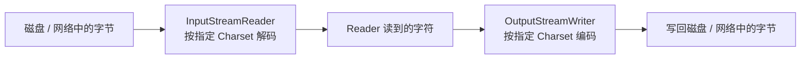

### 5.2 Reader / Writer 的核心作用

| 类 | 作用 |
|------|------|
| `Reader` | 读取字符 |
| `Writer` | 写出字符 |

### 5.3 FileReader / FileWriter

#### 读取文本

```java
try (FileReader reader = new FileReader("a.txt")) {
    char[] buffer = new char[1024];
    int len;
    while ((len = reader.read(buffer)) != -1) {
        System.out.print(new String(buffer, 0, len));
    }
}
```

#### 写入文本

```java
try (FileWriter writer = new FileWriter("a.txt")) {
    writer.write("你好，Java IO");
}
```

### 5.4 FileReader / FileWriter 的局限

它们默认使用平台默认字符集，这在跨平台时很危险。

比如：

- Windows 默认可能是 `GBK`
- Linux 常见是 `UTF-8`

所以生产环境更推荐：

- `InputStreamReader`
- `OutputStreamWriter`

显式指定编码。

### 5.5 正确处理编码的写法

```java
try (
    InputStream in = new FileInputStream("a.txt");
    Reader reader = new InputStreamReader(in, StandardCharsets.UTF_8)
) {
    char[] buffer = new char[1024];
    int len;
    while ((len = reader.read(buffer)) != -1) {
        System.out.print(new String(buffer, 0, len));
    }
}
```

```java
try (
    OutputStream out = new FileOutputStream("a.txt");
    Writer writer = new OutputStreamWriter(out, StandardCharsets.UTF_8)
) {
    writer.write("统一编码最重要");
}
```

> [!important] 最佳实践
> 涉及文本 IO 时，**永远显式指定字符集**，优先使用 `UTF-8`。

---

## 6. 字节流和字符流到底怎么选

### 6.1 一个简单判断标准

- 处理文本：优先字符流
- 处理图片、音频、视频、压缩包、PDF：用字节流
- 不确定：用字节流一定不会错

### 6.2 为什么图片不能用字符流

因为字符流会进行编码/解码。

而图片本质是二进制字节，不能被当作文本解释，否则数据会损坏。

### 6.3 为什么文本也能用字节流

因为文本最终也是字节。

例如：

```java
byte[] bytes = "你好".getBytes(StandardCharsets.UTF_8);
String s = new String(bytes, StandardCharsets.UTF_8);
```

只是字符流把这套过程封装好了。

---

## 7. 缓冲流：为什么 Buffered 很重要

### 7.1 什么是缓冲

缓冲就是先把数据放进一块内存区域，攒到一定量再统一读/写。

目的：

- 减少系统调用次数
- 减少磁盘/网络交互次数
- 提高吞吐

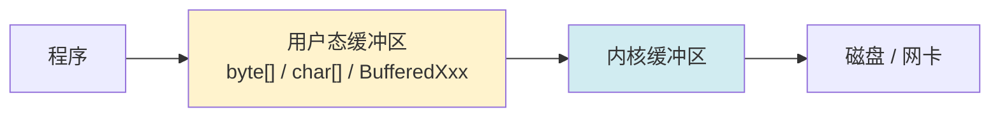

### 7.2 四个高频类

| 类 | 作用 |
|------|------|
| `BufferedInputStream` | 带缓冲的字节输入流 |
| `BufferedOutputStream` | 带缓冲的字节输出流 |
| `BufferedReader` | 带缓冲的字符输入流 |
| `BufferedWriter` | 带缓冲的字符输出流 |

### 7.3 BufferedInputStream / BufferedOutputStream

```java
try (
    BufferedInputStream in = new BufferedInputStream(new FileInputStream("a.zip"));
    BufferedOutputStream out = new BufferedOutputStream(new FileOutputStream("b.zip"))
) {
    byte[] buffer = new byte[8192];
    int len;
    while ((len = in.read(buffer)) != -1) {
        out.write(buffer, 0, len);
    }
}
```

### 7.4 BufferedReader 最常见：按行读取

```java
try (
    BufferedReader reader = new BufferedReader(
        new InputStreamReader(new FileInputStream("a.txt"), StandardCharsets.UTF_8)
    )
) {
    String line;
    while ((line = reader.readLine()) != null) {
        System.out.println(line);
    }
}
```

### 7.5 BufferedWriter

```java
try (
    BufferedWriter writer = new BufferedWriter(
        new OutputStreamWriter(new FileOutputStream("a.txt"), StandardCharsets.UTF_8)
    )
) {
    writer.write("第一行");
    writer.newLine();
    writer.write("第二行");
}
```

> [!warning] 注意
> `readLine()` 会去掉行分隔符。
> 如果你要保留换行，写回时需要自己补 `newLine()`。

---

## 8. flush 和 close 到底有什么区别

### 8.1 flush

`flush()` 的作用是：

- 把程序缓冲区中的数据
- 立刻刷到目标设备或下层流

但 **流本身还可以继续使用**。

### 8.2 close

`close()` 的作用是：

- 先释放系统资源
- 通常内部也会先执行一次 `flush()`
- 然后流不可再用

### 8.3 什么时候必须 flush

典型场景：

- 网络响应需要立即发送
- 日志需要立刻落盘
- 交互式输出不能等缓冲区满

### 8.4 一个重要结论

- `flush()`：刷新，不关闭
- `close()`：关闭，通常也刷新

---

## 9. 装饰器模式：Java IO 为什么类这么多

### 9.1 初看很乱，根因是设计模式

Java IO 类很多，不是因为设计差，而是因为它采用了 **装饰器模式**。

意思是：

- 节点流负责连接数据源
- 处理流负责增强功能
- 多个流可以层层包装

### 9.2 一个经典例子

```java
BufferedReader reader = new BufferedReader(
    new InputStreamReader(
        new FileInputStream("a.txt"),
        StandardCharsets.UTF_8
    )
);
```

这一串分别干了什么：

| 层级 | 类 | 作用 |
|------|------|------|
| 1 | `FileInputStream` | 从文件读取字节 |
| 2 | `InputStreamReader` | 字节转字符，处理编码 |
| 3 | `BufferedReader` | 提供缓冲和按行读取 |

### 9.3 这种设计的优点

- 组合灵活
- 单一职责清晰
- 扩展功能方便
- 避免“大而全”的超级类

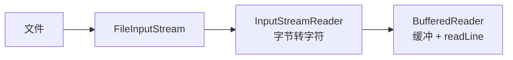

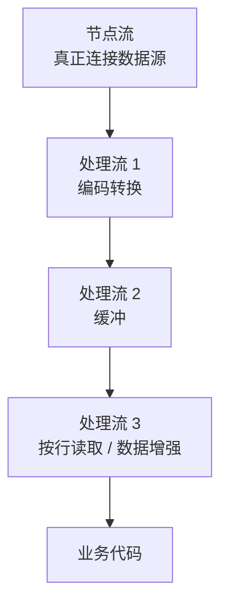

---

## 10. 高级处理流：Data、Object、Print

### 10.1 DataInputStream / DataOutputStream

用于按 Java 基本数据类型读写。

```java
try (DataOutputStream out = new DataOutputStream(new FileOutputStream("data.bin"))) {
    out.writeInt(100);
    out.writeDouble(3.14);
    out.writeUTF("hello");
}

try (DataInputStream in = new DataInputStream(new FileInputStream("data.bin"))) {
    System.out.println(in.readInt());
    System.out.println(in.readDouble());
    System.out.println(in.readUTF());
}
```

> [!warning] 注意
> 写入顺序和读取顺序必须完全一致，否则数据会错位。

### 10.2 ObjectInputStream / ObjectOutputStream

用于对象序列化和反序列化。

#### 基本示例

```java
class User implements Serializable {
    private static final long serialVersionUID = 1L;
    private String name;
    private int age;
}
```

```java
try (ObjectOutputStream out = new ObjectOutputStream(new FileOutputStream("user.obj"))) {
    out.writeObject(new User());
}

try (ObjectInputStream in = new ObjectInputStream(new FileInputStream("user.obj"))) {
    User user = (User) in.readObject();
}
```

#### 序列化要点

- 类必须实现 `Serializable`
- 建议显式定义 `serialVersionUID`
- `static` 字段不会被序列化
- `transient` 字段不会被序列化

#### 为什么很多项目不推荐原生序列化

- 二进制结果不直观
- 兼容性复杂
- 安全风险较高
- 性能并非最佳

生产环境更常见的是：

- JSON
- Protobuf
- Kryo

### 10.3 PrintStream / PrintWriter

用于更方便地输出文本。

```java
try (PrintWriter writer = new PrintWriter(
        new OutputStreamWriter(new FileOutputStream("a.txt"), StandardCharsets.UTF_8))) {
    writer.println("hello");
    writer.printf("age=%d%n", 18);
}
```

典型代表：

- `System.out` 就是 `PrintStream`

---

## 11. try-with-resources：资源关闭的标准姿势

### 11.1 为什么必须自动关闭

IO 流底层通常对应系统资源：

- 文件描述符
- socket
- 管道

如果不及时关闭，会造成资源泄漏。

### 11.2 标准写法

```java
try (
    InputStream in = new FileInputStream("a.txt");
    OutputStream out = new FileOutputStream("b.txt")
) {
    // 使用资源
}
```

### 11.3 为什么优先用它

- 代码更短
- 自动关闭资源
- 异常处理更规范
- 避免 finally 中再次出错导致逻辑复杂

> [!important] 最佳实践
> 只要对象实现了 `AutoCloseable` 或 `Closeable`，优先使用 `try-with-resources`。

---

## 12. File 类：老牌文件 API

### 12.1 File 是什么

`File` 表示文件或目录路径的抽象。

注意：

`File` 更准确地说是“路径对象”，不等于真正已打开的文件。

### 12.2 常见操作

```java
File file = new File("a.txt");
System.out.println(file.exists());
System.out.println(file.isFile());
System.out.println(file.length());
```

```java
File dir = new File("logs");
dir.mkdirs();
```

```java
File[] files = dir.listFiles();
```

### 12.3 File 的局限

- API 偏老
- 异常信息不够清晰
- 路径操作能力一般
- 递归遍历、符号链接等支持不够现代

所以 JDK 7 以后更推荐 `Path` + `Files`。

---

## 13. Java NIO 为什么会出现

### 13.1 传统 IO 的问题

传统 BIO 有几个典型特点：

- 面向流
- 阻塞
- 一个线程常常服务一个连接

这在高并发网络场景下问题明显：

- 线程太多，切换成本高
- 内存占用大
- 连接空闲时线程仍被阻塞

### 13.2 NIO 解决什么问题

NIO，`New IO` / `Non-blocking IO`，核心目标：

1. 支持非阻塞
2. 支持多路复用
3. 更适合高并发网络编程
4. 提供更接近操作系统底层的能力

### 13.3 NIO 的三大核心

- `Buffer`
- `Channel`
- `Selector`

---

## 14. Buffer：NIO 的数据容器

### 14.1 Buffer 和流最大的不同

BIO 是 **面向流** 的：

- 数据只能顺序读写
- 一般是单向

NIO 是 **面向缓冲区** 的：

- 数据先进入 Buffer
- 可以更灵活地读/写/定位

### 14.2 Buffer 的几个核心属性

| 属性 | 作用 |
|------|------|
| `capacity` | 容量，创建后一般固定 |
| `position` | 当前读写位置 |
| `limit` | 当前可读/可写边界 |
| `mark` | 标记位置 |

### 14.3 最常见：ByteBuffer

```java
ByteBuffer buffer = ByteBuffer.allocate(1024);
```

### 14.4 Buffer 的典型状态变化

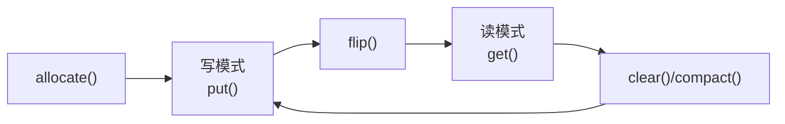

### 14.5 为什么一定要理解 `flip()`

`flip()` 的作用：

- 把 Buffer 从“写模式”切换到“读模式”
- `limit = position`
- `position = 0`

如果不 `flip()`，你写进去的数据就没法按预期读出来。

### 14.6 clear 和 compact 的区别

| 方法 | 作用 |
|------|------|
| `clear()` | 清空读写状态，准备重写，旧数据逻辑上失效 |
| `compact()` | 把未读数据前移，适合半包场景 |

### 14.7 示例：ByteBuffer 基本操作

```java
ByteBuffer buffer = ByteBuffer.allocate(16);
buffer.put((byte) 1);
buffer.put((byte) 2);
buffer.put((byte) 3);

buffer.flip();

while (buffer.hasRemaining()) {
    System.out.println(buffer.get());
}

buffer.clear();
```

### 14.8 其他 Buffer

- `CharBuffer`
- `IntBuffer`
- `LongBuffer`
- `DoubleBuffer`

但最常用的是 `ByteBuffer`。

---

## 15. Channel：双向通道

### 15.1 Channel 是什么

`Channel` 可以理解成数据传输通道，类似“升级版流”。

和流相比，它的特点是：

- 可读可写，很多 Channel 是双向的
- 可以和 Buffer 配合
- 更接近操作系统底层

### 15.2 常见 Channel

| 类 | 场景 |
|------|------|
| `FileChannel` | 文件 IO |
| `SocketChannel` | TCP 客户端连接 |
| `ServerSocketChannel` | TCP 服务端监听 |
| `DatagramChannel` | UDP |

### 15.3 FileChannel 读文件

```java
try (
    FileInputStream fis = new FileInputStream("a.txt");
    FileChannel channel = fis.getChannel()
) {
    ByteBuffer buffer = ByteBuffer.allocate(1024);
    while (channel.read(buffer) != -1) {
        buffer.flip();
        while (buffer.hasRemaining()) {
            System.out.print((char) buffer.get());
        }
        buffer.clear();
    }
}
```

### 15.4 FileChannel 写文件

```java
try (
    FileOutputStream fos = new FileOutputStream("a.txt");
    FileChannel channel = fos.getChannel()
) {
    ByteBuffer buffer = ByteBuffer.wrap("hello nio".getBytes(StandardCharsets.UTF_8));
    channel.write(buffer);
}
```

### 15.5 transferTo / transferFrom

这两个方法非常重要。

```java
sourceChannel.transferTo(0, sourceChannel.size(), targetChannel);
```

作用：

- 直接在通道之间传输数据
- 减少用户态参与
- 可能触发零拷贝优化

---

## 16. Selector：IO 多路复用的核心

### 16.1 它解决了什么问题

如果一个服务器有 1 万个连接，不可能开 1 万个线程分别阻塞等待。

Selector 的思路是：

- 一个线程
- 监听多个 Channel
- 谁准备好了就处理谁

这就是 **IO 多路复用**。

### 16.2 可以监听哪些事件

| 事件 | 说明 |
|------|------|
| `OP_ACCEPT` | 有新连接可接受 |
| `OP_CONNECT` | 连接建立完成 |
| `OP_READ` | 可读 |
| `OP_WRITE` | 可写 |

### 16.3 工作流程

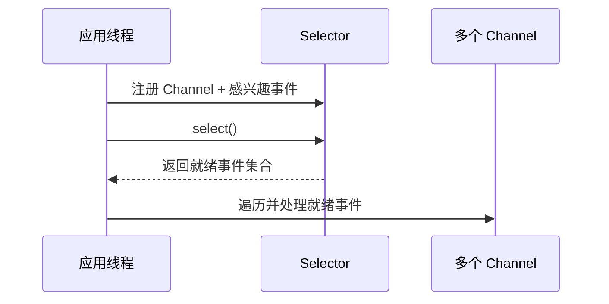

### 16.4 一个极简 NIO 服务端模型

```java
Selector selector = Selector.open();
ServerSocketChannel serverChannel = ServerSocketChannel.open();
serverChannel.configureBlocking(false);
serverChannel.bind(new InetSocketAddress(8080));
serverChannel.register(selector, SelectionKey.OP_ACCEPT);

while (true) {
    selector.select();
    Iterator<SelectionKey> it = selector.selectedKeys().iterator();
    while (it.hasNext()) {
        SelectionKey key = it.next();
        it.remove();

        if (key.isAcceptable()) {
            // 接收连接
        } else if (key.isReadable()) {
            // 读取数据
        }
    }
}
```

### 16.5 为什么说 NIO 适合高并发

因为它把“一个连接一个线程”的模型，变成了：

- 少量线程
- 管理大量连接
- 只处理就绪事件

这样更节省线程和内存资源。

> [!note] 底层映射
> Linux 下 Selector 典型基于 `epoll`，Windows 下通常有自己的实现。
> Java 屏蔽了不同操作系统差异。

---

## 17. BIO、NIO、AIO 到底怎么理解

### 17.1 BIO

你打电话给快递员：

- 一直等
- 他没来你就一直卡着

这叫阻塞。

### 17.2 NIO

你每隔一会儿看一下快递到了没，或者同时盯多个快递。

谁到了先处理谁。

这叫非阻塞 + 多路复用。

### 17.3 AIO

你告诉平台：

- 快递到了通知我

然后你继续做别的事，到了它主动回调你。

这叫异步。

### 17.4 三者对比表

| 模型 | 同步/异步 | 阻塞/非阻塞 | 特点 |
|------|------|------|------|
| BIO | 同步 | 阻塞 | 简单，适合低并发 |
| NIO | 同步 | 非阻塞 | 高并发网络常用 |
| AIO | 异步 | 非阻塞 | 由系统完成后通知 |

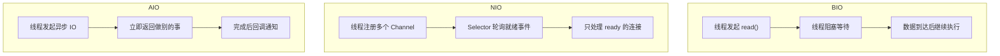

> [!important] 很多人会混淆
> `同步/异步` 说的是 **结果通知方式**。
> `阻塞/非阻塞` 说的是 **调用线程是否卡住**。

---

## 18. AIO：异步 IO

### 18.1 AIO 的核心思想

发起 IO 后立即返回。

真正完成时：

- 回调通知你
- 或者 Future 告诉你结果

### 18.2 AsynchronousFileChannel 示例

```java
AsynchronousFileChannel channel = AsynchronousFileChannel.open(
    Paths.get("a.txt"),
    StandardOpenOption.READ
);

ByteBuffer buffer = ByteBuffer.allocate(1024);
channel.read(buffer, 0, buffer, new CompletionHandler<Integer, ByteBuffer>() {
    @Override
    public void completed(Integer result, ByteBuffer attachment) {
        attachment.flip();
        // 处理结果
    }

    @Override
    public void failed(Throwable exc, ByteBuffer attachment) {
        exc.printStackTrace();
    }
});
```

### 18.3 AIO 适合什么场景

- 高延迟 IO
- 需要真正异步回调
- 特定平台或框架

### 18.4 为什么日常开发 NIO 更常见

因为：

- NIO 生态更成熟
- Netty 等主流框架大量基于 NIO
- AIO 在不同系统上的收益和实现并不总是理想

---

## 19. Path / Files：现代文件 API

### 19.1 为什么推荐 Path 和 Files

JDK 7 引入 `java.nio.file` 后，文件操作体验提升很多。

比 `File` 更现代的地方：

- 路径操作更清晰
- API 更丰富
- 异常更明确
- 支持遍历、复制、移动、权限等更多能力

### 19.2 Path 的基本用法

```java
Path path = Paths.get("data", "a.txt");
System.out.println(path.toAbsolutePath());
```

### 19.3 Files 的高频操作

```java
Path path = Paths.get("a.txt");
boolean exists = Files.exists(path);
```

```java
Files.createDirectories(Paths.get("logs"));
```

```java
Files.write(Paths.get("a.txt"), "hello".getBytes(StandardCharsets.UTF_8));
```

```java
String content = Files.readString(Paths.get("a.txt"), StandardCharsets.UTF_8);
```

```java
List<String> lines = Files.readAllLines(Paths.get("a.txt"), StandardCharsets.UTF_8);
```

### 19.4 遍历目录

```java
try (Stream<Path> stream = Files.walk(Paths.get("src"))) {
    stream.filter(Files::isRegularFile)
          .forEach(System.out::println);
}
```

### 19.5 现代文本文件处理推荐

```java
Files.writeString(Paths.get("note.txt"), "hello", StandardCharsets.UTF_8);
String text = Files.readString(Paths.get("note.txt"), StandardCharsets.UTF_8);
```

如果只是简单文本文件读写，`Files` 往往比传统流更方便。

---

## 20. RandomAccessFile：随机访问文件

### 20.1 它有什么特点

`RandomAccessFile` 可以：

- 从任意位置读
- 从任意位置写
- 不必只能顺序操作

### 20.2 典型场景

- 断点续传
- 文件头修改
- 索引定位
- 固定长度记录存储

### 20.3 示例

```java
try (RandomAccessFile raf = new RandomAccessFile("a.txt", "rw")) {
    raf.seek(5);
    raf.write("JAVA".getBytes(StandardCharsets.UTF_8));
}
```

### 20.4 和 FileChannel 的关系

`RandomAccessFile` 也可以拿到 `FileChannel`：

```java
RandomAccessFile raf = new RandomAccessFile("a.txt", "rw");
FileChannel channel = raf.getChannel();
```

---

## 21. 零拷贝：高性能 IO 的关键概念

### 21.1 什么是“拷贝”

普通文件发送流程中，数据可能经历多次复制：

1. 磁盘 -> 内核缓冲区
2. 内核缓冲区 -> 用户缓冲区
3. 用户缓冲区 -> socket 缓冲区
4. socket 缓冲区 -> 网卡

### 21.2 零拷贝要解决什么

尽量减少：

- 用户态和内核态之间的数据复制
- CPU 参与搬运的次数
- 上下文切换

### 21.3 Java 中常见零拷贝入口

- `FileChannel.transferTo()`
- `FileChannel.transferFrom()`
- `MappedByteBuffer`

### 21.4 为什么 Netty、Kafka 都很重视它

因为大文件传输、网络转发、消息中间件都很依赖吞吐。

减少一次复制，收益就可能很明显。

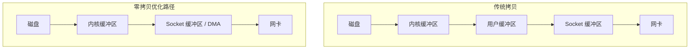

---

## 22. MappedByteBuffer：内存映射文件

### 22.1 它是什么

`MappedByteBuffer` 通过内存映射，把文件的一段区域映射到内存。

这样你操作内存，就像在操作文件。

### 22.2 示例

```java
try (
    RandomAccessFile raf = new RandomAccessFile("a.txt", "rw");
    FileChannel channel = raf.getChannel()
) {
    MappedByteBuffer buffer = channel.map(FileChannel.MapMode.READ_WRITE, 0, 1024);
    buffer.put("hello".getBytes(StandardCharsets.UTF_8));
}
```

### 22.3 优点

- 随机访问效率高
- 可减少传统读写拷贝过程
- 适合超大文件处理

### 22.4 风险和注意点

- 不是银弹
- 映射过大可能占用大量虚拟内存
- 释放时机复杂
- 更依赖底层操作系统行为

> [!warning] 实战注意
> `MappedByteBuffer` 和 `DirectByteBuffer` 都涉及堆外内存，排查内存问题时要联想到 [[JVM内存模型与运行时数据区]] 中的本地内存与 Direct Memory。

---

## 23. 堆内缓冲区和直接缓冲区

### 23.1 HeapByteBuffer

通过 `ByteBuffer.allocate()` 创建，底层在 JVM 堆上。

优点：

- 创建简单
- 由 GC 管理

缺点：

- 与底层 IO 交互时可能多一次拷贝

### 23.2 DirectByteBuffer

通过 `ByteBuffer.allocateDirect()` 创建，底层在堆外内存。

优点：

- 更接近操作系统原生 IO
- 某些场景下性能更好

缺点：

- 分配和释放成本更高
- 不受普通堆大小直接约束
- 排查泄漏更麻烦

### 23.3 什么时候考虑 DirectBuffer

- 高频网络通信
- 大块数据传输
- 框架底层

如果只是普通业务文件读写，没必要到处都上直接内存。

---

## 24. 网络 IO 的经典模型演进

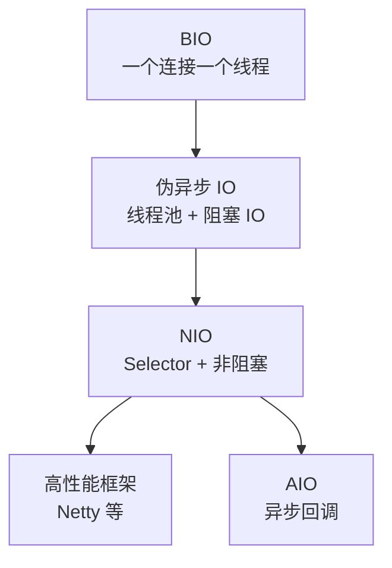

### 24.1 BIO 模型

优点：

- 易理解
- 编码简单

缺点：

- 并发高时线程爆炸

### 24.2 NIO Reactor 模型

常见于 Netty、Tomcat、Redis 等高性能网络系统思想中。

特点：

- 主线程负责监听事件
- 工作线程负责业务处理
- 通过事件驱动提升并发能力

### 24.3 AIO Proactor 模型

底层异步操作完成后主动通知。

理论上更先进，但实践中不一定比成熟 NIO 生态更有优势。

---

## 25. 编码问题：Java IO 里最容易踩坑的点

### 25.1 为什么会乱码

因为“写入时的编码”和“读取时的编码”不一致。

例如：

- 写入用 `UTF-8`
- 读取用 `GBK`

结果就会乱码。

### 25.2 一个标准原则

**谁写入，谁负责声明编码；谁读取，必须按同一编码解码。**

### 25.3 常见易错点

- 用 `FileReader` 读取 UTF-8 文件，但机器默认编码不是 UTF-8
- 前端传 UTF-8，后端按 ISO-8859-1 解码
- 日志文件跨系统查看乱码

### 25.4 统一方案

- 全链路统一 `UTF-8`
- 文本 IO 显式传 `Charset`
- 接口协议中明确声明编码

---

## 26. 常见异常与根因

### 26.1 `FileNotFoundException`

常见原因：

- 路径写错
- 文件不存在
- 目录当成文件打开
- 权限不足

### 26.2 `EOFException`

常见于：

- `DataInputStream`
- `ObjectInputStream`

说明读取超出了有效数据边界。

### 26.3 `MalformedInputException`

通常说明字符编码不匹配。

### 26.4 `ClosedChannelException`

说明你在关闭后还在继续使用 Channel。

### 26.5 `OutOfMemoryError: Direct buffer memory`

说明直接内存使用过多，常见于：

- NIO
- Netty
- 大量 DirectByteBuffer

---

## 27. 实战中最常见的几种写法

### 27.1 读取 UTF-8 文本文件

```java
try (BufferedReader reader = Files.newBufferedReader(
        Paths.get("a.txt"), StandardCharsets.UTF_8)) {
    String line;
    while ((line = reader.readLine()) != null) {
        System.out.println(line);
    }
}
```

### 27.2 写入 UTF-8 文本文件

```java
try (BufferedWriter writer = Files.newBufferedWriter(
        Paths.get("a.txt"), StandardCharsets.UTF_8)) {
    writer.write("hello");
    writer.newLine();
    writer.write("world");
}
```

### 27.3 复制二进制文件

```java
Files.copy(Paths.get("a.jpg"), Paths.get("b.jpg"), StandardCopyOption.REPLACE_EXISTING);
```

### 27.4 读取小文件整个内容

```java
String text = Files.readString(Paths.get("a.txt"), StandardCharsets.UTF_8);
```

### 27.5 大文件流式处理

```java
try (Stream<String> lines = Files.lines(Paths.get("big.log"), StandardCharsets.UTF_8)) {
    lines.filter(line -> line.contains("ERROR"))
         .forEach(System.out::println);
}
```

> [!warning] 注意
> `Files.readAllLines()` 适合小文件。
> 大文件不要一次性全部读入内存。

---

## 28. 面试最爱问的核心问题

### 28.1 字节流和字符流的区别

标准回答：

- 字节流按字节处理，适合所有类型数据
- 字符流按字符处理，本质是字节流 + 编码解码
- 文本优先字符流，二进制必须字节流

### 28.2 BIO 和 NIO 的区别

标准回答：

- BIO 面向流、阻塞式
- NIO 面向缓冲区、支持非阻塞和多路复用
- BIO 更简单，NIO 更适合高并发网络场景

### 28.3 `flush()` 和 `close()` 的区别

标准回答：

- `flush()` 只是把缓冲区数据刷出去，流还能继续用
- `close()` 会释放资源，之后流不能再使用

### 28.4 `InputStreamReader` 的作用

标准回答：

- 它是字节流到字符流的桥梁
- 负责按照指定字符集把字节解码成字符

### 28.5 什么是零拷贝

标准回答：

- 减少数据在用户态和内核态之间的复制次数
- 减少 CPU 搬运和上下文切换
- Java 中常见入口是 `FileChannel.transferTo()` 等

### 28.6 Buffer 的 `flip()` 有什么作用

标准回答：

- 把 Buffer 从写模式切到读模式
- 设置 `limit = position`
- `position = 0`

### 28.7 为什么 NIO 适合高并发

标准回答：

- 通过 Selector 实现一个线程监听多个连接
- 避免一个连接对应一个线程
- 减少线程切换和资源消耗

---

## 29. Java IO 学习路线

### 29.1 初级阶段

掌握：

- `InputStream` / `OutputStream`
- `Reader` / `Writer`
- `BufferedReader` / `BufferedWriter`
- `try-with-resources`
- 编码问题

### 29.2 中级阶段

掌握：

- `File`
- `Path` / `Files`
- `DataInputStream`
- `ObjectOutputStream`
- `RandomAccessFile`

### 29.3 高级阶段

掌握：

- `ByteBuffer`
- `FileChannel`
- `SocketChannel`
- `Selector`
- `DirectByteBuffer`
- 零拷贝
- 内存映射文件

### 29.4 实战阶段

继续延伸到：

- Netty
- Tomcat Connector
- Kafka 网络模型
- Redis 事件驱动
- Linux `select` / `poll` / `epoll`

---

## 30. 一套真正有用的学习方法

### 30.1 不要死记类名，先抓主线

主线永远只有这几条：

1. 数据来源是什么
2. 是文本还是二进制
3. 是顺序读写还是随机读写
4. 是普通文件还是高并发网络
5. 是否要处理编码
6. 是否要性能优化

### 30.2 学 IO 的正确顺序

1. 先学字节流
2. 再学字符流
3. 再学缓冲流和装饰器模式
4. 再学 `Path` / `Files`
5. 最后学 NIO / AIO / 零拷贝

### 30.3 一定要亲手做的小实验

- 拷贝图片，验证为什么必须用字节流
- 用不同编码写中文，再故意用错编码读，观察乱码
- 用 `BufferedReader` 读取大文本
- 用 `ByteBuffer` 手动体验 `flip()` / `clear()`
- 用 `FileChannel.transferTo()` 做文件复制

---

## 31. 高频陷阱总结

> [!danger] IO 常见坑位
> 1. 文本没指定编码，跨机器乱码
> 2. 最后一次读不足一个缓冲区，却把整个数组写出
> 3. 忘记关闭流，导致文件句柄泄漏
> 4. 误把二进制文件当字符流处理
> 5. NIO 中忘记 `flip()`
> 6. 大文件一次性读入内存
> 7. 过度迷信 `MappedByteBuffer` 或 DirectBuffer，把简单问题复杂化

---

## 32. 一张图串起全部知识

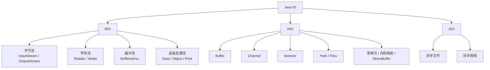

---

## 33. 一句话总结 Java IO

Java IO 的本质，就是 **以合适的数据单位、合适的抽象层、合适的阻塞模型，把数据在程序和外部设备之间高效、正确地搬运**。

如果你只记住下面这组心法，就已经抓住主干了：

- 文本优先字符流，二进制必须字节流
- 简单文件处理优先 `Path` + `Files`
- 高频读写要加缓冲
- 文本必须显式指定编码
- 高并发网络重点掌握 NIO
- 性能优化继续深入零拷贝、DirectBuffer、内存映射

---

## 34. 面试速记版

> [!important] 30 秒速背
> - IO 就是程序与外部设备交换数据
> - Java IO 分 BIO、NIO、AIO
> - BIO 里分字节流和字符流
> - 字符流本质是字节流 + 编码解码
> - 缓冲流用于减少系统调用、提高性能
> - Java IO 使用装饰器模式组合能力
> - NIO 三件套：`Buffer`、`Channel`、`Selector`
> - `flip()` 用于写模式切读模式
> - `transferTo()` 可能利用零拷贝
> - 文本必须统一编码，优先 UTF-8

## 35. 推荐延伸阅读

- [[JVM内存模型与运行时数据区]]
- [[JVM性能调优与故障排查]]
- [[Redis线程模型与IO多路复用]]
