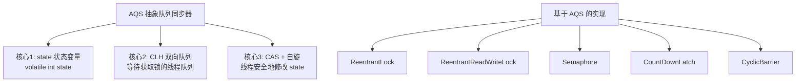
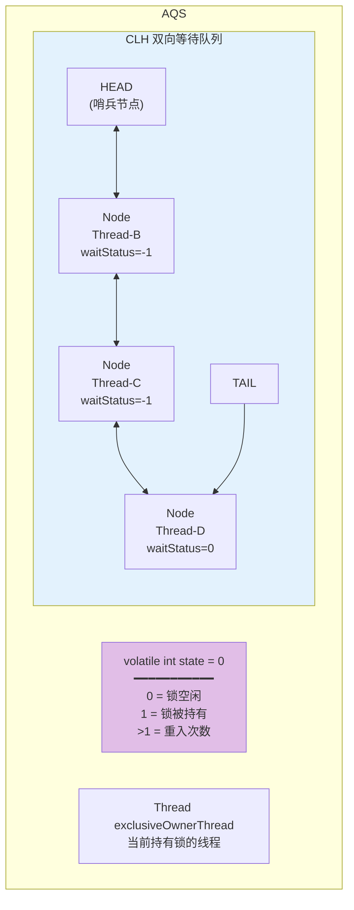
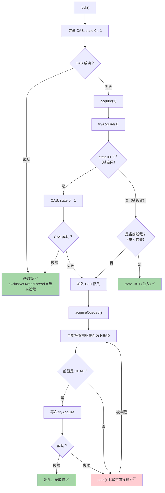
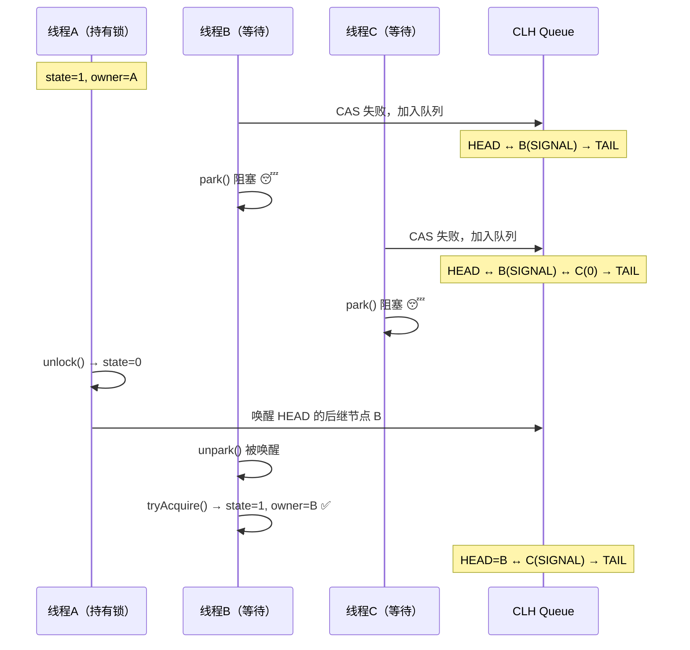
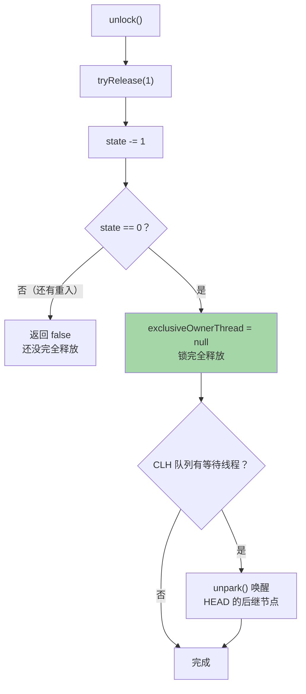
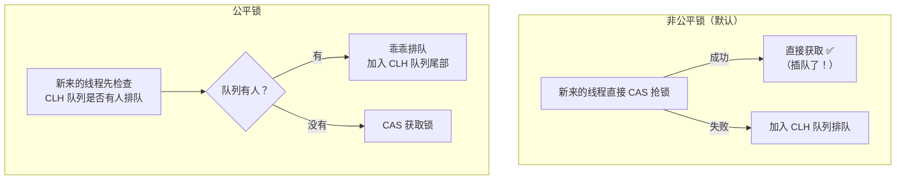
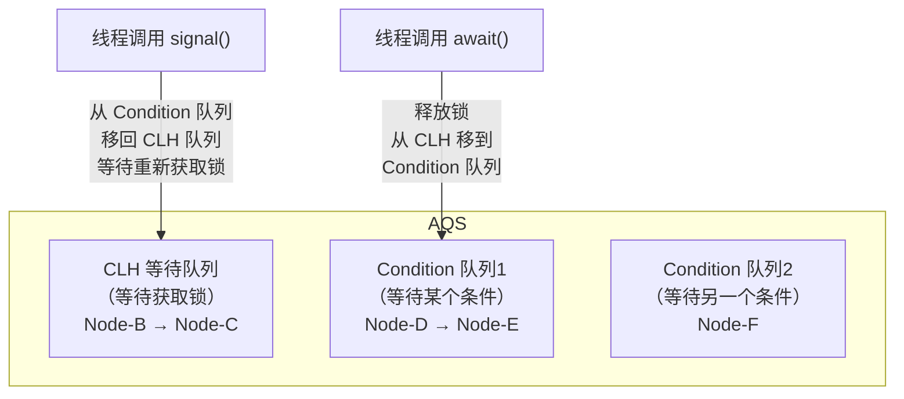
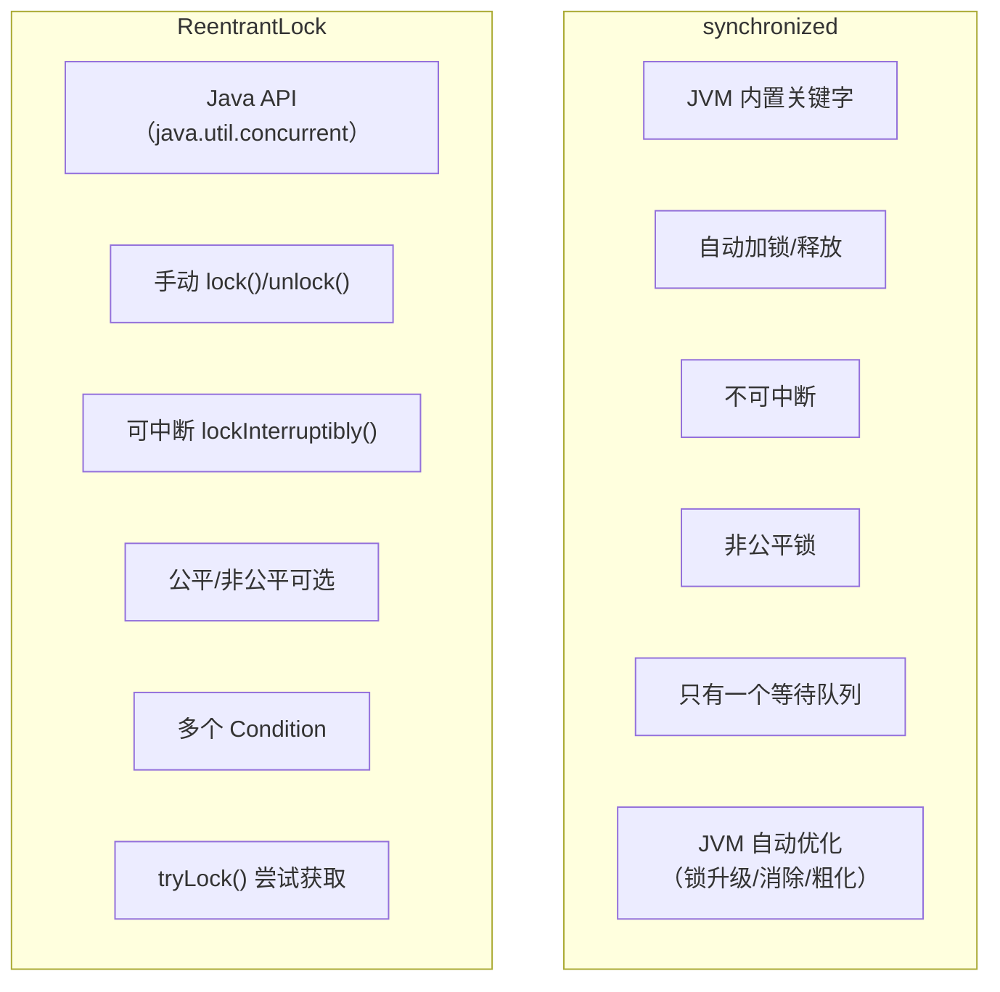

# AQS 与 ReentrantLock

AQS 是 Java 并发包的**灵魂框架**，ReentrantLock、Semaphore、CountDownLatch 等都基于它实现。

## AQS 核心原理

### AQS 是什么？

**AbstractQueuedSynchronizer**（抽象队列同步器），Doug Lea 大师的杰作。



### AQS 核心结构



### Node 节点状态

| waitStatus | 值 | 含义 |
|------------|-----|------|
| **CANCELLED** | 1 | 线程已取消 |
| **SIGNAL** | -1 | 后继节点需要被唤醒 |
| **CONDITION** | -2 | 在 Condition 队列中等待 |
| **PROPAGATE** | -3 | 共享模式下传播唤醒 |
| **0** | 0 | 初始状态 |

---

## ReentrantLock 加锁流程（非公平锁）

这是面试**最核心**的流程，逐步拆解：



### 入队过程图解



---

## ReentrantLock 解锁流程



---

## 公平锁 vs 非公平锁



### 源码区别（一行代码的差异！）

```java
// 非公平锁的 tryAcquire
if (state == 0) {
    if (compareAndSetState(0, 1)) {  // 直接 CAS 抢
        setExclusiveOwnerThread(current);
        return true;
    }
}

// 公平锁的 tryAcquire
if (state == 0) {
    if (!hasQueuedPredecessors() &&   // 先检查队列！多了这一行
        compareAndSetState(0, 1)) {
        setExclusiveOwnerThread(current);
        return true;
    }
}
```

### 对比

| 特性 | 非公平锁 | 公平锁 |
|------|----------|--------|
| **是否按顺序** | ❌ 新线程可以插队 | ✅ 严格 FIFO |
| **吞吐量** | **高**（减少上下文切换） | 低 |
| **饥饿** | 可能（某些线程一直抢不到） | ❌ 不会 |
| **默认** | ✅ 默认 | 需显式指定 |

```java
// 非公平锁（默认）
ReentrantLock lock = new ReentrantLock();
ReentrantLock lock = new ReentrantLock(false);

// 公平锁
ReentrantLock lock = new ReentrantLock(true);
```

> [!tip] 为什么默认非公平？
> 非公平锁性能更好。新来的线程直接获取锁，避免了唤醒队列中线程的**上下文切换**开销。在大部分场景下，吞吐量更重要。

---

## Condition 条件变量

Condition 是 synchronized 中 `wait/notify` 的升级版。



```java
ReentrantLock lock = new ReentrantLock();
Condition notEmpty = lock.newCondition();
Condition notFull = lock.newCondition();

// 生产者
lock.lock();
try {
    while (queue.isFull()) {
        notFull.await();    // 等待"不满"条件
    }
    queue.add(item);
    notEmpty.signal();      // 通知"不空"条件
} finally {
    lock.unlock();
}

// 消费者
lock.lock();
try {
    while (queue.isEmpty()) {
        notEmpty.await();   // 等待"不空"条件
    }
    item = queue.poll();
    notFull.signal();       // 通知"不满"条件
} finally {
    lock.unlock();
}
```

### wait/notify vs await/signal

| 特性 | wait/notify | Condition await/signal |
|------|-------------|----------------------|
| **使用范围** | synchronized 中 | ReentrantLock 中 |
| **条件数量** | 只有一个等待队列 | **多个 Condition**（精确唤醒） |
| **响应中断** | 不支持 | ✅ `awaitUninterruptibly()` |
| **超时等待** | 支持 | ✅ `await(time, unit)` |

---

## synchronized vs ReentrantLock



| 特性 | synchronized | ReentrantLock |
|------|-------------|---------------|
| **层面** | JVM 关键字 | Java API |
| **释放锁** | 自动（离开代码块） | **手动 unlock()**（必须 finally） |
| **可中断** | ❌ | ✅ `lockInterruptibly()` |
| **公平锁** | ❌ 只有非公平 | ✅ 可选公平/非公平 |
| **多条件** | ❌ 一个 wait set | ✅ 多个 Condition |
| **尝试获取** | ❌ | ✅ `tryLock()` |
| **性能** | JDK 6+ 优化后接近 | 接近 |
| **使用建议** | 优先使用（简单安全） | 需要高级功能时使用 |

---

## 面试高频问题

### Q1：AQS 的原理？

AQS 核心是一个 volatile int state（锁状态）和一个 CLH 双向等待队列。获取锁时 CAS 修改 state，失败则加入 CLH 队列阻塞等待。释放锁时将 state 置 0 并唤醒队列中的下一个线程。

### Q2：ReentrantLock 的加锁流程？

1. CAS 尝试将 state 从 0 改为 1
2. 成功则获取锁；失败则检查是否重入（当前线程持有则 state+1）
3. 都不是则加入 CLH 队列
4. 在队列中自旋检查前驱是否为 HEAD，是则再次尝试获取
5. 否则 park() 阻塞等待被唤醒

### Q3：公平锁和非公平锁的区别？

非公平锁新来的线程直接 CAS 抢锁，可能插队；公平锁先检查 CLH 队列是否有人排队。非公平锁吞吐量更高（减少上下文切换），但可能导致线程饥饿。

### Q4：synchronized 和 ReentrantLock 怎么选？

优先用 synchronized（简单、自动释放、JVM 优化）。需要可中断等待、公平锁、多条件、tryLock 等高级功能时用 ReentrantLock。
