# CAS 与原子类

CAS 是**无锁并发**的基础，也是 AQS、原子类、ConcurrentHashMap 等一切并发工具的底层支撑。

## CAS 原理

### 什么是 CAS？

**Compare And Swap**（比较并交换），一条 CPU 原子指令。

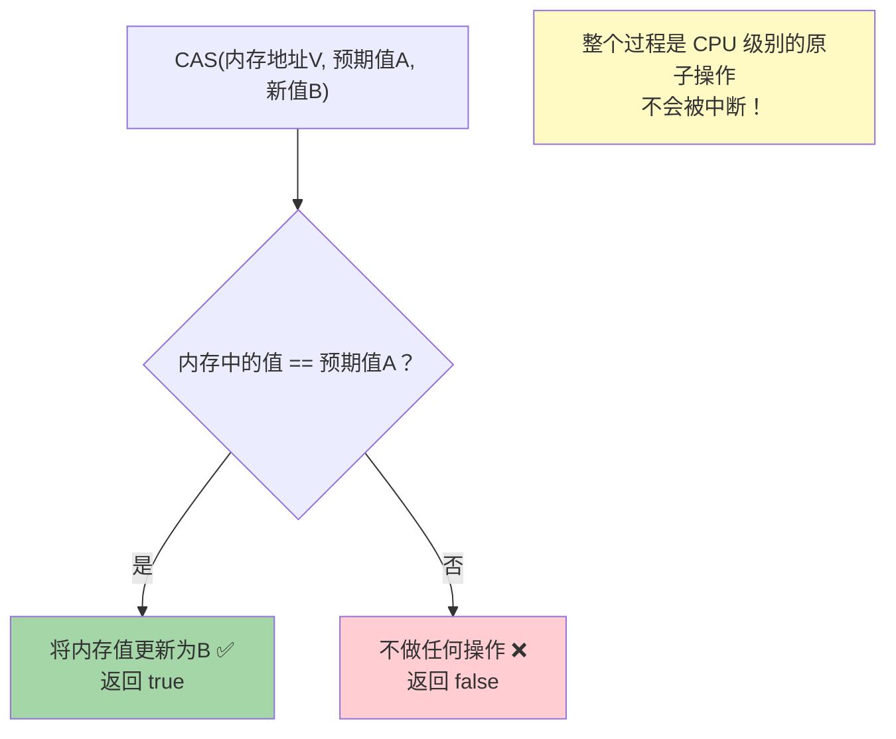

### CAS 执行过程

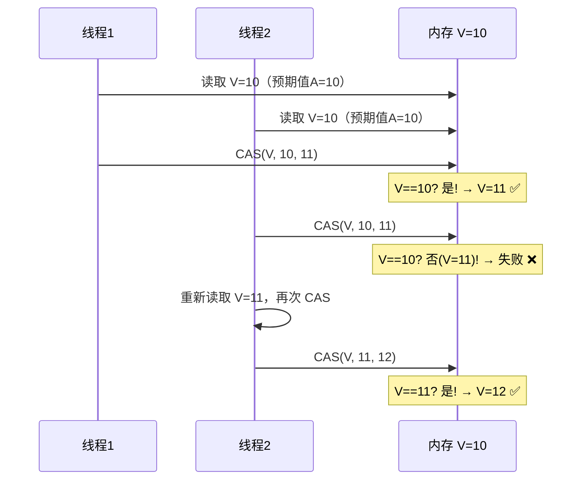

### CAS 底层实现

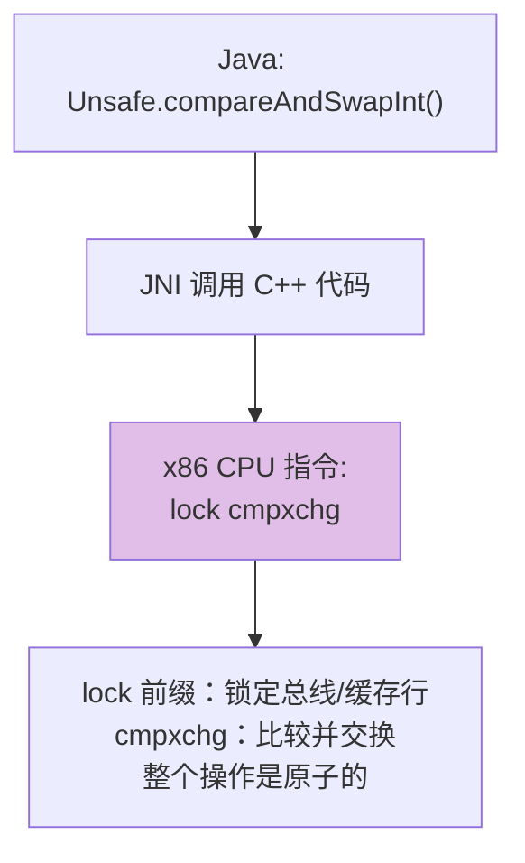

```java
// Unsafe 类中的 CAS 方法（native 方法）
public final native boolean compareAndSwapInt(
    Object obj,    // 对象
    long offset,   // 字段内存偏移量
    int expected,  // 预期值
    int update     // 新值
);
```

---

## CAS 的三大问题

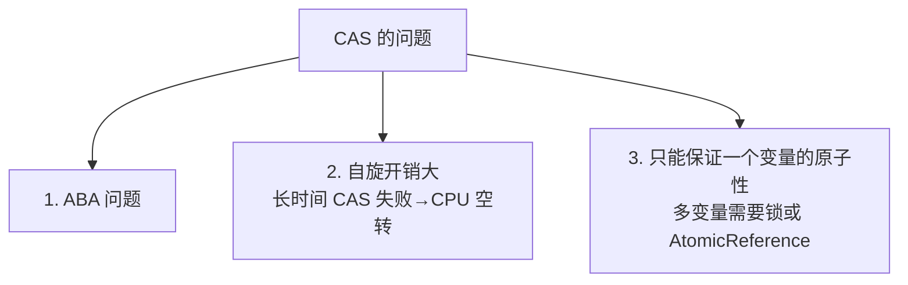

### ABA 问题

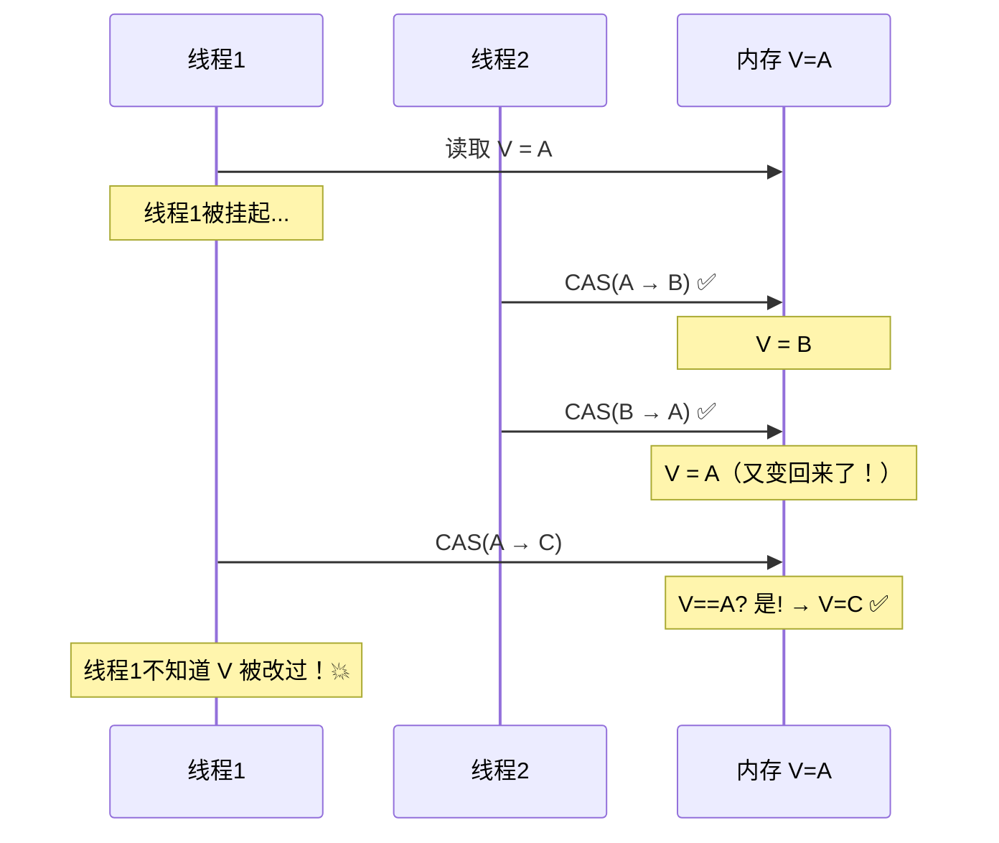

```
看起来值没变（还是A），实际上已经被修改了两次。
在某些场景下（如链表/栈操作），这可能导致严重问题。
```

### ABA 解决方案

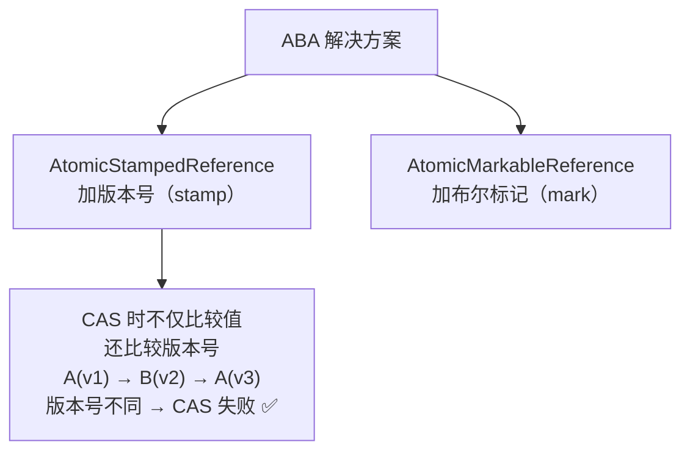

```java
// AtomicStampedReference 解决 ABA
AtomicStampedReference<Integer> ref = 
    new AtomicStampedReference<>(100, 1); // 初始值100, 版本号1

int stamp = ref.getStamp();       // 获取当前版本号
int value = ref.getReference();   // 获取当前值

// CAS 时同时比较值和版本号
ref.compareAndSet(
    100,     // 预期值
    200,     // 新值
    stamp,   // 预期版本号
    stamp + 1 // 新版本号
);
```

---

## 原子类

### 原子类家族

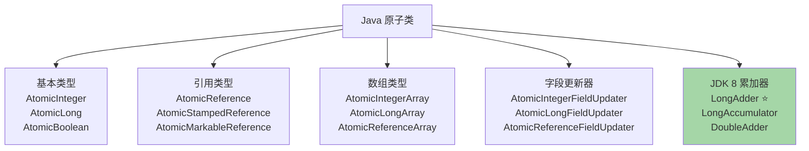

### AtomicInteger 源码分析

```java
public class AtomicInteger {
    // volatile 保证可见性
    private volatile int value;
    
    // Unsafe 实例，提供 CAS 操作
    private static final Unsafe unsafe = Unsafe.getUnsafe();
    // value 字段的内存偏移量
    private static final long valueOffset;
    
    // getAndIncrement（i++的原子版本）
    public final int getAndIncrement() {
        return unsafe.getAndAddInt(this, valueOffset, 1);
    }
}
```

```java
// Unsafe.getAndAddInt 的实现（自旋 CAS）
public final int getAndAddInt(Object obj, long offset, int delta) {
    int v;
    do {
        v = getIntVolatile(obj, offset);  // 读取当前值
    } while (!compareAndSwapInt(obj, offset, v, v + delta)); // CAS 直到成功
    return v;
}
```

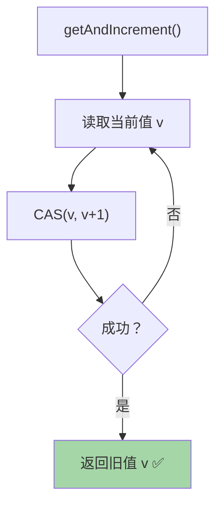

---

## LongAdder（JDK 8 重点）

### AtomicLong 的问题

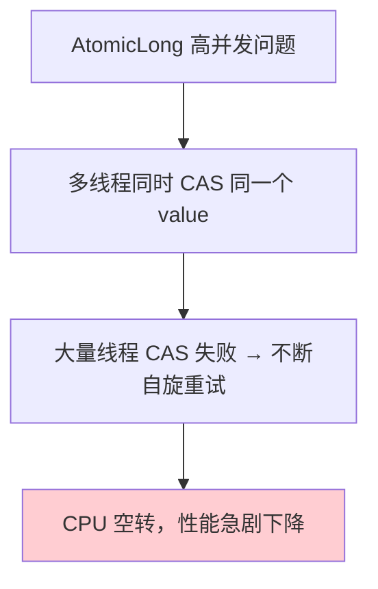

### LongAdder 分段思想

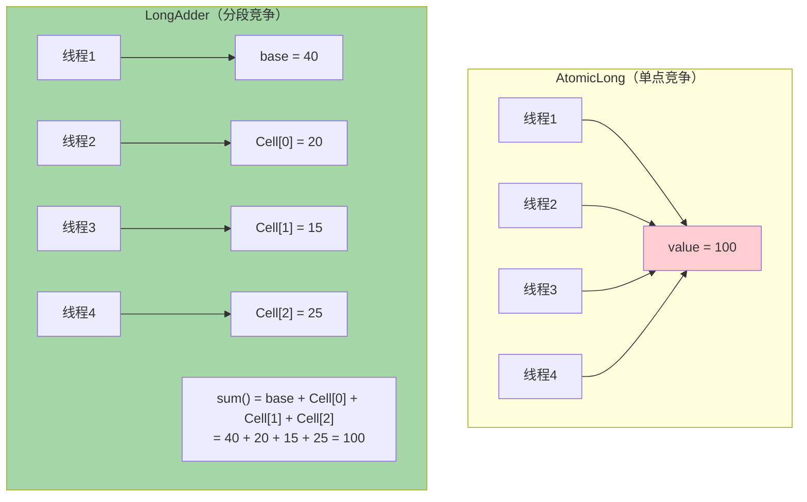

### LongAdder 工作流程

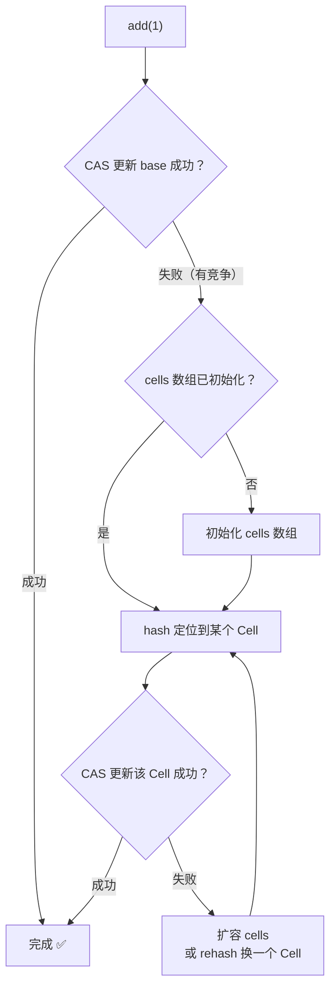

### AtomicLong vs LongAdder

| 特性 | AtomicLong | LongAdder |
|------|-----------|-----------|
| **竞争方式** | 所有线程 CAS 同一个值 | 分散到多个 Cell |
| **高并发性能** | 差（大量自旋） | **极好** |
| **精确读取** | 精确 | 最终一致（sum 时可能不精确） |
| **适用场景** | 需要精确值 | **统计计数**（如 QPS） |
| **内存** | 少 | 多（Cell 数组） |

> [!tip] 选择建议
> - 需要精确原子操作（CAS compareAndSet）→ AtomicLong
> - 只需要累加计数（如统计、限流）→ **LongAdder**（性能高数倍）

---

## 面试高频问题

### Q1：CAS 是什么？原理？

Compare And Swap，比较内存值与预期值，相同则更新为新值。底层由 CPU 的 `lock cmpxchg` 指令保证原子性。是乐观锁的实现基础。

### Q2：CAS 有什么问题？怎么解决？

1. **ABA 问题** → AtomicStampedReference（加版本号）
2. **自旋开销** → 自适应自旋、超过阈值升级为锁
3. **只能保证单变量原子性** → AtomicReference 或用锁

### Q3：AtomicInteger 怎么实现的？

内部用 `volatile int value` 保证可见性，通过 `Unsafe.compareAndSwapInt()` 进行 CAS 操作。`getAndIncrement()` 本质是自旋 CAS，直到成功。

### Q4：LongAdder 为什么比 AtomicLong 快？

AtomicLong 所有线程竞争同一个 value，高并发下大量 CAS 失败导致自旋。LongAdder 将值分散到 base + Cell 数组中，不同线程更新不同的 Cell，减少竞争。sum() 时累加所有 Cell 得到总值。
