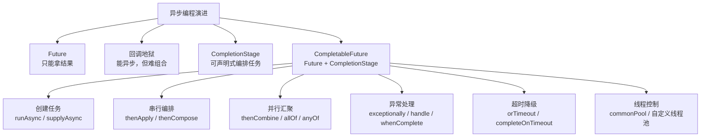
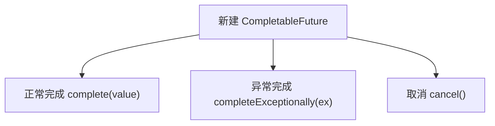
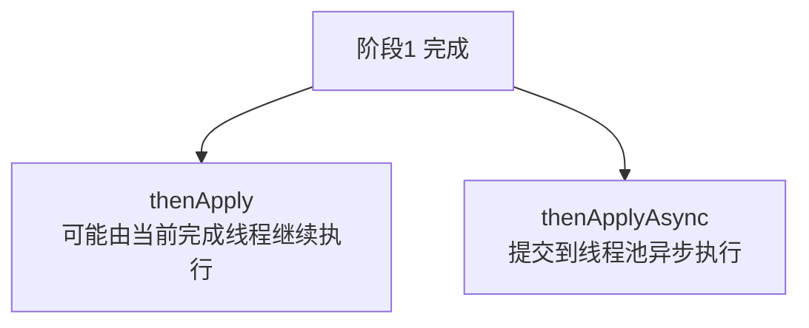
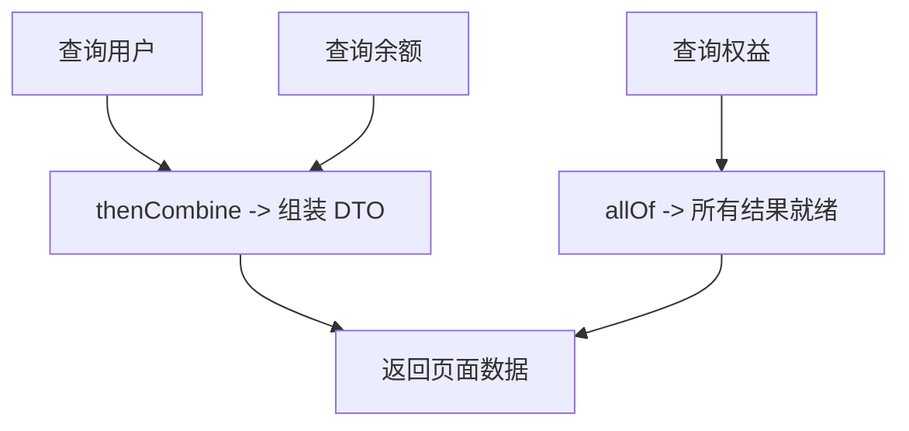
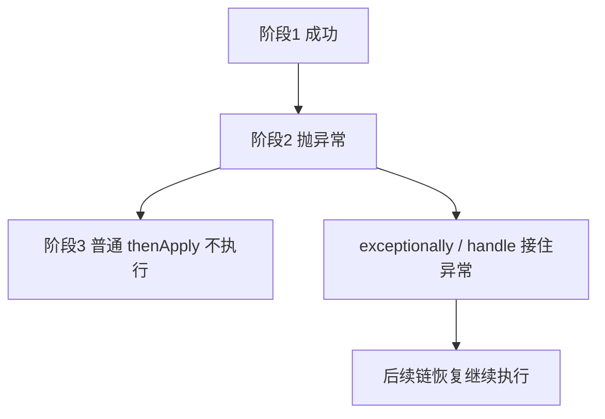
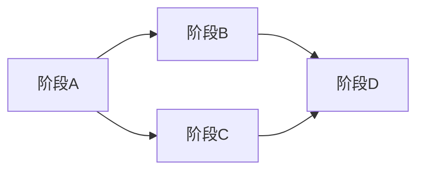

# CompletableFuture 从0基础到精通

> [!tip] 使用指南
> 这篇笔记按 **为什么出现 -> 核心概念 -> 常用 API -> 线程模型 -> 实战模式 -> 底层原理 -> 踩坑与面试** 的顺序组织。
> 如果你是第一次学，建议先看：
> 1. `为什么 Future 不够用`
> 2. `创建与启动方式`
> 3. `thenApply / thenCompose / thenCombine`
> 4. `exceptionally / handle / whenComplete`
> 5. `线程池与 async 版本`

## 一张图先建立全局认知



---

## 1. 为什么需要 CompletableFuture

### 1.1 先看 `Future` 的问题

`Future` 解决的是“**任务已经异步提交了，稍后我能不能拿到结果**”。

但它的问题也很明显：

- `get()` 会阻塞
- 很难写“任务 A 完成后自动执行任务 B”
- 很难把多个异步任务组合起来
- 异常处理不优雅
- 不能方便地写降级、超时、并行汇聚

例如：

```java
ExecutorService pool = Executors.newFixedThreadPool(4);

Future<String> future = pool.submit(() -> {
    Thread.sleep(1000);
    return "hello";
});

String result = future.get(); // 阻塞等待
System.out.println(result);
```

这段代码能异步提交任务，但后面一旦 `get()`，主线程还是会卡住。

### 1.2 `CompletableFuture` 解决了什么

`CompletableFuture` 的核心目标是：

1. **异步任务结果可表示**
2. **任务之间可链式编排**
3. **异常、超时、组合、回调都可声明式表达**

它让你从“拿一个异步结果”升级到“**编排一条异步流程**”。

### 1.3 一句话理解

> [!important]
> `Future` 更像“异步结果占位符”，`CompletableFuture` 更像“异步流程编排器”。

### 1.4 `Future` 和 `CompletableFuture` 对比

| 能力 | `Future` | `CompletableFuture` |
|------|----------|---------------------|
| 获取结果 | `get()` | `get()` / `join()` |
| 非阻塞回调 | ❌ | ✅ |
| 串行依赖编排 | ❌ | ✅ |
| 并行组合 | ❌ | ✅ |
| 异常恢复 | ❌ | ✅ |
| 手动完成 | ❌ | ✅ |
| 超时降级 | 弱 | ✅ |

---

## 2. 三个必须先理解的核心概念

### 2.1 `Future`

`Future<T>` 表示“未来某个时间点会得到一个 `T` 结果”。

你可以把它理解成：

- 现在没有结果
- 任务完成后会有结果
- 你可以稍后去拿

### 2.2 `CompletionStage`

`CompletionStage` 是一个更抽象的接口，强调的是：

- 这个阶段完成后
- 下一阶段做什么
- 出错了怎么处理
- 多个阶段怎么组合

也就是说，它描述的是“**阶段之间的依赖关系**”。

### 2.3 `CompletableFuture`

`CompletableFuture<T>` 同时实现了：

- `Future<T>`
- `CompletionStage<T>`

所以它既能：

- 表示一个异步结果

又能：

- 继续往后编排新的异步阶段

### 2.4 它到底“complete”了什么

`CompletableFuture` 可以有三种终态：

1. **正常完成**
2. **异常完成**
3. **取消完成**



只要进入终态，就不能再改。

---

## 3. 创建 CompletableFuture 的几种方式

### 3.1 `completedFuture`：已经完成的 future

适合你已经有结果，只是想把它包装进异步链。

```java
CompletableFuture<String> future = CompletableFuture.completedFuture("ok");

future.thenAccept(System.out::println).join();
```

### 3.2 `runAsync`：异步执行无返回值任务

```java
CompletableFuture<Void> future = CompletableFuture.runAsync(() -> {
    System.out.println("执行无返回值任务");
});

future.join();
```

适合：

- 异步记录日志
- 异步发通知
- 异步做某个副作用动作

### 3.3 `supplyAsync`：异步执行有返回值任务

```java
CompletableFuture<String> future = CompletableFuture.supplyAsync(() -> {
    return "hello";
});

System.out.println(future.join());
```

这是最常用的入口。

### 3.4 指定线程池执行

默认情况下，`runAsync` / `supplyAsync` 使用 `ForkJoinPool.commonPool()`。

生产环境里更推荐显式指定线程池：

```java
ExecutorService ioPool = Executors.newFixedThreadPool(8);

CompletableFuture<String> future = CompletableFuture.supplyAsync(() -> {
    return "data";
}, ioPool);
```

原因后面会详细说：**不要把业务异步任务全部扔进公共线程池**。

### 3.5 直接 `new CompletableFuture<>()`

```java
CompletableFuture<String> future = new CompletableFuture<>();

// 其他线程里完成它
new Thread(() -> future.complete("manual result")).start();

System.out.println(future.join());
```

这种写法适合：

- 把传统回调风格封装成 `CompletableFuture`
- 手动控制某个 future 的完成时机

### 3.6 手动异常完成

```java
CompletableFuture<String> future = new CompletableFuture<>();
future.completeExceptionally(new RuntimeException("系统异常"));

future.join(); // 抛 CompletionException
```

### 3.7 回调转 CompletableFuture

很多旧 SDK 还是这种风格：

```java
public void queryUser(long id, Callback<User> callback) {
    // 成功 callback.onSuccess(user)
    // 失败 callback.onFailure(ex)
}
```

可以桥接成：

```java
CompletableFuture<User> queryUserAsync(long id) {
    CompletableFuture<User> future = new CompletableFuture<>();

    queryUser(id, new Callback<>() {
        @Override
        public void onSuccess(User user) {
            future.complete(user);
        }

        @Override
        public void onFailure(Throwable ex) {
            future.completeExceptionally(ex);
        }
    });

    return future;
}
```

> [!tip]
> `new CompletableFuture<>()` 最有价值的地方，不是自己手搓异步任务，而是**把外部异步事件桥接进统一编排模型**。

---

## 4. 获取结果：`get()`、`join()`、`getNow()`

### 4.1 `get()`

```java
String result = future.get();
```

特点：

- 阻塞等待
- 抛受检异常：
  - `InterruptedException`
  - `ExecutionException`

### 4.2 `join()`

```java
String result = future.join();
```

特点：

- 也会阻塞等待
- 抛非受检异常 `CompletionException`

所以在函数式链式代码里更常见的是 `join()`。

### 4.3 `getNow(defaultValue)`

```java
String value = future.getNow("default");
```

特点：

- **不会阻塞**
- 如果任务还没完成，直接返回默认值

### 4.4 `get()` 和 `join()` 区别

| 方法 | 是否阻塞 | 异常类型 | 常见场景 |
|------|----------|----------|----------|
| `get()` | 是 | 受检异常 | 传统 Java 风格 |
| `join()` | 是 | 非受检异常 | 链式编排、函数式风格 |
| `getNow()` | 否 | 不等待 | 探测式读取 |

### 4.5 `join()` 不是“更高级的异步”

很多人会误解：

- 用了 `CompletableFuture`
- 再 `join()`
- 就以为自己已经异步化了

其实如果你在请求线程一上来就 `join()`，本质上还是同步等待。

> [!warning]
> `CompletableFuture` 的真正价值不是“换个 API 阻塞”，而是“让等待变成链式编排和组合”。

---

## 5. 最基础的链式操作

### 5.1 `thenApply`：把结果转换成另一个结果

```java
CompletableFuture<String> future = CompletableFuture
    .supplyAsync(() -> "hello")
    .thenApply(String::toUpperCase)
    .thenApply(s -> s + " WORLD");

System.out.println(future.join()); // HELLO WORLD
```

适合：

- DTO 转 VO
- 字符串加工
- 结果映射

### 5.2 `thenAccept`：消费结果但不返回新值

```java
CompletableFuture<Void> future = CompletableFuture
    .supplyAsync(() -> "hello")
    .thenAccept(System.out::println);

future.join();
```

适合：

- 打印
- 发消息
- 落日志

### 5.3 `thenRun`：不关心上一步结果，只想继续执行

```java
CompletableFuture<Void> future = CompletableFuture
    .supplyAsync(() -> "hello")
    .thenRun(() -> System.out.println("前一个阶段完成了"));

future.join();
```

### 5.4 三者区别

| 方法 | 能拿到上一步结果吗 | 自己有返回值吗 |
|------|--------------------|----------------|
| `thenApply` | 能 | 有 |
| `thenAccept` | 能 | 没有 |
| `thenRun` | 不能 | 没有 |

### 5.5 一个最小完整例子

```java
CompletableFuture<Void> pipeline = CompletableFuture
    .supplyAsync(() -> "order-1001")
    .thenApply(orderNo -> "处理订单：" + orderNo)
    .thenAccept(System.out::println);

pipeline.join();
```

---

## 6. `thenApply` 和 `thenApplyAsync` 到底有什么区别

这是面试和实战都非常高频的点。

### 6.1 非 `Async` 版本

```java
future.thenApply(result -> transform(result));
```

含义：

- 下一阶段可能由**完成上一个阶段的线程**直接执行
- 如果上一步已经完成，也可能由当前调用线程执行

也就是说：**它不保证切线程**。

### 6.2 `Async` 版本

```java
future.thenApplyAsync(result -> transform(result));
```

含义：

- 下一阶段会被提交到异步执行器中
- 没指定线程池时，通常用 `ForkJoinPool.commonPool()`

### 6.3 指定线程池的 `Async`

```java
future.thenApplyAsync(result -> transform(result), businessPool);
```

这是最可控的写法。

### 6.4 一张图记住



### 6.5 实战选择原则

- 轻量、纯内存、很快完成的转换：`thenApply`
- 明确要切线程、避免阻塞当前线程：`thenApplyAsync`
- 业务线程调度要可控：`thenApplyAsync(..., executor)`

> [!important]
> 非 `Async` 版本的重点不是“同步”，而是“**不额外调度线程**”。

---

## 7. 串行依赖：`thenCompose`

### 7.1 为什么它重要

假设：

1. 先查用户
2. 再根据用户查订单

第二步依赖第一步结果，并且第二步本身也是异步的。

### 7.2 错误写法：`thenApply`

```java
CompletableFuture<CompletableFuture<Order>> future =
    queryUserAsync(userId)
        .thenApply(user -> queryOrderAsync(user.getId()));
```

结果类型变成了：

`CompletableFuture<CompletableFuture<Order>>`

这叫“future 套 future”。

### 7.3 正确写法：`thenCompose`

```java
CompletableFuture<Order> future =
    queryUserAsync(userId)
        .thenCompose(user -> queryOrderAsync(user.getId()));
```

`thenCompose` 会自动把两层 future **压平**。

### 7.4 一句话理解

| 方法 | 适用场景 |
|------|----------|
| `thenApply` | 同步转换：`T -> U` |
| `thenCompose` | 异步转换：`T -> CompletableFuture<U>` |

### 7.5 真实业务例子

```java
CompletableFuture<UserOrderDTO> future =
    queryUserAsync(userId)
        .thenCompose(user ->
            queryLatestOrderAsync(user.getId())
                .thenApply(order -> new UserOrderDTO(user, order))
        );
```

这就是典型的“**前置查询 + 后置依赖查询**”。

---

## 8. 并行汇聚：`thenCombine`、`allOf`、`anyOf`

### 8.1 `thenCombine`：两个独立任务都完成后合并

假设：

- 一个任务查用户信息
- 一个任务查账户余额

两者互不依赖，可以并行。

```java
CompletableFuture<User> userFuture =
    CompletableFuture.supplyAsync(() -> queryUser(userId), ioPool);

CompletableFuture<Balance> balanceFuture =
    CompletableFuture.supplyAsync(() -> queryBalance(userId), ioPool);

CompletableFuture<UserProfileDTO> profileFuture =
    userFuture.thenCombine(balanceFuture, UserProfileDTO::new);
```

### 8.2 `thenAcceptBoth`

和 `thenCombine` 类似，但只消费结果，不返回新值。

```java
userFuture.thenAcceptBoth(balanceFuture, (user, balance) -> {
    System.out.println(user.getName() + ":" + balance.getAmount());
}).join();
```

### 8.3 `runAfterBoth`

两个任务都完成后，执行一个不关心结果的动作。

```java
userFuture.runAfterBoth(balanceFuture, () -> {
    System.out.println("两个任务都结束了");
}).join();
```

### 8.4 `allOf`：等所有任务结束

```java
CompletableFuture<String> f1 = CompletableFuture.supplyAsync(() -> "A", ioPool);
CompletableFuture<String> f2 = CompletableFuture.supplyAsync(() -> "B", ioPool);
CompletableFuture<String> f3 = CompletableFuture.supplyAsync(() -> "C", ioPool);

CompletableFuture<Void> all = CompletableFuture.allOf(f1, f2, f3);

all.join();
System.out.println(f1.join() + f2.join() + f3.join());
```

注意：

- `allOf` 返回的是 `CompletableFuture<Void>`
- 它只表示“都完成了”
- 不会自动帮你把结果聚成 `List<T>`

### 8.5 收集 `allOf` 结果的标准写法

```java
List<CompletableFuture<User>> futures = ids.stream()
    .map(id -> CompletableFuture.supplyAsync(() -> queryUser(id), ioPool))
    .toList();

CompletableFuture<List<User>> allUsersFuture =
    CompletableFuture.allOf(futures.toArray(CompletableFuture[]::new))
        .thenApply(v -> futures.stream()
            .map(CompletableFuture::join)
            .toList());
```

### 8.6 `anyOf`：谁先完成用谁

```java
CompletableFuture<Object> fastest = CompletableFuture.anyOf(
    queryFromCacheAsync(key),
    queryFromRedisAsync(key),
    queryFromDbAsync(key)
);
```

适合：

- 多数据源抢最快响应
- 多机房抢首包
- 超时兜底前的抢结果策略

### 8.7 一张图理解并发编排



---

## 9. 异常处理：这是 CompletableFuture 最容易写错的部分

### 9.1 `exceptionally`

只在异常时触发，并返回一个兜底值。

```java
CompletableFuture<String> future = CompletableFuture
    .supplyAsync(() -> {
        throw new RuntimeException("服务异常");
    })
    .exceptionally(ex -> {
        System.err.println("发生异常: " + ex.getMessage());
        return "默认值";
    });

System.out.println(future.join()); // 默认值
```

### 9.2 `handle`

无论成功还是失败都会执行，并且可以统一转换结果。

```java
CompletableFuture<String> future = CompletableFuture
    .supplyAsync(() -> "ok")
    .handle((result, ex) -> {
        if (ex != null) {
            return "fallback";
        }
        return result.toUpperCase();
    });
```

### 9.3 `whenComplete`

无论成功还是失败都会执行，但通常只做副作用操作，不改变主结果。

```java
CompletableFuture<String> future = CompletableFuture
    .supplyAsync(() -> "ok")
    .whenComplete((result, ex) -> {
        if (ex == null) {
            System.out.println("成功: " + result);
        } else {
            System.err.println("失败: " + ex.getMessage());
        }
    });
```

### 9.4 三者区别

| 方法 | 什么时候执行 | 能改返回值吗 | 典型用途 |
|------|--------------|--------------|----------|
| `exceptionally` | 仅失败时 | 能 | 降级恢复 |
| `handle` | 总会执行 | 能 | 成败统一收口 |
| `whenComplete` | 总会执行 | 不能作为主要目的 | 日志、监控、埋点 |

### 9.5 非常关键的异常传播规则

如果你中间某一阶段抛了异常：

- 后续依赖该结果的普通阶段默认不会继续执行业务函数
- 异常会沿链往后传播
- 直到被 `exceptionally` / `handle` 等恢复



### 9.6 `CompletionException` 和真正异常

很多时候你看到的是：

- `CompletionException`
- `ExecutionException`

它们本质上是**包装异常**。

真正的根因通常在：

```java
Throwable cause = ex.getCause();
```

### 9.7 一个完整异常恢复例子

```java
CompletableFuture<String> future = CompletableFuture
    .supplyAsync(() -> queryRemote())
    .thenApply(String::trim)
    .exceptionally(ex -> {
        System.err.println("远程调用失败，走本地缓存");
        return queryLocalCache();
    })
    .thenApply(String::toUpperCase);
```

---

## 10. 超时控制：生产环境里必须掌握

### 10.1 `orTimeout`

超时后让 future 异常完成。

```java
CompletableFuture<String> future = CompletableFuture
    .supplyAsync(() -> slowCall(), ioPool)
    .orTimeout(2, TimeUnit.SECONDS);
```

如果 2 秒没完成，就抛超时异常。

### 10.2 `completeOnTimeout`

超时后返回默认值。

```java
CompletableFuture<String> future = CompletableFuture
    .supplyAsync(() -> slowCall(), ioPool)
    .completeOnTimeout("DEFAULT", 2, TimeUnit.SECONDS);
```

### 10.3 超时 + 降级组合

```java
CompletableFuture<String> future = CompletableFuture
    .supplyAsync(() -> callRemoteService(), ioPool)
    .orTimeout(300, TimeUnit.MILLISECONDS)
    .exceptionally(ex -> "fallback");
```

### 10.4 注意一个误区

> [!warning]
> future 超时或取消，不等于底层任务一定被立刻中断。

也就是说：

- `CompletableFuture` 可能已经对外表现为失败/取消
- 但底层线程里的业务代码如果没有响应中断，仍可能继续跑

这点后面在“踩坑”里还会再强调。

---

## 11. 线程模型：这是 80% 线上问题的来源

### 11.1 默认线程池是什么

不显式指定 `Executor` 时，很多异步阶段默认使用：

`ForkJoinPool.commonPool()`

它是 JVM 级别共享的公共线程池。

### 11.2 为什么公共线程池有风险

因为它是共享的：

- 你自己的业务在用
- 第三方库也可能在用
- 某个地方阻塞了，其他地方也会受影响

### 11.3 非 `Async` 阶段的线程来源

例如：

```java
CompletableFuture.supplyAsync(() -> query())
    .thenApply(result -> transform(result))
    .thenAccept(System.out::println);
```

其中：

- `supplyAsync` 由线程池执行
- 后面的 `thenApply` / `thenAccept`
- 很可能由前一个阶段完成的线程直接顺着执行

### 11.4 `Async` 阶段的线程来源

```java
CompletableFuture.supplyAsync(() -> query(), ioPool)
    .thenApplyAsync(result -> transform(result), cpuPool)
    .thenAcceptAsync(System.out::println, callbackPool);
```

这个链路的每一段线程归属都更明确。

### 11.5 推荐的线程池拆分思路

| 任务类型 | 线程池建议 |
|----------|------------|
| CPU 密集 | 小线程池，接近 CPU 核数 |
| IO 密集 | 适当更大线程池 |
| 回调通知 | 单独轻量线程池 |
| 慢 SQL / 慢 HTTP | 不要混到 CPU 池里 |

线程池参数怎么定，可以结合 [[线程池原理]] 一起看。

### 11.6 最典型的错误：在 commonPool 里做阻塞 IO

```java
CompletableFuture<String> future = CompletableFuture.supplyAsync(() -> {
    return restTemplate.getForObject(url, String.class); // 阻塞 IO
});
```

这会导致：

- 公共线程池线程被占住
- 其他依赖 commonPool 的任务也变慢
- 高并发时出现线程饥饿

### 11.7 一条工程化原则

> [!important]
> 业务异步任务，尤其是远程调用、数据库、文件 IO，优先使用**显式自定义线程池**。

---

## 12. 典型实战模式

### 12.1 并行查询聚合接口

一个接口页通常要查：

- 用户基本信息
- 账户余额
- 会员权益

这三个查询互不依赖，最适合并行化：

```java
CompletableFuture<User> userFuture =
    CompletableFuture.supplyAsync(() -> userService.query(userId), ioPool);

CompletableFuture<Balance> balanceFuture =
    CompletableFuture.supplyAsync(() -> accountService.queryBalance(userId), ioPool);

CompletableFuture<Benefit> benefitFuture =
    CompletableFuture.supplyAsync(() -> vipService.queryBenefit(userId), ioPool);

CompletableFuture<UserCenterVO> resultFuture =
    CompletableFuture.allOf(userFuture, balanceFuture, benefitFuture)
        .thenApply(v -> new UserCenterVO(
            userFuture.join(),
            balanceFuture.join(),
            benefitFuture.join()
        ));
```

### 12.2 串行依赖查询

```java
CompletableFuture<OrderDetailVO> future =
    CompletableFuture.supplyAsync(() -> orderService.queryOrder(orderId), ioPool)
        .thenCompose(order ->
            CompletableFuture.supplyAsync(
                () -> productService.queryProduct(order.getProductId()),
                ioPool
            ).thenApply(product -> new OrderDetailVO(order, product))
        );
```

### 12.3 超时降级

```java
CompletableFuture<PriceDTO> future =
    CompletableFuture.supplyAsync(() -> remotePriceService.query(skuId), ioPool)
        .completeOnTimeout(PriceDTO.defaultValue(), 200, TimeUnit.MILLISECONDS)
        .exceptionally(ex -> PriceDTO.defaultValue());
```

### 12.4 首个成功结果优先返回

```java
CompletableFuture<Object> future = CompletableFuture.anyOf(
    CompletableFuture.supplyAsync(() -> queryFromNodeA(), ioPool),
    CompletableFuture.supplyAsync(() -> queryFromNodeB(), ioPool),
    CompletableFuture.supplyAsync(() -> queryFromNodeC(), ioPool)
);
```

### 12.5 异步流水线

```java
CompletableFuture<String> future = CompletableFuture
    .supplyAsync(() -> loadData(), ioPool)
    .thenApply(data -> convert(data))
    .thenApply(result -> validate(result))
    .thenCompose(validated -> saveAsync(validated))
    .thenApply(saveId -> "SUCCESS:" + saveId)
    .exceptionally(ex -> "FAIL");
```

### 12.6 结果回写缓存

```java
CompletableFuture<Product> future =
    CompletableFuture.supplyAsync(() -> productService.query(id), ioPool)
        .whenComplete((product, ex) -> {
            if (ex == null && product != null) {
                cache.put(id, product);
            }
        });
```

---

## 13. `CompletableFuture` 不是“越多越好”

### 13.1 什么时候适合用

- 多个独立耗时任务需要并行
- 一个任务结果依赖另一个异步任务
- 需要统一处理超时、降级、回调
- 需要把异步流程声明式表达出来

### 13.2 什么时候不适合滥用

- 本来就是单线程、同步、很快的纯内存逻辑
- 只是为了“显得高级”硬拆成很多 future
- 链路里每一步都很轻，切线程成本反而更高

### 13.3 一个判断标准

> [!tip]
> 如果没有“等待外部资源”或“并行提升时延”的需求，很多场景根本不需要 `CompletableFuture`。

---

## 14. 底层原理：它为什么能做到链式编排

### 14.1 它不是基于 AQS 的

很多人学完 [[AQS与ReentrantLock]] 后，会下意识以为并发组件都基于 AQS。

但 `CompletableFuture` **不是**。

它更核心的思路是：

- 一个 `result` 字段保存最终结果
- 一组依赖节点保存后续阶段
- 完成时通过 CAS 改状态
- 然后触发后续节点执行

### 14.2 它本质上像一张依赖图



每个 `thenXxx` 其实都是：

- 基于当前阶段
- 挂一个新的依赖阶段

### 14.3 完成时发生了什么

当某个 `CompletableFuture` 完成时，大致做几件事：

1. CAS 设置结果
2. 标记自己进入终态
3. 取出等待它的依赖阶段
4. 逐个触发这些依赖阶段执行

### 14.4 为什么可见性没问题

因为它内部状态变更依赖：

- `volatile`
- CAS
- happens-before 规则

所以一个线程完成结果后，其他线程读取能看到最新值。这个可以和 [[Java内存模型与volatile]] 一起理解。

### 14.5 为什么能链式传播异常

因为每个阶段不仅保存“成功时怎么走”，还会把“异常状态”一路传下去。

如果中间异常了：

- 普通依赖节点会跳过业务函数
- 带异常处理能力的节点会接住异常

### 14.6 为什么 `allOf` 不直接返回 `List<T>`

因为它是一个通用 API：

- 入参是多个可能不同类型的 future
- 返回值只能抽象成“所有阶段都完成了”

所以标准库只返回 `CompletableFuture<Void>`。

真正的类型收集需要业务自己再包一层。

---

## 15. 取消、完成、异常完成的真实语义

### 15.1 `complete(value)`

手动正常完成。

```java
CompletableFuture<String> future = new CompletableFuture<>();
future.complete("OK");
```

### 15.2 `completeExceptionally(ex)`

手动异常完成。

```java
future.completeExceptionally(new IllegalStateException("bad state"));
```

### 15.3 `cancel(mayInterruptIfRunning)`

```java
future.cancel(true);
```

语义上是把 future 置为取消状态。

但要注意：

- 这不是“强杀业务代码”的银弹
- 底层任务是否真正停下来，还取决于执行器和任务是否响应中断

### 15.4 一个经常被误解的点

> [!warning]
> `CompletableFuture` 关心的是“结果状态”，不是“像操作系统一样强制杀线程”。

---

## 16. 常见踩坑总结

### 16.1 在链路中大量 `join()`

错误思路：

- 用 `CompletableFuture` 开了几个任务
- 但中间每一步都马上 `join()`

这会把异步编排重新打回同步等待。

### 16.2 把阻塞 IO 扔进 commonPool

这是线上最典型问题之一。

后果：

- 公共池线程被占满
- 回调执行变慢
- 整体吞吐下降

### 16.3 不区分 `thenApply` 和 `thenCompose`

结果就是 future 套 future。

记忆口诀：

- `T -> U` 用 `thenApply`
- `T -> CompletableFuture<U>` 用 `thenCompose`

### 16.4 不区分 `thenApply` 和 `thenApplyAsync`

很多人以为只要写了 `thenApply` 就已经异步切线程。

这是错的。

### 16.5 忘记处理异常

如果异步链路没有收口异常：

- 线上日志难排查
- 调用方拿到包装异常
- 业务容易出现“无声失败”

### 16.6 `allOf` 完成了却忘记取结果

`allOf` 只代表都结束了，不代表结果自动聚合好了。

### 16.7 在线程池里再嵌套阻塞等待

例如单线程池里这样写：

```java
ExecutorService one = Executors.newSingleThreadExecutor();

CompletableFuture<String> future = CompletableFuture.supplyAsync(() -> {
    return CompletableFuture.supplyAsync(() -> "inner", one).join();
}, one);
```

这很容易造成线程互相等待，甚至死锁/饥饿。

### 16.8 想当然地依赖 ThreadLocal

切线程后，像这些上下文经常会丢：

- `ThreadLocal`
- MDC
- 登录态上下文
- Spring 事务上下文

所以异步阶段不要默认指望线程上下文自动传递。

### 16.9 用它替代真正的响应式模型

`CompletableFuture` 很适合：

- 单次结果
- 有限数量的异步步骤

但它并不是：

- 背压模型
- 无限流式处理模型
- 全功能响应式框架

---

## 17. 最佳实践

### 17.1 显式指定业务线程池

```java
ExecutorService ioPool = new ThreadPoolExecutor(
    8,
    16,
    60,
    TimeUnit.SECONDS,
    new ArrayBlockingQueue<>(1000),
    Executors.defaultThreadFactory(),
    new ThreadPoolExecutor.CallerRunsPolicy()
);
```

然后：

```java
CompletableFuture.supplyAsync(() -> queryRemote(), ioPool);
```

### 17.2 让每一段职责单一

不要在一个 `thenApply` 里同时做：

- 远程调用
- 数据转换
- 落库
- 发消息

应该拆成不同阶段。

### 17.3 区分 CPU 任务和 IO 任务

- IO 任务放 IO 池
- 计算任务放 CPU 池

不要混用一个池解决所有问题。

### 17.4 异常一定收口

至少在链末尾统一加一层异常处理、日志和监控。

### 17.5 超时要成为默认配置

远程调用几乎都应该考虑：

- 超时
- 降级
- 熔断

`CompletableFuture` 至少能把前两者写得很清楚。

### 17.6 非 `Async` 回调保持轻量

因为它可能直接跑在完成上一步任务的线程上。

### 17.7 业务编排和业务逻辑分开

好的写法是：

- service 方法负责“查什么、怎么拼”
- `CompletableFuture` 负责“怎么编排”

而不是把一坨复杂业务逻辑全塞进 lambda。

---

## 18. 面试高频问题速记

### Q1：`Future` 和 `CompletableFuture` 区别？

标准回答：

- `Future` 只能表示异步结果，占位作用强，编排能力弱
- `CompletableFuture` 既是 `Future`，又实现了 `CompletionStage`
- 它支持链式回调、组合多个异步任务、异常处理、超时控制、手动完成

### Q2：`thenApply` 和 `thenCompose` 区别？

标准回答：

- `thenApply` 用于同步转换，函数返回普通值
- `thenCompose` 用于异步转换，函数返回另一个 `CompletableFuture`
- `thenCompose` 会自动压平嵌套 future

### Q3：`thenApply` 和 `thenApplyAsync` 区别？

标准回答：

- 非 `Async` 版本通常由上一个阶段完成的线程继续执行
- `Async` 版本会把任务提交到线程池异步执行
- 不指定线程池时通常走 `ForkJoinPool.commonPool()`

### Q4：`join()` 和 `get()` 区别？

标准回答：

- 都会阻塞等待结果
- `get()` 抛受检异常
- `join()` 抛非受检异常 `CompletionException`

### Q5：`allOf` 为什么返回 `Void`？

标准回答：

- 因为它是通用组合器，只表达“都完成了”
- 不负责替你按业务类型聚合结果

### Q6：异常处理常用哪几个方法？

标准回答：

- `exceptionally`：只处理失败并给默认值
- `handle`：无论成功失败都处理并返回新值
- `whenComplete`：无论成功失败都执行，多用于日志和副作用

### Q7：为什么不建议默认全用 commonPool？

标准回答：

- 公共线程池是共享资源
- 阻塞 IO 容易拖慢整个应用的异步任务
- 业务线程模型不可控

### Q8：`cancel(true)` 会不会立刻杀死任务？

标准回答：

- 不一定
- 它首先改变的是 future 状态
- 底层任务是否停止，取决于执行器和任务对中断的响应

### Q9：它底层基于 AQS 吗？

标准回答：

- 不是
- 主要依赖 `volatile`、CAS、依赖节点触发机制实现状态流转与回调传播

### Q10：什么时候适合用 `CompletableFuture`？

标准回答：

- 并行调用多个独立服务
- 异步链式依赖
- 需要超时、降级、结果组合的场景

---

## 19. 学习路线

### 19.1 入门阶段

先掌握：

- `runAsync`
- `supplyAsync`
- `get()` / `join()`
- `thenApply`
- `thenAccept`
- `exceptionally`

### 19.2 进阶阶段

再掌握：

- `thenCompose`
- `thenCombine`
- `allOf`
- `anyOf`
- `handle`
- `whenComplete`
- `orTimeout`
- `completeOnTimeout`

### 19.3 高阶阶段

继续深入：

- 线程模型与自定义线程池
- future 取消与超时语义
- 回调桥接
- 上下文传播问题
- 底层 CAS 与依赖触发机制

### 19.4 实战阶段

重点关注：

- 聚合接口并行优化
- 异步降级
- 超时控制
- 日志与监控
- 与 [[线程池原理]] 结合做容量规划

---

## 20. 一句话总结 CompletableFuture

`CompletableFuture` 的本质，就是 **把“未来结果”升级成“可编排的异步阶段图”，让你能以声明式方式处理串行依赖、并行汇聚、异常恢复、超时降级和线程调度**。

如果你只记住下面这组心法，就已经抓到主干了：

- `Future` 只能等结果，`CompletableFuture` 能编排流程
- `thenApply` 处理同步转换，`thenCompose` 处理异步转换
- `thenCombine` / `allOf` 处理并行任务汇聚
- `exceptionally` / `handle` / `whenComplete` 负责异常与收口
- 非 `Async` 不保证切线程，业务上尽量显式指定线程池
- 不要把阻塞 IO 随手丢到 `commonPool`
- 超时、降级、异常日志要默认考虑

## 21. 推荐延伸阅读

- [[Java并发与锁底层原理 - 总览]]
- [[Java异步编程使用用法]]
- [[线程池原理]]
- [[并发工具类]]
- [[Java内存模型与volatile]]
- [[AQS与ReentrantLock]]
