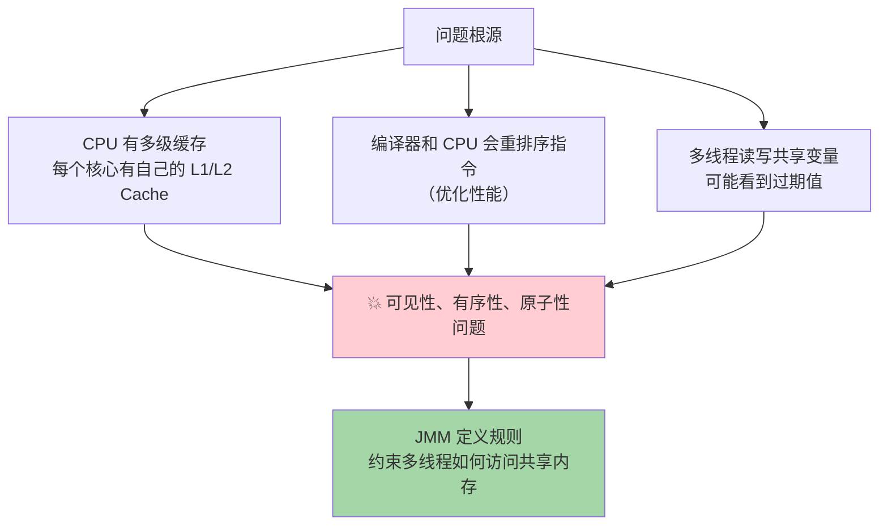
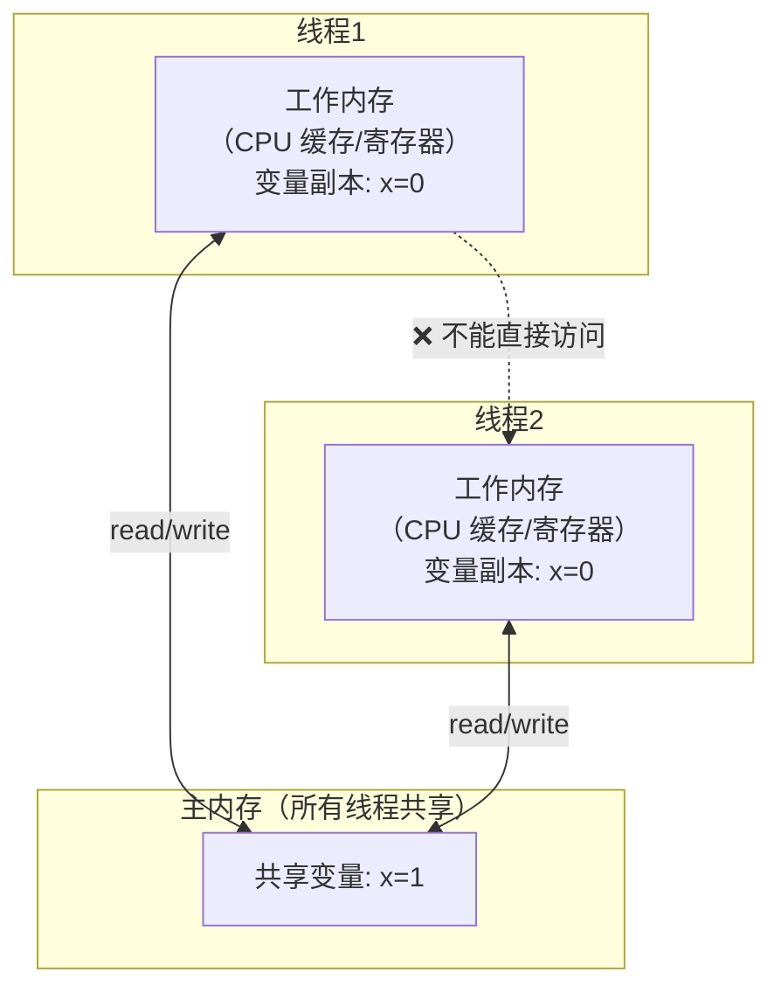
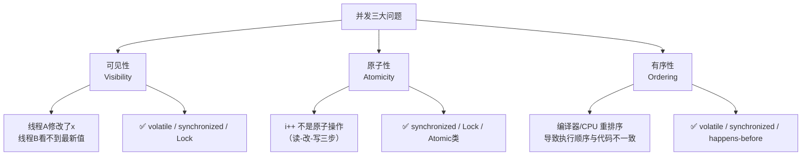
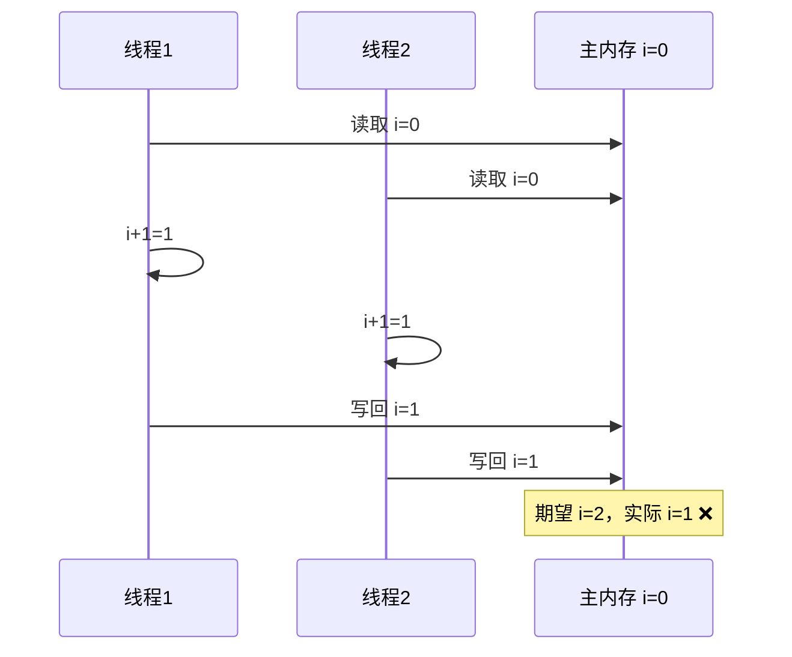
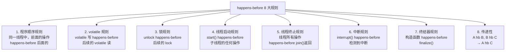
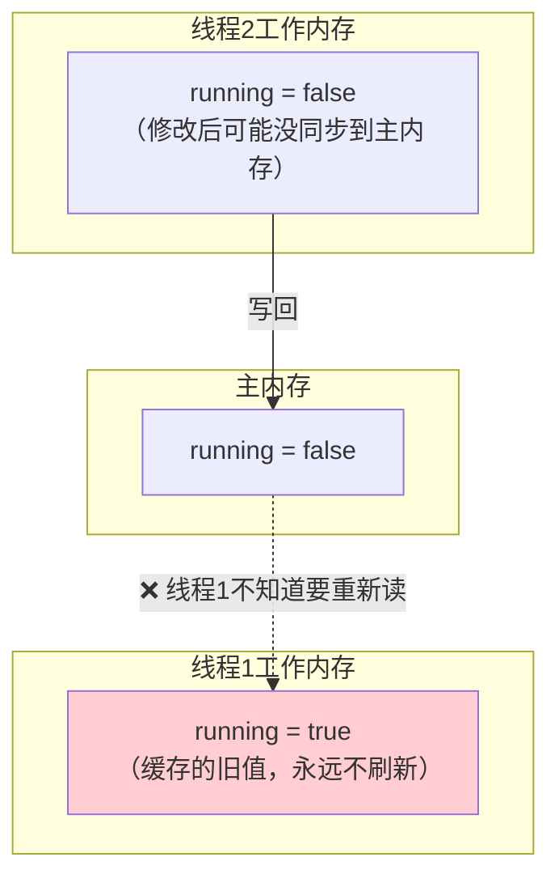
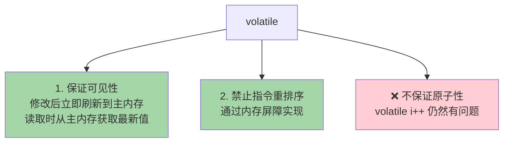
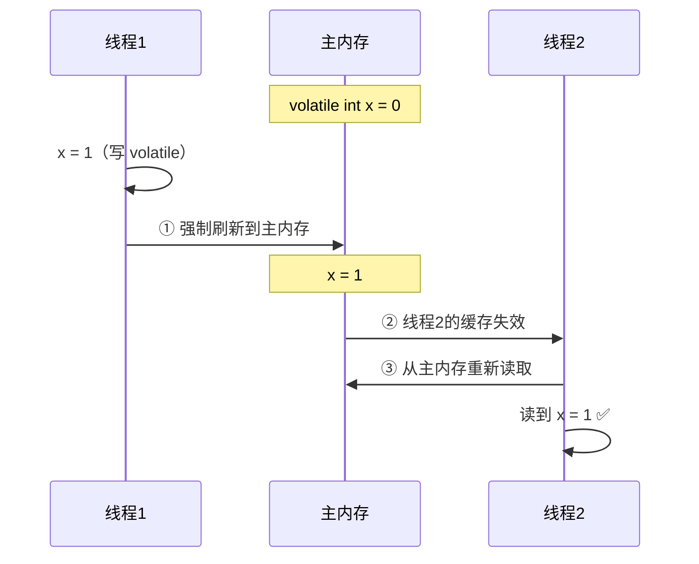
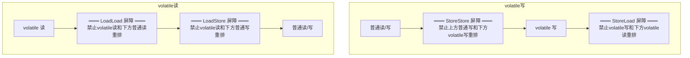
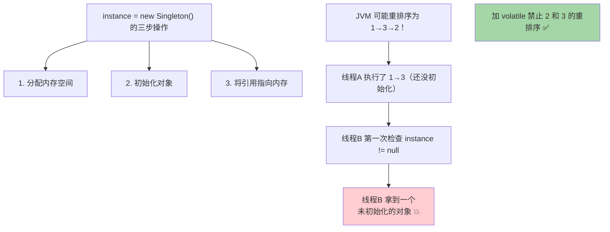

# Java 内存模型与 volatile

JMM 是理解一切并发问题的**基石**，不理解 JMM 就无法理解锁。

## Java 内存模型（JMM）

### 为什么需要 JMM？



### JMM 内存结构



> [!important] 核心规则
> 1. 所有共享变量存在**主内存**中
> 2. 每个线程有自己的**工作内存**（本地缓存）
> 3. 线程对变量的操作必须在工作内存中进行
> 4. 线程之间**不能直接访问**对方的工作内存
> 5. 线程间通信必须通过主内存**传递**

### 并发三大问题



### i++ 为什么不是原子操作？



```
i++ 的字节码（三步操作）:
1. iload    → 从工作内存读取 i 的值
2. iadd     → 加 1
3. istore   → 写回工作内存

三步之间可以被其他线程打断 → 不是原子操作
```

---

## happens-before 规则

JMM 不是说完全禁止重排序，而是通过 **happens-before** 规则约束哪些操作的结果对其他线程可见。

> **如果 A happens-before B，则 A 的操作结果对 B 可见，且 A 在 B 之前执行。**

### 8 大 happens-before 规则



### 可见性问题示例

```java
// 没有 volatile → 可能死循环！
boolean running = true;  // 共享变量

// 线程1
new Thread(() -> {
    while (running) {  // 可能永远读到 true（工作内存的缓存值）
        // do something
    }
}).start();

// 线程2
running = false;  // 线程2修改了，但线程1可能看不到
```



---

## volatile 底层原理

### volatile 的两大作用



### volatile 可见性原理



**底层实现（x86）：**
- volatile 写 → 生成 `lock` 前缀指令
- `lock` 指令做两件事：
  1. 将当前处理器缓存行写回主内存
  2. 使其他 CPU 的缓存行**失效**（MESI 缓存一致性协议）

### 内存屏障（Memory Barrier）

volatile 通过插入**内存屏障**禁止重排序：



### 四种内存屏障

| 屏障类型 | 说明 |
|----------|------|
| **LoadLoad** | Load1; LoadLoad; Load2 → Load1 在 Load2 之前完成 |
| **StoreStore** | Store1; StoreStore; Store2 → Store1 在 Store2 之前刷新到主内存 |
| **LoadStore** | Load1; LoadStore; Store2 → Load1 在 Store2 之前完成 |
| **StoreLoad** | Store1; StoreLoad; Load2 → Store1 刷新到主内存后才能执行 Load2（**最强屏障**） |

### volatile 经典应用：双重检查锁单例

```java
public class Singleton {
    private static volatile Singleton instance;  // 必须 volatile！
    
    public static Singleton getInstance() {
        if (instance == null) {              // 第一次检查（无锁）
            synchronized (Singleton.class) {
                if (instance == null) {      // 第二次检查（有锁）
                    instance = new Singleton(); // 这一行可能被重排序！
                }
            }
        }
        return instance;
    }
}
```

**为什么需要 volatile？**



---

## synchronized vs volatile 对比

| 特性 | synchronized | volatile |
|------|-------------|----------|
| **可见性** | ✅ | ✅ |
| **原子性** | ✅ | ❌ |
| **有序性** | ✅ | ✅ |
| **阻塞** | 会阻塞 | 不阻塞 |
| **使用范围** | 方法/代码块 | 变量 |
| **性能** | 较重 | 较轻 |
| **适用场景** | 复合操作 | 状态标志、DCL 单例 |

---

## 面试高频问题

### Q1：JMM 是什么？

Java 内存模型定义了多线程如何访问共享内存的规则。每个线程有自己的工作内存（缓存），共享变量在主内存中。JMM 通过 happens-before 规则约束可见性和有序性。

### Q2：volatile 能保证什么？不能保证什么？

能保证**可见性**（修改立即对其他线程可见）和**有序性**（禁止重排序）。不能保证**原子性**（volatile i++ 仍然有问题）。

### Q3：volatile 底层怎么实现的？

写操作生成 `lock` 前缀指令，将缓存行写回主内存并使其他 CPU 缓存失效。通过插入**内存屏障**（StoreStore、StoreLoad、LoadLoad、LoadStore）禁止重排序。

### Q4：DCL 单例为什么需要 volatile？

`new Singleton()` 不是原子操作（分配内存→初始化→赋值引用），JVM 可能重排序为分配内存→赋值引用→初始化。其他线程可能拿到未初始化的对象。volatile 禁止这种重排序。
