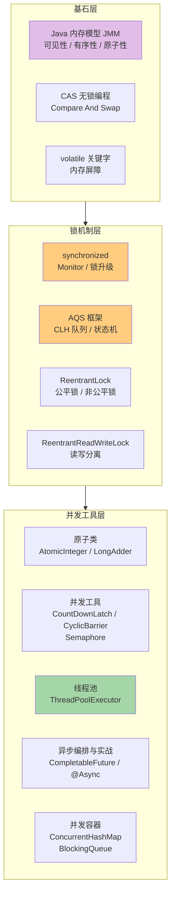

# Java 并发与锁底层原理 - 完整知识体系

> [!tip] 使用指南
> 并发与锁是 Java 面试中**考察频率最高、区分度最大**的模块。本系列笔记用大量图解拆解每一个底层细节，看完可以碾压面试官。

## 全景知识架构

## 模块导航

| 序号 | 模块 | 核心内容 | 面试热度 |
|------|------|----------|----------|
| 1 | [[Java内存模型与volatile]] | JMM 三大特性、happens-before、volatile 底层、内存屏障 | ⭐⭐⭐⭐⭐ |
| 2 | [[synchronized底层原理]] | 对象头、Monitor、偏向锁→轻量级锁→重量级锁升级全流程 | ⭐⭐⭐⭐⭐ |
| 3 | [[CAS与原子类]] | CAS 原理、ABA 问题、AtomicInteger、LongAdder 分段 | ⭐⭐⭐⭐⭐ |
| 4 | [[AQS与ReentrantLock]] | AQS 框架、CLH 队列、公平/非公平锁、Condition | ⭐⭐⭐⭐⭐ |
| 5 | [[并发工具类]] | CountDownLatch、CyclicBarrier、Semaphore、ReadWriteLock | ⭐⭐⭐⭐ |
| 6 | [[线程池原理]] | 7 大参数、4 种拒绝策略、执行流程、线程池大小计算 | ⭐⭐⭐⭐⭐ |
| 7 | [[CompletableFuture 从0基础到精通]] | Future 局限、异步编排、异常处理、超时控制、线程模型 | ⭐⭐⭐⭐⭐ |
| 8 | [[Java异步编程使用用法]] | 线程池、Future、CompletableFuture、@Async、超时降级、实战模板 | ⭐⭐⭐⭐⭐ |
| 9 | [[并发容器原理]] | ConcurrentHashMap（JDK7 vs 8）、BlockingQueue、CopyOnWrite | ⭐⭐⭐⭐⭐ |

## 面试高频 Top 10 问题速查

1. **synchronized 的底层原理？锁升级过程？** → [[synchronized底层原理#锁升级全流程]]
2. **volatile 怎么保证可见性和有序性？** → [[Java内存模型与volatile#volatile 底层原理]]
3. **CAS 是什么？有什么问题？** → [[CAS与原子类#CAS 原理]]
4. **AQS 的原理？ReentrantLock 怎么实现的？** → [[AQS与ReentrantLock#AQS 核心原理]]
5. **synchronized 和 ReentrantLock 的区别？** → [[AQS与ReentrantLock#synchronized vs ReentrantLock]]
6. **线程池的参数？执行流程？** → [[线程池原理#7 大核心参数]]
7. **ConcurrentHashMap 怎么保证线程安全？** → [[并发容器原理#ConcurrentHashMap]]
8. **ThreadLocal 原理？内存泄漏？** → [[并发工具类#ThreadLocal]]
9. **什么是 happens-before？** → [[Java内存模型与volatile#happens-before 规则]]
10. **公平锁和非公平锁的区别？** → [[AQS与ReentrantLock#公平锁 vs 非公平锁]]
11. **Java 异步编程怎么用？有哪些坑？** → [[Java异步编程使用用法]]
