# synchronized 底层原理

synchronized 是 Java 并发面试的**绝对 C 位**，锁升级过程必须烂熟于心。

## synchronized 三种用法

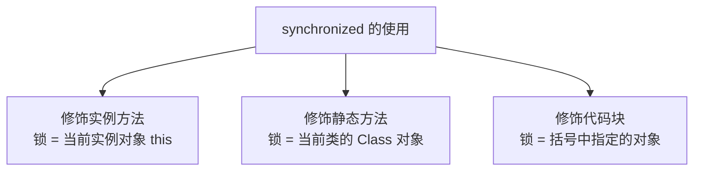

```java
// 1. 修饰实例方法 → 锁 this
public synchronized void method() { }

// 2. 修饰静态方法 → 锁 Class 对象
public static synchronized void method() { }

// 3. 修饰代码块 → 锁指定对象
synchronized (obj) { }
```

---

## 字节码层面

### 同步代码块

```java
synchronized (obj) {
    // 临界区
}
```

```
字节码:
monitorenter      ← 获取锁（monitor 计数器 +1）
  ... 临界区代码 ...
monitorexit        ← 释放锁（monitor 计数器 -1）
monitorexit        ← 异常时也释放（编译器自动添加）
```

### 同步方法

```java
public synchronized void method() { }
```

```
方法的 access_flags 中设置 ACC_SYNCHRONIZED 标志
JVM 在调用方法时自动加锁/解锁
```

---

## Monitor（管程/监视器）

**每一个 Java 对象都可以关联一个 Monitor 对象**（由 C++ 实现的 ObjectMonitor）。

### Monitor 结构

```
ObjectMonitor {
    _header       // Mark Word 备份
    _count        // 重入计数器
    _owner        // 持有锁的线程
    _WaitSet      // wait() 的线程队列
    _EntryList    // 阻塞等待锁的线程队列
    _recursions   // 重入次数
}
```

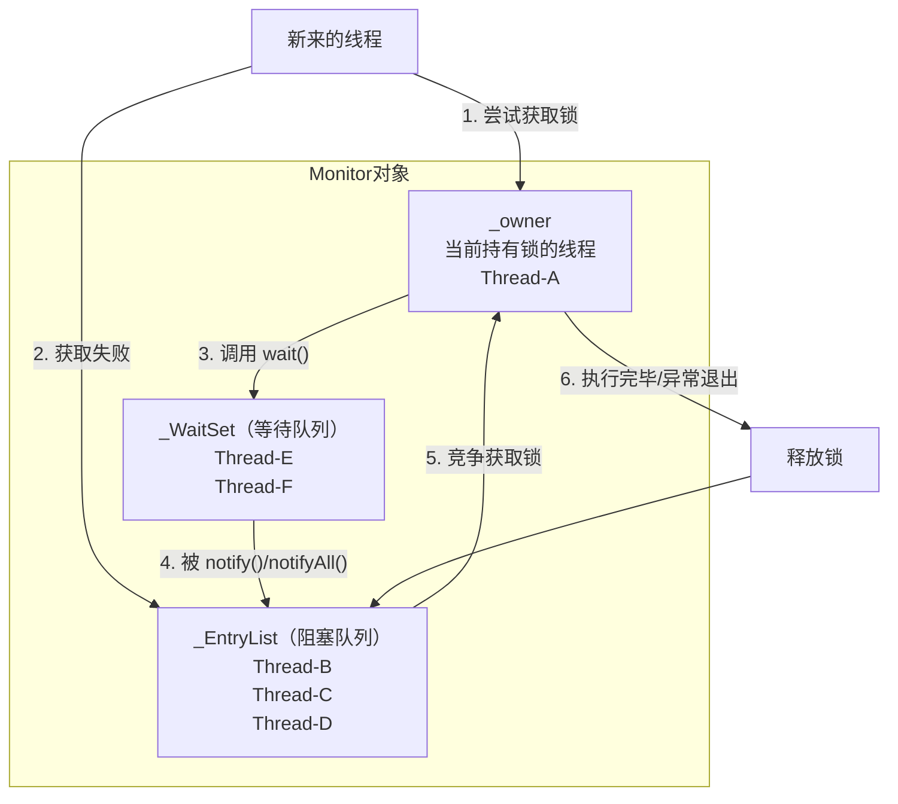

### Monitor 工作流程

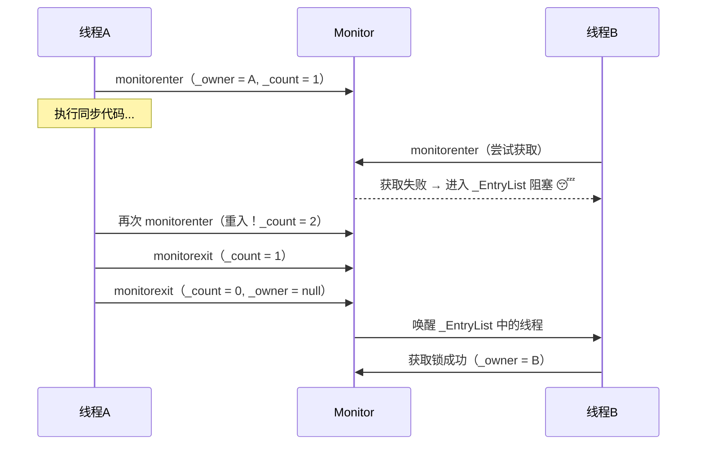

### wait/notify 流程

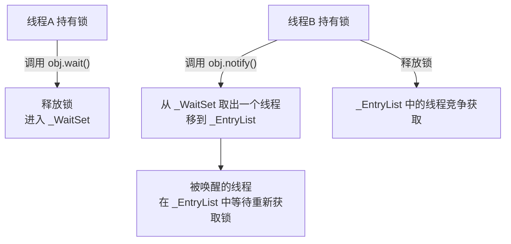

> [!important] wait/notify 必须在 synchronized 块中
> 因为 wait() 需要释放 Monitor 锁，notify() 需要操作 Monitor 的 _WaitSet。没有锁就没有 Monitor → 抛 `IllegalMonitorStateException`。

---

## 对象头与锁状态

synchronized 的锁信息存储在对象头的 **Mark Word** 中（详见 [[JVM对象创建与内存布局#Mark Word 详细结构]]）。

### Mark Word 在不同锁状态下的内容（64位 JVM）

```
┌────────────────────────────────────────────────────────────────┐
│                      Mark Word (64 bits)                        │
├────────────────────────────────┬──────┬────────┬───────────────┤
│           内容                  │ 分代  │ 偏向   │ 锁标志位       │
│                                │ 年龄  │ 锁位   │               │
├────────────────────────────────┼──────┼────────┼───────────────┤
│ 无锁    hashcode(31) unused    │ 4bit │   0    │     01        │
├────────────────────────────────┼──────┼────────┼───────────────┤
│ 偏向锁  threadId(54) epoch(2)  │ 4bit │   1    │     01        │
├────────────────────────────────┼──────┼────────┼───────────────┤
│ 轻量级锁 指向栈中Lock Record指针(62)          │     00        │
├────────────────────────────────┼──────┼────────┼───────────────┤
│ 重量级锁 指向 Monitor 对象的指针(62)           │     10        │
├────────────────────────────────┼──────┼────────┼───────────────┤
│ GC标记   空                                   │     11        │
└────────────────────────────────┴──────┴────────┴───────────────┘
```

---

## 锁升级全流程

这是面试**最高频**的问题，把这张图刻进脑子里：

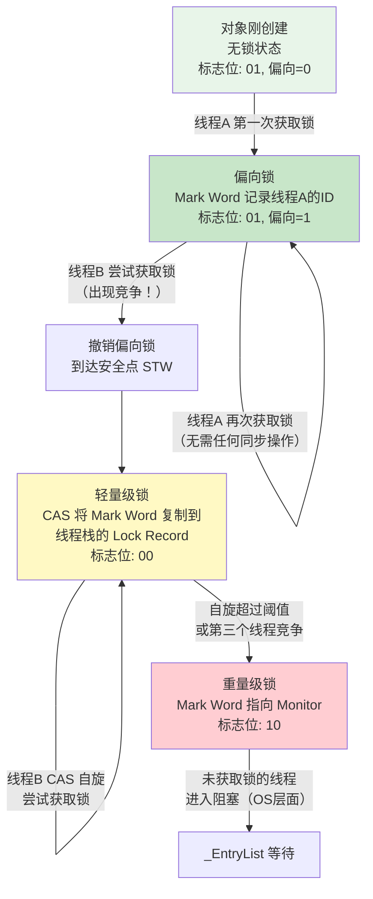

### 完整流程图（超详细版）

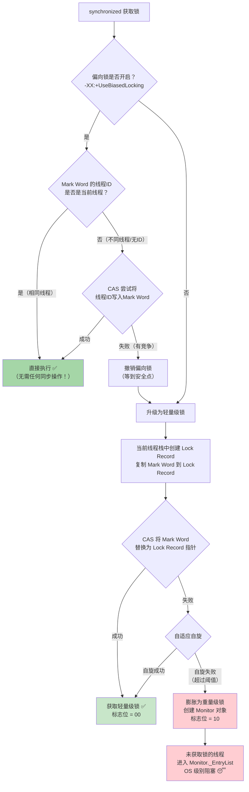

---

## 偏向锁（Biased Locking）

### 核心思想

**大多数情况下，锁不存在多线程竞争，总是同一个线程获取**。偏向锁让这个线程获取锁的成本几乎为零。

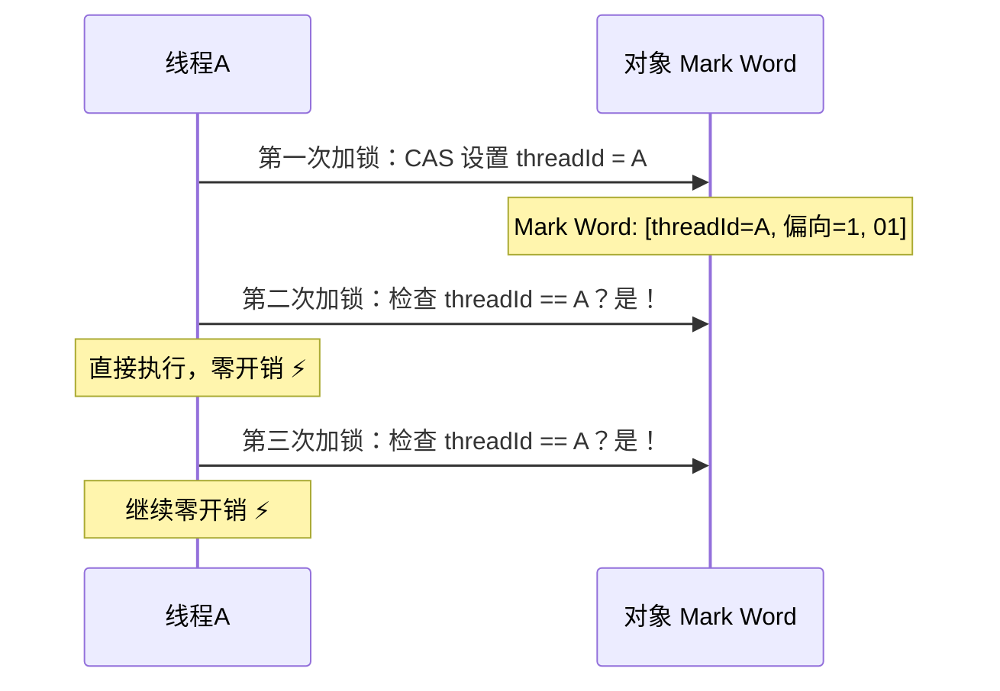

### 偏向锁撤销

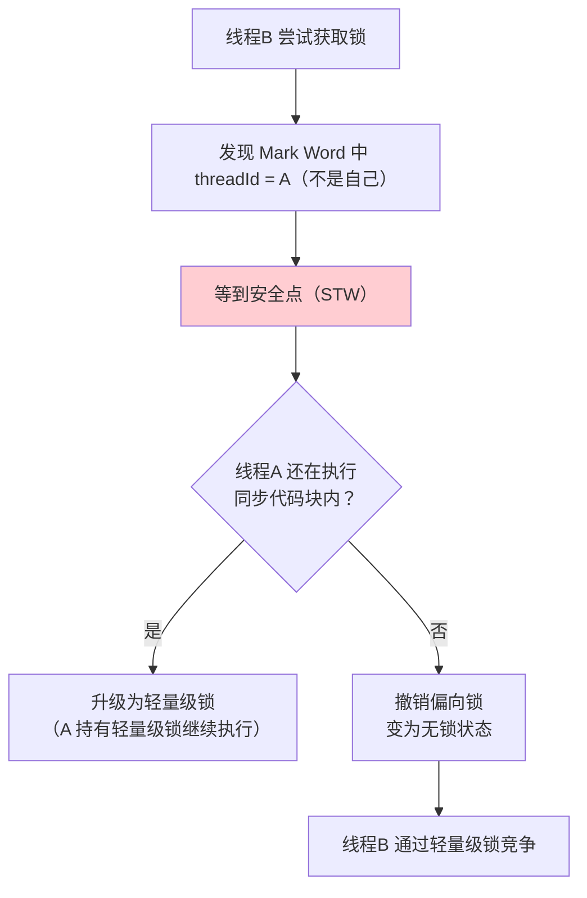

> [!warning] JDK 15 默认禁用偏向锁
> `-XX:+UseBiasedLocking`（JDK 15 之前默认开启）
> JDK 15 开始默认关闭偏向锁（认为现代应用竞争普遍，偏向锁撤销的开销反而更大）。

---

## 轻量级锁（Lightweight Lock）

### 核心思想

在**竞争不激烈**时，通过 CAS + 自旋避免操作系统级别的线程阻塞。

### Lock Record 机制

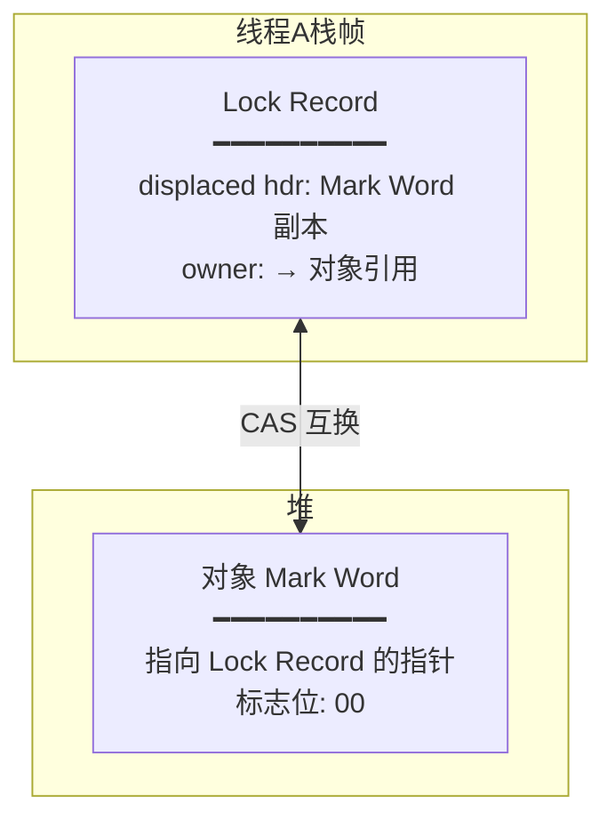

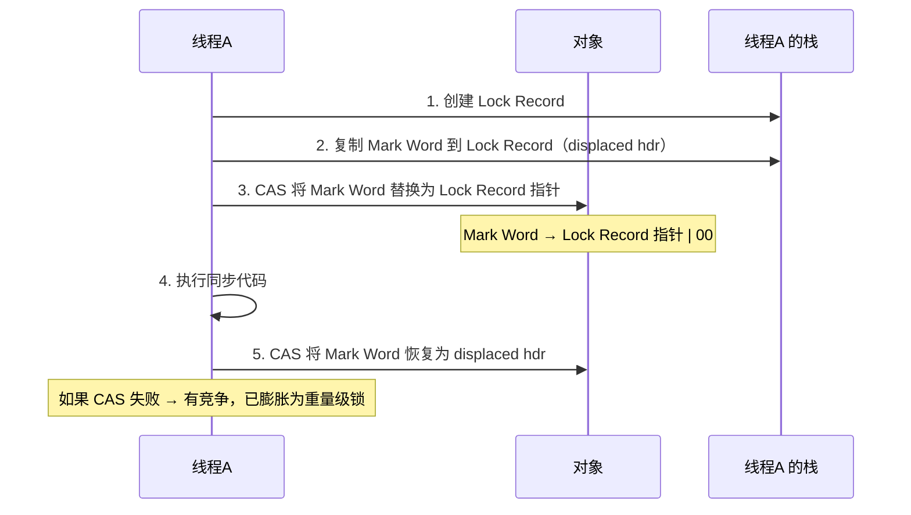

### 自适应自旋（Adaptive Spinning）

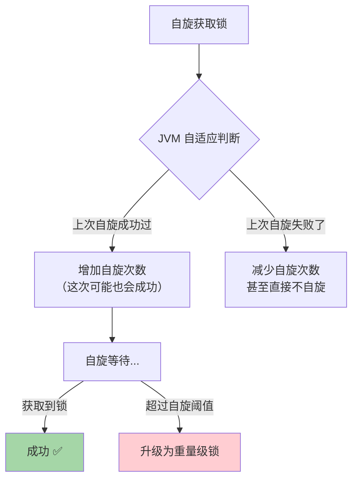

> **自适应自旋**：JVM 根据历史数据动态调整自旋次数。比固定自旋更智能。

---

## 重量级锁（Heavyweight Lock）

### 核心：依赖操作系统 Mutex

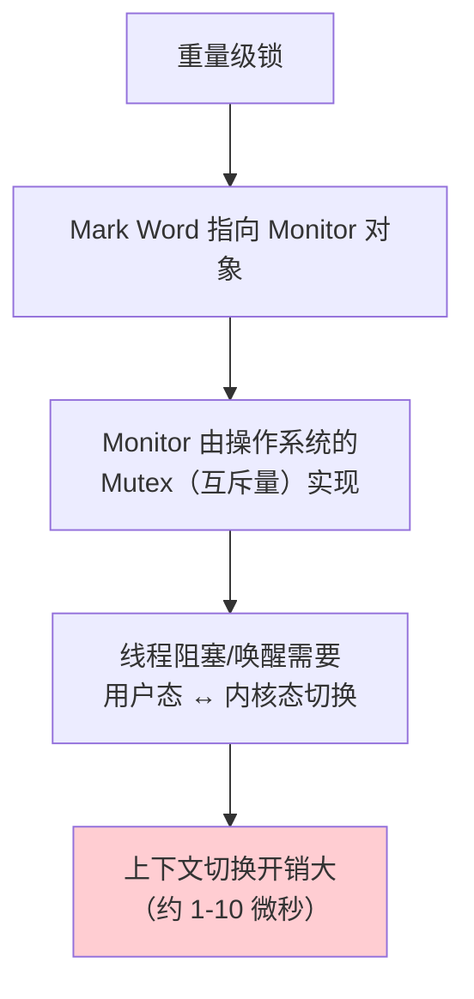

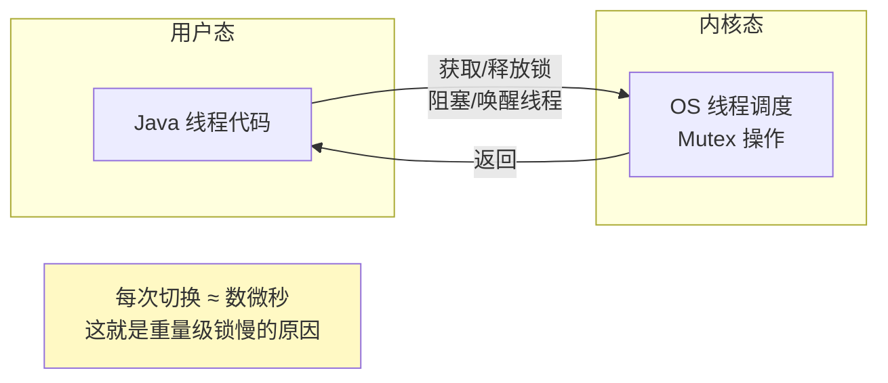

---

## 锁升级对比总结

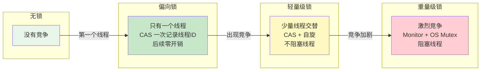

| 锁状态 | 标志位 | 适用场景 | 加锁方式 | 性能 |
|--------|--------|----------|----------|------|
| **无锁** | 01 (偏向=0) | 无竞争 | - | - |
| **偏向锁** | 01 (偏向=1) | 只有一个线程 | CAS 一次 → 后续无操作 | ⚡⚡⚡ |
| **轻量级锁** | 00 | 少量线程交替 | CAS + 自旋 | ⚡⚡ |
| **重量级锁** | 10 | 激烈竞争 | Monitor + OS 阻塞 | ⚡ |

> [!danger] 锁只能升级，不能降级！
> 无锁 → 偏向锁 → 轻量级锁 → 重量级锁，单向不可逆。

---

## 锁优化技术

### JVM 自动优化

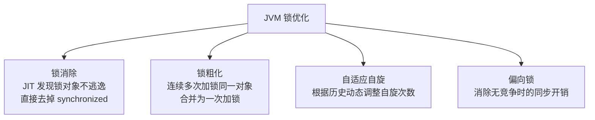

### 锁消除

```java
// JIT 编译时发现 sb 不逃逸，会自动消除 synchronized
public String concat(String s1, String s2) {
    StringBuffer sb = new StringBuffer(); // sb 是局部变量，不逃逸
    sb.append(s1);  // append 方法内部有 synchronized
    sb.append(s2);  // 但 sb 不会被其他线程访问
    return sb.toString();
}
// 优化后等效于没有 synchronized
```

### 锁粗化

```java
// 原始代码
for (int i = 0; i < 100; i++) {
    synchronized (lock) {
        // do something
    }
}

// JVM 优化后
synchronized (lock) {
    for (int i = 0; i < 100; i++) {
        // do something
    }
}
```

---

## 面试高频问题

### Q1：synchronized 的底层原理？

同步代码块通过 `monitorenter/monitorexit` 字节码指令，底层关联对象的 Monitor（ObjectMonitor）。Monitor 有 _EntryList（阻塞队列）和 _WaitSet（等待队列），通过 _owner 记录持有锁的线程。

### Q2：锁升级过程？

无锁 → 偏向锁（记录线程ID，后续零开销）→ 轻量级锁（CAS + 自旋，不阻塞）→ 重量级锁（Monitor + OS Mutex，阻塞线程）。只能升级不能降级。

### Q3：偏向锁有什么用？为什么 JDK 15 默认关闭了？

偏向锁优化只有一个线程反复获取锁的场景（零开销）。JDK 15 关闭是因为现代应用普遍存在竞争，偏向锁撤销（需要 STW）的开销大于其带来的收益。

### Q4：轻量级锁和重量级锁的区别？

轻量级锁通过 CAS + 自旋在用户态完成，不阻塞线程。重量级锁通过操作系统的 Mutex 实现，需要内核态切换，会阻塞线程。竞争不激烈用轻量级锁，竞争激烈用重量级锁。
