# 并发容器原理

ConcurrentHashMap 是面试中**出现频率最高**的并发容器。

## HashMap 的线程安全问题

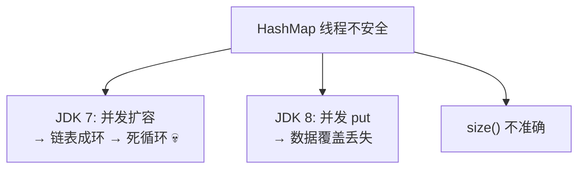

### JDK 7 死循环（头插法）

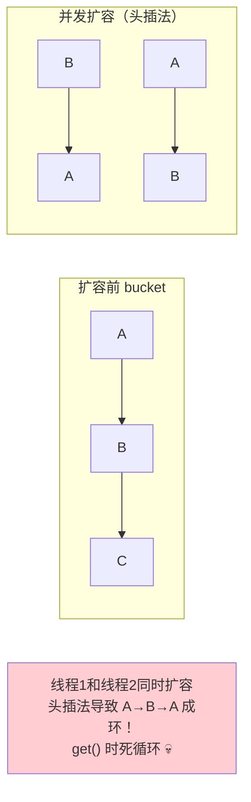

> JDK 8 改为**尾插法**，解决了死循环问题，但并发 put 仍可能数据丢失。

---

## ConcurrentHashMap

### JDK 7 实现：分段锁

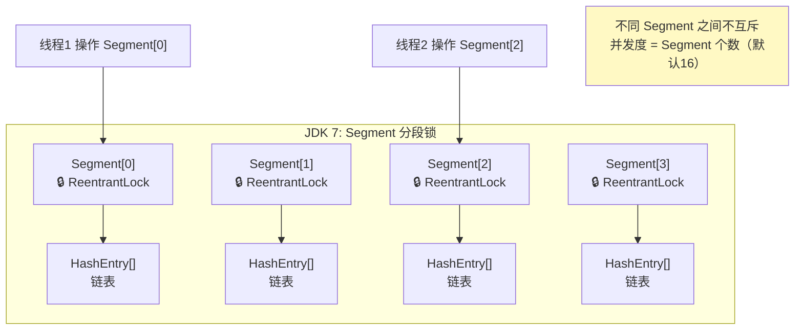

**JDK 7 结构：**
- `Segment[]`（16个段，每个是 ReentrantLock）
- 每个 Segment 包含一个 `HashEntry[]`
- 操作不同 Segment 的线程互不影响
- **并发度 = Segment 个数 = 16**（固定，不可扩容）

### JDK 8 实现：CAS + synchronized（重点！）

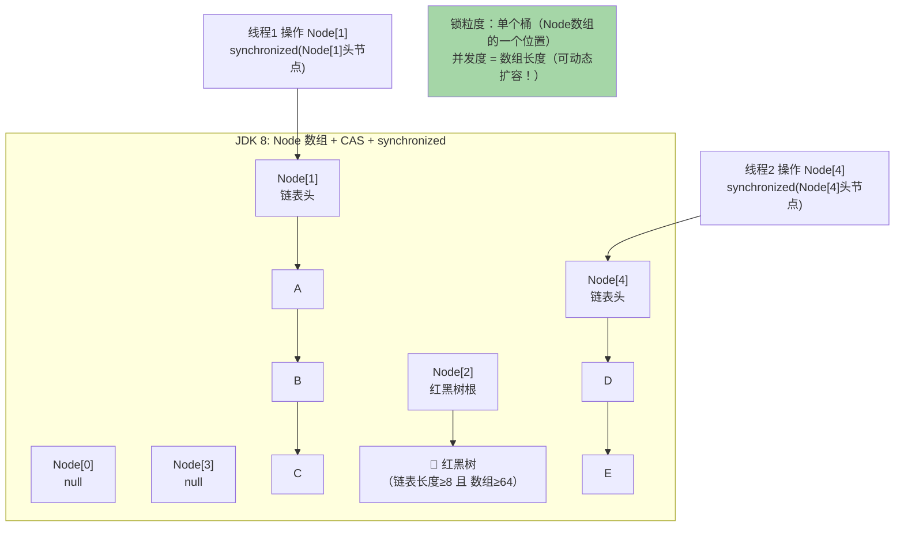

### JDK 8 put 流程

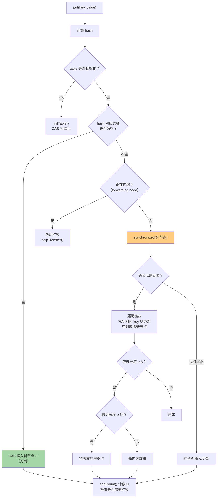

### 关键细节

**为什么 put 时空桶用 CAS，非空桶用 synchronized？**

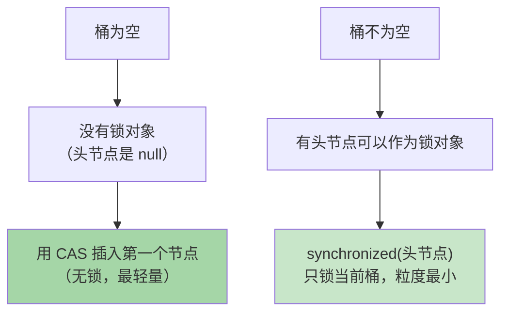

### JDK 8 扩容：多线程协助

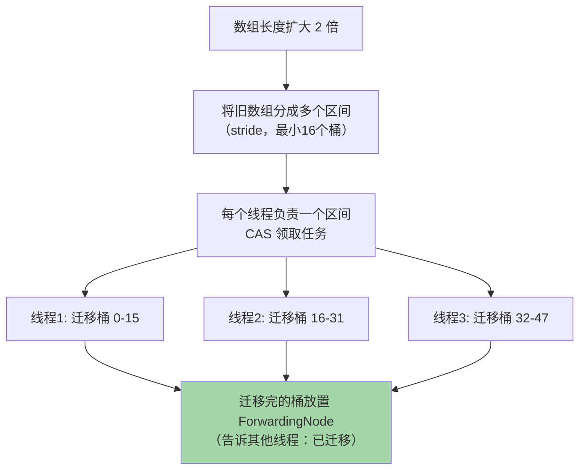

### size() 怎么保证准确？

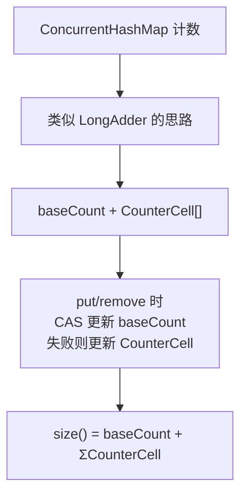

### JDK 7 vs JDK 8 对比

| 对比 | JDK 7 | JDK 8 |
|------|-------|-------|
| **数据结构** | Segment[] + HashEntry[] + 链表 | Node[] + 链表/红黑树 |
| **锁机制** | ReentrantLock（Segment 锁） | **CAS + synchronized（桶锁）** |
| **锁粒度** | Segment（16个段） | **单个桶（数组每个位置）** |
| **并发度** | 固定 16 | **等于数组长度（动态增长）** |
| **查询复杂度** | O(n)（链表） | O(log n)（红黑树） |
| **扩容** | Segment 内单线程 | **多线程协助扩容** |
| **计数** | 分段统计 | baseCount + CounterCell |

---

## BlockingQueue（阻塞队列）

### 阻塞特性

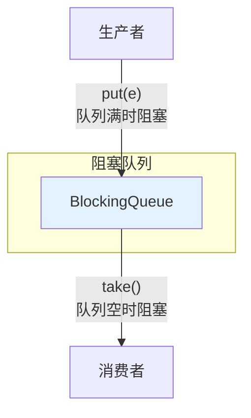

| 操作方式 | 抛异常 | 返回特殊值 | 阻塞 | 超时 |
|----------|--------|-----------|------|------|
| **插入** | add(e) | offer(e) | **put(e)** | offer(e, time) |
| **移除** | remove() | poll() | **take()** | poll(time) |
| **检查** | element() | peek() | - | - |

### 常用实现

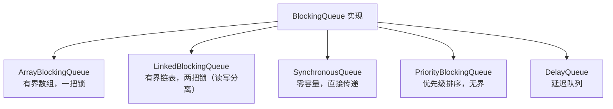

### ArrayBlockingQueue vs LinkedBlockingQueue

| 特性 | ArrayBlockingQueue | LinkedBlockingQueue |
|------|-------------------|---------------------|
| **存储** | 数组（固定大小） | 链表 |
| **有界** | 必须指定容量 | 默认 Integer.MAX_VALUE |
| **锁** | **一把锁**（put/take 互斥） | **两把锁**（putLock + takeLock） |
| **并发** | 低 | **高**（读写分离） |
| **内存** | 预分配 | 动态分配 |

---

## CopyOnWriteArrayList

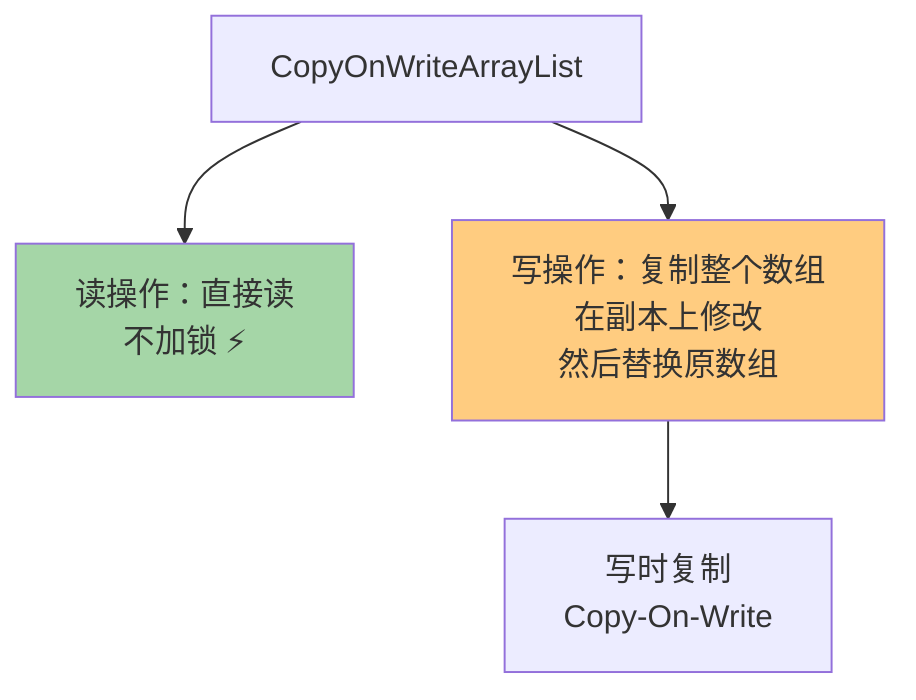

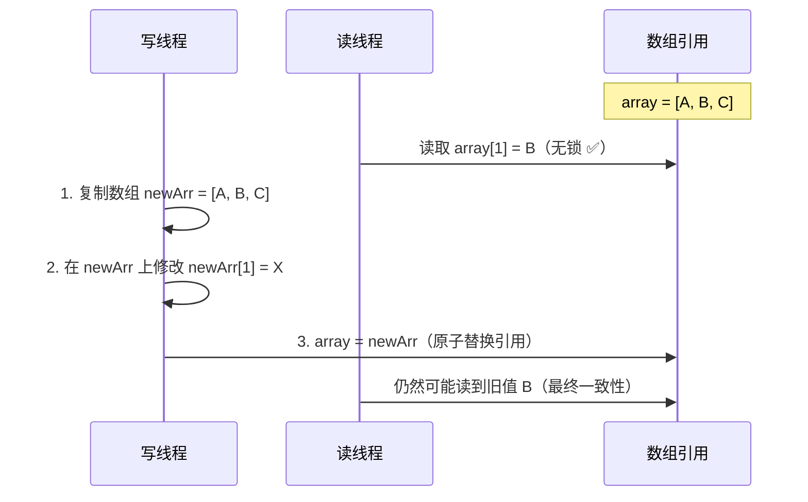

**适用场景：读多写少**（如配置列表、白名单）。
**不适用：写多、数据量大（每次写都复制整个数组）。**

---

## 面试高频问题

### Q1：ConcurrentHashMap JDK 7 和 8 的区别？

JDK 7 用 Segment 分段锁（ReentrantLock），并发度固定 16。JDK 8 改为 CAS + synchronized 锁桶，并发度等于数组长度，还支持链表转红黑树和多线程协助扩容。

### Q2：ConcurrentHashMap 的 put 流程（JDK 8）？

1. hash 计算定位桶
2. 桶为空 → CAS 插入
3. 正在扩容 → 帮助扩容
4. 桶不为空 → synchronized(头节点) 后遍历链表/红黑树插入
5. 链表长度 ≥ 8 且数组 ≥ 64 → 转红黑树

### Q3：ConcurrentHashMap 为什么用 synchronized 而不是 ReentrantLock？

1. JDK 6+ synchronized 经过大量优化（锁升级），性能接近 ReentrantLock
2. synchronized 由 JVM 实现，能被 JIT 进一步优化（锁消除/粗化）
3. 内存占用更小（不需要额外的 AQS Node 对象）

### Q4：ConcurrentHashMap 的 key 和 value 能不能为 null？

**都不能！** 与 HashMap 不同。
原因：多线程环境下无法区分"key 不存在"和"key 的 value 是 null"的情况。`get(key) == null` 到底是没有这个 key 还是 value 就是 null？有二义性。
