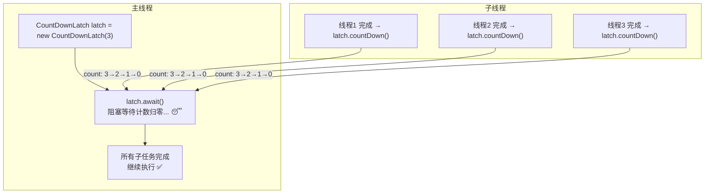
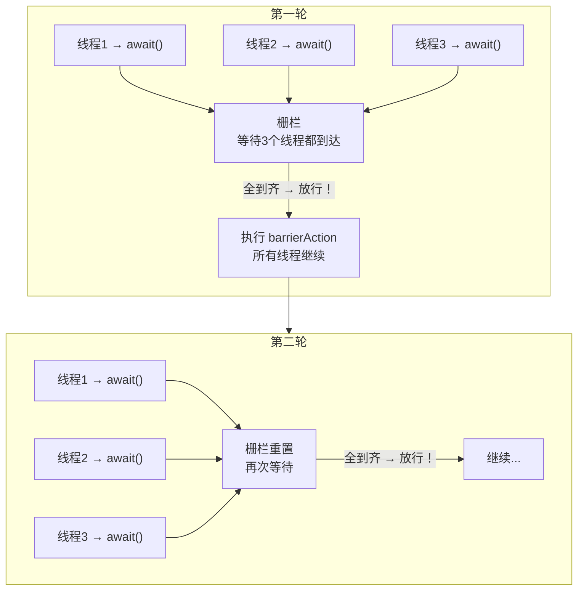
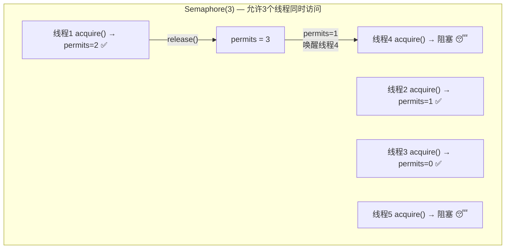
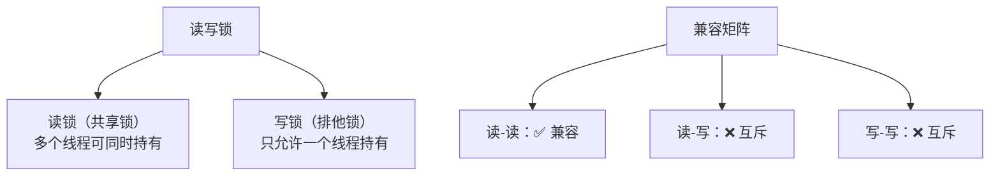
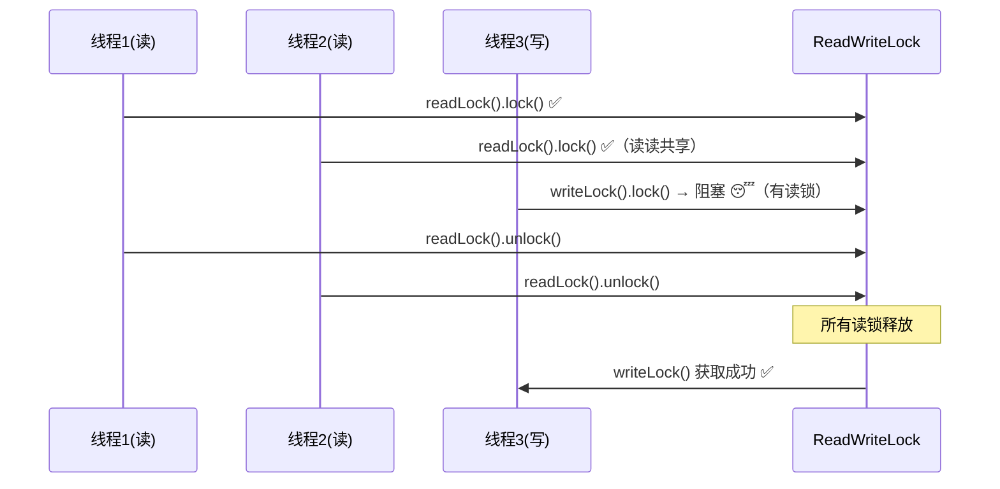
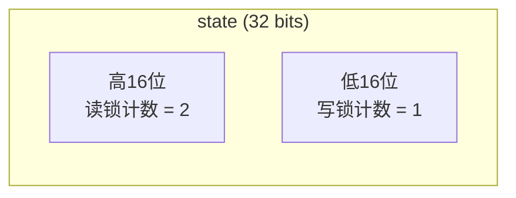
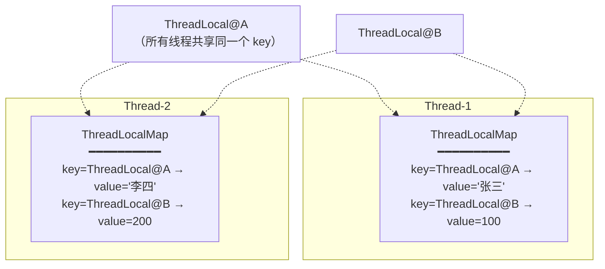
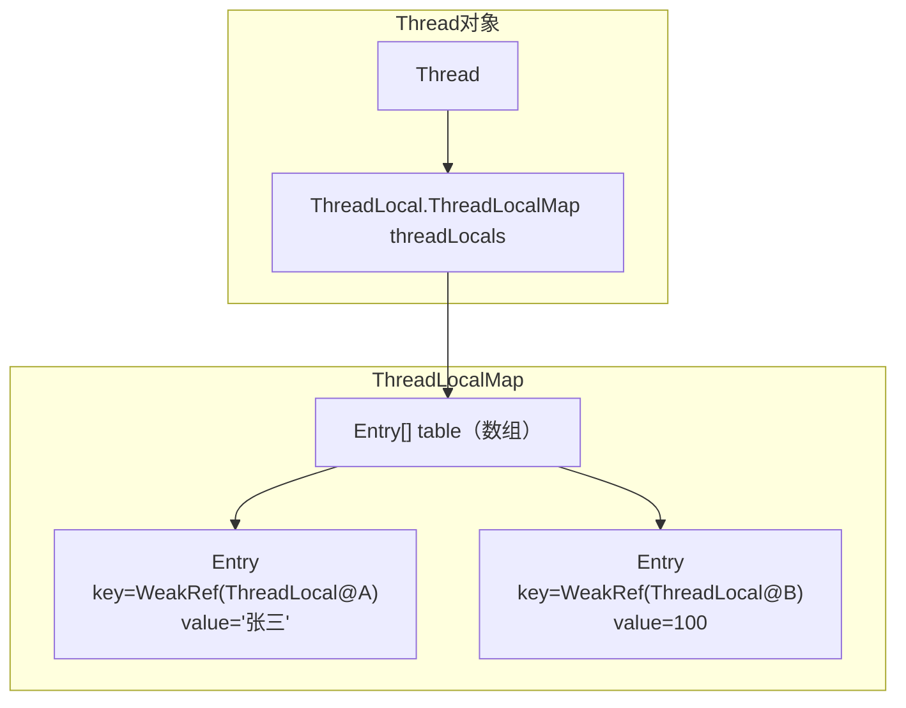
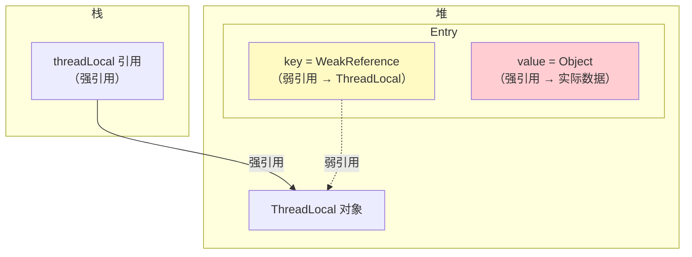
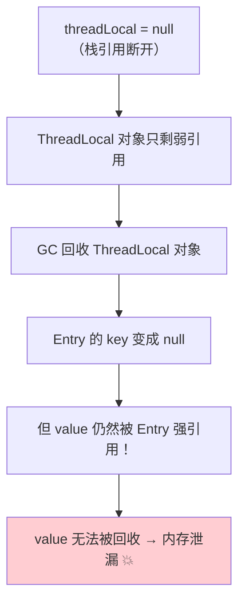

# 并发工具类

## CountDownLatch（倒计时门闩）



- 基于 AQS **共享模式**：state 初始化为 count
- `countDown()`：state - 1
- `await()`：阻塞直到 state == 0
- **一次性的**，计数到 0 后不能重置

### 典型场景

```java
// 等待多个任务全部完成后汇总
CountDownLatch latch = new CountDownLatch(3);

for (int i = 0; i < 3; i++) {
    new Thread(() -> {
        try {
            // 执行任务...
        } finally {
            latch.countDown();
        }
    }).start();
}

latch.await(); // 主线程等待3个任务完成
System.out.println("全部完成，开始汇总");
```

---

## CyclicBarrier（循环栅栏）



### CountDownLatch vs CyclicBarrier

| 特性 | CountDownLatch | CyclicBarrier |
|------|---------------|---------------|
| **计数方向** | 倒数 → 0 | 正数 → N |
| **重用** | ❌ 一次性 | ✅ 可重置循环使用 |
| **等待方** | 一个线程等其他线程 | 多个线程互相等待 |
| **触发动作** | 无 | 可设置 barrierAction |
| **底层** | AQS 共享模式 | ReentrantLock + Condition |

---

## Semaphore（信号量）



- 基于 AQS **共享模式**：state = permits
- `acquire()`：state - 1（为 0 时阻塞）
- `release()`：state + 1（唤醒等待线程）
- **典型场景**：限流、连接池、资源池

```java
// 限制并发数为 3
Semaphore semaphore = new Semaphore(3);

for (int i = 0; i < 10; i++) {
    new Thread(() -> {
        try {
            semaphore.acquire();   // 获取许可
            // 最多3个线程同时执行这里
            Thread.sleep(1000);
        } finally {
            semaphore.release();   // 释放许可
        }
    }).start();
}
```

---

## ReentrantReadWriteLock（读写锁）





### state 的巧妙设计

```
AQS 的 state (32位 int) 被拆分为两部分:

高 16 位: 读锁持有的次数（共享计数）
低 16 位: 写锁重入的次数（独占计数）

state = 0x00020001 表示:
  读锁被 2 个线程持有
  写锁重入 1 次
```



### 锁降级

```java
// 写锁可以降级为读锁（安全的）
writeLock.lock();
try {
    // 写操作...
    readLock.lock();    // 持有写锁时获取读锁 ✅
} finally {
    writeLock.unlock();  // 释放写锁，仍持有读锁
}
// 现在只持有读锁（降级完成）
readLock.unlock();

// ❌ 读锁不能升级为写锁（会死锁！）
```

---

## ThreadLocal

### 原理



**关键：每个 Thread 对象内部有一个 `ThreadLocalMap`，key 是 ThreadLocal 对象本身，value 是线程的本地值。**

### 数据结构



### 内存泄漏问题





> [!danger] 内存泄漏的根本原因
> **key 是弱引用会被 GC 回收，但 value 是强引用不会被回收**。
> key 回收后 Entry 变成 (null → value)，这个 value 再也无法被访问但也无法被回收。
> 线程池中的线程长期存活 → 泄漏的 value 越来越多！

### 解决方案

```java
// ✅ 用完一定要 remove()！
ThreadLocal<String> tl = new ThreadLocal<>();
try {
    tl.set("value");
    // 使用...
} finally {
    tl.remove();  // 必须手动移除！
}
```

> [!important] 面试标准答案
> ThreadLocal 的 key 使用弱引用是为了让 ThreadLocal 对象可以被 GC 回收。但 value 是强引用，key 被回收后 value 仍然存在导致内存泄漏。
> **解决方案：使用完后调用 `remove()`。** 尤其是线程池场景中，线程不会销毁，必须手动清理。

---

## 面试高频问题

### Q1：CountDownLatch 和 CyclicBarrier 的区别？

CountDownLatch 是一个线程等其他线程完成（一次性）；CyclicBarrier 是多个线程互相等待到达同一个点（可重用）。

### Q2：ThreadLocal 原理？为什么会内存泄漏？

每个 Thread 内部有一个 ThreadLocalMap，key 是 ThreadLocal 的弱引用，value 是强引用。ThreadLocal 被 GC 回收后 key 为 null，但 value 无法回收导致泄漏。解决：用完调用 `remove()`。

### Q3：读写锁的 state 怎么同时表示读和写？

将 32 位 int 拆分：高 16 位表示读锁计数，低 16 位表示写锁重入次数。

### Q4：Semaphore 有什么用？

限制并发访问数量。比如数据库连接池限制最多 10 个并发连接，或者接口限流。
