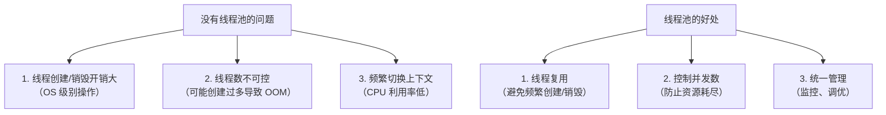
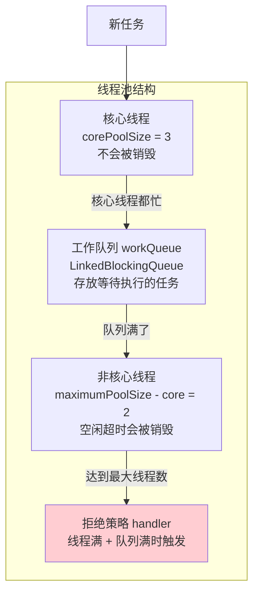
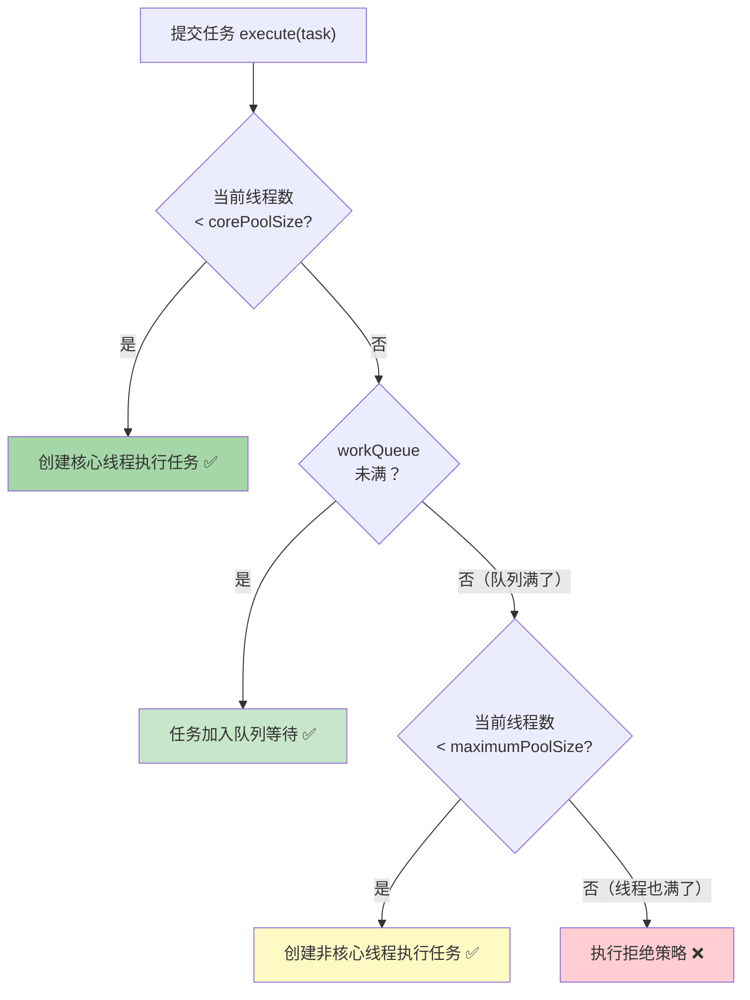
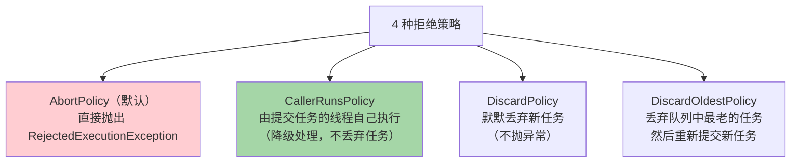
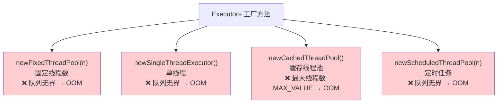
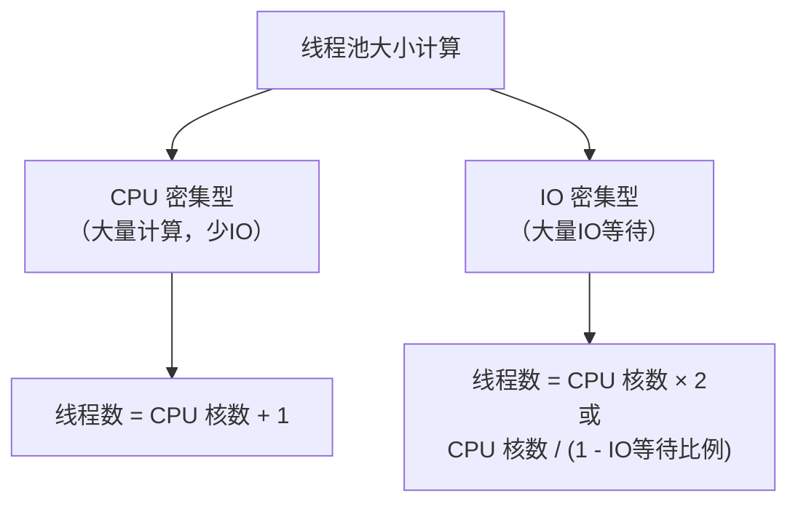
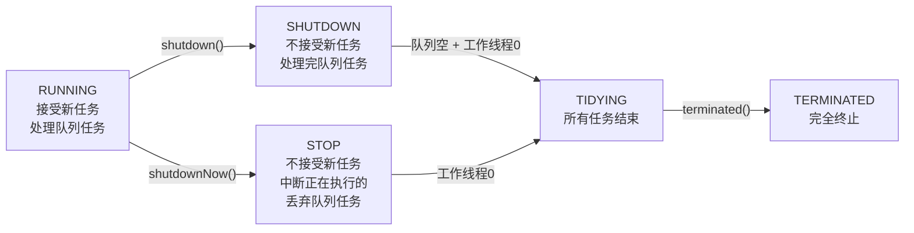

# 线程池原理

线程池是面试**必问题**，7 大参数和执行流程必须烂熟。

## 为什么需要线程池？



---

## 7 大核心参数

```java
public ThreadPoolExecutor(
    int corePoolSize,         // 核心线程数
    int maximumPoolSize,      // 最大线程数
    long keepAliveTime,       // 非核心线程空闲存活时间
    TimeUnit unit,            // 存活时间单位
    BlockingQueue<Runnable> workQueue,  // 工作队列
    ThreadFactory threadFactory,        // 线程工厂
    RejectedExecutionHandler handler    // 拒绝策略
)
```



### 参数详解

| 参数 | 说明 | 面试要点 |
|------|------|----------|
| **corePoolSize** | 核心线程数，不会被回收 | 即使空闲也保持 |
| **maximumPoolSize** | 最大线程数（核心+非核心） | 队列满了才创建非核心线程 |
| **keepAliveTime** | 非核心线程空闲等待时间 | 超时后销毁 |
| **unit** | 时间单位 | TimeUnit.SECONDS 等 |
| **workQueue** | 任务等待队列 | LinkedBlockingQueue / ArrayBlockingQueue / SynchronousQueue |
| **threadFactory** | 线程工厂 | 自定义线程名、优先级 |
| **handler** | 拒绝策略 | 4 种策略 |

---

## 执行流程（核心！）



### 用数字理解执行流程

```
假设: corePoolSize=3, maximumPoolSize=5, workQueue容量=10

提交第 1 个任务 → 创建核心线程1（线程数: 1）
提交第 2 个任务 → 创建核心线程2（线程数: 2）
提交第 3 个任务 → 创建核心线程3（线程数: 3）
提交第 4 个任务 → 进入队列（队列: 1/10）
提交第 5 个任务 → 进入队列（队列: 2/10）
  ...
提交第 13 个任务 → 进入队列（队列: 10/10 满了！）
提交第 14 个任务 → 创建非核心线程4（线程数: 4）
提交第 15 个任务 → 创建非核心线程5（线程数: 5）
提交第 16 个任务 → 线程满+队列满 → 拒绝策略！❌
```

> [!warning] 注意！先队列后线程！
> 不是先创建到最大线程，再入队列。而是**先填满队列，队列满了才创建非核心线程**。这个顺序面试经常考。

---

## 4 种拒绝策略



| 策略 | 行为 | 适用场景 |
|------|------|----------|
| **AbortPolicy** ❌ | 抛异常 | 默认，严格场景 |
| **CallerRunsPolicy** ✅ | 调用者线程执行 | **推荐**，不丢任务，自动降速 |
| **DiscardPolicy** | 静默丢弃 | 允许丢弃的场景 |
| **DiscardOldestPolicy** | 丢弃队列最老的 | 优先处理新任务 |

---

## 常用工作队列

| 队列 | 特点 | 适用场景 |
|------|------|----------|
| **LinkedBlockingQueue** | 无界队列（默认 Integer.MAX_VALUE） | FixedThreadPool、SingleThread |
| **ArrayBlockingQueue** | **有界队列**（必须指定容量） | 自定义线程池（推荐） |
| **SynchronousQueue** | 不存储元素，直接传递 | CachedThreadPool |
| **PriorityBlockingQueue** | 优先级队列 | 需要优先级排序的场景 |
| **DelayQueue** | 延迟队列 | ScheduledThreadPool |

> [!danger] 无界队列的风险
> LinkedBlockingQueue 默认无界（Integer.MAX_VALUE），任务堆积可能导致 **OOM**！
> 生产环境推荐使用 **ArrayBlockingQueue**（有界）。

---

## Executors 预定义线程池（及其问题）



> [!danger] 阿里巴巴开发手册规定
> **禁止使用 Executors 创建线程池！** 必须使用 ThreadPoolExecutor 手动指定参数。
> 原因：Executors 的线程池要么队列无界，要么线程数无界，都可能导致 OOM。

---

## 线程池大小怎么设置？



| 任务类型 | 公式 | 示例（8核） |
|----------|------|-------------|
| **CPU 密集型** | N + 1 | 9 个线程 |
| **IO 密集型** | N × 2 | 16 个线程 |
| **混合型** | N × (1 + W/C) | W=等待时间, C=计算时间 |

> [!tip] 实际建议
> 理论公式只是起点，实际需要**压测调优**。观察 CPU 利用率、线程数、队列积压等指标动态调整。

---

## 线程池生命周期



### 优雅关闭

```java
executor.shutdown();              // 不接受新任务，等待现有任务完成
executor.awaitTermination(60, TimeUnit.SECONDS); // 等待最多60秒
if (!executor.isTerminated()) {
    executor.shutdownNow();       // 强制关闭
}
```

---

## 线程池监控

```java
ThreadPoolExecutor pool = ...;

pool.getPoolSize();          // 当前线程数
pool.getActiveCount();       // 活跃线程数
pool.getCorePoolSize();      // 核心线程数
pool.getMaximumPoolSize();   // 最大线程数
pool.getQueue().size();      // 队列中等待的任务数
pool.getCompletedTaskCount();// 已完成任务数
pool.getTaskCount();         // 总任务数（已完成+执行中+等待）
```

---

## 面试高频问题

### Q1：线程池的 7 大参数？

核心线程数、最大线程数、非核心线程空闲存活时间、时间单位、工作队列、线程工厂、拒绝策略。

### Q2：线程池的执行流程？

核心线程 → 队列 → 非核心线程 → 拒绝策略。注意是**先入队列再创建非核心线程**。

### Q3：为什么不用 Executors？

Executors 创建的线程池要么队列无界（FixedThreadPool、SingleThreadExecutor），要么线程数无界（CachedThreadPool），都可能导致 OOM。应该用 ThreadPoolExecutor 手动指定有界队列和合理的最大线程数。

### Q4：线程池大小怎么设置？

CPU 密集型：N+1；IO 密集型：N×2。实际需要根据业务压测调优。
