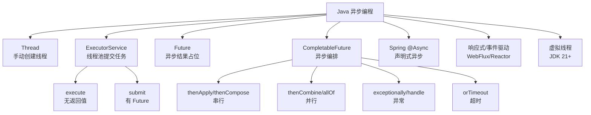

# Java 异步编程使用用法

> [!tip] 使用指南
> 这篇笔记偏“怎么用”和“怎么落地”，重点不是底层源码，而是把异步任务写成可控、可观测、可维护的业务代码。底层原理可以配合 [[CompletableFuture 从0基础到精通]]、[[线程池原理]]、[[Java内存模型与volatile]] 一起看。

## 1. 先理解：什么是异步

同步调用：

```java
Result result = service.query();
doSomething(result);
```

调用方必须等 `service.query()` 返回，后面的逻辑才能继续执行。

异步调用：

```java
CompletableFuture<Result> future =
    CompletableFuture.supplyAsync(() -> service.query(), ioPool);

future.thenAccept(result -> doSomething(result));
```

调用方提交任务后，不一定马上等待结果；结果完成后，可以由回调、编排链路或统一收口逻辑继续处理。

异步的本质不是“代码看起来高级”，而是：

1. 把耗时任务交给其他线程或事件循环执行
2. 当前线程不被无意义地阻塞
3. 多个互不依赖的任务可以并行推进
4. 最终在合适位置收口结果、异常和超时

## 2. 什么时候适合用异步

适合使用异步的场景：

| 场景 | 说明 | 典型例子 |
|---|---|---|
| 并行查询 | 多个任务互不依赖，可以同时执行 | 查询用户、余额、优惠券、订单统计 |
| 慢 IO | 任务主要耗时在网络、磁盘、RPC、DB 等等待 | 调第三方接口、读文件、访问 Redis/MySQL |
| 非核心流程后置 | 主流程成功后，附属动作可以后台做 | 发消息、写操作日志、发送邮件 |
| 超时降级 | 外部依赖慢或不稳定，需要快速返回兜底值 | 商品推荐、风控标签、画像服务 |
| 流水线处理 | 一个阶段完成后触发下一个阶段 | 下载文件 -> 解析 -> 入库 -> 通知 |

不适合滥用异步的场景：

| 场景 | 原因 |
|---|---|
| 单个很快的本地计算 | 创建和调度任务的开销可能大于收益 |
| 强事务一致性流程 | 异步任务通常不在原事务里，容易产生一致性问题 |
| CPU 已经打满 | 再开更多异步任务只会增加线程切换 |
| 没有超时、限流、监控 | 异步会把故障从显性阻塞变成后台堆积 |
| 调用方马上 `get()` 等待 | 只是把同步阻塞换了个写法 |

> [!warning]
> 异步不是性能银弹。异步真正提升的是“等待型任务”的整体吞吐和接口耗时，不会凭空减少任务本身的工作量。

## 3. Java 异步方案全景



实际业务中最常用的是：

1. `ThreadPoolExecutor`：控制异步任务执行资源
2. `CompletableFuture`：组织任务依赖、并行汇聚、异常和超时
3. Spring `@Async`：简单后台任务或事件通知

## 4. 异步的基础：线程池

异步任务最终必须由线程执行。业务代码不要直接 `new Thread()`，也不要随手使用 `Executors.newFixedThreadPool()`；推荐显式创建有界线程池。

### 4.1 推荐线程池模板

```java
import java.util.concurrent.ArrayBlockingQueue;
import java.util.concurrent.ThreadFactory;
import java.util.concurrent.ThreadPoolExecutor;
import java.util.concurrent.TimeUnit;
import java.util.concurrent.atomic.AtomicInteger;

public class AsyncExecutors {

    public static final ThreadPoolExecutor IO_POOL = new ThreadPoolExecutor(
        16,
        32,
        60,
        TimeUnit.SECONDS,
        new ArrayBlockingQueue<>(1000),
        namedThreadFactory("biz-io-"),
        new ThreadPoolExecutor.CallerRunsPolicy()
    );

    private static ThreadFactory namedThreadFactory(String prefix) {
        AtomicInteger index = new AtomicInteger(1);
        return runnable -> {
            Thread thread = new Thread(runnable);
            thread.setName(prefix + index.getAndIncrement());
            thread.setDaemon(false);
            thread.setUncaughtExceptionHandler((t, e) ->
                System.err.println("Uncaught async error, thread=" + t.getName() + ", error=" + e.getMessage())
            );
            return thread;
        };
    }
}
```

关键点：

- 队列必须有界，避免任务无限堆积导致 OOM
- 线程名必须可识别，方便排查日志和线程栈
- 拒绝策略要明确，不能让任务悄悄丢失
- IO 密集型线程数可以稍大，CPU 密集型线程数接近 CPU 核数
- 线程池要按业务隔离，避免慢任务拖垮所有异步任务

### 4.2 CPU 密集型和 IO 密集型线程池

CPU 密集型任务：

```java
int cpu = Runtime.getRuntime().availableProcessors();

ThreadPoolExecutor cpuPool = new ThreadPoolExecutor(
    cpu,
    cpu,
    0,
    TimeUnit.MILLISECONDS,
    new ArrayBlockingQueue<>(200),
    namedThreadFactory("cpu-task-"),
    new ThreadPoolExecutor.CallerRunsPolicy()
);
```

IO 密集型任务：

```java
int cpu = Runtime.getRuntime().availableProcessors();

ThreadPoolExecutor ioPool = new ThreadPoolExecutor(
    cpu * 2,
    cpu * 4,
    60,
    TimeUnit.SECONDS,
    new ArrayBlockingQueue<>(1000),
    namedThreadFactory("io-task-"),
    new ThreadPoolExecutor.CallerRunsPolicy()
);
```

估算公式：

```text
线程数 = CPU 核数 * CPU 利用率目标 * (1 + 等待时间 / 计算时间)
```

面试和实战都要强调：公式只是起点，最终要靠压测、监控、队列长度、拒绝次数、接口耗时来调。

## 5. `ExecutorService` + `Future` 基础用法

`Future` 是最早的异步结果模型：提交任务后拿到一个“未来结果”。

### 5.1 无返回值任务：`execute`

```java
ExecutorService pool = AsyncExecutors.IO_POOL;

pool.execute(() -> {
    sendEmail(userId);
});
```

特点：

- 适合不关心返回值的后台任务
- 任务异常不会通过返回值暴露
- 异常要在任务内部捕获并记录

```java
pool.execute(() -> {
    try {
        sendEmail(userId);
    } catch (Exception e) {
        log.error("send email failed, userId={}", userId, e);
    }
});
```

### 5.2 有返回值任务：`submit`

```java
Future<User> future = pool.submit(() -> userService.queryById(userId));

User user = future.get(800, TimeUnit.MILLISECONDS);
```

`submit` 适合简单异步结果，但缺点明显：

- `get()` 会阻塞
- 多个 `Future` 不好组合
- 异常处理不够优雅
- 超时和降级要手写很多样板代码

### 5.3 `Future` 超时模板

```java
try {
    Future<User> future = pool.submit(() -> userService.queryById(userId));
    return future.get(800, TimeUnit.MILLISECONDS);
} catch (TimeoutException e) {
    log.warn("query user timeout, userId={}", userId);
    return User.defaultUser(userId);
} catch (Exception e) {
    log.error("query user failed, userId={}", userId, e);
    return User.defaultUser(userId);
}
```

这个写法能用，但一旦任务变多，代码会很笨重，所以业务编排更推荐 `CompletableFuture`。

## 6. `CompletableFuture` 核心用法

### 6.1 创建异步任务

无返回值：

```java
CompletableFuture<Void> future =
    CompletableFuture.runAsync(() -> sendEmail(userId), AsyncExecutors.IO_POOL);
```

有返回值：

```java
CompletableFuture<User> future =
    CompletableFuture.supplyAsync(() -> userService.queryById(userId), AsyncExecutors.IO_POOL);
```

区别：

| API | 返回值 | 使用场景 |
|---|---|---|
| `runAsync` | `CompletableFuture<Void>` | 发送消息、写日志、清理缓存 |
| `supplyAsync` | `CompletableFuture<T>` | 查询数据、计算结果、调用远程接口 |

> [!warning]
> 不指定线程池时，`CompletableFuture` 默认通常使用 `ForkJoinPool.commonPool()`。业务代码里建议显式传入自定义线程池，尤其是阻塞 IO 任务。

### 6.2 串行转换：`thenApply`

前一个任务返回 `T`，下一个步骤把它转换成 `U`。

```java
CompletableFuture<UserVO> future =
    CompletableFuture
        .supplyAsync(() -> userService.queryById(userId), AsyncExecutors.IO_POOL)
        .thenApply(user -> {
            UserVO vo = new UserVO();
            vo.setId(user.getId());
            vo.setName(user.getName());
            return vo;
        });
```

适合：

- DTO 转换
- 字段加工
- 本地轻量计算

### 6.3 串行消费：`thenAccept`

只消费上一步结果，不返回新值。

```java
CompletableFuture<Void> future =
    CompletableFuture
        .supplyAsync(() -> orderService.query(orderId), AsyncExecutors.IO_POOL)
        .thenAccept(order -> log.info("order loaded, orderId={}", order.getId()));
```

### 6.4 串行异步依赖：`thenCompose`

如果第二步本身也返回 `CompletableFuture`，用 `thenCompose` 拉平嵌套。

错误写法：

```java
CompletableFuture<CompletableFuture<OrderDetail>> nested =
    queryOrder(orderId).thenApply(order -> queryOrderDetail(order.getId()));
```

正确写法：

```java
CompletableFuture<OrderDetail> future =
    queryOrder(orderId).thenCompose(order -> queryOrderDetail(order.getId()));
```

完整示例：

```java
private CompletableFuture<Order> queryOrder(Long orderId) {
    return CompletableFuture.supplyAsync(
        () -> orderService.query(orderId),
        AsyncExecutors.IO_POOL
    );
}

private CompletableFuture<OrderDetail> queryOrderDetail(Long orderId) {
    return CompletableFuture.supplyAsync(
        () -> orderDetailService.queryByOrderId(orderId),
        AsyncExecutors.IO_POOL
    );
}

public CompletableFuture<OrderDetail> queryDetail(Long orderId) {
    return queryOrder(orderId)
        .thenCompose(order -> queryOrderDetail(order.getId()));
}
```

记忆：

- `thenApply`：`T -> U`
- `thenCompose`：`T -> CompletableFuture<U>`

### 6.5 两个任务合并：`thenCombine`

两个任务并行执行，两个都完成后合并结果。

```java
CompletableFuture<User> userFuture =
    CompletableFuture.supplyAsync(() -> userService.queryById(userId), AsyncExecutors.IO_POOL);

CompletableFuture<Account> accountFuture =
    CompletableFuture.supplyAsync(() -> accountService.queryByUserId(userId), AsyncExecutors.IO_POOL);

CompletableFuture<UserAccountVO> resultFuture =
    userFuture.thenCombine(accountFuture, (user, account) -> {
        UserAccountVO vo = new UserAccountVO();
        vo.setUserId(user.getId());
        vo.setUserName(user.getName());
        vo.setBalance(account.getBalance());
        return vo;
    });

UserAccountVO vo = resultFuture.join();
```

适合：

- 两个接口并行查
- 两个计算结果合并
- 用户信息 + 账户信息 + 权益信息这类聚合接口

### 6.6 多任务汇聚：`allOf`

`allOf` 等所有任务完成，但返回 `CompletableFuture<Void>`，结果要从原来的 future 里取。

```java
CompletableFuture<User> userFuture =
    CompletableFuture.supplyAsync(() -> userService.queryById(userId), AsyncExecutors.IO_POOL);

CompletableFuture<List<Order>> ordersFuture =
    CompletableFuture.supplyAsync(() -> orderService.queryRecent(userId), AsyncExecutors.IO_POOL);

CompletableFuture<List<Coupon>> couponsFuture =
    CompletableFuture.supplyAsync(() -> couponService.queryAvailable(userId), AsyncExecutors.IO_POOL);

CompletableFuture<UserCenterVO> resultFuture =
    CompletableFuture.allOf(userFuture, ordersFuture, couponsFuture)
        .thenApply(ignored -> {
            UserCenterVO vo = new UserCenterVO();
            vo.setUser(userFuture.join());
            vo.setOrders(ordersFuture.join());
            vo.setCoupons(couponsFuture.join());
            return vo;
        });

UserCenterVO vo = resultFuture.join();
```

为什么 `thenApply` 里可以 `join()`：

- `allOf` 已经保证所有 future 完成
- 此时 `join()` 通常不会再阻塞等待
- 如果某个任务异常，`join()` 会抛出 `CompletionException`

### 6.7 多任务列表汇聚模板

实际业务里经常根据 ID 列表并发查询。

```java
public List<Product> queryProducts(List<Long> productIds) {
    List<CompletableFuture<Product>> futures = productIds.stream()
        .map(productId -> CompletableFuture.supplyAsync(
            () -> productService.queryById(productId),
            AsyncExecutors.IO_POOL
        ))
        .toList();

    CompletableFuture<Void> allDone =
        CompletableFuture.allOf(futures.toArray(new CompletableFuture[0]));

    return allDone.thenApply(ignored -> futures.stream()
            .map(CompletableFuture::join)
            .toList())
        .join();
}
```

> [!warning]
> 不要对几万个 ID 直接创建几万个异步任务。要分批、限流或使用有界并发，否则线程池队列会被打爆。

### 6.8 任意一个完成：`anyOf`

适合“多个渠道谁先返回用谁”的场景。

```java
CompletableFuture<Object> fastest =
    CompletableFuture.anyOf(
        CompletableFuture.supplyAsync(() -> queryFromCache(userId), AsyncExecutors.IO_POOL),
        CompletableFuture.supplyAsync(() -> queryFromRemoteA(userId), AsyncExecutors.IO_POOL),
        CompletableFuture.supplyAsync(() -> queryFromRemoteB(userId), AsyncExecutors.IO_POOL)
    );

Object result = fastest.join();
```

注意：

- `anyOf` 返回 `CompletableFuture<Object>`
- 其他未完成任务不会自动停止
- 如果需要取消其他任务，要额外保存 future 并调用 `cancel`

## 7. 异常处理

异步代码最容易出问题的地方就是异常没有收口。

### 7.1 `exceptionally`：异常兜底

```java
CompletableFuture<User> future =
    CompletableFuture
        .supplyAsync(() -> userService.queryById(userId), AsyncExecutors.IO_POOL)
        .exceptionally(ex -> {
            log.error("query user failed, userId={}", userId, ex);
            return User.defaultUser(userId);
        });
```

特点：

- 只有异常时执行
- 可以返回兜底值
- 返回类型必须和正常结果一致

### 7.2 `handle`：正常和异常都处理

```java
CompletableFuture<User> future =
    CompletableFuture
        .supplyAsync(() -> userService.queryById(userId), AsyncExecutors.IO_POOL)
        .handle((user, ex) -> {
            if (ex != null) {
                log.error("query user failed, userId={}", userId, ex);
                return User.defaultUser(userId);
            }
            return user;
        });
```

适合：

- 统一把异常转换成默认值
- 正常结果也要加工
- 希望链路继续往后走

### 7.3 `whenComplete`：记录日志，不改变结果

```java
CompletableFuture<User> future =
    CompletableFuture
        .supplyAsync(() -> userService.queryById(userId), AsyncExecutors.IO_POOL)
        .whenComplete((user, ex) -> {
            if (ex != null) {
                log.error("query user failed, userId={}", userId, ex);
            } else {
                log.info("query user success, userId={}", user.getId());
            }
        });
```

特点：

- 正常和异常都会执行
- 主要用于日志、监控、埋点
- 不负责吞异常，异常仍会继续向后传播

### 7.4 异常处理对比

| API | 是否拿到正常结果 | 是否拿到异常 | 是否能返回新结果 | 常用场景 |
|---|---:|---:|---:|---|
| `exceptionally` | 否 | 是 | 是 | 异常兜底 |
| `handle` | 是 | 是 | 是 | 统一转换 |
| `whenComplete` | 是 | 是 | 否 | 日志监控 |

推荐模板：

```java
CompletableFuture<Result> future =
    CompletableFuture
        .supplyAsync(() -> remoteService.query(request), AsyncExecutors.IO_POOL)
        .orTimeout(800, TimeUnit.MILLISECONDS)
        .whenComplete((result, ex) -> {
            if (ex != null) {
                log.warn("remote query failed, request={}", request, ex);
            }
        })
        .exceptionally(ex -> Result.fallback());
```

## 8. 超时控制

异步任务如果没有超时，故障时会持续占用线程和队列。

### 8.1 `orTimeout`

超时后让 future 以异常完成。

```java
CompletableFuture<User> future =
    CompletableFuture
        .supplyAsync(() -> userService.queryById(userId), AsyncExecutors.IO_POOL)
        .orTimeout(500, TimeUnit.MILLISECONDS);
```

通常配合 `exceptionally` 使用：

```java
CompletableFuture<User> future =
    CompletableFuture
        .supplyAsync(() -> userService.queryById(userId), AsyncExecutors.IO_POOL)
        .orTimeout(500, TimeUnit.MILLISECONDS)
        .exceptionally(ex -> {
            log.warn("query user timeout or failed, userId={}", userId, ex);
            return User.defaultUser(userId);
        });
```

### 8.2 `completeOnTimeout`

超时后直接返回默认值。

```java
CompletableFuture<User> future =
    CompletableFuture
        .supplyAsync(() -> userService.queryById(userId), AsyncExecutors.IO_POOL)
        .completeOnTimeout(User.defaultUser(userId), 500, TimeUnit.MILLISECONDS);
```

区别：

| API | 超时结果 | 适合场景 |
|---|---|---|
| `orTimeout` | 抛异常 | 需要记录异常、统一降级 |
| `completeOnTimeout` | 返回默认值 | 明确可以直接兜底 |

> [!warning]
> `orTimeout` 和 `completeOnTimeout` 改变的是 `CompletableFuture` 的完成状态，不等于强制杀掉底层正在执行的线程。真正的底层调用也要设置 HTTP、RPC、DB 的客户端超时时间。

## 9. 取消任务

```java
CompletableFuture<User> future =
    CompletableFuture.supplyAsync(() -> userService.queryById(userId), AsyncExecutors.IO_POOL);

boolean cancelled = future.cancel(true);
```

注意：

- `cancel(true)` 不一定能中断正在执行的任务
- 任务代码要响应中断才可能及时退出
- 很多阻塞 IO 是否能被中断，取决于底层客户端实现
- 不要把取消当成可靠的资源回收手段，超时和限流更重要

任务内部响应中断：

```java
CompletableFuture<Void> future =
    CompletableFuture.runAsync(() -> {
        while (!Thread.currentThread().isInterrupted()) {
            doOneBatch();
        }
    }, AsyncExecutors.IO_POOL);
```

## 10. 典型业务场景

### 10.1 聚合接口并行优化

同步写法：

```java
public UserCenterVO queryUserCenter(Long userId) {
    User user = userService.queryById(userId);
    Account account = accountService.queryByUserId(userId);
    List<Order> orders = orderService.queryRecent(userId);
    List<Coupon> coupons = couponService.queryAvailable(userId);

    return UserCenterVO.of(user, account, orders, coupons);
}
```

如果四个查询互不依赖，总耗时接近四者之和。

异步写法：

```java
public UserCenterVO queryUserCenter(Long userId) {
    CompletableFuture<User> userFuture =
        CompletableFuture.supplyAsync(() -> userService.queryById(userId), AsyncExecutors.IO_POOL);

    CompletableFuture<Account> accountFuture =
        CompletableFuture.supplyAsync(() -> accountService.queryByUserId(userId), AsyncExecutors.IO_POOL);

    CompletableFuture<List<Order>> ordersFuture =
        CompletableFuture.supplyAsync(() -> orderService.queryRecent(userId), AsyncExecutors.IO_POOL);

    CompletableFuture<List<Coupon>> couponsFuture =
        CompletableFuture.supplyAsync(() -> couponService.queryAvailable(userId), AsyncExecutors.IO_POOL);

    CompletableFuture.allOf(userFuture, accountFuture, ordersFuture, couponsFuture).join();

    return UserCenterVO.of(
        userFuture.join(),
        accountFuture.join(),
        ordersFuture.join(),
        couponsFuture.join()
    );
}
```

更稳的写法：每个分支自己降级。

```java
public UserCenterVO queryUserCenter(Long userId) {
    CompletableFuture<User> userFuture =
        CompletableFuture.supplyAsync(() -> userService.queryById(userId), AsyncExecutors.IO_POOL)
            .completeOnTimeout(User.defaultUser(userId), 500, TimeUnit.MILLISECONDS)
            .exceptionally(ex -> {
                log.warn("query user failed, userId={}", userId, ex);
                return User.defaultUser(userId);
            });

    CompletableFuture<Account> accountFuture =
        CompletableFuture.supplyAsync(() -> accountService.queryByUserId(userId), AsyncExecutors.IO_POOL)
            .completeOnTimeout(Account.empty(userId), 500, TimeUnit.MILLISECONDS)
            .exceptionally(ex -> {
                log.warn("query account failed, userId={}", userId, ex);
                return Account.empty(userId);
            });

    CompletableFuture<List<Order>> ordersFuture =
        CompletableFuture.supplyAsync(() -> orderService.queryRecent(userId), AsyncExecutors.IO_POOL)
            .completeOnTimeout(List.of(), 800, TimeUnit.MILLISECONDS)
            .exceptionally(ex -> {
                log.warn("query orders failed, userId={}", userId, ex);
                return List.of();
            });

    CompletableFuture<List<Coupon>> couponsFuture =
        CompletableFuture.supplyAsync(() -> couponService.queryAvailable(userId), AsyncExecutors.IO_POOL)
            .completeOnTimeout(List.of(), 800, TimeUnit.MILLISECONDS)
            .exceptionally(ex -> {
                log.warn("query coupons failed, userId={}", userId, ex);
                return List.of();
            });

    CompletableFuture.allOf(userFuture, accountFuture, ordersFuture, couponsFuture).join();

    return UserCenterVO.of(
        userFuture.join(),
        accountFuture.join(),
        ordersFuture.join(),
        couponsFuture.join()
    );
}
```

这个模式最常见：

1. 每个分支异步执行
2. 每个分支独立超时
3. 每个分支独立异常兜底
4. `allOf` 汇聚
5. 最终组装 VO

### 10.2 异步发送消息

```java
public void paySuccess(Long orderId) {
    updateOrderStatus(orderId);

    CompletableFuture
        .runAsync(() -> messageService.sendPaySuccessMessage(orderId), AsyncExecutors.IO_POOL)
        .whenComplete((ignored, ex) -> {
            if (ex != null) {
                log.error("send pay success message failed, orderId={}", orderId, ex);
            }
        });
}
```

注意：

- 如果消息是强一致核心链路，不要简单异步丢线程池
- 更可靠的方式是本地消息表、事务消息、Outbox Pattern、MQ 重试
- 普通通知类任务可以用异步线程池

### 10.3 异步写操作日志

```java
public void createOrder(CreateOrderRequest request) {
    Order order = orderService.create(request);

    CompletableFuture.runAsync(() -> {
        OperationLog log = OperationLog.create("CREATE_ORDER", order.getId());
        operationLogService.save(log);
    }, AsyncExecutors.IO_POOL).exceptionally(ex -> {
        log.error("save operation log failed, orderId={}", order.getId(), ex);
        return null;
    });
}
```

适合异步的原因：

- 操作日志不影响主流程返回
- 失败可以补偿或容忍
- 可以削峰

### 10.4 批量任务限流并发

不要一次性创建过多异步任务。可以用 `Semaphore` 控制并发。

```java
public List<Product> queryProductsLimitConcurrency(List<Long> productIds) {
    Semaphore semaphore = new Semaphore(20);

    List<CompletableFuture<Product>> futures = productIds.stream()
        .map(productId -> CompletableFuture.supplyAsync(() -> {
            try {
                semaphore.acquire();
                return productService.queryById(productId);
            } catch (InterruptedException e) {
                Thread.currentThread().interrupt();
                throw new RuntimeException(e);
            } finally {
                semaphore.release();
            }
        }, AsyncExecutors.IO_POOL))
        .toList();

    CompletableFuture.allOf(futures.toArray(new CompletableFuture[0])).join();

    return futures.stream()
        .map(CompletableFuture::join)
        .toList();
}
```

上面代码有一个问题：如果 `semaphore.acquire()` 失败也会执行 `release()`。更严谨的写法要记录是否成功获取许可。

```java
public Product queryWithLimit(Long productId, Semaphore semaphore) {
    boolean acquired = false;
    try {
        semaphore.acquire();
        acquired = true;
        return productService.queryById(productId);
    } catch (InterruptedException e) {
        Thread.currentThread().interrupt();
        throw new RuntimeException(e);
    } finally {
        if (acquired) {
            semaphore.release();
        }
    }
}
```

### 10.5 异步流水线

```java
CompletableFuture<Void> future =
    CompletableFuture
        .supplyAsync(() -> fileService.download(fileUrl), AsyncExecutors.IO_POOL)
        .thenApply(file -> parser.parse(file))
        .thenApply(records -> validator.validate(records))
        .thenAccept(records -> recordService.batchSave(records))
        .whenComplete((ignored, ex) -> {
            if (ex != null) {
                log.error("import file failed, fileUrl={}", fileUrl, ex);
            } else {
                log.info("import file success, fileUrl={}", fileUrl);
            }
        });
```

如果某个阶段是耗时 IO，使用 `thenApplyAsync` 并指定线程池：

```java
CompletableFuture<Void> future =
    CompletableFuture
        .supplyAsync(() -> fileService.download(fileUrl), AsyncExecutors.IO_POOL)
        .thenApplyAsync(file -> parser.parse(file), AsyncExecutors.CPU_POOL)
        .thenAcceptAsync(records -> recordService.batchSave(records), AsyncExecutors.IO_POOL);
```

## 11. `Async` 后缀到底代表什么

`CompletableFuture` 很多 API 都有普通版本和 `Async` 版本。

```java
thenApply(...)
thenApplyAsync(...)
thenApplyAsync(..., executor)
```

区别：

| 写法 | 执行线程 |
|---|---|
| `thenApply(fn)` | 可能由完成上一个阶段的线程继续执行 |
| `thenApplyAsync(fn)` | 提交到默认异步线程池 |
| `thenApplyAsync(fn, executor)` | 提交到指定线程池 |

示例：

```java
CompletableFuture<String> future =
    CompletableFuture
        .supplyAsync(() -> {
            log.info("step1 thread={}", Thread.currentThread().getName());
            return "hello";
        }, AsyncExecutors.IO_POOL)
        .thenApply(value -> {
            log.info("step2 thread={}", Thread.currentThread().getName());
            return value.toUpperCase();
        });
```

`thenApply` 不保证切线程。它可能继续使用执行 `step1` 的线程。

推荐：

- 轻量转换：用非 `Async`
- 耗时 IO：用 `xxxAsync(..., ioPool)`
- CPU 计算：用 `xxxAsync(..., cpuPool)`
- 业务代码不要依赖“回调一定在哪个线程执行”

## 12. `join()` 和 `get()` 区别

| 方法 | 异常 | 是否需要显式处理受检异常 | 常见场景 |
|---|---|---:|---|
| `get()` | `ExecutionException`、`InterruptedException` | 是 | 传统 Future、需要处理中断 |
| `join()` | `CompletionException` | 否 | CompletableFuture 链路收口 |

`get()` 示例：

```java
try {
    User user = future.get();
} catch (InterruptedException e) {
    Thread.currentThread().interrupt();
    throw new RuntimeException(e);
} catch (ExecutionException e) {
    throw new RuntimeException(e.getCause());
}
```

`join()` 示例：

```java
try {
    User user = future.join();
} catch (CompletionException e) {
    throw new RuntimeException(e.getCause());
}
```

在 `CompletableFuture.allOf(...).thenApply(...)` 内部取结果时，经常用 `join()`。

## 13. Spring `@Async` 用法

Spring Boot 项目里，简单异步任务可以用 `@Async`。

### 13.1 开启异步

```java
import org.springframework.context.annotation.Configuration;
import org.springframework.scheduling.annotation.EnableAsync;

@EnableAsync
@Configuration
public class AsyncConfig {
}
```

### 13.2 配置线程池

```java
import org.springframework.context.annotation.Bean;
import org.springframework.context.annotation.Configuration;
import org.springframework.scheduling.concurrent.ThreadPoolTaskExecutor;

import java.util.concurrent.Executor;
import java.util.concurrent.ThreadPoolExecutor;

@Configuration
public class AsyncThreadPoolConfig {

    @Bean("bizAsyncExecutor")
    public Executor bizAsyncExecutor() {
        ThreadPoolTaskExecutor executor = new ThreadPoolTaskExecutor();
        executor.setCorePoolSize(16);
        executor.setMaxPoolSize(32);
        executor.setQueueCapacity(1000);
        executor.setKeepAliveSeconds(60);
        executor.setThreadNamePrefix("biz-async-");
        executor.setRejectedExecutionHandler(new ThreadPoolExecutor.CallerRunsPolicy());
        executor.initialize();
        return executor;
    }
}
```

### 13.3 无返回值异步方法

```java
import org.springframework.scheduling.annotation.Async;
import org.springframework.stereotype.Service;

@Service
public class NotifyService {

    @Async("bizAsyncExecutor")
    public void sendPaySuccessNotify(Long orderId) {
        notifyClient.send(orderId);
    }
}
```

调用：

```java
@Service
public class OrderService {

    private final NotifyService notifyService;

    public OrderService(NotifyService notifyService) {
        this.notifyService = notifyService;
    }

    public void paySuccess(Long orderId) {
        updateOrderStatus(orderId);
        notifyService.sendPaySuccessNotify(orderId);
    }
}
```

### 13.4 有返回值异步方法

```java
@Async("bizAsyncExecutor")
public CompletableFuture<User> queryUserAsync(Long userId) {
    User user = userService.queryById(userId);
    return CompletableFuture.completedFuture(user);
}
```

调用：

```java
CompletableFuture<User> userFuture = asyncQueryService.queryUserAsync(userId);
CompletableFuture<Account> accountFuture = asyncQueryService.queryAccountAsync(userId);

CompletableFuture.allOf(userFuture, accountFuture).join();

User user = userFuture.join();
Account account = accountFuture.join();
```

### 13.5 `@Async` 常见坑

| 坑 | 原因 | 解决 |
|---|---|---|
| 同类内部调用不生效 | Spring AOP 代理没有经过代理对象 | 抽到另一个 Bean，或通过代理对象调用 |
| 方法必须是 `public` | AOP 代理限制 | 使用 public 方法 |
| 异常丢失 | `void` 异步方法异常不会返回给调用方 | 方法内部 try-catch，或配置 `AsyncUncaughtExceptionHandler` |
| 事务不共享 | 异步线程不是原调用线程 | 不要依赖原事务，必要时异步方法自己开事务 |
| ThreadLocal 丢失 | 换线程后上下文不自动传递 | 使用任务装饰器或显式传参 |
| 默认线程池不可控 | 默认配置可能不符合业务 | 显式指定 `@Async("executorName")` |

### 13.6 异步异常处理器

```java
import org.springframework.aop.interceptor.AsyncUncaughtExceptionHandler;
import org.springframework.context.annotation.Configuration;
import org.springframework.scheduling.annotation.AsyncConfigurer;

import java.lang.reflect.Method;
import java.util.concurrent.Executor;

@Configuration
public class AsyncExceptionConfig implements AsyncConfigurer {

    private final Executor bizAsyncExecutor;

    public AsyncExceptionConfig(Executor bizAsyncExecutor) {
        this.bizAsyncExecutor = bizAsyncExecutor;
    }

    @Override
    public Executor getAsyncExecutor() {
        return bizAsyncExecutor;
    }

    @Override
    public AsyncUncaughtExceptionHandler getAsyncUncaughtExceptionHandler() {
        return (Throwable ex, Method method, Object... params) -> {
            log.error("async method failed, method={}, params={}", method.getName(), params, ex);
        };
    }
}
```

## 14. 线程上下文传递

异步会切线程，所以这些基于 `ThreadLocal` 的上下文默认拿不到：

- 用户登录态
- TraceId
- MDC 日志上下文
- 租户 ID
- 数据权限上下文
- `RequestContextHolder`

错误期待：

```java
MDC.put("traceId", traceId);

CompletableFuture.runAsync(() -> {
    log.info("traceId={}", MDC.get("traceId")); // 可能是 null
}, AsyncExecutors.IO_POOL);
```

简单做法：显式传参。

```java
String traceId = MDC.get("traceId");

CompletableFuture.runAsync(() -> {
    MDC.put("traceId", traceId);
    try {
        doAsyncWork();
    } finally {
        MDC.remove("traceId");
    }
}, AsyncExecutors.IO_POOL);
```

Spring 线程池可以使用 `TaskDecorator`：

```java
executor.setTaskDecorator(runnable -> {
    Map<String, String> contextMap = MDC.getCopyOfContextMap();
    return () -> {
        if (contextMap != null) {
            MDC.setContextMap(contextMap);
        }
        try {
            runnable.run();
        } finally {
            MDC.clear();
        }
    };
});
```

原则：

- 能显式传参就显式传参
- MDC 这类日志上下文可以用装饰器
- 使用线程池后一定清理 ThreadLocal，避免线程复用导致上下文污染

## 15. 异步和事务

异步任务不会天然加入调用方事务。

错误示例：

```java
@Transactional
public void createOrder(CreateOrderRequest request) {
    Order order = orderRepository.save(request.toOrder());

    CompletableFuture.runAsync(() -> {
        // 这里不在 createOrder 的事务里
        orderLogRepository.save(OrderLog.create(order.getId()));
    }, AsyncExecutors.IO_POOL);
}
```

可能出现的问题：

- 主事务还没提交，异步线程查不到刚插入的数据
- 主事务回滚了，异步任务已经发送了消息
- 异步任务失败，主事务已经提交，无法一起回滚

可靠做法：

1. 核心一致性逻辑不要简单异步
2. 事务提交后再触发异步动作
3. 使用本地消息表、MQ 事务消息、Outbox Pattern
4. 异步任务自己定义重试和补偿

Spring 事务提交后执行：

```java
import org.springframework.transaction.support.TransactionSynchronization;
import org.springframework.transaction.support.TransactionSynchronizationManager;

@Transactional
public void createOrder(CreateOrderRequest request) {
    Order order = orderRepository.save(request.toOrder());

    TransactionSynchronizationManager.registerSynchronization(new TransactionSynchronization() {
        @Override
        public void afterCommit() {
            CompletableFuture.runAsync(
                () -> messageService.sendOrderCreatedMessage(order.getId()),
                AsyncExecutors.IO_POOL
            );
        }
    });
}
```

## 16. 虚拟线程：JDK 21+ 的新选择

虚拟线程适合大量阻塞 IO 任务。它让“一个请求一个线程”的写法更轻量，但不等于不需要限流。

简单使用：

```java
try (ExecutorService executor = Executors.newVirtualThreadPerTaskExecutor()) {
    Future<User> userFuture = executor.submit(() -> userService.queryById(userId));
    Future<Account> accountFuture = executor.submit(() -> accountService.queryByUserId(userId));

    User user = userFuture.get();
    Account account = accountFuture.get();
}
```

适合：

- 大量阻塞 IO
- 代码希望保持同步写法
- 希望减少平台线程占用

仍然要注意：

- 数据库连接池、HTTP 连接池、下游服务容量仍然有限
- 虚拟线程不能让外部依赖变快
- CPU 密集型任务不适合靠虚拟线程堆数量
- 仍然需要超时、限流、熔断、监控

## 17. 异步任务的监控指标

只写异步代码不够，还要知道它有没有堆积。

线程池核心指标：

```java
ThreadPoolExecutor executor = AsyncExecutors.IO_POOL;

int poolSize = executor.getPoolSize();
int activeCount = executor.getActiveCount();
int queueSize = executor.getQueue().size();
long completedTaskCount = executor.getCompletedTaskCount();
long taskCount = executor.getTaskCount();
```

需要关注：

- 活跃线程数是否长期接近最大线程数
- 队列长度是否持续增长
- 拒绝任务次数是否增加
- 异步任务平均耗时和 P95/P99
- 下游接口超时率
- 降级次数
- 异常次数

常见告警：

| 指标 | 风险 |
|---|---|
| 队列长期不为空 | 消费能力不足 |
| 活跃线程长期打满 | 线程池容量不足或下游变慢 |
| 拒绝任务增加 | 任务提交速度超过处理速度 |
| P99 升高 | 下游抖动或队列等待变长 |
| 降级次数增加 | 外部依赖不稳定 |

## 18. 常见错误写法

### 18.1 提交后立刻阻塞等待

```java
CompletableFuture<User> future =
    CompletableFuture.supplyAsync(() -> userService.queryById(userId), AsyncExecutors.IO_POOL);

User user = future.join();
```

如果只有这一个任务，马上 `join()` 通常没有意义，还增加线程切换成本。

### 18.2 阻塞 IO 扔到 `commonPool`

```java
CompletableFuture<User> future =
    CompletableFuture.supplyAsync(() -> userService.queryById(userId));
```

问题：

- 默认公共线程池是全局共享资源
- 阻塞 IO 会占住公共工作线程
- 其他使用 `commonPool` 的任务会被拖慢

### 18.3 异常没有收口

```java
CompletableFuture.runAsync(() -> remoteService.call(), AsyncExecutors.IO_POOL);
```

异常可能只停留在 future 内部，没有日志、没有告警、没有补偿。

改成：

```java
CompletableFuture
    .runAsync(() -> remoteService.call(), AsyncExecutors.IO_POOL)
    .exceptionally(ex -> {
        log.error("remote call failed", ex);
        return null;
    });
```

### 18.4 在线程池任务里等待同一个小线程池的其他任务

```java
ThreadPoolExecutor oneThreadPool = new ThreadPoolExecutor(
    1, 1, 0, TimeUnit.MILLISECONDS,
    new ArrayBlockingQueue<>(10)
);

CompletableFuture<String> future = CompletableFuture.supplyAsync(() -> {
    return CompletableFuture
        .supplyAsync(() -> "inner", oneThreadPool)
        .join();
}, oneThreadPool);
```

外层任务占住唯一线程，内层任务排队等线程，外层又在等内层，容易死锁。

### 18.5 无限制创建异步任务

```java
for (Long id : ids) {
    CompletableFuture.runAsync(() -> service.process(id), AsyncExecutors.IO_POOL);
}
```

如果 `ids` 有几十万，线程池队列会被瞬间打满。

改法：

- 分批处理
- 使用 `Semaphore` 限制并发
- 使用队列和消费者模型
- 使用 MQ 削峰
- 对任务入口做限流

### 18.6 异步方法依赖请求上下文

```java
CompletableFuture.runAsync(() -> {
    HttpServletRequest request =
        ((ServletRequestAttributes) RequestContextHolder.getRequestAttributes()).getRequest();
}, AsyncExecutors.IO_POOL);
```

异步线程不一定有请求上下文。应该提前取出必要字段，作为参数传入异步任务。

## 19. 推荐代码模板

### 19.1 安全执行无返回值异步任务

```java
public static CompletableFuture<Void> runAsyncSafely(
    Runnable task,
    Executor executor,
    String taskName
) {
    return CompletableFuture
        .runAsync(task, executor)
        .whenComplete((ignored, ex) -> {
            if (ex != null) {
                log.error("async task failed, taskName={}", taskName, ex);
            }
        });
}
```

使用：

```java
runAsyncSafely(
    () -> notifyService.send(orderId),
    AsyncExecutors.IO_POOL,
    "sendPayNotify"
);
```

### 19.2 带默认值的异步查询

```java
public static <T> CompletableFuture<T> supplyAsyncWithFallback(
    Supplier<T> supplier,
    T fallback,
    long timeout,
    TimeUnit unit,
    Executor executor,
    String taskName
) {
    return CompletableFuture
        .supplyAsync(supplier, executor)
        .orTimeout(timeout, unit)
        .exceptionally(ex -> {
            log.warn("async query failed, taskName={}", taskName, ex);
            return fallback;
        });
}
```

使用：

```java
CompletableFuture<User> userFuture = supplyAsyncWithFallback(
    () -> userService.queryById(userId),
    User.defaultUser(userId),
    500,
    TimeUnit.MILLISECONDS,
    AsyncExecutors.IO_POOL,
    "queryUser"
);
```

### 19.3 多任务汇聚工具

```java
public static <T> List<T> joinAll(List<CompletableFuture<T>> futures) {
    CompletableFuture
        .allOf(futures.toArray(new CompletableFuture[0]))
        .join();

    return futures.stream()
        .map(CompletableFuture::join)
        .toList();
}
```

使用：

```java
List<CompletableFuture<Product>> futures = productIds.stream()
    .map(id -> CompletableFuture.supplyAsync(
        () -> productService.queryById(id),
        AsyncExecutors.IO_POOL
    ))
    .toList();

List<Product> products = joinAll(futures);
```

## 20. 面试速答

### Q1：Java 里有哪些异步方式？

常见方式有：手动 `Thread`、`ExecutorService` + `Future`、`CompletableFuture`、Spring `@Async`、响应式编程、JDK 21+ 虚拟线程。业务中最常用的是自定义线程池配合 `CompletableFuture` 做异步编排，简单后台任务可以用 `@Async`。

### Q2：为什么不建议直接使用 `Executors`？

因为很多 `Executors` 工厂方法隐藏了无界队列或无界线程数风险，比如 `newFixedThreadPool` 使用无界队列，`newCachedThreadPool` 最大线程数非常大。高并发下可能导致 OOM。推荐使用 `ThreadPoolExecutor` 显式指定核心线程数、最大线程数、有界队列、线程工厂和拒绝策略。

### Q3：`Future` 和 `CompletableFuture` 区别？

`Future` 只能表示异步结果，主要通过 `get()` 阻塞等待；`CompletableFuture` 既能表示异步结果，又支持链式编排、并行组合、异常处理、超时控制和手动完成，更适合复杂业务流程。

### Q4：`thenApply` 和 `thenCompose` 区别？

`thenApply` 用于普通转换，函数签名类似 `T -> U`；`thenCompose` 用于异步扁平化，函数签名类似 `T -> CompletableFuture<U>`。如果下一步本身就是异步任务，应该用 `thenCompose`，避免出现 `CompletableFuture<CompletableFuture<T>>`。

### Q5：`thenApply` 和 `thenApplyAsync` 区别？

`thenApply` 不保证切线程，可能由完成上一个阶段的线程继续执行；`thenApplyAsync` 会把回调提交到异步线程池。不传 executor 时通常使用默认公共线程池，业务代码建议使用 `thenApplyAsync(fn, executor)` 显式指定线程池。

### Q6：`allOf` 怎么拿返回值？

`allOf` 返回 `CompletableFuture<Void>`，只负责等待所有任务完成，不直接聚合结果。结果需要从原来的 future 里 `join()` 获取。

### Q7：异步任务异常怎么处理？

常用 `exceptionally` 做异常兜底，`handle` 同时处理正常和异常结果，`whenComplete` 做日志和监控。生产代码里异步链路必须有异常收口，否则失败可能没有日志、没有告警、没有补偿。

### Q8：异步超时怎么处理？

`orTimeout` 让 future 超时后异常完成，适合配合 `exceptionally` 记录日志并降级；`completeOnTimeout` 在超时时直接返回默认值。注意这两个 API 不等于强制杀掉底层执行线程，HTTP、RPC、DB 客户端自身也要设置超时。

### Q9：`@Async` 为什么有时不生效？

常见原因是同类内部调用没有经过 Spring 代理，方法不是 `public`，没有开启 `@EnableAsync`，或者没有被 Spring 容器管理。解决方式是把异步方法放到另一个 Bean，通过代理对象调用，并显式指定线程池。

### Q10：异步和事务有什么坑？

异步任务通常运行在另一个线程，不会自动加入调用方事务。主事务未提交时异步线程可能查不到数据，主事务回滚后异步消息可能已经发出。强一致流程不要简单丢线程池，应该使用事务提交后回调、本地消息表、事务消息或 Outbox Pattern。

## 21. 一句话总结

Java 异步编程的核心不是“开线程”，而是 **用可控线程池承载任务，用 `CompletableFuture` 编排依赖，用超时和异常兜底保护主流程，用监控和限流防止后台任务失控**。

## 22. 推荐延伸阅读

- [[CompletableFuture 从0基础到精通]]
- [[线程池原理]]
- [[并发工具类]]
- [[Java内存模型与volatile]]
- [[AQS与ReentrantLock]]
