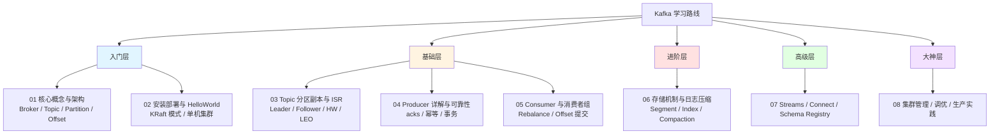
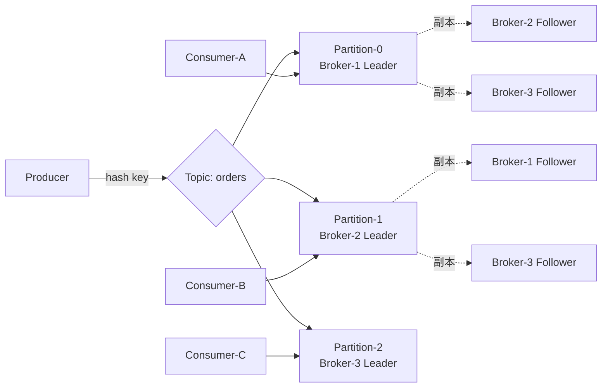
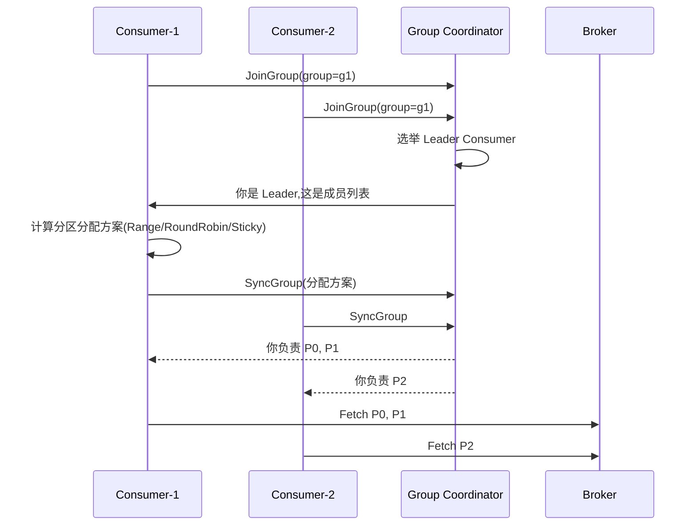

# Kafka 学习路线 MOC

Apache Kafka 是一个**分布式流处理平台**,核心解决三类问题:**高吞吐的消息传递**、**异构系统间的数据集成**、**实时流式计算**。它不只是消息队列,更是企业级数据中枢(Data Hub)。

> [!note] 这份 MOC 怎么用
> 这是 Kafka 系列笔记的总入口。下面的路线图按"入门 → 基础 → 进阶 → 高级 → 大神"分层,每一层都有对应的子笔记。建议**顺序学习**,不要跳过基础直接看 Kafka Streams,否则会被分区、副本、Rebalance 这些概念反复劝退。

---

## 一、为什么要学 Kafka

> [!question] Kafka 到底解决了什么传统 MQ 解决不了的问题?
> 传统 MQ(ActiveMQ、早期 RabbitMQ)在面对**百万 TPS 写入 + 数据可重放 + 多消费者独立消费**这三件事同时出现时会非常吃力。Kafka 把消息按**顺序追加写入磁盘日志**,用**零拷贝(sendfile)**做网络下推,再用**分区(Partition)**做水平扩展,把磁盘当成了"无限长的环形缓冲区"。

典型场景:

- **日志聚合**: 收集全公司服务日志,下游接 ELK / ClickHouse / Hive
- **事件驱动架构(EDA)**: 微服务之间用事件解耦
- **CDC 数据同步**: 通过 Debezium + Kafka Connect 把 MySQL binlog 同步到 ES / 数仓
- **实时数仓 / 实时风控**: Kafka + Flink / Kafka Streams
- **指标与监控管道**: Metrics → Kafka → Prometheus / TSDB

---

## 二、学习路线图



---

## 三、章节索引

### 入门层 — 知道它是什么

- [[01-入门-核心概念与架构]] — Broker、Topic、Partition、Offset、Producer、Consumer、ZooKeeper / KRaft 的关系
- [[02-入门-安装部署与HelloWorld]] — 本地单机、Docker Compose 三节点集群、第一个 `kafka-console-producer` / `consumer`

### 基础层 — 能写出生产可用的代码

- [[03-基础-Topic分区副本与ISR]] — 分区机制、副本同步、ISR / OSR、HW / LEO,**这是理解 Kafka 一切高可用的根**
- [[04-基础-Producer详解与可靠性]] — `acks=all`、`enable.idempotence`、事务消息、批量与压缩
- [[05-基础-Consumer与消费者组]] — Consumer Group、Rebalance 协议(Eager / Cooperative)、手动 vs 自动提交、`seek` 重放

### 进阶层 — 理解底层

- [[06-进阶-存储机制与日志压缩]] — LogSegment、稀疏索引(.index / .timeindex)、Log Compaction、零拷贝

### 高级层 — 用 Kafka 构建数据平台

- [[07-高级-KafkaStreams与Connect与SchemaRegistry]] — Kafka Streams DSL、KTable、Connect Source/Sink、Avro + Schema Registry

### 大神层 — 上生产、扛流量、救火

- [[08-大神-集群管理与性能调优与生产实践]] — JVM 调优、Page Cache、磁盘选型、跨机房复制(MirrorMaker 2)、监控告警、故障复盘

---

## 四、Kafka vs 其他消息中间件

> [!example] 选型对比
> 这张表是面试和技术选型时最常被问的。记忆口诀: **Kafka 强吞吐 / RabbitMQ 强路由 / Pulsar 强弹性 / RocketMQ 强事务**。

| 维度 | Kafka | RabbitMQ | Apache Pulsar | RocketMQ |
|---|---|---|---|---|
| **定位** | 分布式流平台 | 通用消息代理 | 云原生流 + 队列 | 金融级业务消息 |
| **协议** | 自定义 TCP | AMQP / MQTT / STOMP | 自定义二进制 | 自定义 + OpenMessaging |
| **吞吐量** | 百万级 TPS(单机) | 万级 TPS | 百万级 TPS | 十万级 TPS |
| **延迟** | 毫秒级(2~5ms) | 微秒级(<1ms) | 毫秒级 | 毫秒级 |
| **消息顺序** | 分区内严格有序 | 队列内有序 | 分区内有序 | 队列内有序 |
| **存储模型** | 顺序日志 + 分区 | 内存 + 镜像队列 | **计算存储分离**(Broker + BookKeeper) | CommitLog + ConsumeQueue |
| **副本机制** | ISR | 镜像队列(已弃用) → Quorum Queue | BookKeeper Quorum | 主从同步 / DLedger |
| **事务消息** | 支持(Producer 事务) | 较弱 | 支持 | **业界最强**(半消息 + 回查) |
| **延迟消息** | 不原生支持(需自实现) | 插件支持 | 原生支持(任意时长) | 原生支持(固定级别) |
| **死信队列** | 不原生(需手动) | 原生支持 | 原生支持 | 原生支持 |
| **多租户** | 较弱(靠 ACL) | 支持 vhost | **原生强支持** | 支持 |
| **运维复杂度** | 中(KRaft 后降低) | 低 | 高(两套集群) | 中 |
| **生态** | 极广(Flink / Spark / Connect / Streams) | 中等 | 增长中 | 阿里系生态丰富 |
| **典型场景** | 日志、流处理、CDC、事件总线 | 业务解耦、RPC 异步化 | 跨地域多租户、Serverless | 电商交易、金融订单 |

> [!tip] 选型建议
> - **要扛流量、做数据管道、对接大数据生态** → Kafka,几乎没有别的选项
> - **业务系统解耦、需要复杂路由(routing key / fanout)** → RabbitMQ
> - **多租户 SaaS、希望存储和计算分别扩缩容** → Pulsar
> - **金融级事务、严格顺序、阿里云环境** → RocketMQ

---

## 五、核心心智模型

> [!warning] 这三个模型搞错,后面全错
> **Kafka 不是队列,是分布式提交日志(Commit Log)。** 这是理解一切行为的基础。

### 模型 1: Topic 是逻辑,Partition 是物理



一个 Topic 由多个 Partition 组成,Partition 才是真正的并行单位和存储单位。详见 [[03-基础-Topic分区副本与ISR]]。

### 模型 2: Offset 由消费者维护

Broker 不知道哪条消息被"消费完"。消费者自己提交 offset 到 `__consumer_offsets` 这个内部 topic。所以 Kafka 天然支持**消息重放**——只要 offset 改回去就行。

### 模型 3: 消费者组内分区独占



**同一个消费者组内,一个分区最多被一个消费者消费。** 这是 Kafka 实现"集群消费"语义的方式。详见 [[05-基础-Consumer与消费者组]]。

---

## 六、最小可运行代码(快速感受)

> [!example] 30 秒发一条消息(三种语言对照)
> 完整可运行示例和深入参数解析见 [[04-基础-Producer详解与可靠性]]。

**Java(原生客户端)**:

```java
Properties props = new Properties();
props.put("bootstrap.servers", "localhost:9092");
props.put("key.serializer", "org.apache.kafka.common.serialization.StringSerializer");
props.put("value.serializer", "org.apache.kafka.common.serialization.StringSerializer");
props.put("acks", "all");
props.put("enable.idempotence", "true");

try (KafkaProducer<String, String> producer = new KafkaProducer<>(props)) {
    producer.send(new ProducerRecord<>("orders", "order-1001", "{\"amt\":99}"),
        (meta, ex) -> {
            if (ex != null) ex.printStackTrace();
            else System.out.printf("ok: partition=%d offset=%d%n",
                meta.partition(), meta.offset());
        });
}
```

**Python(confluent-kafka)**:

```python
from confluent_kafka import Producer

p = Producer({'bootstrap.servers': 'localhost:9092',
              'acks': 'all',
              'enable.idempotence': True})

def cb(err, msg):
    if err: print(f'err: {err}')
    else:   print(f'ok: {msg.topic()}[{msg.partition()}]@{msg.offset()}')

p.produce('orders', key='order-1001', value='{"amt":99}', callback=cb)
p.flush()
```

**Go(segmentio/kafka-go)**:

```go
w := &kafka.Writer{
    Addr:         kafka.TCP("localhost:9092"),
    Topic:        "orders",
    Balancer:     &kafka.Hash{},
    RequiredAcks: kafka.RequireAll,
}
defer w.Close()

err := w.WriteMessages(context.Background(), kafka.Message{
    Key:   []byte("order-1001"),
    Value: []byte(`{"amt":99}`),
})
if err != nil { log.Fatal(err) }
```

---

## 七、常见面试题(本系列覆盖)

> [!question] 面试高频题清单
> 每一题都会在对应章节里展开,不会只给"标准答案"。

1. **Kafka 为什么这么快?** → 顺序写 + Page Cache + 零拷贝 + 批量压缩 + 分区并行。详见 [[06-进阶-存储机制与日志压缩]]
2. **ISR 是什么?为什么不直接用所有副本?** → 容忍慢副本,平衡可用性和性能。详见 [[03-基础-Topic分区副本与ISR]]
3. **`acks=all` 一定不丢消息吗?** → 不一定,还要看 `min.insync.replicas` 和 `unclean.leader.election.enable`。详见 [[04-基础-Producer详解与可靠性]]
4. **Rebalance 为什么慢?怎么优化?** → Stop-the-World、Cooperative Sticky、`session.timeout.ms` 调优。详见 [[05-基础-Consumer与消费者组]]
5. **Exactly Once 怎么实现?** → 幂等 Producer + 事务 + Read-Process-Write 模式。详见 [[04-基础-Producer详解与可靠性]]
6. **Kafka 和 Pulsar 有什么本质区别?** → 计算存储是否分离;见本页对比表
7. **KRaft 模式相比 ZooKeeper 有什么优势?** → 元数据自管理、部署简化、扩展性更强。详见 [[08-大神-集群管理与性能调优与生产实践]]
8. **Log Compaction 和 Log Retention 的区别?** → 一个按 key 保留最新值,一个按时间/大小淘汰。详见 [[06-进阶-存储机制与日志压缩]]

---

## 八、官方资源与延伸阅读

> [!note] 一手资料永远优先
> 中文博客经常版本滞后(尤其是 KRaft 相关内容),遇到关键问题请查官方文档。

**官方资源**:

- 官方文档: https://kafka.apache.org/documentation/
- KIP(Kafka Improvement Proposals): https://cwiki.apache.org/confluence/display/KAFKA/Kafka+Improvement+Proposals
- 官方 GitHub: https://github.com/apache/kafka
- Confluent 文档(更工程化): https://docs.confluent.io/
- Confluent Developer 教程: https://developer.confluent.io/

**经典书籍**:

- 《Kafka 权威指南》(Kafka: The Definitive Guide, 2nd Edition)— Confluent 团队亲笔,2022 版覆盖 KRaft
- 《深入理解 Kafka:核心设计与实践原理》— 朱忠华,中文最系统的一本
- 《Designing Data-Intensive Applications》— 第 11 章流处理,理解 Kafka 在数据架构中的位置

**视频与博客**:

- Jay Kreps(Kafka 作者)的 *The Log* 一文: https://engineering.linkedin.com/distributed-systems/log-what-every-software-engineer-should-know-about-real-time-datas-unifying
- Confluent 官方 YouTube 频道
- 美团技术博客 / 字节跳动技术博客的 Kafka 实战文章

---

> [!danger] 学习陷阱提醒
> 1. **不要在没理解分区和副本之前就上手 Kafka Streams**,会非常痛苦
> 2. **不要用 Kafka 当 RPC 用**,延迟会让你怀疑人生
> 3. **不要用单分区跑高吞吐**,分区数 = 并行度上限
> 4. **生产环境不要用 `auto.offset.reset=latest` + 自动提交**,丢数据不眨眼
> 5. **不要忽视 `__consumer_offsets` 这个 topic**,它本身也会出问题

下一步: 开始 [[01-入门-核心概念与架构]]。
