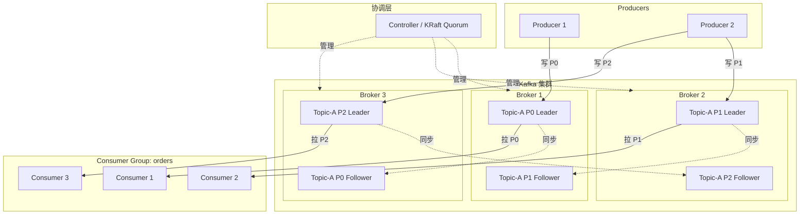
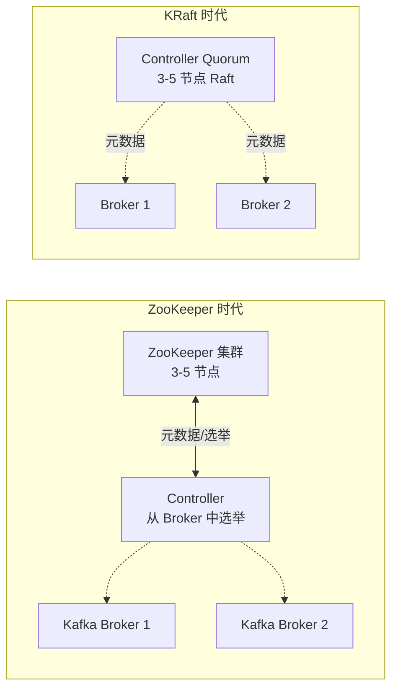
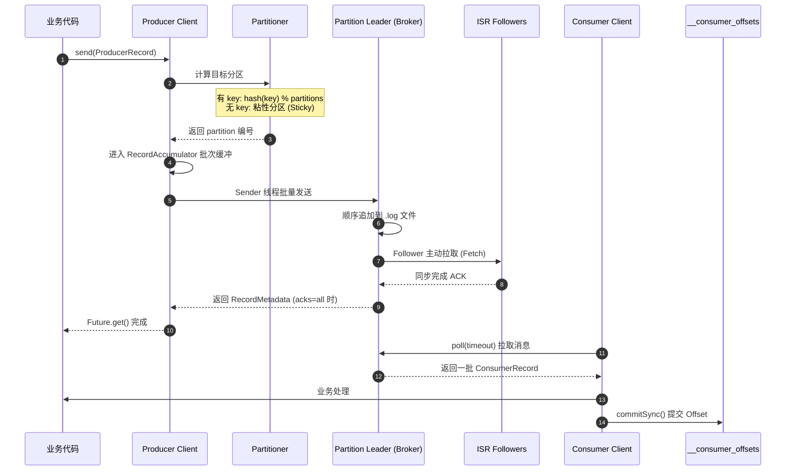
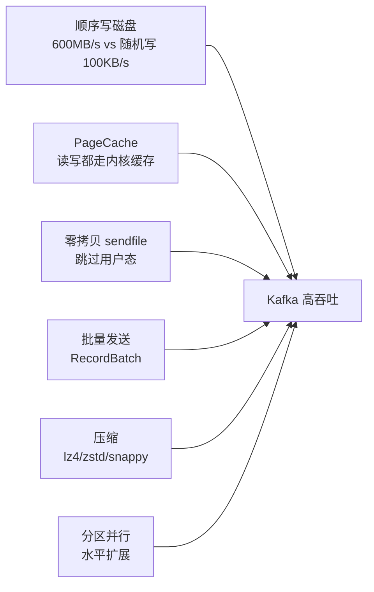

# Kafka 入门:核心概念与架构

## 一、Kafka 到底是什么

Kafka 不是传统意义上的消息队列(MQ),把它当成 RabbitMQ、ActiveMQ 的同类产品是新手最大的认知偏差。

准确的定义:**Kafka 是一个分布式的、可水平扩展的、基于持久化日志(commit log)的发布-订阅系统**。它由 LinkedIn 在 2010 年开源,2012 年成为 Apache 顶级项目,设计目标是为了解决 LinkedIn 内部海量用户行为数据(activity stream)的实时收集与分发问题。

> [!note] 一句话记忆
> Kafka 本质是一个**只能追加写入的、按分区切分的、可重放的分布式日志**,消息队列只是它最浅层的用法。

Kafka 现在的主要应用方向:

- **消息系统**(替代 MQ)
- **日志聚合**(替代 Flume + HDFS 的传统组合)
- **流处理**(配合 Kafka Streams / Flink)
- **事件溯源**(Event Sourcing)
- **CDC 数据管道**(配合 Debezium)
- **指标与监控数据收集**

## 二、与传统 MQ 的本质区别

很多人学 Kafka 时容易掉进 "Kafka 也是 MQ" 的坑里,导致后面理解 Offset、Partition、Consumer Group 时反复打架。先把这张表刻在脑子里:

| 维度 | 传统 MQ (RabbitMQ / ActiveMQ) | Kafka |
|------|------------------------------|-------|
| 存储模型 | 内存为主,消费即删 | 磁盘持久化日志,默认保留 7 天 |
| 消息位置 | Broker 维护,消费完即丢 | Consumer 自己维护 Offset |
| 写入方式 | 复杂的路由、Exchange 匹配 | 顺序追加写日志文件 |
| 消费模式 | Push (Broker 推送) | Pull (Consumer 拉取) |
| 吞吐量 | 万级 / 秒 | 百万级 / 秒 |
| 消息重放 | 不支持(消费即删) | 支持(改 Offset 即可) |
| 路由能力 | 强(Topic Exchange、Direct、Fanout) | 弱(只有 Topic + Partition) |
| 顺序保证 | 队列级别 | 分区级别 |
| 典型场景 | 业务解耦、任务分发 | 大数据管道、日志、流处理 |

> [!tip] 三个关键差异
> 1. **持久化日志**:消息写入后不会因为消费而消失,这是 Kafka 能做"重放"和"事件溯源"的根本原因
> 2. **Offset 由 Consumer 管理**:Broker 几乎是无状态的,扩展性极强
> 3. **顺序追加写**:不做随机 IO,配合 PageCache,磁盘也能跑出内存的速度

## 三、核心概念全景

下面这些名词在后续所有章节都会反复出现,理解不到位后面全是坑。

### 3.1 Broker

一个 Kafka 服务器实例 = 一个 Broker。多个 Broker 组成 Kafka 集群。每个 Broker 有唯一的 `broker.id`。

### 3.2 Topic

逻辑上的消息分类,类似数据库的"表"。生产者往 Topic 写,消费者从 Topic 读。

### 3.3 Partition (分区)

Topic 的物理切分单位。**一个 Topic 由 1~N 个 Partition 组成**,Partition 是 Kafka 并行度和扩展性的基本单位。

> [!warning] 关于分区数
> Partition 数量决定了消费的最大并行度。一个 Consumer Group 内,**一个 Partition 同一时刻只能被组内一个 Consumer 消费**。分区数 < 消费者数,会导致部分消费者空闲。

### 3.4 Replica (副本)

每个 Partition 有 N 个副本(由 `replication.factor` 决定),其中:

- **Leader**:唯一对外提供读写服务的副本
- **Follower**:从 Leader 拉数据做同步,不对外服务,Leader 宕机时顶上

### 3.5 ISR (In-Sync Replicas)

与 Leader 保持同步状态的副本集合(包含 Leader 自己)。落后太多的 Follower 会被踢出 ISR,进入 OSR (Out-of-Sync Replicas)。`acks=all` 时,消息必须被所有 ISR 确认才算写入成功。

### 3.6 Producer

消息生产者。负责选择把消息发到哪个 Partition(通过 Partitioner)。

### 3.7 Consumer & Consumer Group

消费者及消费者组。**Consumer Group 是 Kafka 实现"队列模式"和"广播模式"的统一抽象**:

- 同一个 Group 内:**队列语义**,消息只被组内一个 Consumer 消费(分区独占)
- 不同 Group 之间:**广播语义**,每个 Group 都能完整消费一遍

### 3.8 Offset

消息在 Partition 内的唯一编号,从 0 单调递增。Consumer 通过提交 Offset 来记录"我消费到哪了"。

### 3.9 Controller

集群中一个特殊的 Broker,负责分区 Leader 选举、副本状态管理、Topic 元数据变更等。KRaft 模式下由 Controller Quorum 承担。

## 四、整体架构图



> [!example] 这张图的核心信息
> - 同一个 Partition 的 Leader 和 Follower **必须分布在不同 Broker** 上(否则副本无意义)
> - Producer 只往 Leader 写,Follower 主动从 Leader 拉取(pull-based replication)
> - Consumer Group 内 Consumer 数量 ≤ Partition 数量时,实现完美并行

## 五、ZooKeeper 时代 vs KRaft 时代

Kafka 的元数据管理经历了一次脱胎换骨的重构:

| 阶段 | 版本 | 元数据存储 |
|------|------|-----------|
| ZooKeeper 时代 | 0.x ~ 2.7 | 完全依赖 ZooKeeper |
| 过渡期 | 2.8 (引入 KRaft 预览) | 双模式并存 |
| KRaft GA | 3.3 | KRaft 生产可用 |
| 纯 KRaft | 4.0 (2025) | **彻底移除 ZooKeeper** |

> [!danger] 重要时间节点
> Kafka 4.0 已经**完全移除 ZooKeeper**。新项目直接上 KRaft,老项目要规划迁移路径。继续依赖 ZooKeeper 的方案没有未来。

KRaft (Kafka Raft) 的优势:

- **少一个外部依赖**:运维复杂度大幅下降
- **扩展性更强**:单集群支持百万级分区(ZK 模式下约 20 万就吃力)
- **元数据变更更快**:Controller 故障切换从秒级降到毫秒级
- **部署更简单**:不用再单独搭一个 ZK 集群



## 六、一条消息的生命周期

把所有概念串起来,看一条消息从被发送到被消费的完整过程:



> [!question] 思考:为什么是 Pull 而不是 Push
> Push 模式下 Broker 必须感知每个 Consumer 的消费能力,慢消费者会被压垮。Pull 模式把流控权交给 Consumer,各取所需;代价是空轮询,Kafka 通过 long-polling (`fetch.max.wait.ms`) 缓解。

## 七、生产者代码示例

### 7.1 原生 Java 客户端

```java
import org.apache.kafka.clients.producer.*;
import org.apache.kafka.common.serialization.StringSerializer;
import java.util.Properties;

public class SimpleProducer {
    public static void main(String[] args) {
        Properties props = new Properties();
        props.put(ProducerConfig.BOOTSTRAP_SERVERS_CONFIG, "localhost:9092");
        props.put(ProducerConfig.KEY_SERIALIZER_CLASS_CONFIG, StringSerializer.class.getName());
        props.put(ProducerConfig.VALUE_SERIALIZER_CLASS_CONFIG, StringSerializer.class.getName());
        props.put(ProducerConfig.ACKS_CONFIG, "all");
        props.put(ProducerConfig.ENABLE_IDEMPOTENCE_CONFIG, true);
        props.put(ProducerConfig.COMPRESSION_TYPE_CONFIG, "lz4");
        props.put(ProducerConfig.LINGER_MS_CONFIG, 10);
        props.put(ProducerConfig.BATCH_SIZE_CONFIG, 32 * 1024);

        try (Producer<String, String> producer = new KafkaProducer<>(props)) {
            for (int i = 0; i < 100; i++) {
                ProducerRecord<String, String> record =
                    new ProducerRecord<>("orders", "user-" + i, "{\"orderId\":" + i + "}");
                producer.send(record, (metadata, exception) -> {
                    if (exception != null) {
                        exception.printStackTrace();
                    } else {
                        System.out.printf("partition=%d offset=%d%n",
                            metadata.partition(), metadata.offset());
                    }
                });
            }
            producer.flush();
        }
    }
}
```

### 7.2 Spring Boot 写法

`application.yml`:

```yaml
spring:
  kafka:
    bootstrap-servers: localhost:9092
    producer:
      key-serializer: org.apache.kafka.common.serialization.StringSerializer
      value-serializer: org.springframework.kafka.support.serializer.JsonSerializer
      acks: all
      properties:
        enable.idempotence: true
        linger.ms: 10
        compression.type: lz4
```

业务代码:

```java
@Service
@RequiredArgsConstructor
public class OrderEventPublisher {
    private final KafkaTemplate<String, OrderEvent> kafkaTemplate;

    public void publish(OrderEvent event) {
        kafkaTemplate.send("orders", event.getUserId(), event)
            .whenComplete((result, ex) -> {
                if (ex != null) {
                    log.error("send failed", ex);
                } else {
                    log.info("sent to partition {} offset {}",
                        result.getRecordMetadata().partition(),
                        result.getRecordMetadata().offset());
                }
            });
    }
}
```

### 7.3 Python 对照(confluent-kafka)

```python
from confluent_kafka import Producer
import json

conf = {
    'bootstrap.servers': 'localhost:9092',
    'acks': 'all',
    'enable.idempotence': True,
    'compression.type': 'lz4',
    'linger.ms': 10,
}
producer = Producer(conf)

def delivery_report(err, msg):
    if err is not None:
        print(f'Delivery failed: {err}')
    else:
        print(f'Delivered to {msg.topic()} [{msg.partition()}] @ {msg.offset()}')

for i in range(100):
    producer.produce(
        'orders',
        key=f'user-{i}',
        value=json.dumps({'orderId': i}),
        callback=delivery_report,
    )
producer.flush()
```

### 7.4 Go 对照(segmentio/kafka-go)

```go
package main

import (
    "context"
    "fmt"
    "github.com/segmentio/kafka-go"
)

func main() {
    w := &kafka.Writer{
        Addr:         kafka.TCP("localhost:9092"),
        Topic:        "orders",
        Balancer:     &kafka.Hash{},
        RequiredAcks: kafka.RequireAll,
        Compression:  kafka.Lz4,
    }
    defer w.Close()

    err := w.WriteMessages(context.Background(),
        kafka.Message{Key: []byte("user-1"), Value: []byte(`{"orderId":1}`)},
    )
    if err != nil {
        fmt.Println("write failed:", err)
    }
}
```

## 八、消费者代码示例

### 8.1 Spring Boot 写法

```java
@Component
@Slf4j
public class OrderEventListener {

    @KafkaListener(
        topics = "orders",
        groupId = "order-service",
        concurrency = "3"
    )
    public void onMessage(ConsumerRecord<String, OrderEvent> record, Acknowledgment ack) {
        try {
            log.info("partition={} offset={} key={} value={}",
                record.partition(), record.offset(), record.key(), record.value());
            // 业务处理
            ack.acknowledge();  // 手动提交
        } catch (Exception e) {
            log.error("handle failed, will retry", e);
        }
    }
}
```

`application.yml`:

```yaml
spring:
  kafka:
    consumer:
      group-id: order-service
      auto-offset-reset: earliest
      enable-auto-commit: false
      key-deserializer: org.apache.kafka.common.serialization.StringDeserializer
      value-deserializer: org.springframework.kafka.support.serializer.JsonDeserializer
      properties:
        spring.json.trusted.packages: "*"
        max.poll.records: 500
    listener:
      ack-mode: manual_immediate
```

## 九、适用场景与不适用场景

> [!tip] Kafka 适合做什么
> - **日志聚合**:多个服务的日志统一汇集到 Kafka,再分发到 ES、HDFS、S3
> - **事件溯源**:把状态变更作为不可变事件流持久化
> - **流处理管道**:对接 Flink、Spark Streaming、Kafka Streams
> - **CDC**:配合 Debezium 抓取数据库 binlog
> - **指标采集**:海量监控数据缓冲层
> - **微服务解耦**:异步事件驱动架构的事件总线

> [!warning] Kafka 不适合做什么
> - **复杂消息路由**:Topic Exchange、Header 路由这种用 RabbitMQ
> - **严格优先级队列**:Kafka 没有优先级概念
> - **延迟队列**:原生不支持(需要靠 RocketMQ 或外部调度)
> - **小规模简单队列**:单机 Redis List 就能搞定,杀鸡用牛刀
> - **请求-响应模式**:Kafka 是单向流,不适合 RPC 替代

## 十、Kafka 为什么这么快

这是面试必考题,记住六个关键词:



逐条展开:

1. **顺序写**:Kafka 的 Partition 是 append-only 日志,磁盘顺序 IO 接近内存速度
2. **PageCache**:写入先进操作系统页缓存,读取也优先命中,JVM 几乎不参与数据缓存
3. **零拷贝 (sendfile)**:Broker 把数据发给 Consumer 时,通过 `sendfile` 系统调用直接从 PageCache 到 Socket,跳过用户空间拷贝
4. **批量**:Producer 端 RecordAccumulator 聚批,Consumer 端 `max.poll.records` 批量拉取
5. **压缩**:批次级压缩(不是单条),压缩比更高,网络和磁盘双收益
6. **分区并行**:横向加 Broker、加 Partition 就能线性扩容

> [!note] 关于零拷贝
> 传统流程:磁盘 → 内核 PageCache → 用户态 → Socket 缓冲区 → 网卡,4 次拷贝、2 次上下文切换。
> sendfile 流程:磁盘 → PageCache → 网卡,2 次拷贝、1 次上下文切换。

## 十一、常见面试题

> [!question] Q1:Kafka 为什么去掉 ZooKeeper
> 1. **运维复杂**:需要单独维护 ZK 集群,版本兼容、故障排查都要双重技能
> 2. **元数据扩展瓶颈**:ZK 的 Watch 机制在百万级分区下性能急剧下降
> 3. **元数据一致性问题**:Controller 与 ZK 之间存在元数据漂移风险
> 4. **故障恢复慢**:Controller 故障切换需要全量加载 ZK 元数据,可能秒级
> 5. **架构不优雅**:本身已经是分布式系统,再依赖另一个分布式协调服务

> [!question] Q2:一个 Topic 应该设置多少个 Partition
> 起步公式:`分区数 = max(目标吞吐 / 单分区吞吐, 期望消费并行度)`。
> 注意:**分区只能增加不能减少**,前期不要拍脑袋设几百个。单个 Broker 承载分区上限建议 4000 以内(KRaft 下可更多)。

> [!question] Q3:Producer 的 acks 三种值有什么区别
> - `acks=0`:发出去就不管,最高吞吐,可能丢消息
> - `acks=1`:Leader 写入即返回,Leader 宕机且未同步时丢消息
> - `acks=all` (或 `-1`):所有 ISR 写入才返回,最安全,需配合 `min.insync.replicas >= 2`

> [!question] Q4:Consumer Group 内 Consumer 数量超过 Partition 数会怎样
> 多出来的 Consumer 会**空闲**,不会消费任何消息。这是 Kafka 并行度的硬上限,也是设计分区数时的核心考量。

> [!question] Q5:Kafka 如何保证消息不丢
> 三个环节都要保证:
> - **Producer 端**:`acks=all` + `retries=Integer.MAX_VALUE` + `enable.idempotence=true`
> - **Broker 端**:`replication.factor >= 3` + `min.insync.replicas >= 2` + `unclean.leader.election.enable=false`
> - **Consumer 端**:关闭自动提交,业务处理成功后再手动 commit

> [!question] Q6:Kafka 能保证全局有序吗
> 不能,**只能保证单 Partition 内有序**。要全局有序就只能用 1 个 Partition,代价是失去并行能力。业务上通常通过 Key Hash 把同一业务实体的消息打到同一分区,实现"业务级别有序"。

## 十二、延伸阅读

### 本系列其他章节(待写)

- [[02-安装与运维-KRaft模式部署]]
- [[03-Producer深度解析-分区策略与可靠性]]
- [[04-Consumer深度解析-Rebalance与位移管理]]
- [[05-存储原理-日志分段与索引]]
- [[06-副本机制-ISR与高水位]]
- [[07-事务与Exactly-Once语义]]
- [[08-Kafka-Streams入门]]
- [[09-性能调优实战]]
- [[10-Kafka监控-Prometheus与Grafana]]

### 官方与权威资料

- Kafka 官方文档:<https://kafka.apache.org/documentation/>
- KIP-500 (移除 ZooKeeper):<https://cwiki.apache.org/confluence/display/KAFKA/KIP-500>
- 《Kafka 权威指南》(O'Reilly) — Neha Narkhede 等
- 《深入理解 Kafka:核心设计与实践原理》— 朱忠华
- LinkedIn Engineering Blog 关于 Kafka 的早期论文 *Kafka: a Distributed Messaging System for Log Processing*

### 相关技术对比

- [[../RabbitMQ/01-入门-AMQP协议与核心模型]] — 对比 AMQP 路由模型
- Pulsar:分层存储 + 计算存储分离的下一代消息系统
- RocketMQ:阿里开源,事务消息、延迟队列原生支持

---

> [!note] 学完本章你应该能回答
> 1. Kafka 与 RabbitMQ 的本质区别是什么
> 2. Partition、Replica、ISR、Leader、Follower 之间的关系
> 3. 为什么 Kafka 能做到百万级 TPS
> 4. KRaft 相比 ZooKeeper 解决了什么问题
> 5. 一条消息从 Producer 到 Consumer 经过哪些环节
