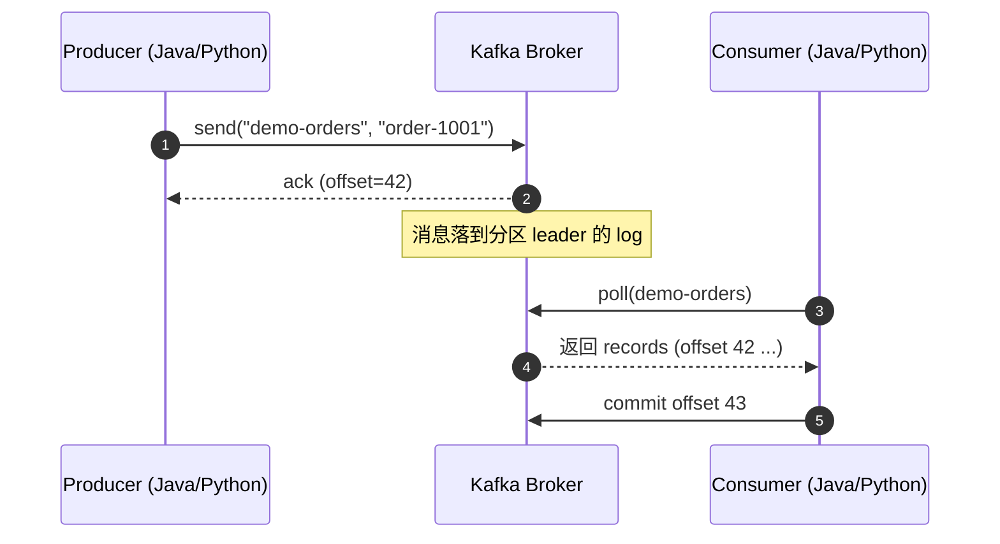
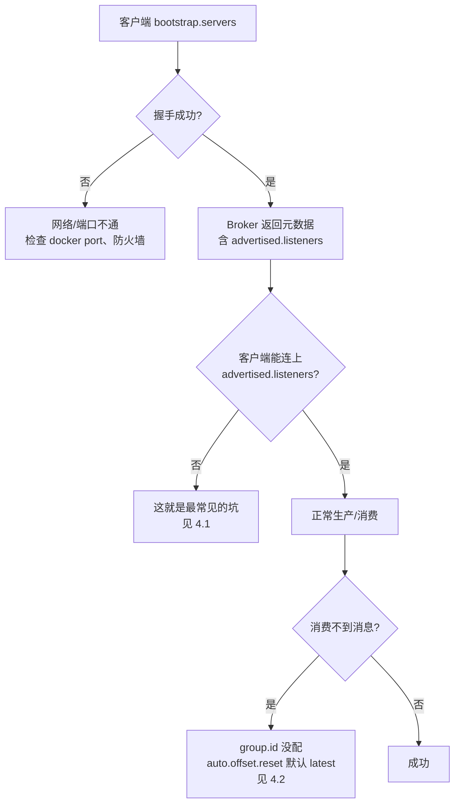

> [!note] 本章目标
> 看完这一章，你应该能：在本机跑起一个 Kafka 集群（Docker 或二进制都行）、用命令行收发消息、用 Java / Spring Boot / Python 写出第一个生产者和消费者，并且知道 `advertised.listeners` 这个坑长什么样、为什么会踩到。

承接 [[01-Kafka概述-为什么需要消息队列]]，这一章我们不再聊理论，直接动手。先把环境搞起来，再用三种语言把 Hello World 跑通，最后总结新手最容易踩的几个坑。

---

## 1. 三种安装方式对比

选哪种取决于你打算做什么。生产环境别用我下面给的任何一个示例，那些都是为了**学习**和**本地开发**。

| 方式 | 适合场景 | 优点 | 缺点 |
| --- | --- | --- | --- |
| Docker / Docker Compose | 本地开发、CI、临时验证 | 一条命令起集群，干净不污染环境 | 网络模型要懂一点，否则会踩 listeners 坑 |
| 二进制包 | 想看 Kafka 内部细节、做实验 | 透明、可控、改配置直接生效 | 要装 JDK，手动管理 ZK 或 KRaft |
| Confluent Platform | 企业 PoC、要 Schema Registry / ksqlDB / Control Center | 全家桶、官方支持 | 体积大、商业组件有 License 限制 |

### 1.1 Docker（推荐新手）

下面这份 `docker-compose.yml` 用了 KRaft 模式（无 ZooKeeper），并附带一个 Web UI 方便观察 Topic、消费组和消息。

```yaml
# docker-compose.yml  
# 用法：docker compose up -d  
# 关闭：docker compose down -v   (-v 会清掉数据卷，谨慎)  
version: "3.8"  
  
services:  
  kafka:  
    image: apache/kafka:3.9.0  
    container_name: kafka  
    ports:  
      - "9092:9092"  
      - "9094:9094"  
    environment:  
      KAFKA_NODE_ID: "1"  
      KAFKA_PROCESS_ROLES: "controller,broker"  
      KAFKA_CONTROLLER_QUORUM_VOTERS: "1@kafka:9093"  
      KAFKA_LISTENERS: "PLAINTEXT://:9092,CONTROLLER://:9093,INTERNAL://:9094"  
      KAFKA_ADVERTISED_LISTENERS: "PLAINTEXT://localhost:9092,INTERNAL://kafka:9094"  
      KAFKA_LISTENER_SECURITY_PROTOCOL_MAP: "CONTROLLER:PLAINTEXT,PLAINTEXT:PLAINTEXT,INTERNAL:PLAINTEXT"  
      KAFKA_CONTROLLER_LISTENER_NAMES: "CONTROLLER"  
      KAFKA_INTER_BROKER_LISTENER_NAME: "INTERNAL"  
      KAFKA_OFFSETS_TOPIC_REPLICATION_FACTOR: "1"  
      KAFKA_TRANSACTION_STATE_LOG_REPLICATION_FACTOR: "1"  
      KAFKA_TRANSACTION_STATE_LOG_MIN_ISR: "1"  
      KAFKA_AUTO_CREATE_TOPICS_ENABLE: "true"  
      KAFKA_LOG_DIRS: "/var/lib/kafka/data"  
    volumes:  
      - kafka_data:/var/lib/kafka/data  
  
  kafka-ui:  
    image: kafbat/kafka-ui:latest      # provectus 已停更，这是接棒的维护版  
    container_name: kafka-ui  
    ports:  
      - "8088:8080"                    # 宿主机 8088 → 容器 8080    environment:  
      KAFKA_CLUSTERS_0_NAME: "local"  
      KAFKA_CLUSTERS_0_BOOTSTRAPSERVERS: "kafka:9094"   # ← 走 INTERNAL 监听器  
      DYNAMIC_CONFIG_ENABLED: "true"  
    depends_on:  
      - kafka  
  
volumes:  
  kafka_data:
```

启动：

```bash
docker compose up -d
docker compose logs -f kafka     # 看日志
open http://localhost:8080       # 打开 kafka-ui
```

> [!tip] 也可以选 Redpanda Console
> 如果你更喜欢 Redpanda Console（另一款好用的 UI），把镜像换成 `docker.redpanda.com/redpandadata/console:latest`，配置变量是 `KAFKA_BROKERS=kafka:9094`。功能跟 kafka-ui 类似，UI 风格更现代。

### 1.2 二进制包

去官网 https://kafka.apache.org/downloads 下载 `kafka_2.13-3.7.x.tgz`。解压后目录里 `bin/` 是脚本，`config/` 是配置。

#### 传统 ZooKeeper 模式

```bash
# 终端 1：启动 ZK
bin/zookeeper-server-start.sh config/zookeeper.properties

# 终端 2：启动 Kafka
bin/kafka-server-start.sh config/server.properties
```

#### KRaft 模式（3.3+ 推荐，4.0 以后 ZK 模式被移除）

```bash
# 1) 生成集群 ID（只做一次）
KAFKA_CLUSTER_ID=$(bin/kafka-storage.sh random-uuid)

# 2) 首次启动前必须 format 存储目录
bin/kafka-storage.sh format -t "$KAFKA_CLUSTER_ID" -c config/kraft/server.properties

# 3) 启动
bin/kafka-server-start.sh config/kraft/server.properties
```

> [!danger] 首次 KRaft 启动忘了 format 怎么办
> 你会看到 `No meta.properties found in /tmp/kraft-combined-logs ...`。解决方式就是上面那条 `kafka-storage.sh format`。生产上重启不需要再 format，只有**第一次**初始化要做。

### 1.3 Confluent Platform 简介

Confluent 是 Kafka 原作者创立的公司，他们的发行版叫 **Confluent Platform**，在 Apache Kafka 基础上加了：

- **Schema Registry**：Avro / Protobuf / JSON Schema 的模式注册与版本管理
- **Kafka Connect** 一堆现成连接器
- **ksqlDB**：在 Kafka 上写 SQL 做流处理
- **Control Center**：商业版的 Web 管控台

学习阶段直接用 Apache 社区版就够。要研究 Schema Registry，可以单独跑一个 `confluentinc/cp-schema-registry` 容器接上去。

---

## 2. 常用命令行工具速查

所有脚本都在 `bin/` 下，Docker 里在 `/opt/bitnami/kafka/bin/` 或 `/usr/bin/`。在 Docker 容器里执行命令的姿势：

```bash
docker exec -it kafka /opt/kafka/bin/kafka-topics.sh \
  --bootstrap-server localhost:9092 --list
```

| 脚本 | 干啥 |
| --- | --- |
| `kafka-topics.sh` | 增删查改 Topic、查看分区与副本分布 |
| `kafka-console-producer.sh` | 命令行往 Topic 写消息 |
| `kafka-console-consumer.sh` | 命令行从 Topic 读消息 |
| `kafka-consumer-groups.sh` | 查看消费组 lag、重置 offset |
| `kafka-configs.sh` | 动态修改 Broker / Topic / Client 配置 |
| `kafka-storage.sh` | KRaft 模式格式化存储 |
| `kafka-dump-log.sh` | 转储 segment 文件（排查问题用） |

### 2.1 创建 Topic

```bash
docker exec -it kafka /opt/kafka/bin/kafka-topics.sh \
  --bootstrap-server localhost:9092 \
  --create \
  --topic demo-orders \
  --partitions 3 \
  --replication-factor 1
```

> [!warning] partitions 与 replication-factor 怎么选
> - `partitions`：**并发上限**。一个消费组里同时消费某 Topic 的消费者数量不会超过分区数。生产上通常 6 / 12 / 24 起步，留出扩容余地。
> - `replication-factor`：**副本数**。生产至少 3，开发可以是 1。**replication-factor 不能超过 Broker 数量**，单机就只能填 1。
> 详细原理见 [[03-Kafka架构-Broker分区副本与控制器]]。

### 2.2 查看与修改

```bash
# 查看 Topic 详情（分区、Leader、ISR）
docker exec -it kafka /opt/kafka/bin/kafka-topics.sh  --bootstrap-server localhost:9092 --describe --topic demo-orders

# 增加分区数（只能加，不能减）
docker exec -it kafka /opt/kafka/bin/kafka-topics.sh --bootstrap-server localhost:9092 --alter --topic demo-orders --partitions 6

# 修改 Topic 保留时间为 1 小时
kafka-configs.sh --bootstrap-server localhost:9092 \
  --entity-type topics --entity-name demo-orders \
  --alter --add-config retention.ms=3600000
```

### 2.3 命令行生产消费

```bash
# 生产者：每行一条消息
kafka-console-producer.sh --bootstrap-server localhost:9092 --topic demo-orders
>order-1001 created
>order-1002 paid

# 消费者：从头开始读
kafka-console-consumer.sh --bootstrap-server localhost:9092 \
  --topic demo-orders --from-beginning
```

### 2.4 查看消费组

```bash
# 列出所有消费组
kafka-consumer-groups.sh --bootstrap-server localhost:9092 --list

# 查看某个组的消费进度（CURRENT-OFFSET / LOG-END-OFFSET / LAG）
kafka-consumer-groups.sh --bootstrap-server localhost:9092 \
  --describe --group order-service

# 把消费组 offset 重置到最早
kafka-consumer-groups.sh --bootstrap-server localhost:9092 \
  --group order-service --topic demo-orders \
  --reset-offsets --to-earliest --execute
```

---

## 3. Hello World 全家桶

下面这个时序图描述了我们要实现的最小闭环：



### 3.1 Java 原生客户端

`pom.xml`：

```xml
<dependency>
    <groupId>org.apache.kafka</groupId>
    <artifactId>kafka-clients</artifactId>
    <version>3.7.0</version>
</dependency>
<dependency>
    <groupId>org.slf4j</groupId>
    <artifactId>slf4j-simple</artifactId>
    <version>2.0.13</version>
</dependency>
```

生产者：

```java
import org.apache.kafka.clients.producer.*;
import org.apache.kafka.common.serialization.StringSerializer;

import java.util.Properties;

public class HelloProducer {
    public static void main(String[] args) throws Exception {
        Properties props = new Properties();
        props.put(ProducerConfig.BOOTSTRAP_SERVERS_CONFIG, "localhost:9092");
        props.put(ProducerConfig.KEY_SERIALIZER_CLASS_CONFIG, StringSerializer.class.getName());
        props.put(ProducerConfig.VALUE_SERIALIZER_CLASS_CONFIG, StringSerializer.class.getName());
        props.put(ProducerConfig.ACKS_CONFIG, "all");          // 等所有 ISR 写入
        props.put(ProducerConfig.ENABLE_IDEMPOTENCE_CONFIG, true); // 幂等
        props.put(ProducerConfig.LINGER_MS_CONFIG, 5);         // 批量等待 5ms

        try (KafkaProducer<String, String> producer = new KafkaProducer<>(props)) {
            for (int i = 0; i < 10; i++) {
                String key = "user-" + (i % 3);
                String value = "order-" + (1000 + i);
                ProducerRecord<String, String> record =
                        new ProducerRecord<>("demo-orders", key, value);

                producer.send(record, (meta, ex) -> {
                    if (ex != null) {
                        ex.printStackTrace();
                    } else {
                        System.out.printf("sent topic=%s partition=%d offset=%d key=%s%n",
                                meta.topic(), meta.partition(), meta.offset(), key);
                    }
                });
            }
            producer.flush();
        }
    }
}
```

消费者：

```java
import org.apache.kafka.clients.consumer.*;
import org.apache.kafka.common.serialization.StringDeserializer;

import java.time.Duration;
import java.util.Collections;
import java.util.Properties;

public class HelloConsumer {
    public static void main(String[] args) {
        Properties props = new Properties();
        props.put(ConsumerConfig.BOOTSTRAP_SERVERS_CONFIG, "localhost:9092");
        props.put(ConsumerConfig.GROUP_ID_CONFIG, "demo-order-consumer");
        props.put(ConsumerConfig.KEY_DESERIALIZER_CLASS_CONFIG, StringDeserializer.class.getName());
        props.put(ConsumerConfig.VALUE_DESERIALIZER_CLASS_CONFIG, StringDeserializer.class.getName());
        props.put(ConsumerConfig.AUTO_OFFSET_RESET_CONFIG, "earliest"); // 新组从头读
        props.put(ConsumerConfig.ENABLE_AUTO_COMMIT_CONFIG, false);     // 手动提交

        try (KafkaConsumer<String, String> consumer = new KafkaConsumer<>(props)) {
            consumer.subscribe(Collections.singletonList("demo-orders"));
            while (true) {
                ConsumerRecords<String, String> records = consumer.poll(Duration.ofMillis(500));
                for (ConsumerRecord<String, String> r : records) {
                    System.out.printf("got partition=%d offset=%d key=%s value=%s%n",
                            r.partition(), r.offset(), r.key(), r.value());
                }
                if (!records.isEmpty()) {
                    consumer.commitSync();
                }
            }
        }
    }
}
```

> [!example] 想看到分区分布
> 把 `HelloProducer` 跑两遍，你会发现相同 `key=user-0` 的消息**始终落在同一分区**。这是分区器按 `hash(key) % partitions` 算的结果，也是 Kafka 保证**分区内有序**的核心机制。详细见 [[04-Kafka生产者-分区策略与可靠性]]。

### 3.2 Spring Boot 集成 spring-kafka

`pom.xml`：

```xml
<dependency>
    <groupId>org.springframework.boot</groupId>
    <artifactId>spring-boot-starter</artifactId>
</dependency>
<dependency>
    <groupId>org.springframework.kafka</groupId>
    <artifactId>spring-kafka</artifactId>
</dependency>
```

`application.yml`：

```yaml
spring:
  kafka:
    bootstrap-servers: localhost:9092
    producer:
      key-serializer: org.apache.kafka.common.serialization.StringSerializer
      value-serializer: org.apache.kafka.common.serialization.StringSerializer
      acks: all
      properties:
        enable.idempotence: true
        linger.ms: 5
    consumer:
      group-id: demo-order-consumer
      key-deserializer: org.apache.kafka.common.serialization.StringDeserializer
      value-deserializer: org.apache.kafka.common.serialization.StringDeserializer
      auto-offset-reset: earliest
      enable-auto-commit: false
    listener:
      ack-mode: manual_immediate
```

生产者 + 消费者：

```java
@SpringBootApplication
public class KafkaDemoApp {
    public static void main(String[] args) {
        SpringApplication.run(KafkaDemoApp.class, args);
    }
}

@RestController
@RequiredArgsConstructor
class OrderController {
    private final KafkaTemplate<String, String> kafkaTemplate;

    @PostMapping("/orders")
    public String send(@RequestParam String userId, @RequestParam String body) {
        kafkaTemplate.send("demo-orders", userId, body);
        return "ok";
    }
}

@Component
@Slf4j
class OrderConsumer {
    @KafkaListener(topics = "demo-orders", groupId = "demo-order-consumer")
    public void onMessage(ConsumerRecord<String, String> record, Acknowledgment ack) {
        log.info("partition={} offset={} key={} value={}",
                record.partition(), record.offset(), record.key(), record.value());
        // ... 业务处理
        ack.acknowledge();   // 手动提交
    }
}
```

> [!tip] 为什么用 `manual_immediate` + 手动 ack
> 默认 `BATCH` 模式在 poll 一批后自动提交。这在业务异常时会丢消息（"看似处理完，其实抛了"）。手动 ack 是新人**最值得养成的习惯**，详细对比见 [[05-Kafka消费者-消费模型与offset管理]]。

### 3.3 Python kafka-python 对照

```bash
pip install kafka-python
```

```python
# producer.py
from kafka import KafkaProducer

producer = KafkaProducer(
    bootstrap_servers="localhost:9092",
    key_serializer=lambda k: k.encode(),
    value_serializer=lambda v: v.encode(),
    acks="all",
    linger_ms=5,
    enable_idempotence=True,
)

for i in range(10):
    key = f"user-{i % 3}"
    value = f"order-{1000 + i}"
    fut = producer.send("demo-orders", key=key, value=value)
    meta = fut.get(timeout=10)
    print(f"sent partition={meta.partition} offset={meta.offset} key={key}")

producer.flush()
```

```python
# consumer.py
from kafka import KafkaConsumer

consumer = KafkaConsumer(
    "demo-orders",
    bootstrap_servers="localhost:9092",
    group_id="demo-order-consumer",
    auto_offset_reset="earliest",
    enable_auto_commit=False,
)

for msg in consumer:
    print(f"partition={msg.partition} offset={msg.offset} "
          f"key={msg.key.decode()} value={msg.value.decode()}")
    consumer.commit()
```

> [!question] 用 confluent-kafka-python 还是 kafka-python
> 生产推荐 `confluent-kafka-python`（基于 librdkafka，性能与稳定性更好）。`kafka-python` 纯 Python 实现，写示例脚本足够，高吞吐场景容易瓶颈。

---

## 4. 新手最容易踩的坑

下面这张流程图描述"客户端连上 Broker 但收不到 / 发不出消息"的常见路径：



### 4.1 advertised.listeners 配置（**最经典的坑**）

> [!warning] 这条要刻进 DNA
> 客户端**第一次**连 `bootstrap.servers` 拿到的是集群元数据。元数据里告诉客户端"以后要发消息请连这个地址"——这个地址就是 `advertised.listeners`，**不是** `listeners`，也**不是**你 `bootstrap.servers` 里写的那个。
>
> 所以你常见的报错：
> - `Connection to node -1 could not be established`
> - 程序 hang 住、几十秒后 `Topic ... not present in metadata`
>
> 大概率是 `advertised.listeners` 给的是容器内部主机名（如 `kafka:9092`），客户端在宿主机里根本解析不到。

**结论**：

| 客户端位置 | bootstrap.servers | advertised.listeners 必须包含 |
| --- | --- | --- |
| 宿主机 / 公网 | `localhost:9092` | `PLAINTEXT://localhost:9092` |
| 其他容器 | `kafka:9094` | `INTERNAL://kafka:9094` |
| 同时支持 | 看连接方 | **同时**配置两个 listener（见 1.1 yml） |

### 4.2 消费不到消息

新人最常问的另一个问题。原因通常是这三件之一：

1. **没设 `group.id`**：每次重启都生成新组，行为不可预期
2. **`auto.offset.reset=latest`**（默认）：新组从**最新**开始读，所以**之前**写进去的消息看不到
3. **消费者组对该 Topic 没有任何分区被分配**：例如分区数 < 消费者数，多出来的消费者会闲置

> [!tip] 调试三板斧
> ```bash
> # 1. 看消费组到底存不存在
> kafka-consumer-groups.sh --bootstrap-server localhost:9092 --list
>
> # 2. 看组里有没有 lag
> kafka-consumer-groups.sh --bootstrap-server localhost:9092 \
>   --describe --group demo-order-consumer
>
> # 3. 把 offset 重置到最早再试
> kafka-consumer-groups.sh --bootstrap-server localhost:9092 \
>   --group demo-order-consumer --topic demo-orders \
>   --reset-offsets --to-earliest --execute
> ```
> **注意**：reset offset 必须在该组**没有活跃消费者**时才能执行，否则会报错。

### 4.3 KRaft 首次启动要 format

前面在 1.2 已经讲过，这里再强调一次：**KRaft 首次启动前**必须执行 `kafka-storage.sh format -t <UUID> -c config/kraft/server.properties`，否则 broker 起不来。Docker 镜像（如 Bitnami）已经帮你做了，所以 docker compose 用户感觉不到。

### 4.4 单节点 replication-factor

> [!danger] 单 Broker 千万别填 replication-factor=3
> 你会看到 `org.apache.kafka.common.errors.InvalidReplicationFactorException: Replication factor: 3 larger than available brokers: 1`。
> 学习环境保持 1 就行，研究高可用请上 [[06-Kafka高可用-副本机制与ISR]] 那一章再开三节点集群。

---

## 5. 常见面试题

> [!question] Q1：ZooKeeper 模式和 KRaft 模式的区别？为什么要去 ZK？
>
> - **ZK 模式**：元数据（Topic、分区、ACL、Controller 选举）都存在 ZooKeeper。Kafka 需要再维护一个分布式系统，运维成本高、扩展性受 ZK 限制（几千分区开始吃力）。
> - **KRaft 模式**：把元数据用 Raft 协议存到 Kafka 自己内部的 `__cluster_metadata` Topic。少一个组件，更快的 controller 故障切换，支持百万级分区。3.3 GA，**4.0 起 ZK 模式被完全移除**。

> [!question] Q2：`acks=0/1/all` 区别？
>
> - `acks=0`：发出去就不管，可能丢消息，性能最高
> - `acks=1`：leader 写入就回 ack，leader 挂了未同步到 follower 的消息会丢
> - `acks=all` (或 `-1`)：所有 ISR 都写入才回 ack，配合 `min.insync.replicas>=2` 实现"不丢消息"，性能最低

> [!question] Q3：为什么相同 key 的消息一定在同一分区？
>
> 默认分区器 `DefaultPartitioner` 对 key 做 `murmur2` 哈希再对分区数取模。所以**只要分区数不变**，相同 key 必然落到同一分区，从而保证**分区内有序**。增加分区数会破坏这个语义，需要慎重。

> [!question] Q4：`auto.offset.reset` 的 earliest/latest/none？
>
> 仅在**消费组对该分区没有已提交 offset** 时生效：
> - `earliest`：从最早可用消息开始
> - `latest`（默认）：从最新开始
> - `none`：抛异常，让你自己处理

> [!question] Q5：消费者数量 > 分区数会怎样？
>
> 多出来的消费者**空闲**，不会消费任何分区。同一消费组里，**一个分区最多被一个消费者消费**。

---

## 6. 延伸阅读

- [[01-Kafka概述-为什么需要消息队列]] — 前置知识
- [[03-Kafka架构-Broker分区副本与控制器]] — 理解 partitions / replication-factor 背后的设计
- [[04-Kafka生产者-分区策略与可靠性]] — 深入生产者参数与幂等、事务
- [[05-Kafka消费者-消费模型与offset管理]] — 手动 ack、重平衡、Exactly-Once
- [[06-Kafka高可用-副本机制与ISR]] — 多 Broker 集群实战
- 官方文档：https://kafka.apache.org/documentation/
- KRaft 设计提案 KIP-500：https://cwiki.apache.org/confluence/display/KAFKA/KIP-500
- Confluent 开发者教程：https://developer.confluent.io/

> [!note] 下一步
> 环境搞通了、Hello World 跑起来了，接下来要搞清楚"消息到底存在哪里、怎么分布、leader 挂了怎么办"。进入 [[03-Kafka架构-Broker分区副本与控制器]]。
