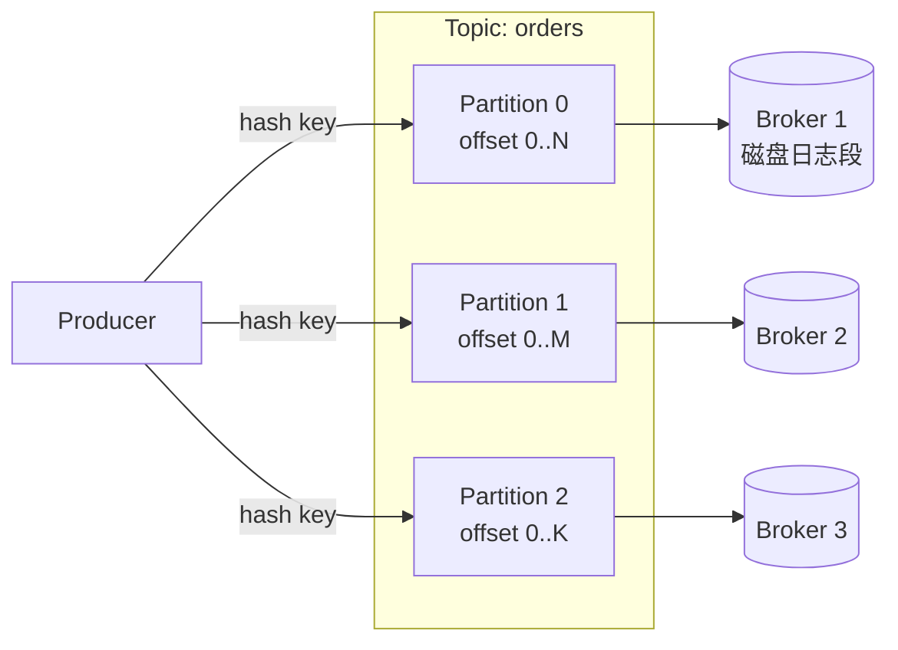
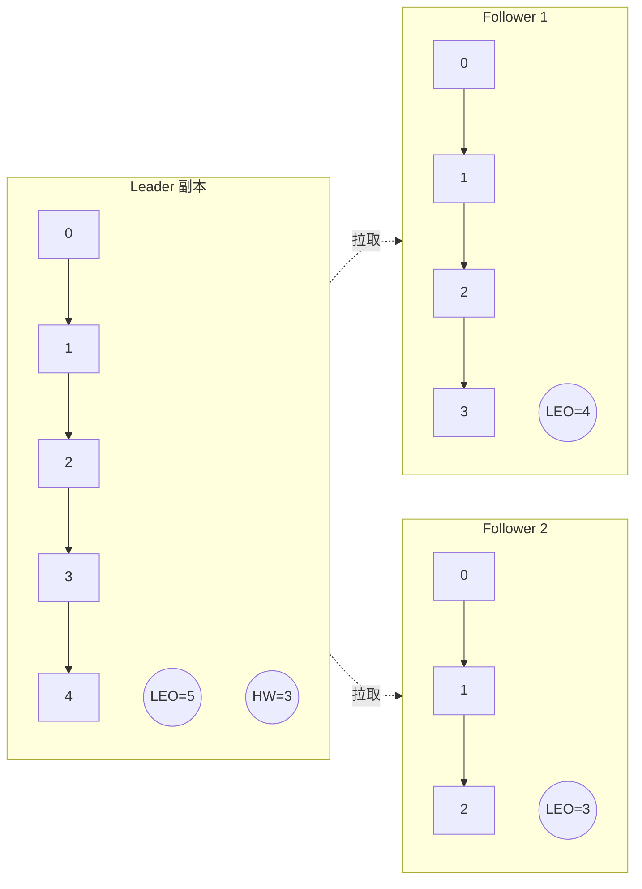
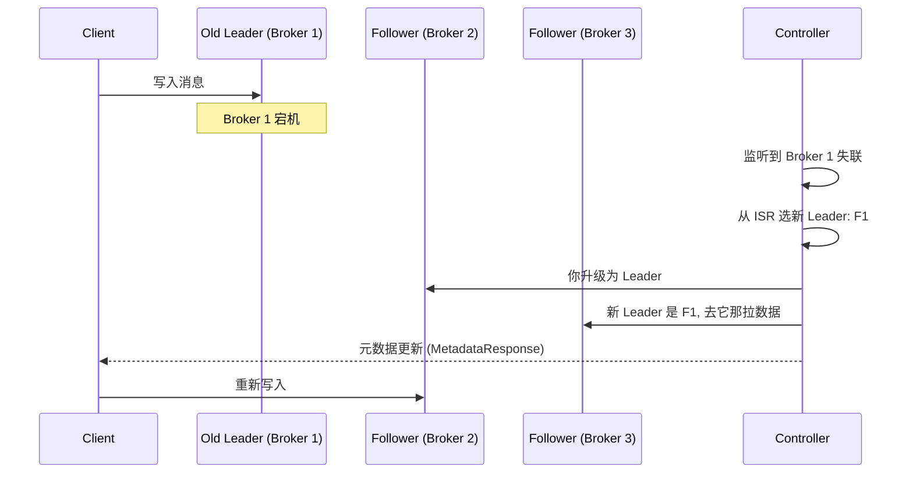

# Kafka Topic 分区、副本与 ISR 机制

Topic 是 Kafka 对外暴露的逻辑概念,但真正决定 Kafka 性能、可用性、一致性的,是底层的 **Partition** 和 **Replica** 机制。这一章把这套机制从物理结构、读写路径、故障转移到运维操作彻底讲透。

> [!note] 前置阅读
> 阅读本章前,建议先看完 [[01-基础-Kafka是什么与适用场景]] 和 [[02-基础-架构与核心概念总览]],对 Broker、Producer、Consumer 的角色已经熟悉。

---

## 一、Topic 与 Partition 的物理关系

Topic 在逻辑上是一个消息分类,在物理上它被切成 N 个 **Partition**,每个 Partition 是一段 **有序、不可变、只追加** 的 commit log。



每个 Partition 在磁盘上是一组 **日志段文件** (segment),命名形如 `00000000000000000000.log`,配套有 `.index` 和 `.timeindex`。

> [!tip] 顺序写就是 Kafka 高吞吐的根
> Partition 内部 **只追加**,这让 Kafka 把随机写变成了顺序写,机械盘也能跑出几百 MB/s 的吞吐。这一点和 RocketMQ、传统 MQ 全局有序的设计完全不同 — Kafka 用 "牺牲全局有序,换取吞吐和水平扩展" 的方式赢得了大数据生态。

**有序性保证**:Kafka 只保证 **同一个 Partition 内** 消息有序,跨 Partition 不保证。如果你需要 "同一个用户的订单严格有序",必须用 `userId` 作为 key,让同一 key 路由到同一 Partition。

---

## 二、分区数怎么定

分区数是 Kafka 设计里 **最常被问、最容易踩坑** 的参数。

### 影响因素

| 因素 | 关系 |
|------|------|
| 吞吐目标 | 单分区写入上限约 10-100 MB/s,总吞吐 = 单分区吞吐 × 分区数 |
| 消费者并发上限 | 同一 Consumer Group 内,一个 Partition 只能被一个 Consumer 实例消费 |
| 磁盘 IO | 分区越多,Broker 上打开的文件句柄、随机 IO 越多 |
| 故障恢复时间 | 分区越多,Controller 选举、Leader 切换耗时越长 |
| Producer 内存 | Producer 端会为每个 Partition 维护 batch 缓冲 |

### 经验公式

```
分区数 ≈ max(目标吞吐 / 单分区吞吐, 期望最大消费者并发)
```

举例:目标写入 200 MB/s,单分区写约 20 MB/s,消费侧期望最多 12 个实例并行 → 分区数取 **max(10, 12) = 12**。

> [!warning] 分区只能加,不能减
> Kafka 不支持减少分区。原因:减少分区意味着要丢弃或合并某个 Partition 的日志,而 offset、消息顺序、消费位点都会被破坏。**所以分区数宁可保守一点起步,后续按需扩,千万别一上来就开 1024 个。**

> [!danger] 加分区也有副作用
> 增加分区会改变 key → partition 的 hash 映射(默认 `hash(key) % partitions`),原来路由到 Partition 3 的 key 可能会跑到 Partition 7。如果业务依赖 "同 key 同分区" 的顺序保证,扩分区那一刻历史顺序会乱。生产环境扩分区前必须评估这一点。

---

## 三、Offset、LEO 与 HW

### 三个 offset 概念

- **消息 offset**:Partition 内每条消息的唯一编号,从 0 开始单调递增,**永不重用**。
- **LEO (Log End Offset)**:下一条待写入消息的 offset,等于当前最大 offset + 1。**每个副本都有自己的 LEO**。
- **HW (High Watermark)**:**已被所有 ISR 副本同步成功** 的最大 offset。消费者最多能读到 `HW - 1`。



上图:Leader 已经写到 offset 4(LEO=5),但 Follower2 只同步到 offset 2(LEO=3),所以 **HW = min(所有 ISR 副本 LEO) = 3**。消费者此刻只能看到 offset 0、1、2 三条消息。

> [!question] 为什么消费者只能读到 HW 之前?
> 因为 HW 之后的数据 **可能还没复制到足够多的副本**。一旦 Leader 挂了,新当选的 Leader 不一定有这些数据,消费者就会读到 "幻读" — 同一个 offset 第一次读到 A,第二次读到 B。HW 机制本质上是 Kafka 在 **副本一致性** 上的妥协方案。

---

## 四、Replica 副本机制

Kafka 通过多副本提供高可用。每个 Partition 配置 `replication.factor`(常见 3),意味着集群中有 3 份完全相同的日志,分布在 3 个不同的 Broker 上。

### 角色划分

- **Leader**:唯一处理读写请求的副本。
- **Follower**:从 Leader 主动 **拉取**(pull)消息追加到自己的日志,**不对客户端提供服务**。

> [!note] 为什么 Follower 不分担读?
> Kafka 选择 **Leader 独占读写**,简化一致性模型 — 消费者不会从滞后的 Follower 读到旧数据。代价是 Leader 节点压力大,所以要靠 Controller 把不同 Topic 的 Leader **均匀分布** 在所有 Broker 上。
>
> (注:Kafka 2.4+ 引入 `KIP-392` 允许 Follower 读,主要用于跨机房就近读,但默认仍是 Leader 读。)

---

## 五、ISR / OSR / AR

这三个概念是面试高频题。

| 缩写 | 全称 | 含义 |
|------|------|------|
| **AR** | Assigned Replicas | 一个 Partition 所有 **被分配的副本** 集合(包含 Leader 自己) |
| **ISR** | In-Sync Replicas | AR 中 **与 Leader 保持同步** 的副本集合 |
| **OSR** | Out-of-Sync Replicas | AR 中 **落后过多被踢出** 的副本集合 |

显然:**AR = ISR + OSR**。

### 进出 ISR 的判定

Kafka 用一个时间阈值判定 Follower 是否"跟得上":

```
replica.lag.time.max.ms = 30000  # 默认 30 秒
```

> [!example] ISR 判定规则
> 如果一个 Follower **超过 `replica.lag.time.max.ms` 没有向 Leader 发起 fetch 请求**,或者发起了但一直追不上 Leader 的 LEO,就会被踢出 ISR,进入 OSR。
> 反之,一旦 Follower 追上了 Leader 的 LEO,会被重新加入 ISR。

> [!warning] 老版本的坑
> 0.9 以前用 `replica.lag.max.messages`(按消息条数判定),问题是流量突增时所有 Follower 同时被踢出 ISR,整个集群陷入 "频繁出入 ISR" 的抖动。0.9 之后改成 **按时间判定**,这个问题才解决。

---

## 六、Leader 选举

Leader 挂了怎么办?Controller 会从 **ISR 列表** 中选一个新的 Leader,优先选 ISR 中第一个还活着的副本。

### unclean leader election:一致性 vs 可用性

```properties
# 默认值 (Kafka 2.4 之后)
unclean.leader.election.enable=false
```

> [!danger] 这是 CAP 选择题
> 当 **整个 ISR 都挂了**,只剩 OSR 副本存活:
> - `unclean.leader.election.enable=false`(**默认,选 CP**):Partition 直接 **不可用**,等 ISR 中至少一个副本恢复,保证不丢数据。
> - `unclean.leader.election.enable=true`(**选 AP**):允许从 OSR 中选 Leader,Partition 立即可用,**但会丢失 OSR 落后的那部分数据**。
>
> **金融、订单、计费类业务必须保持 false**;日志、监控、可丢数据的场景才可以打开。

### 选举流程时序



---

## 七、Controller 角色

整个 Kafka 集群里有 **且只有一个** Broker 担任 **Controller**,负责:

- 监听 Broker 上下线
- 触发分区 Leader 选举
- 管理 Topic 的创建/删除/分区重分配
- 把元数据变更广播给所有 Broker

### ZooKeeper 时代 vs KRaft 时代

| 维度            | ZK 模式 (旧) | KRaft 模式 (Kafka 3.3+ 生产可用)          |
| ------------- | --------- | ----------------------------------- |
| 元数据存储         | ZooKeeper | Kafka 内部 `__cluster_metadata` topic |
| Controller 选举 | ZK 临时节点抢锁 | Raft 协议选举                           |
| 启动速度          | 慢(几分钟)    | 快(几秒)                               |
| 单集群分区上限       | ~20 万     | 百万级                                 |
| 运维复杂度         | 需维护 ZK 集群 | 单一系统                                |

> [!tip] 新项目直接上 KRaft
> Kafka 4.0 已经移除 ZK 支持。新搭集群没有理由再用 ZK 模式。

---

## 八、Leader 自动均衡

Leader 全部聚集到少数 Broker 会导致热点。Kafka 默认开启:

```properties
auto.leader.rebalance.enable=true
leader.imbalance.check.interval.seconds=300
leader.imbalance.per.broker.percentage=10
```

每 5 分钟检查一次,若某个 Broker 上 "不是首选 Leader 的分区" 占比超过 10%,就触发 **preferred leader election**,把 Leader 切回最初分配的那个副本。

> [!warning] 生产建议关掉自动均衡
> 自动 rebalance 会引发短暂(秒级)的写入抖动。**大流量集群通常关掉它**,改成低峰期用 `kafka-leader-election.sh --election-type PREFERRED` 手动触发。

---

## 九、手动迁移分区: kafka-reassign-partitions.sh

新增 Broker 后,老 Topic 的分区不会自动搬过去,需要手动 reassign。

### 三步走

```bash
# 1. 生成迁移计划
cat > topics.json <<EOF
{"topics":[{"topic":"orders"}],"version":1}
EOF

kafka-reassign-partitions.sh \
  --bootstrap-server broker1:9092 \
  --topics-to-move-json-file topics.json \
  --broker-list "1,2,3,4,5" \
  --generate

# 2. 把上面输出的 "Proposed partition reassignment" 保存为 plan.json
# 执行迁移
kafka-reassign-partitions.sh \
  --bootstrap-server broker1:9092 \
  --reassignment-json-file plan.json \
  --execute \
  --throttle 50000000   # 限流 50MB/s, 避免压垮集群

# 3. 验证进度
kafka-reassign-partitions.sh \
  --bootstrap-server broker1:9092 \
  --reassignment-json-file plan.json \
  --verify
```

> [!danger] 务必加 throttle
> 不限流的 reassign 会把所有网卡带宽吃满,导致线上 Producer 写入超时、Consumer 拉取失败。**生产迁移必须配 `--throttle`**,完事再用 `--verify` 自动清除限流配置。

---

## 十、完整示例: 创建 3 副本 6 分区 Topic 并演示故障切换

### 创建 Topic

```bash
kafka-topics.sh --bootstrap-server broker1:9092 \
  --create \
  --topic order-events \
  --partitions 6 \
  --replication-factor 3 \
  --config min.insync.replicas=2 \
  --config unclean.leader.election.enable=false
```

### 查看分区分布

```bash
kafka-topics.sh --bootstrap-server broker1:9092 --describe --topic order-events
```

输出示例:

```
Topic: order-events  Partition: 0  Leader: 1  Replicas: 1,2,3  Isr: 1,2,3
Topic: order-events  Partition: 1  Leader: 2  Replicas: 2,3,1  Isr: 2,3,1
Topic: order-events  Partition: 2  Leader: 3  Replicas: 3,1,2  Isr: 3,1,2
...
```

### Java Producer 写入(Spring Boot)

```java
@Configuration
public class KafkaConfig {
    @Bean
    public ProducerFactory<String, String> producerFactory() {
        Map<String, Object> cfg = new HashMap<>();
        cfg.put(ProducerConfig.BOOTSTRAP_SERVERS_CONFIG, "broker1:9092,broker2:9092,broker3:9092");
        cfg.put(ProducerConfig.KEY_SERIALIZER_CLASS_CONFIG, StringSerializer.class);
        cfg.put(ProducerConfig.VALUE_SERIALIZER_CLASS_CONFIG, StringSerializer.class);
        cfg.put(ProducerConfig.ACKS_CONFIG, "all");          // 等所有 ISR 确认
        cfg.put(ProducerConfig.ENABLE_IDEMPOTENCE_CONFIG, true);
        cfg.put(ProducerConfig.RETRIES_CONFIG, Integer.MAX_VALUE);
        return new DefaultKafkaProducerFactory<>(cfg);
    }

    @Bean
    public KafkaTemplate<String, String> kafkaTemplate(ProducerFactory<String, String> pf) {
        return new KafkaTemplate<>(pf);
    }
}

@Service
public class OrderEventPublisher {
    @Autowired KafkaTemplate<String, String> kafka;

    public void send(String userId, String payload) {
        // 用 userId 作为 key, 保证同一用户路由到同一 Partition, 顺序消费
        kafka.send("order-events", userId, payload);
    }
}
```

### Python 对照 (confluent-kafka)

```python
from confluent_kafka import Producer

p = Producer({
    "bootstrap.servers": "broker1:9092,broker2:9092,broker3:9092",
    "acks": "all",
    "enable.idempotence": True,
    "retries": 2147483647,
})

def delivery(err, msg):
    if err:
        print(f"FAIL {err}")
    else:
        print(f"OK partition={msg.partition()} offset={msg.offset()}")

p.produce("order-events", key="user-42", value="paid", callback=delivery)
p.flush()
```

### Go 对照 (segmentio/kafka-go)

```go
w := &kafka.Writer{
    Addr:         kafka.TCP("broker1:9092", "broker2:9092", "broker3:9092"),
    Topic:        "order-events",
    Balancer:     &kafka.Hash{},        // 按 key hash 分区
    RequiredAcks: kafka.RequireAll,     // acks=all
}
defer w.Close()

w.WriteMessages(context.Background(), kafka.Message{
    Key:   []byte("user-42"),
    Value: []byte("paid"),
})
```

### 演示 Leader 切换

```bash
# 找到 Partition 0 的 Leader 所在 Broker (假设是 broker1)
# kill 它
docker kill kafka-broker1     # 或 systemctl stop kafka

# 立刻 describe, 观察 ISR 收缩和新 Leader 当选
kafka-topics.sh --bootstrap-server broker2:9092 --describe --topic order-events

# 输出会变成:
# Partition: 0  Leader: 2  Replicas: 1,2,3  Isr: 2,3
```

整个过程对 Producer **透明**:客户端会自动刷新 metadata,把请求改发到 Broker 2,期间最多丢失几次失败重试。

> [!tip] `min.insync.replicas` 是配套保险
> 上面创建 Topic 时设置了 `min.insync.replicas=2`。配合 `acks=all`,意思是 **ISR 至少有 2 个副本时,Producer 写入才被确认**。一旦 ISR 只剩 1 个(即 Leader 自己),Producer 会收到 `NotEnoughReplicasException`,**宁可写失败,也不丢数据**。

---

## 十一、常见面试题

> [!question] Q1: ISR 机制是什么?为什么需要它?
> ISR(In-Sync Replicas)是与 Leader 保持同步的副本集合。它解决了 "副本同步进度不一致" 的问题:
> - **判定标准**:`replica.lag.time.max.ms`(默认 30s)内有过 fetch 且追得上 LEO 的副本才在 ISR 内。
> - **作用**:HW 只取 ISR 内最小 LEO,保证 Leader 故障时新选出的 Leader 一定包含已确认的数据,避免数据丢失。
> - **配合 `acks=all` + `min.insync.replicas`**,提供 "至少 N 副本成功" 的强一致语义。

> [!question] Q2: HW 和 LEO 的区别?
> - **LEO** 是 **每个副本** 自己的下一条待写 offset。
> - **HW** 是 **整个 Partition** 已被所有 ISR 同步的最大 offset = `min(ISR 中所有副本的 LEO)`。
> - 消费者只能读到 `HW - 1`,LEO 到 HW 之间是 "已写但未对消费者可见" 的数据。

> [!question] Q3: 为什么 Kafka 不允许减少分区?
> - 减分区意味着要丢/合并某个 Partition 的数据,会破坏 **offset 单调性** 和 **消息顺序**。
> - 已经消费到某 offset 的 Consumer Group,位点会失效。
> - 实现复杂度极高、收益极低,Kafka 团队明确不做。**正确做法:新建一个分区数合适的 Topic,做数据迁移**。

> [!question] Q4: `acks=all` 一定不丢数据吗?
> 不一定。还要满足:
> 1. `replication.factor >= 3`
> 2. `min.insync.replicas >= 2`
> 3. `unclean.leader.election.enable=false`
> 4. Producer 端 `enable.idempotence=true` 且 `retries` 足够大
>
> 任何一条不满足,都可能在极端故障下丢数据。

> [!question] Q5: Controller 选举怎么做?
> - **ZK 模式**:所有 Broker 抢着在 ZK 创建 `/controller` 临时节点,谁先创建成功谁就是 Controller。挂了之后 ZK 通知大家重新抢。
> - **KRaft 模式**:专门的 Controller 节点用 **Raft 协议** 选举 Leader,元数据存在内部 topic `__cluster_metadata`,无需外部依赖。

> [!question] Q6: 为什么 Follower 不能对外提供读?
> 默认设计上,Follower 可能滞后 Leader,如果允许读会破坏 "读到最新 HW" 的语义。Kafka 选择简化一致性模型 — 所有读写都走 Leader。2.4+ 之后通过 KIP-392 支持 Follower fetch,**但主要用于跨机房就近读,以容忍一定的延迟换跨区带宽**。

---

## 十二、延伸阅读

- [[02-基础-架构与核心概念总览]] — 回顾 Broker / Producer / Consumer 整体角色
- [[04-基础-Producer发送流程与acks语义]] — `acks`、幂等、事务的完整路径
- [[05-基础-Consumer与消费者组Rebalance]] — Partition 与 Consumer 绑定关系、Rebalance 协议
- [[06-进阶-高水位HW与LeaderEpoch机制]] — Leader Epoch 如何修复 0.11 之前的 HW 截断 bug
- [[07-运维-Topic分区扩容与数据迁移实战]] — `kafka-reassign-partitions` 深度操作手册
- [[08-进阶-KRaft模式架构详解]] — 没有 ZK 之后,Kafka 元数据怎么管
- 官方文档: [Kafka Replication Design](https://kafka.apache.org/documentation/#replication)
- KIP-101: Alter Replication Protocol to use Leader Epoch
- KIP-392: Allow consumers to fetch from closest replica
- KIP-500: Replace ZooKeeper with a Self-Managed Metadata Quorum
