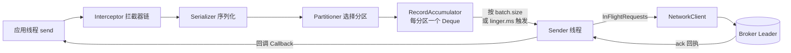
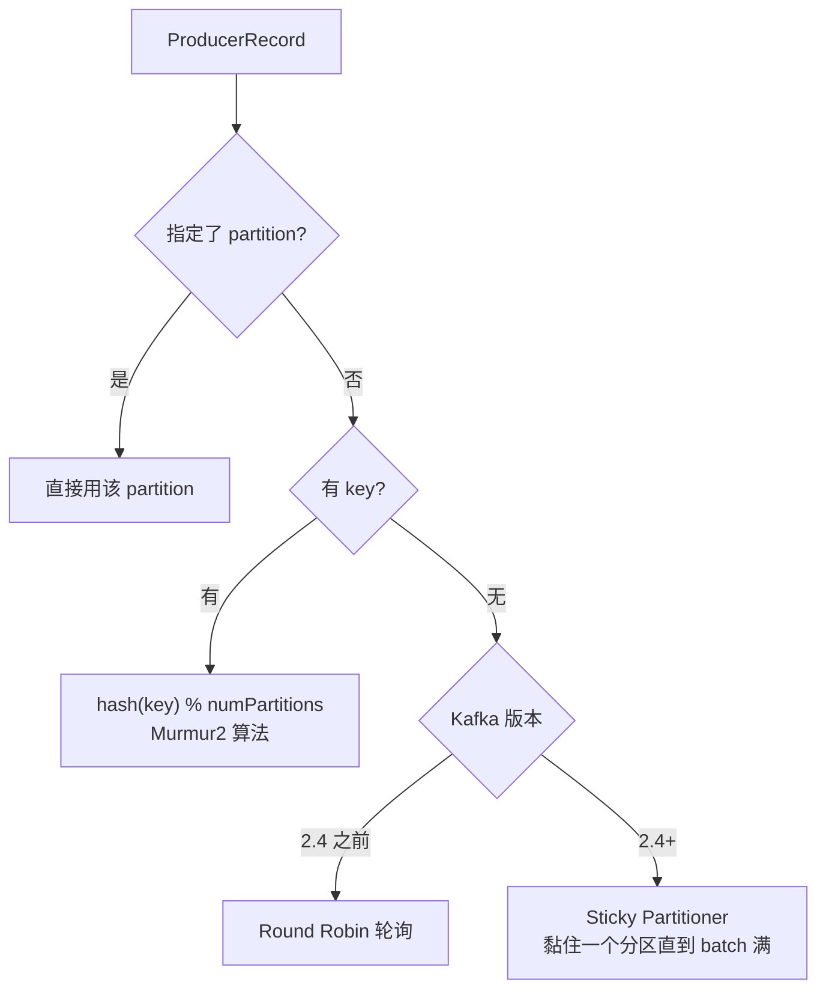
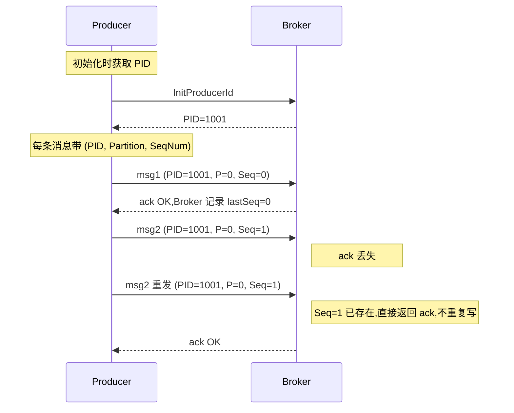
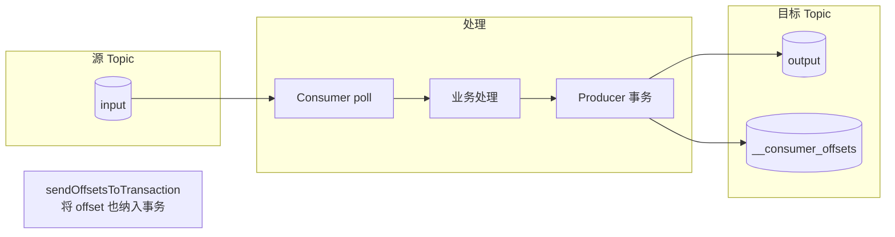

# 第 4 章 Producer 详解与可靠性

Producer 是 Kafka 数据进入集群的唯一入口。新人最容易写出"看起来能跑、压测一上就丢消息"的代码,根因几乎都在于不理解 Producer 的内部缓冲模型和 `acks`/幂等性这一套语义。本章把工作流程、参数、分区策略、幂等、事务、EOS、错误处理一次性讲透。

前置阅读: [[01-基础-Kafka是什么与核心概念]]、[[02-基础-架构与角色]]、[[03-基础-Topic与Partition设计]]。

---

## 1. Producer 的工作流程

很多人以为 `producer.send()` 调一下消息就直接发到 Broker 了。错。`send()` 只是把消息塞进本地一个内存缓冲区,真正的网络发送是另一个后台线程在做。理解这一点,后面所有参数才解释得通。



> [!note] 关键点
> - 应用线程只负责把消息攒到 `RecordAccumulator` 的双端队列里,**不阻塞网络**。
> - `Sender` 是单独的后台 IO 线程,从队列尾部取已满 batch 发出去。
> - `RecordAccumulator` 默认总大小由 `buffer.memory`(默认 32MB)控制,**满了之后 `send()` 会阻塞**,最长阻塞时间 `max.block.ms`(默认 60s)。

> [!warning] 新人坑
> 看到 `send()` 立刻返回就以为发送成功了。其实那只是 enqueue,真正成功必须看 Callback 回调或 Future 的结果。

---

## 2. 关键参数全景

### 2.1 必填三件套

| 参数 | 说明 |
|---|---|
| `bootstrap.servers` | 集群入口,**至少写 2 个**,防止单点宕机连不上 |
| `key.serializer` | key 序列化器,常见 `StringSerializer` |
| `value.serializer` | value 序列化器,可用 `ByteArraySerializer`、Avro、Protobuf |

### 2.2 acks - 决定可靠性的最关键参数

| acks 值 | 含义 | 吞吐 | 可靠性 | 适用场景 |
|---|---|---|---|---|
| `0` | 不等任何 ack,发出即成功 | 最高 | 最差,Broker 挂掉或网络丢包都不知道 | 日志埋点、监控指标 |
| `1` | 只等 Leader 落盘(PageCache)就 ack | 中 | 中,Leader 挂且未同步给 Follower 会丢 | 一般业务 |
| `all` / `-1` | 等所有 ISR 副本都同步成功 | 最低 | 最高 | 订单、支付等不能丢的场景 |

> [!danger] 经典误区
> `acks=all` 但 `min.insync.replicas=1`,等于 ISR 里只要 Leader 一个就算成功,**和 `acks=1` 没差别**。生产环境必须 `acks=all + min.insync.replicas>=2 + replication.factor>=3`,三者缺一不可。

### 2.3 重试相关

| 参数                    | 默认                  | 说明                              |
| --------------------- | ------------------- | ------------------------------- |
| `retries`             | `Integer.MAX_VALUE` | 重试次数,新版默认无限重试                   |
| `retry.backoff.ms`    | 100                 | 每次重试间隔                          |
| `delivery.timeout.ms` | 120000              | **真正的兜底**,从 send 到完成的总超时,超过就抛异常 |
| `request.timeout.ms`  | 30000               | 单次请求超时                          |

> [!tip] 推荐配置
> 不要去调 `retries`,改 `delivery.timeout.ms` 更直观。比如业务能容忍 2 分钟内重试到底,就把它设成 120s。

### 2.4 吞吐 vs 延迟的核心权衡

| 参数                 | 默认             | 含义                          |
| ------------------ | -------------- | --------------------------- |
| `batch.size`       | 16384(16KB)    | 单个分区 batch 满了就发             |
| `linger.ms`        | 0              | batch 没满也会等 N 毫秒再发,攒大 batch |
| `buffer.memory`    | 33554432(32MB) | 整个 Producer 的内存缓冲上限         |
| `compression.type` | none           | 压缩算法                        |

> [!example] 高吞吐场景调优
> ```properties
> batch.size=65536        # 64KB
> linger.ms=20            # 攒 20ms 再发
> compression.type=lz4    # 吞吐型压缩
> buffer.memory=67108864  # 64MB
> ```
> 这套配置在日志/埋点场景能轻松把吞吐推到几十万 TPS,代价是端到端延迟从 ~1ms 涨到 ~20ms。

### 2.5 压缩算法对比

| 算法 | 压缩率 | 压缩速度 | 解压速度 | 推荐场景 |
|---|---|---|---|---|
| `none` | 1.0 | - | - | 极低延迟、消息已压缩 |
| `gzip` | 高 | 慢 | 慢 | 存储敏感,CPU 不紧张 |
| `snappy` | 中 | 快 | 快 | 通用,Google 出品 |
| `lz4` | 中 | 很快 | 很快 | **吞吐优先,推荐默认** |
| `zstd` | 高 | 快 | 快 | Kafka 2.1+ 新出,综合最佳 |

> [!note] 压缩在哪端做
> Producer 端压缩,**Broker 直接落盘压缩后的数据**(零拷贝原样转发),Consumer 端解压。所以 Broker CPU 几乎不参与压缩,这是 Kafka 高吞吐的关键之一。如果 Producer 和 Broker `compression.type` 配置不一致,Broker 会**解压再用自己配置的算法重压**,CPU 飙升,千万别这么干。

### 2.6 max.in.flight.requests.per.connection

每个连接上**未收到响应**的请求最大数,默认 5。

> [!warning] 与顺序性的关系
> - 关闭幂等性时,如果 `retries>0` 且这个值 `>1`,**有重排序风险**(第 1 个失败重发时,第 2 个已经写入)。
> - 开启幂等性后(`enable.idempotence=true`,默认 true),Kafka 内部会保证 `<=5` 时仍然有序,无需手动调成 1。

---

## 3. 分区策略 Partitioner

消息到底进哪个 Partition,由 Partitioner 决定。



### 3.1 为什么 2.4 改成黏性分区

老版轮询的问题: **每条消息都换分区,导致每个分区的 batch 都凑不满 `batch.size`**,linger.ms 一到就被迫小 batch 发出去,吞吐很差。

黏性策略: 一直往同一个分区塞,直到 batch 满了或 linger 到了,再换下一个分区。**整体延迟没变,吞吐显著提升**。但单个分区会出现"短时间内集中收到一批数据"的小毛刺,通常无害。

### 3.2 自定义 Partitioner

```java
public class OrderPartitioner implements Partitioner {
    @Override
    public int partition(String topic, Object key, byte[] keyBytes,
                         Object value, byte[] valueBytes, Cluster cluster) {
        List<PartitionInfo> partitions = cluster.partitionsForTopic(topic);
        int numPartitions = partitions.size();
        if (key == null) {
            return ThreadLocalRandom.current().nextInt(numPartitions);
        }
        // 大客户单独走 0 号分区做优先级隔离
        String k = key.toString();
        if (k.startsWith("VIP_")) return 0;
        return Math.abs(k.hashCode() % (numPartitions - 1)) + 1;
    }
    @Override public void close() {}
    @Override public void configure(Map<String, ?> configs) {}
}
```

启用: `props.put("partitioner.class", "com.xxx.OrderPartitioner");`

---

## 4. 幂等性 Producer

**问题**: `acks=all + retries>0` 的场景下,如果 Broker 已落盘但 ack 在网络上丢了,Producer 会重发,导致**消息重复**。

**解法**: `enable.idempotence=true`(Kafka 3.0 起默认开启)。

### 4.1 原理



每个 `<PID, Partition>` 维护一个单调递增的 `Sequence Number`,Broker 端按分区做去重判断:
- `seq == lastSeq + 1`: 正常写入
- `seq <= lastSeq`: 重复消息,丢弃但返回成功
- `seq > lastSeq + 1`: 中间丢了消息,抛 `OutOfOrderSequenceException`

> [!warning] 幂等性的边界
> - **只保证单 Producer 单分区不重复**,跨分区、跨会话(Producer 重启 PID 变了)不保证。
> - 想要跨分区、跨会话的恰好一次,得用事务。

### 4.2 开启后的隐性约束

```properties
enable.idempotence=true
acks=all                                    # 强制
retries>0                                   # 强制
max.in.flight.requests.per.connection<=5    # 强制
```

不满足会直接报错。

---

## 5. 事务 Producer

事务解决两个问题:
1. **跨分区、跨 Topic 原子写**: 要么全成功,要么全失败。
2. **Consume-Transform-Produce 场景的 EOS**: 消费 + 处理 + 写回,offset 提交和消息写入在同一个事务里。

### 5.1 配置与 API

```java
Properties props = new Properties();
props.put("bootstrap.servers", "broker1:9092,broker2:9092");
props.put("key.serializer", StringSerializer.class.getName());
props.put("value.serializer", StringSerializer.class.getName());
props.put("enable.idempotence", true);
props.put("transactional.id", "order-tx-1"); // 必须唯一且稳定

KafkaProducer<String, String> producer = new KafkaProducer<>(props);
producer.initTransactions();                  // 启动时调一次

try {
    producer.beginTransaction();
    producer.send(new ProducerRecord<>("order", "k1", "下单"));
    producer.send(new ProducerRecord<>("inventory", "k1", "扣库存"));
    producer.send(new ProducerRecord<>("point", "k1", "加积分"));
    producer.commitTransaction();             // 一起可见
} catch (ProducerFencedException e) {
    producer.close();                         // 致命错误,只能关闭
} catch (KafkaException e) {
    producer.abortTransaction();              // 一起回滚
}
```

> [!tip] transactional.id 的取名
> 必须**业务稳定唯一**。同一个业务实例重启后必须用同一个 `transactional.id`,这样 Kafka 才能 fence 掉同名的旧实例(防止脑裂下双写)。常见做法是 `<服务名>-<实例编号>`。

### 5.2 原理简述

引入了**事务协调器 Transaction Coordinator**(每个 `transactional.id` 由特定 Broker 负责),所有事务状态写入内部 Topic `__transaction_state`。提交时给所有涉及分区写一条 `Control Message`(Commit/Abort 标记),Consumer 在 `read_committed` 模式下会跳过 Abort 的消息。

---

## 6. Exactly Once Semantics (EOS)

EOS 不是单一开关,而是**三件套合起来**:

| 层        | 配置                                              |
| -------- | ----------------------------------------------- |
| Producer | `enable.idempotence=true` + 事务 API              |
| Broker   | 默认支持,无需配置                                       |
| Consumer | `isolation.level=read_committed` + offset 提交进事务 |



关键 API: `producer.sendOffsetsToTransaction(offsets, consumerGroupMetadata)`,把消费位移作为事务的一部分一起提交。

详见 [[07-基础-Consumer与ConsumerGroup]]。

---

## 7. 同步 vs 异步发送

### 7.1 三种发送方式

```java
// 方式 1: Fire and Forget(不推荐生产用,等于看不到失败)
producer.send(record);

// 方式 2: 同步发送
try {
    RecordMetadata md = producer.send(record).get();
    log.info("offset={} partition={}", md.offset(), md.partition());
} catch (Exception e) {
    log.error("send failed", e);
}

// 方式 3: 异步 + Callback(推荐)
producer.send(record, (metadata, exception) -> {
    if (exception != null) {
        log.error("send failed key={}", record.key(), exception);
        // 写入死信、报警、降级
    } else {
        log.debug("ok p={} o={}", metadata.partition(), metadata.offset());
    }
});
```

> [!warning] Callback 里千万别做重活
> Callback 在 **Sender 线程** 上执行,做 IO/锁/重逻辑会拖慢整个 Producer 吞吐。复杂处理扔到业务线程池里。

### 7.2 Python 对照

```python
from confluent_kafka import Producer

p = Producer({
    'bootstrap.servers': 'broker1:9092,broker2:9092',
    'acks': 'all',
    'enable.idempotence': True,
    'compression.type': 'lz4',
    'linger.ms': 20,
})

def delivery(err, msg):
    if err:
        print(f'fail: {err}')
    else:
        print(f'ok p={msg.partition()} o={msg.offset()}')

p.produce('order', key='k1', value='下单', callback=delivery)
p.flush()   # 程序退出前必须调,否则缓冲区里的消息会丢
```

### 7.3 Go 对照

```go
w := &kafka.Writer{
    Addr:         kafka.TCP("broker1:9092", "broker2:9092"),
    Topic:        "order",
    Balancer:     &kafka.Hash{},
    RequiredAcks: kafka.RequireAll,
    Async:        false,
    Compression:  kafka.Lz4,
    BatchTimeout: 20 * time.Millisecond,
}
defer w.Close()

err := w.WriteMessages(ctx, kafka.Message{Key: []byte("k1"), Value: []byte("下单")})
if err != nil { log.Fatal(err) }
```

---

## 8. 错误分类与处理

| 类别 | 典型异常 | 是否自动重试 | 处理建议 |
|---|---|---|---|
| 可重试 | `LeaderNotAvailableException`、`NotEnoughReplicasException`、`NetworkException` | 是 | 让客户端自己重试,设好 `delivery.timeout.ms` |
| 不可重试 | `SerializationException`、`RecordTooLargeException`、`InvalidTopicException` | 否 | Callback 里捕获,落死信表,告警 |
| 致命 | `ProducerFencedException`、`OutOfOrderSequenceException` | 否 | 必须关闭 Producer 重建 |

> [!example] 死信处理模式
> ```java
> producer.send(record, (md, ex) -> {
>     if (ex == null) return;
>     if (ex instanceof RetriableException) {
>         // 已经被自动重试过仍失败,落到死信 Topic
>         dlqProducer.send(new ProducerRecord<>("order.dlq", record.key(), record.value()));
>     } else {
>         // 不可重试,直接进死信
>         dlqProducer.send(new ProducerRecord<>("order.dlq", record.key(), record.value()));
>         alert.fire("kafka send fatal: " + ex.getMessage());
>     }
> });
> ```

---

## 9. 常见坑总结

> [!danger] 高频踩雷清单
> 1. **`acks=all` 配 `min.insync.replicas=1`**: 等于没配可靠性。三副本最少配 `min.insync.replicas=2`。
> 2. **`batch.size` 设到几 MB**: 内存放大几十倍,反而不容易凑满,延迟也涨。一般 16KB~64KB。
> 3. **`linger.ms=0` 还嫌吞吐低**: 完全没攒批的机会,实测把 `linger.ms` 调成 5~20ms 吞吐能涨好几倍。
> 4. **Producer 和 Broker 压缩算法不一致**: Broker 解压重压,CPU 直接打满。
> 5. **每条消息 new 一个 Producer**: Producer 是线程安全的重对象,**全局共享一个实例**就够。
> 6. **`transactional.id` 用 UUID 随机生成**: 每次启动一个新事务身份,Coordinator 状态膨胀,fence 也失效。
> 7. **Callback 里同步写 DB**: 拖死 Sender 线程,整体吞吐崩盘。
> 8. **不调 `flush()` 或 `close()` 就退出进程**: 缓冲区里几千条消息直接丢。

---

## 10. 常见面试题

> [!question] Q1: Kafka Producer 怎么保证消息不丢?
> 三层一起做:
> - **Producer**: `acks=all` + `enable.idempotence=true` + `retries` 足够大(或 `delivery.timeout.ms` 足够长) + 用 Callback/同步发送确认。
> - **Broker**: `replication.factor>=3` + `min.insync.replicas>=2` + `unclean.leader.election.enable=false`。
> - **Consumer**: 关闭自动提交,业务处理完再手动提交 offset。
> 任何一层缺位都不算"不丢"。

> [!question] Q2: 怎么保证消息不重复?
> - **链路上不重发**: 幂等性 Producer(`enable.idempotence=true`),Broker 用 `(PID, Partition, Seq)` 去重。
> - **跨分区原子性**: 事务 Producer。
> - **真正的端到端 EOS**: Producer 幂等/事务 + Consumer `read_committed` + offset 进事务。
> - **业务兜底**: 不管中间件吹得多稳,业务侧都应该做幂等键(订单号、消息 ID),数据库唯一索引兜底。

> [!question] Q3: 黏性分区为什么改、改了之后有什么影响?
> 老版无 key 时是轮询,导致每个分区的 batch 都凑不满,小批次发送严重拖累吞吐。2.4 引入 Sticky Partitioner,一直黏一个分区直到 batch 满或 linger 到,再换。**吞吐显著提升,端到端延迟基本不变,代价是单个分区会有短时数据集中**,在分区数较多时无感。

> [!question] Q4: 事务 Producer 的原理是什么?
> - 引入事务协调器(Transaction Coordinator)和内部 Topic `__transaction_state` 管事务状态。
> - 每个 `transactional.id` 启动时拿到一个递增的 epoch,旧 epoch 的 Producer 会被 fence(防脑裂)。
> - 提交时给所有涉及分区写 Commit 标记(Control Message),Consumer 在 `read_committed` 下跳过 Abort 的消息。
> - 配合 `sendOffsetsToTransaction` 把消费 offset 也纳入事务,实现 Consume-Transform-Produce 的 EOS。

> [!question] Q5: max.in.flight.requests.per.connection 设成几?为什么?
> 默认 5。开启幂等性后 Kafka 内部会保证 <=5 仍然有序,**不需要降到 1**。关闭幂等性 + `retries>0` + 该值 >1 时才有重排序风险。生产环境直接保持默认 5 即可。

---

## 11. 延伸阅读

- [[03-基础-Topic与Partition设计]]: 分区数怎么定,直接影响 Producer 吞吐天花板
- [[05-基础-Broker与副本机制ISR]]: 理解 `acks=all` 背后的 ISR 同步语义
- [[06-基础-存储引擎与零拷贝]]: 压缩消息为什么能直接落盘转发
- [[07-基础-Consumer与ConsumerGroup]]: `read_committed` 隔离级别、EOS 的消费侧
- [[10-进阶-Kafka事务与EOS深入]]: 事务协调器、`__transaction_state`、两阶段提交细节
- [[12-进阶-性能调优Producer与Broker]]: batch / linger / 压缩 的实战压测数据
- 官方文档: [Kafka Producer Configs](https://kafka.apache.org/documentation/#producerconfigs)
- KIP-98: Exactly Once Delivery and Transactional Messaging
- KIP-480: Sticky Partitioner
