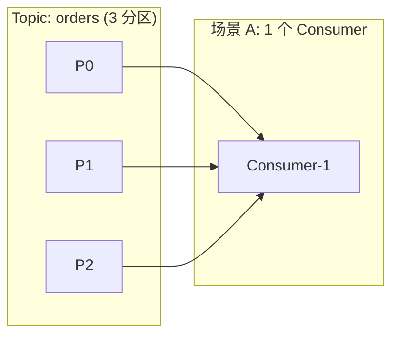
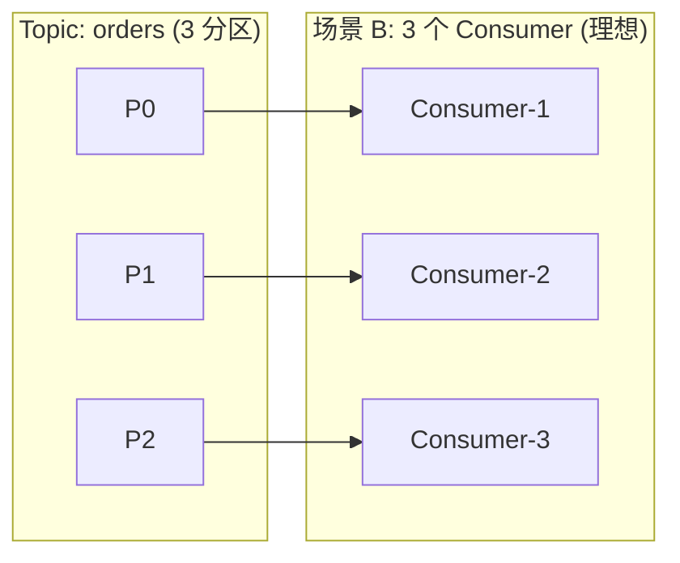
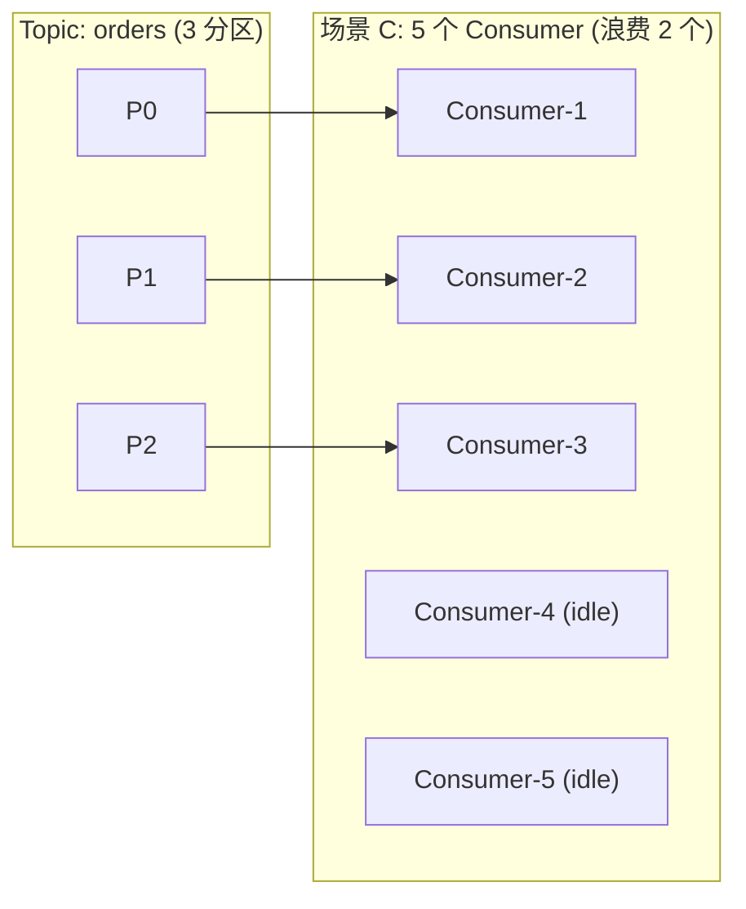
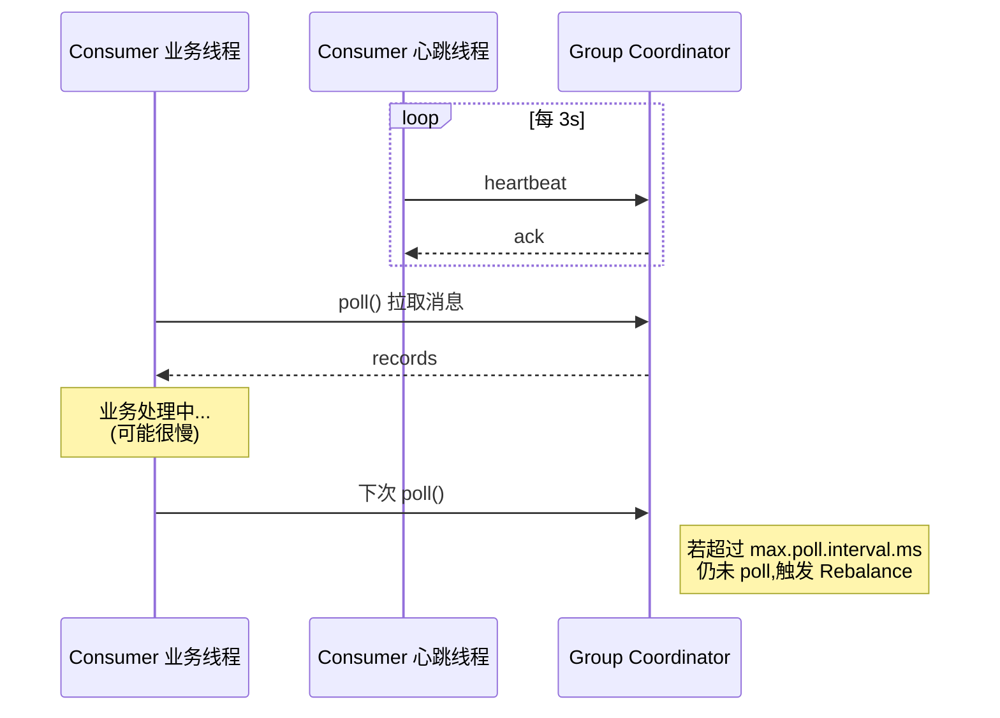
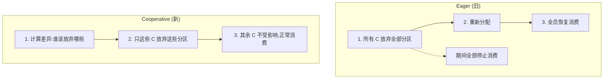
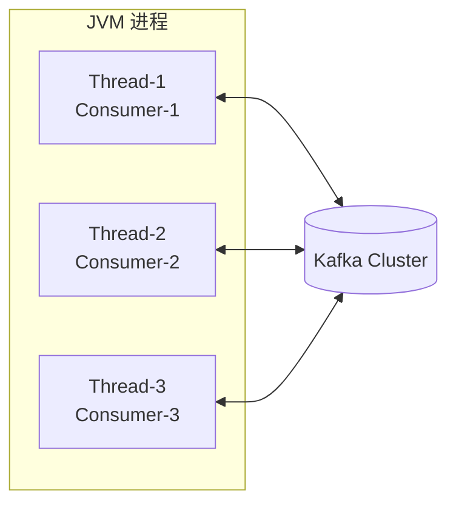
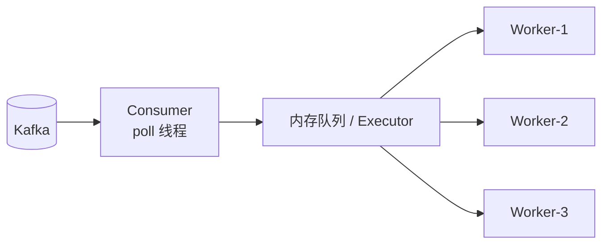

# 第 5 章 Consumer 与消费者组

接续 [[04-基础-Producer发送流程与可靠性]],Producer 把消息打到 Broker 的分区里,接下来要回答另一半问题: **谁来消费?怎么消费?多个消费者怎么协调?**

Kafka 的设计哲学在消费者侧体现得淋漓尽致 -- 它不像 RabbitMQ 那样由 Broker 推消息,而是 **Consumer 主动 poll**,并通过 **Consumer Group** 这一抽象,优雅地同时满足了 "队列模型(P2P)" 和 "发布订阅模型(Pub/Sub)" 两种语义。

---

## 一、Consumer Group 的核心思想

一句话定义:

> [!note] 核心规则
> **一个分区(Partition)在同一时刻,只能被同一个 Consumer Group 内的一个 Consumer 实例消费。**
> 但同一个分区可以被不同 Group 各自独立消费。

这条规则推导出 Kafka 消费侧的所有行为:

| 想要的语义 | 怎么做 |
|---|---|
| 队列模型(消息只被处理一次) | 所有 Consumer 加入**同一个 Group** |
| 广播模型(每个订阅者都收到全量消息) | 每个 Consumer 用**不同 Group** |
| 横向扩展消费能力 | 在同一个 Group 内**加更多 Consumer**,但上限是分区数 |
| 容错 | 某个 Consumer 挂了,它持有的分区会 Rebalance 给同 Group 其他 Consumer |

### 1.1 三种数量关系图解

假设一个 Topic 有 **3 个分区**:







> [!warning] 推论
> **消费者数量 > 分区数时,多出的 Consumer 永远处于 idle 状态,白白浪费资源。**
> 所以容量规划时,分区数是消费并行度的**上限**。想再扩,要么加分区(代价不小,见 [[03-基础-Topic与Partition深入]]),要么在单个 Consumer 内部做多线程处理(见后文)。

---

## 二、poll() 模型与心跳机制

Kafka Consumer 是 **pull 模型**: Consumer 自己控制节奏,循环调用 `poll(timeout)` 拉取消息。这与 RabbitMQ 的 push 完全不同。

### 2.1 为什么是 pull?

- Consumer 自己控制消费速度,慢的 Consumer 不会被 Broker 压垮;
- 支持批量拉取(`max.poll.records`),吞吐高;
- Broker 实现更简单,只需要按 offset 顺序返回数据。

### 2.2 三个关键超时参数

这是面试高频考点,务必理清楚:

| 参数 | 默认值 | 含义 |
|---|---|---|
| `heartbeat.interval.ms` | 3 s | Consumer 后台线程向 Group Coordinator 发心跳的频率 |
| `session.timeout.ms` | 45 s (新版) / 10 s (旧版) | Coordinator 多久收不到心跳就认为 Consumer 死了 |
| `max.poll.interval.ms` | 5 min | 两次 `poll()` 之间允许的最长间隔 |

> [!tip] 三者关系
> - `heartbeat.interval.ms` < `session.timeout.ms` (一般是 1/3)
> - **心跳由后台线程发**,即使你的业务线程正在处理消息,心跳照常发,所以 `session.timeout` 主要检测**进程崩溃 / 网络断开**;
> - **`max.poll.interval.ms` 检测的是业务逻辑卡死**,如果你处理一批消息超过这个时间,Consumer 会被踢出 Group,触发 Rebalance。



> [!danger] 典型坑
> 业务方写了个消费方法,每条消息要调外部 API 平均 2 秒,一批拉 500 条 = 1000 秒,远超 `max.poll.interval.ms = 300s`。结果 Consumer 被反复踢出 Group,Rebalance 风暴,消费完全卡住。
> **解法**: 减小 `max.poll.records`,或调大 `max.poll.interval.ms`,或在业务侧异步化处理(但要小心 offset 提交,见后文)。

---

## 三、Rebalance:消费者组的重新分配

### 3.1 触发条件

> [!example] Rebalance 触发的三大类
> 1. **成员变化**: 新 Consumer 加入、Consumer 主动离开、Consumer 被判定死亡(超过 `session.timeout.ms` 或 `max.poll.interval.ms`)。
> 2. **订阅 Topic 变化**: 用正则订阅时,有新 Topic 匹配上了。
> 3. **分区数变化**: Topic 的分区数被增加(分区数只能加不能减)。

### 3.2 Rebalance 协议演进

| 协议 | 时间线 | 工作方式 | 代价 |
|---|---|---|---|
| **Eager Rebalance** | Kafka 早期 | "Stop-the-world":所有 Consumer 先放弃**全部**分区,然后重新分配 | 整个 Group 在 Rebalance 期间**完全停止消费**,慢 |
| **Cooperative / Incremental Cooperative** | Kafka 2.4+ | 只让**受影响的分区**重新分配,其他分区继续消费 | 分两轮 Rebalance,但每轮只动一小部分,**消费几乎不中断** |



> [!tip] 实战建议
> 新项目一律设置 `partition.assignment.strategy = CooperativeStickyAssignor`,几乎是无脑提升。

### 3.3 分区分配策略

Kafka 内置了 4 种 `partition.assignment.strategy`:

| 策略 | 思路 | 优点 | 缺点 |
|---|---|---|---|
| **Range** (默认,旧) | 按 Topic 维度,把分区按范围切分给 Consumer | 简单 | Topic 数多时分配不均,前面的 Consumer 负担重 |
| **RoundRobin** | 所有 Topic 的所有分区一起轮询分配 | 总体均匀 | Rebalance 时变动大 |
| **Sticky** | 在均匀的前提下,尽可能保持原有分配不变 | Rebalance 代价小 | 实现复杂 |
| **CooperativeSticky** | Sticky 的协议升级版,配合 Cooperative Rebalance | **强烈推荐** | 需要 2.4+ |

---

## 四、Offset 管理

Offset(位移)是 Consumer 在分区上的"读到哪儿了"的书签。这是 Kafka 消费侧最容易出问题的地方。

### 4.1 `__consumer_offsets`:存 offset 的内部 Topic

新版 Kafka 把 offset 存在一个**内部 Topic** 里,名叫 `__consumer_offsets`,默认 50 个分区。

- key: `(group_id, topic, partition)`
- value: `offset + 元数据`
- 通过 `group_id` 的 hash 决定落在哪个分区 -> 哪台 Broker 上的副本就是这个 Group 的 **Group Coordinator**。

> [!note]
> 这就是为什么 Group Coordinator 是按 Group 分散在不同 Broker 上的 -- 天然均衡。

### 4.2 自动提交 vs 手动提交

#### 自动提交(默认)

```properties
enable.auto.commit=true
auto.commit.interval.ms=5000
```

简单,但有两个坑:

> [!danger] 自动提交的两大风险
> 1. **重复消费**: 拉了 100 条,处理到第 50 条时崩了,但前面 5 秒内可能已经提交了 offset=100,重启后从 100 开始 -> 50~100 丢失;**或者**还没到 5 秒,offset 还是 0,重启后从 0 开始 -> 0~50 重复处理。
> 2. **丢消息**: 拉到消息但还没处理就提交,业务失败后没法重试。

#### 手动提交(推荐)

```java
enable.auto.commit=false
```

然后业务自己决定何时提交:

| 方法 | 同步/异步 | 行为 |
|---|---|---|
| `commitSync()` | 同步阻塞 | 失败会自动重试,**慢但可靠** |
| `commitAsync()` | 异步 | 不阻塞,**快但失败不会重试**(避免覆盖更新的 offset) |
| `commitSync(Map<TopicPartition, OffsetAndMetadata>)` | 同步 | 提交**指定**分区的指定 offset,精细控制 |

> [!tip] 最佳实践组合拳
> 平时用 `commitAsync()`,Consumer 即将关闭时用 `commitSync()` 兜底。

```java
try {
    while (running.get()) {
        ConsumerRecords<String, String> records = consumer.poll(Duration.ofMillis(1000));
        for (ConsumerRecord<String, String> r : records) {
            process(r);
        }
        consumer.commitAsync((offsets, ex) -> {
            if (ex != null) log.warn("async commit failed", ex);
        });
    }
} finally {
    try {
        consumer.commitSync();   // 关闭前同步兜底
    } finally {
        consumer.close();
    }
}
```

### 4.3 提交特定 offset

如果一批消息里只处理成功了一部分,可以精确提交:

```java
Map<TopicPartition, OffsetAndMetadata> offsets = new HashMap<>();
offsets.put(
    new TopicPartition("orders", 0),
    new OffsetAndMetadata(record.offset() + 1, "processed-by-host-A")
);
consumer.commitSync(offsets);
```

> [!warning] 注意 +1
> 提交的 offset 是**下一次该读的位置**,所以是 `record.offset() + 1`。这个 off-by-one 错过无数次,记牢。

---

## 五、从指定位置消费

`auto.offset.reset` 决定**没有已提交 offset 时**(新 Group / offset 过期被删)从哪里开始:

| 取值 | 行为 | 适用场景 |
|---|---|---|
| `earliest` | 从分区最早可用消息开始 | 数据补跑、ETL |
| `latest` (默认) | 从最新位置开始,只消费新消息 | 在线业务 |
| `none` | 找不到 offset 直接抛异常 | 严格场景,强迫显式处理 |

运行时也可以**任意跳**:

```java
TopicPartition tp = new TopicPartition("orders", 0);
consumer.assign(List.of(tp));         // 注意:用 assign 不要用 subscribe
consumer.seek(tp, 12345L);            // 跳到指定 offset
consumer.seekToBeginning(List.of(tp)); // 跳到开头
consumer.seekToEnd(List.of(tp));       // 跳到末尾
// 按时间戳找 offset
Map<TopicPartition, OffsetAndTimestamp> map =
    consumer.offsetsForTimes(Map.of(tp, System.currentTimeMillis() - 3600_000));
```

---

## 六、隔离级别 `isolation.level`

配合事务 Producer(见 [[04-基础-Producer发送流程与可靠性]] 末尾)使用:

| 取值 | 行为 |
|---|---|
| `read_uncommitted` (默认) | 所有消息都能读到,包括事务中尚未提交、甚至已 abort 的 |
| `read_committed` | 只能读到**已提交**的事务消息,abort 的事务消息会被 Consumer 透明过滤 |

> [!question] 为什么默认是 read_uncommitted?
> 因为大部分场景没用事务 Producer,默认值省去等待事务提交的延迟。一旦上游用了 EOS(Exactly Once Semantics),消费侧务必改成 `read_committed`,否则会读到脏数据。

---

## 七、多线程消费模型

Kafka Consumer 实例**不是线程安全的**,这是设计上的硬约束。所以有两种主流模型:

### 模型 A:一个线程一个 Consumer(推荐)



> [!tip] 优点
> - 实现简单,offset 提交清晰
> - 一个 Consumer 卡住不影响另一个
> - 直接通过启动 N 个 Consumer 实现并行

缺点是: 线程数(Consumer 数) ≤ 分区数,并行度受限于分区数。

### 模型 B:单 Consumer + 多 Worker 处理



> [!danger] 模型 B 的核心难题:offset 怎么提交?
> - 如果 Worker 还没处理完就提交 offset -> 崩溃后**丢消息**
> - 如果等所有 Worker 都处理完才提交 -> 退化成串行,失去意义
> - 如果按 Worker 完成顺序提交 -> **乱序**,可能跳过未完成的较低 offset
>
> 通常做法: **每个分区一个 Worker**,Worker 内部串行,提交时按分区维度的 high-water-mark。或者用 [Reactive 风格](https://github.com/reactor/reactor-kafka) 框架托管。

---

## 八、完整示例

### 8.1 原生 Java Consumer

```java
Properties props = new Properties();
props.put("bootstrap.servers", "kafka1:9092,kafka2:9092");
props.put("group.id", "order-service");
props.put("key.deserializer", "org.apache.kafka.common.serialization.StringDeserializer");
props.put("value.deserializer", "org.apache.kafka.common.serialization.StringDeserializer");
props.put("enable.auto.commit", "false");
props.put("auto.offset.reset", "earliest");
props.put("max.poll.records", "100");
props.put("max.poll.interval.ms", "300000");
props.put("session.timeout.ms", "45000");
props.put("partition.assignment.strategy",
    "org.apache.kafka.clients.consumer.CooperativeStickyAssignor");
props.put("isolation.level", "read_committed");

try (KafkaConsumer<String, String> consumer = new KafkaConsumer<>(props)) {
    consumer.subscribe(List.of("orders"));
    while (!Thread.currentThread().isInterrupted()) {
        ConsumerRecords<String, String> records = consumer.poll(Duration.ofSeconds(1));
        if (records.isEmpty()) continue;

        for (ConsumerRecord<String, String> r : records) {
            try {
                handleOrder(r.value());
            } catch (Exception e) {
                log.error("handle failed offset={}", r.offset(), e);
                // 业务决策:重试 / 入死信队列 / 直接跳过
            }
        }
        consumer.commitAsync();
    }
}
```

### 8.2 Spring Kafka `@KafkaListener`

`application.yml`:

```yaml
spring:
  kafka:
    bootstrap-servers: kafka1:9092,kafka2:9092
    consumer:
      group-id: order-service
      enable-auto-commit: false
      auto-offset-reset: earliest
      max-poll-records: 50
      properties:
        isolation.level: read_committed
        partition.assignment.strategy: org.apache.kafka.clients.consumer.CooperativeStickyAssignor
    listener:
      ack-mode: MANUAL_IMMEDIATE
      concurrency: 3   # 启动 3 个 Consumer 线程
      type: BATCH      # 批量消费
```

Listener:

```java
@Component
public class OrderListener {

    @KafkaListener(topics = "orders", groupId = "order-service")
    public void onBatch(List<ConsumerRecord<String, String>> records, Acknowledgment ack) {
        for (ConsumerRecord<String, String> r : records) {
            try {
                process(r);
            } catch (Exception e) {
                log.error("offset={} failed", r.offset(), e);
                // 此时 ack 还没调,失败可重试整批;
                // 若要更精细的 per-record ack,用 ErrorHandler + DeadLetterPublishingRecoverer
            }
        }
        ack.acknowledge();   // 手动提交本批
    }
}
```

### 8.3 Python(`confluent-kafka`)对照

```python
from confluent_kafka import Consumer

c = Consumer({
    "bootstrap.servers": "kafka1:9092",
    "group.id": "order-service",
    "enable.auto.commit": False,
    "auto.offset.reset": "earliest",
    "partition.assignment.strategy": "cooperative-sticky",
})
c.subscribe(["orders"])

try:
    while True:
        msg = c.poll(1.0)
        if msg is None: continue
        if msg.error():
            print(msg.error()); continue
        process(msg.value())
        c.commit(message=msg, asynchronous=True)
finally:
    c.close()
```

### 8.4 Go(`segmentio/kafka-go`)对照

```go
r := kafka.NewReader(kafka.ReaderConfig{
    Brokers:        []string{"kafka1:9092"},
    GroupID:        "order-service",
    Topic:          "orders",
    MinBytes:       10e3,
    MaxBytes:       10e6,
    CommitInterval: 0, // 0 = 手动提交
})
defer r.Close()
ctx := context.Background()
for {
    m, err := r.FetchMessage(ctx)
    if err != nil { break }
    if err := handle(m); err == nil {
        _ = r.CommitMessages(ctx, m)
    }
}
```

---

## 九、消息堆积:排查与处理

> [!example] 排查思路
> 1. `kafka-consumer-groups.sh --describe --group order-service` 看 `LAG`(每个分区落后多少条);
> 2. 看哪些分区 LAG 大: 个别分区大 -> 数据倾斜(key 选得差);所有分区都大 -> 整体消费能力不足;
> 3. 看 Consumer 端: CPU?GC?业务慢 SQL?外部依赖?
> 4. 看 Rebalance 日志: 是否在反复 Rebalance?

> [!tip] 应急处理
> - **临时**: 加 Consumer 实例(直到等于分区数)、调大 `max.poll.records`、关闭非关键消费逻辑;
> - **中期**: 业务异步化、批量写库、加缓存;
> - **长期**: 加分区(注意 key hash 路由会变,有顺序要求的业务慎重)、拆 Topic。

> [!warning] 千万别这么干
> 1. 不要随便 `seek` 到 latest 跳过堆积消息 -- **数据丢了不可恢复**,除非业务允许;
> 2. 不要一边在线消费一边手动改 `__consumer_offsets`;
> 3. 加分区会破坏现有 key 的分区路由,有顺序依赖时务必先评估。

---

## 十、常见坑总结

| 坑 | 表象 | 解决 |
|---|---|---|
| `max.poll.interval.ms` 太短 | 频繁 Rebalance,日志一堆 `member ... is leaving` | 减小 `max.poll.records` 或调大该参数 |
| 自动提交 + 慢业务 | 消息处理一半重启,数据丢失 | 改手动提交 |
| Consumer 比分区多 | 部分实例 idle | 加分区或减实例 |
| 没用 CooperativeSticky | 一次 Rebalance 全员停顿几秒到几十秒 | 升级到 2.4+ 并配置 |
| Worker 模型 offset 乱提 | 偶发丢消息,难复现 | 改一线程一 Consumer,或按分区做 high-watermark |
| Group 频繁切换 ID 测试 | offset 不复用,重复消费海量历史数据 | 测试用固定 Group + `latest` 起点 |
| Consumer 部署在容器,JVM OOM 被 K8s 重启 | Rebalance 风暴 | 看 GC,调 heap,看是不是一批拉太多 |

---

## 十一、常见面试题

> [!question] Q1: Rebalance 的过程是怎样的?
>
> 1. Group Coordinator(某个 Broker)检测到成员变化;
> 2. 通知组内所有 Consumer **revoke**(放弃)分区;
> 3. 所有 Consumer 重新发 `JoinGroup` 请求,Coordinator 选出 **Group Leader**(第一个加入的 Consumer);
> 4. Leader 根据 `partition.assignment.strategy` 计算分配方案,发回给 Coordinator;
> 5. Coordinator 通过 `SyncGroup` 把分配结果广播给所有成员;
> 6. Consumer 开始消费分配到的分区。
>
> Cooperative 协议把 2~6 分成两轮,第一轮只 revoke "需要移动" 的分区,大大减少停顿。

> [!question] Q2: CooperativeSticky 好在哪?
>
> - **增量**: 只动需要动的分区,其他分区在 Rebalance 期间继续消费;
> - **黏性**: 尽量保留原分配,减少缓存失效、状态迁移成本;
> - **少停顿**: 用户视角几乎感知不到 Rebalance。

> [!question] Q3: offset 提交策略怎么选?
>
> - 业务允许少量重复(幂等设计) -> `enable.auto.commit=true` 也行;
> - 不允许重复、不允许丢失 -> 手动提交,且业务自身要做幂等(因为崩溃时刻仍可能重复);
> - 极致性能 -> `commitAsync` 为主,close 前 `commitSync` 兜底;
> - 跨业务事务一致性 -> 用事务 Producer + `read_committed`,把消费结果再写回 Kafka,offset 也在事务里提交。

> [!question] Q4: Consumer Group 和 Topic 的关系?
>
> Group 不属于任何特定 Topic,它是一个**消费者编组的标识**。同一个 Group 可以订阅多个 Topic,Coordinator 会统一管理这个 Group 下所有 Topic 所有分区的分配。

> [!question] Q5: 为什么 Kafka 不支持消费者数 > 分区数的扩展?
>
> 因为"分区内有序"是 Kafka 的核心保证,如果一个分区被两个 Consumer 同时读,就要引入加锁或外部协调,而这会摧毁分区天然的并行模型。Kafka 的设计选择是: **用分区数作为并行度上限**,简单、清晰、可预测。

---

## 十二、延伸阅读

- [[03-基础-Topic与Partition深入]] -- 分区是消费并行度的上限,先把分区规划做好
- [[04-基础-Producer发送流程与可靠性]] -- Producer 的 EOS / 事务,决定 Consumer 是否要开 `read_committed`
- [[06-进阶-Exactly-Once语义]] -- 完整的端到端 Exactly Once
- [[07-进阶-消费者性能调优]] -- 吞吐 vs 延迟、批量大小、预取
- [[08-运维-消费者监控与告警]] -- LAG / Rebalance 频率 / 心跳指标
- 官方文档: [Kafka Consumer Configs](https://kafka.apache.org/documentation/#consumerconfigs)
- KIP-429: Kafka Consumer Incremental Rebalance Protocol
- 《Kafka 权威指南(第二版)》第 4 章
