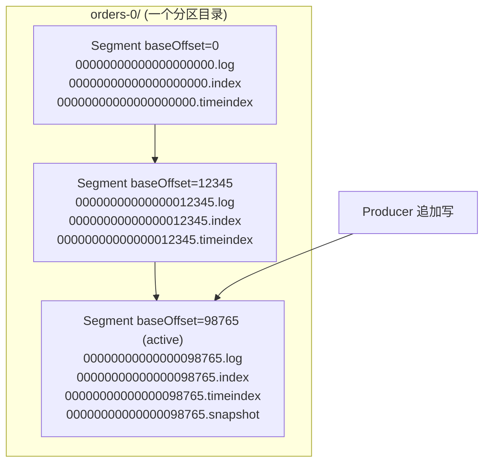
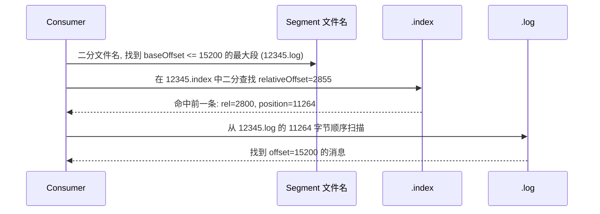
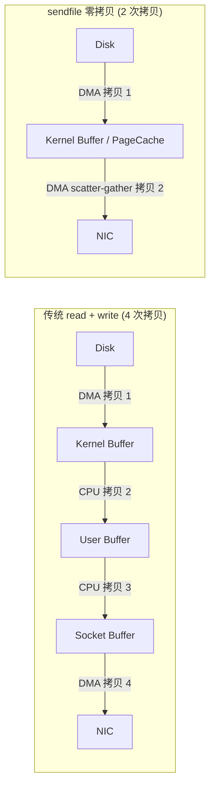
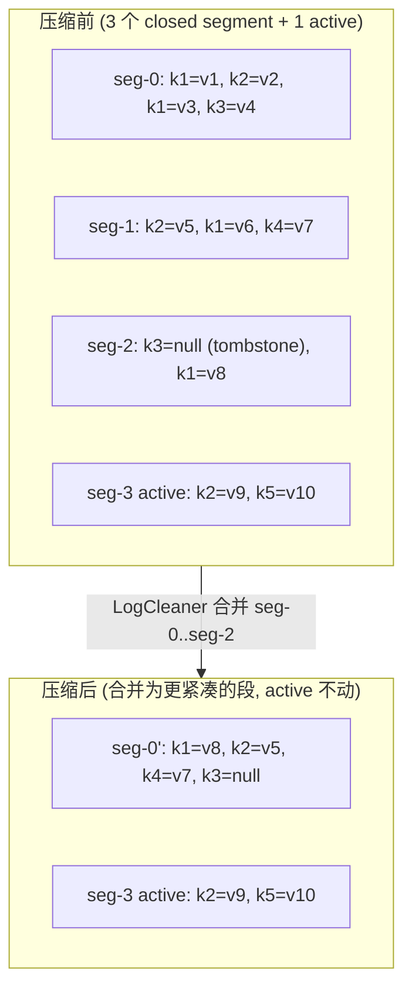

# Kafka 存储机制与日志压缩

Kafka 之所以能在单机上做到百万级 TPS, 核心秘密不在"内存里有多少黑科技", 而在它把磁盘用对了: **顺序追加写 + 稀疏索引 + PageCache + 零拷贝**。这一章把存储层从目录结构、段文件、索引、保留策略一直讲到日志压缩, 帮你建立"我打开 broker 数据目录, 每个文件是什么、什么时候出现、什么时候消失"的完整心智模型。

如果你还没读过前面几章, 建议先回顾 [[03-核心-Producer 生产者机制]] 和 [[04-核心-Consumer 消费者与位移管理]], 再进入存储层。

---

## 1. 存储目录结构

每个 broker 在 `server.properties` 里配置 `log.dirs` (允许多个目录, 逗号分隔, 用于 JBOD):

```properties
log.dirs=/data1/kafka-logs,/data2/kafka-logs
num.recovery.threads.per.data.dir=4
```

在每个 `log.dirs` 下, **一个 partition 对应一个子目录**, 命名为 `<topic>-<partition>`:

```
/data1/kafka-logs/
├── orders-0/
│   ├── 00000000000000000000.log
│   ├── 00000000000000000000.index
│   ├── 00000000000000000000.timeindex
│   ├── 00000000000000012345.log
│   ├── 00000000000000012345.index
│   ├── 00000000000000012345.timeindex
│   ├── 00000000000000012345.snapshot
│   ├── leader-epoch-checkpoint
│   └── partition.metadata
├── orders-1/
├── __consumer_offsets-12/
└── meta.properties
```

| 文件 | 作用 |
|------|------|
| `.log` | 实际消息数据, 追加写 |
| `.index` | 偏移量稀疏索引 (offset → 文件物理位置) |
| `.timeindex` | 时间戳稀疏索引 (timestamp → offset) |
| `.snapshot` | 幂等/事务生产者的 producer 状态快照 |
| `leader-epoch-checkpoint` | leader epoch 与起始 offset 映射, 用于截断 |
| `partition.metadata` | KRaft 模式下的 partition 元数据 |

> [!note] 一个分区 = 一个目录 = 多个段文件
> 千万别误以为一个 partition 是一个大文件。它是一个目录, 里面有滚动产生的多个段 (segment), 每段又由 `.log` + `.index` + `.timeindex` 三件套组成。

---

## 2. LogSegment 段文件

Kafka 不会把一个 partition 写成无限大的单文件, 而是按规则切成一个个 **LogSegment**:

| 参数 | 默认值 | 含义 |
|------|--------|------|
| `log.segment.bytes` | 1 GiB | 单段最大字节数, 写满即滚动 |
| `log.roll.ms` / `log.roll.hours` | 7 天 | 即使没写满, 时间到也会滚动 |
| `log.index.size.max.bytes` | 10 MiB | 索引文件最大大小 |
| `log.index.interval.bytes` | 4 KiB | 每写多少消息字节追加一条索引 |

任意时刻, 每个 partition 只有**一个 active segment** (当前写入段), 其余都是已封闭段 (closed)。

### 2.1 文件命名: baseOffset

文件名是该段内**第一条消息的 offset**, 左侧补 0 到 20 位:

```
00000000000000000000.log   # baseOffset = 0
00000000000000012345.log   # baseOffset = 12345
00000000000000098765.log   # baseOffset = 98765, active
```

这样命名的好处: 想定位 offset = 15000 的消息, 直接对所有 `.log` 文件名做二分, 选 `baseOffset <= 15000` 的最大值 (`12345.log`), 即可锁定段。

> [!tip] 文件名就是索引
> Kafka 的"段级"查找其实是个文件系统级二分, 根本不需要再维护一份段索引。简单而高效, 是非常典型的"用约定代替配置"。

### 2.2 单分区段结构图



---

## 3. 索引文件: 稀疏索引

`.index` 与 `.timeindex` 都是**稀疏索引** (Sparse Index): 不是每条消息一条索引项, 而是每写入 `log.index.interval.bytes` (默认 4 KiB) 才追加一条。

### 3.1 .index 偏移量索引

每项 8 字节 = 4 字节相对 offset + 4 字节物理位置:

```
relativeOffset (4B) | position (4B)
        100         |     4096
        250         |     8192
        410         |    12288
        ...
```

- `relativeOffset = absoluteOffset - baseOffset`, 用相对值省空间
- `position` 是 `.log` 文件内的字节偏移

### 3.2 .timeindex 时间戳索引

每项 12 字节 = 8 字节时间戳 + 4 字节相对 offset:

```
timestamp (8B)        | relativeOffset (4B)
1716800000000         |       100
1716800030000         |       250
1716800060000         |       410
```

用于 `KafkaConsumer.offsetsForTimes()` 按时间回溯。

### 3.3 查找流程

定位 `offset = 15200` 的消息:



> [!note] 为什么用稀疏索引
> 稠密索引 (每条消息一项) 在写入百亿消息的场景下索引会比数据还大, 完全无法接受。稀疏索引牺牲一点"最后一公里"的扫描时间 (最多扫 4 KiB), 换来 99% 以上的内存与磁盘节省, 而且 4 KiB 通常一次 PageCache 命中就读完了, 实际开销可忽略。

---

## 4. 顺序写 + PageCache + 零拷贝

这一节是面试高频, 必须能在白板上画出来。

### 4.1 顺序写 vs 随机写

机械磁盘随机写 IOPS 约 100, 顺序写带宽可到 100+ MB/s, **差距 600 倍以上**; 即便 SSD, 顺序写也比随机写寿命更长、放大更小。Kafka 永远只在 active segment 末尾 `append`, 是教科书级别的顺序写场景。

### 4.2 PageCache: 把内存让给操作系统

Kafka 不维护自己的消息缓存, 而是把所有"缓存"工作交给 Linux PageCache:

- 写: `write()` 先进 PageCache, 再异步刷盘
- 读: `read()` 命中 PageCache 直接返回, 不读盘
- 重启不丢缓存 (只要进程重启而不是机器重启)
- 与 JVM 堆解耦, 避免大堆 GC 抖动

所以 Kafka 推荐 **堆 4 GiB ~ 6 GiB** 就够, 其余物理内存全留给 PageCache。

### 4.3 零拷贝 sendfile

传统从磁盘文件发送到 socket 要经历 **4 次拷贝 + 4 次上下文切换**:



| 维度 | 传统 read+write | sendfile (零拷贝) |
|------|----------------|------------------|
| 拷贝次数 | 4 | 2 |
| 上下文切换 | 4 | 2 |
| 是否经过用户态 | 是 | 否 |
| CPU 参与拷贝 | 是 | 否 (全 DMA) |

Kafka 通过 Java NIO 的 `FileChannel.transferTo()` 调用底层 `sendfile(2)`。**前提是数据不需要在用户态处理**, 这也是 Kafka 不在 broker 端做消息解码、不做服务端过滤的根本原因 (除非启用 SSL 或某些拦截器, 会回退到非零拷贝路径)。

> [!warning] SSL 会破坏零拷贝
> 启用 SSL/TLS 后, 数据必须在用户态做加密, sendfile 无法使用, 吞吐通常下降 20%~40%。生产环境如果一定要 SSL, 优先考虑 PLAINTEXT + 网络层隔离 (VPC/ACL) 的方案, 或使用 KIP-712 的 KIP-714 类优化。

---

## 5. 数据保留策略 (Cleanup Policy)

`cleanup.policy` 决定 Kafka 如何回收旧数据, 取值: `delete`, `compact`, `compact,delete`。

### 5.1 delete (默认): 按时间/大小淘汰

| 参数 | 默认值 | 说明 |
|------|--------|------|
| `log.retention.hours` | 168 (7 天) | 保留时长, 也有 minutes / ms 版本 |
| `log.retention.bytes` | -1 (不限) | 单分区最大字节数 |
| `log.retention.check.interval.ms` | 5 分钟 | 后台检查周期 |

任一条件命中, 整个 segment 会被删除 (不会删半个段)。所以**单段大小**直接影响**保留精度**。

### 5.2 compact: 按 key 保留最新值

只要相同 key 的新消息到达, 旧的就可以被回收, 适合表达"状态快照"语义。典型用户:

- `__consumer_offsets`: 内置主题, 保存每个 (group, topic, partition) 的最新位移
- Kafka Streams 的 state store changelog
- CDC 场景中"表的最新快照"

### 5.3 compact,delete 组合

既按 key 去重, 又按时间删除超期 key。适合"想要最新值快照, 但又不想保留已下线 key"的场景, 例如用户在线状态: 用户下线后超过 30 天的 key 整体清除。

| Policy | 适合数据特征 | 典型场景 |
|--------|------------|---------|
| `delete` | 事件流, 关心时间窗口 | 日志、订单事件、埋点 |
| `compact` | 有 key 的最新状态 | 配置变更、用户画像快照 |
| `compact,delete` | 有 key 状态 + 过期清理 | 在线状态、会话信息 |

---

## 6. 日志压缩 (Log Compaction) 详解

### 6.1 核心规则

Log Compaction 由后台 **LogCleaner 线程** (`log.cleaner.threads`, 默认 1) 完成, 它读取已封闭的 segment, 按 key 去重, 重写出新的 segment。

> [!important] active segment 永远不参与压缩
> 正在写入的段 (active) 不会被压缩。所以你刚写入的同 key 的旧值不会立刻消失, 必须等段滚动后 + LogCleaner 触发后才会被回收。

### 6.2 触发条件: dirty ratio

LogCleaner 维护两个区段:

- **clean**: 已被压缩过的部分 (低 offset 段)
- **dirty**: 未被压缩、自上次压缩以来追加的部分 (高 offset 段, 不含 active)

```
dirty ratio = dirty bytes / (clean bytes + dirty bytes)
```

当 `dirty ratio >= min.cleanable.dirty.ratio` (默认 0.5) **且**满足 `min.compaction.lag.ms` (消息最短"保鲜期", 默认 0) 时, 触发压缩。同时受 `max.compaction.lag.ms` (强制压缩上限) 保护。

### 6.3 tombstone 墓碑消息

要从 compacted topic 里**真正删除一个 key**, 不是用 DELETE 命令, 而是写一条 `value=null` 的消息:

```java
producer.send(new ProducerRecord<>("user-state", "user-42", null));
```

LogCleaner 看到 tombstone 后, 会:

1. 在下次压缩中删除该 key 之前的所有版本
2. 把 tombstone 自己保留 `delete.retention.ms` (默认 24 小时), 以便下游消费者有时间感知"该 key 被删除"
3. 超过该时长后, 下次压缩才会把 tombstone 也删掉

> [!warning] 不要把 tombstone 当 DELETE 用
> tombstone 一样会经过完整的生产-复制-消费链路, 不是"立即从磁盘抹除"。在 GDPR/合规场景下, 你需要的是**整 topic delete + 重建**, 而不是 tombstone。

### 6.4 压缩前后变化



注意:

- `k1` 保留最新的 `v8`, 旧的 `v1/v3/v6` 都被回收
- `k3` 的 tombstone 暂时保留, 24 小时后再清
- active 段中的 `k2=v9` 还不会覆盖 compacted 段, 要等 active 滚动

### 6.5 关键参数总览

| 参数                          | 默认       | 作用                                |
| --------------------------- | -------- | --------------------------------- |
| `cleanup.policy`            | delete   | delete / compact / compact,delete |
| `min.cleanable.dirty.ratio` | 0.5      | 触发压缩的比例                           |
| `min.compaction.lag.ms`     | 0        | 消息最少多久后才能被压缩                      |
| `max.compaction.lag.ms`     | LONG_MAX | 强制压缩的最长延迟                         |
| `delete.retention.ms`       | 86400000 | tombstone 保留时长                    |
| `segment.ms`                | 7 天      | 段时间滚动                             |
| `log.cleaner.threads`       | 1        | 后台清理线程数                           |

---

## 7. 数据可靠性: flush 与 OS 协作

Kafka 默认**不主动调用 fsync**, 完全依赖 OS 的 PageCache 与脏页回写机制。原因: 副本机制 (ISR + acks=all) 提供的耐久性比单机 fsync 更强, 详见 [[05-核心-副本机制与 ISR]]。

| 参数                                | 默认       | 说明              |
| --------------------------------- | -------- | --------------- |
| `log.flush.interval.messages`     | LONG_MAX | 每多少条消息 fsync 一次 |
| `log.flush.interval.ms`           | null     | 每多少毫秒 fsync 一次  |
| `log.flush.scheduler.interval.ms` | LONG_MAX | 调度器检查频率         |

> [!danger] 不要随便开启 flush.messages
> 在多副本架构下, 强制 fsync 几乎不能提高耐久性, 反而会让吞吐下降一个数量级。除非你只有一个副本且业务无法忍受机器掉电丢数据, 否则**保持默认**。

---

## 8. 磁盘故障与多目录 JBOD

Kafka 支持在 `log.dirs` 里配置多个目录, 每个目录建议挂在不同物理盘上 (JBOD, Just a Bunch Of Disks), 而**不**推荐做 RAID-10 + 单目录:

| 方案 | 优点 | 缺点 |
|------|------|------|
| 单目录 + RAID-10 | 容错强, 运维简单 | 浪费一半容量, RAID 控制器是瓶颈 |
| 多目录 JBOD | 容量利用率高, IO 并行好 | 单盘故障会让该盘上的副本 offline |

KIP-112/113 后, 单盘故障不会让整个 broker 下线, 只是该盘上的分区会被标记为 offline, 由其他 broker 上的副本接管。配合 `replica.failure.detection.timeout.ms` 调参, JBOD 已经是绝大多数生产集群的首选。

---

## 9. 消息格式演进: v0 / v1 / v2

| 版本 | 引入版本 | 关键特性 |
|------|---------|---------|
| v0 | 0.8.x | 最原始, 无时间戳, 单条消息为单位 |
| v1 | 0.10.0 | 引入消息时间戳, 仍是单条消息 |
| v2 | 0.11.0 | **RecordBatch** 批次格式, 变长编码 (Varint), 批头集中存元数据, 支持事务与幂等 |

v2 的关键优化:

1. **批次共享头部**: timestamp delta、offset delta 等都相对 batch 起点编码, 整批共享 producerId、epoch、压缩类型
2. **Varint 变长编码**: 小整数只占 1 字节, 大幅减小体积
3. **批级 CRC**: 校验粒度从单条提升到批, 减少计算
4. **支持事务标记**: control batch 用于 commit/abort 标记

> [!example] v2 RecordBatch 结构示意
> ```
> BaseOffset | Length | PartitionLeaderEpoch | Magic(=2) | CRC | Attributes
>   | LastOffsetDelta | FirstTimestamp | MaxTimestamp
>   | ProducerId | ProducerEpoch | BaseSequence
>   | Records[ ... 多条变长 Record ... ]
> ```

升级 broker/客户端时, 二者会通过 `ApiVersionsRequest` 协商使用的格式; 老客户端连接新 broker 时, 新 broker 会做**下转换 (down-conversion)**, 但这会使 sendfile 失效, 是常见的性能陷阱。统一升级客户端是最佳实践。

---

## 10. 实战: 给一个 compacted topic 写最新状态

> [!example] Spring Boot 配置 + 原生 Producer 示例

```java
// 1. 创建一个 compacted topic
@Configuration
public class TopicConfig {
    @Bean
    public NewTopic userStateTopic() {
        return TopicBuilder.name("user-state")
                .partitions(6)
                .replicas(3)
                .config("cleanup.policy", "compact")
                .config("min.cleanable.dirty.ratio", "0.3")
                .config("segment.ms", String.valueOf(Duration.ofHours(1).toMillis()))
                .config("delete.retention.ms", String.valueOf(Duration.ofHours(6).toMillis()))
                .build();
    }
}

// 2. 写入与删除
@Service
@RequiredArgsConstructor
public class UserStateProducer {
    private final KafkaTemplate<String, String> kafka;

    public void upsert(String userId, String stateJson) {
        kafka.send("user-state", userId, stateJson);
    }

    public void delete(String userId) {
        // value = null 即为 tombstone
        kafka.send("user-state", userId, null);
    }
}
```

Python 对照 (confluent-kafka):

```python
from confluent_kafka import Producer

p = Producer({"bootstrap.servers": "localhost:9092"})

def upsert(user_id: str, state_json: str):
    p.produce("user-state", key=user_id, value=state_json)

def delete(user_id: str):
    p.produce("user-state", key=user_id, value=None)  # tombstone

p.flush()
```

Go 对照 (segmentio/kafka-go):

```go
w := &kafka.Writer{
    Addr:     kafka.TCP("localhost:9092"),
    Topic:    "user-state",
    Balancer: &kafka.Hash{},
}

// upsert
w.WriteMessages(ctx, kafka.Message{Key: []byte(userID), Value: []byte(stateJSON)})

// tombstone
w.WriteMessages(ctx, kafka.Message{Key: []byte(userID), Value: nil})
```

---

## 11. 常见面试题

> [!question] 1. 为什么 Kafka 用稀疏索引而不是稠密索引?
> 稠密索引在亿级消息下索引比数据还大, 内存放不下。稀疏索引牺牲最后 4 KiB 的顺序扫描, 换来索引体积下降两到三个数量级, 且这段扫描通常一次 PageCache 命中就完成, 几乎无开销。

> [!question] 2. 零拷贝省了哪几次拷贝?
> 传统 read+write 路径是: 磁盘 → 内核 PageCache → 用户态 buffer → socket buffer → 网卡, 共 4 次拷贝、4 次上下文切换。sendfile 跳过用户态, 内核 PageCache 直接通过 DMA scatter-gather 送到网卡, 减到 2 次拷贝、2 次上下文切换, CPU 不再参与数据搬运。

> [!question] 3. compact 和 delete 应该怎么选?
> 关键问题: 你关心的是"事件流"还是"key 的最新状态"。事件流 (订单、埋点、日志) 用 delete; 状态快照 (位移、配置、画像) 用 compact; 既要状态又要过期清理用 compact,delete。

> [!question] 4. tombstone 会保留多久?
> 由 `delete.retention.ms` 控制, 默认 24 小时。设计目的是给下游消费者足够的时间读到这条 tombstone, 感知到删除事件; 之后下一次压缩才会把它本身也清掉。

> [!question] 5. Kafka 为什么不主动 fsync?
> 单机 fsync 不能解决磁盘损坏问题, 真正的耐久性靠多副本同步 (`acks=all` + `min.insync.replicas`)。开启 fsync 会让吞吐下降一个数量级却几乎不增加可靠性, 是典型的"假努力"。

> [!question] 6. 同 partition 同 key 的旧消息为什么有时还能读到?
> 因为 active segment 不参与压缩; 同时新消息所在段必须先滚动, 再触发 dirty ratio, 才会启动 LogCleaner。compact topic 提供的是**最终保留最新值**, 不是实时去重。

> [!question] 7. 为什么不推荐 RAID-10, 而推荐 JBOD?
> Kafka 自身已有副本机制, RAID-10 等于在副本之上再做一次副本, 浪费 50% 容量与一半 IOPS。JBOD + 多目录可以让多盘并行, 单盘故障也只影响该盘上的分区。

---

## 12. 延伸阅读

- 官方文档: [Kafka Documentation - Log](https://kafka.apache.org/documentation/#log)
- KIP-32: 在 v1 消息格式中加入时间戳
- KIP-98: 幂等与事务的存储格式 (v2 RecordBatch)
- KIP-112 / KIP-113: JBOD 支持单盘故障
- KIP-405: Tiered Storage 分层存储 (把冷段下沉到对象存储)
- Jay Kreps, "The Log: What every software engineer should know about real-time data's unifying abstraction"
- Martin Kleppmann, 《数据密集型应用系统设计》第 11 章: 流处理

继续阅读:

- 上一篇: [[05-核心-副本机制与 ISR]]
- 下一篇: [[07-进阶-事务与精确一次语义]]
- 相关: [[08-运维-监控指标与性能调优]]、[[09-运维-集群部署与容量规划]]
