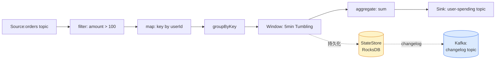
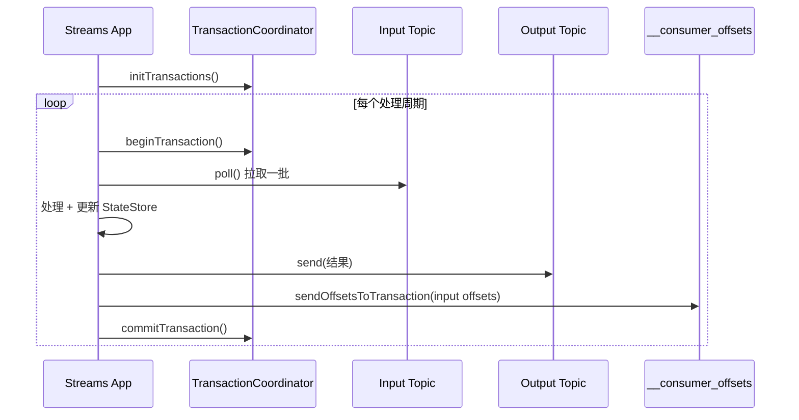
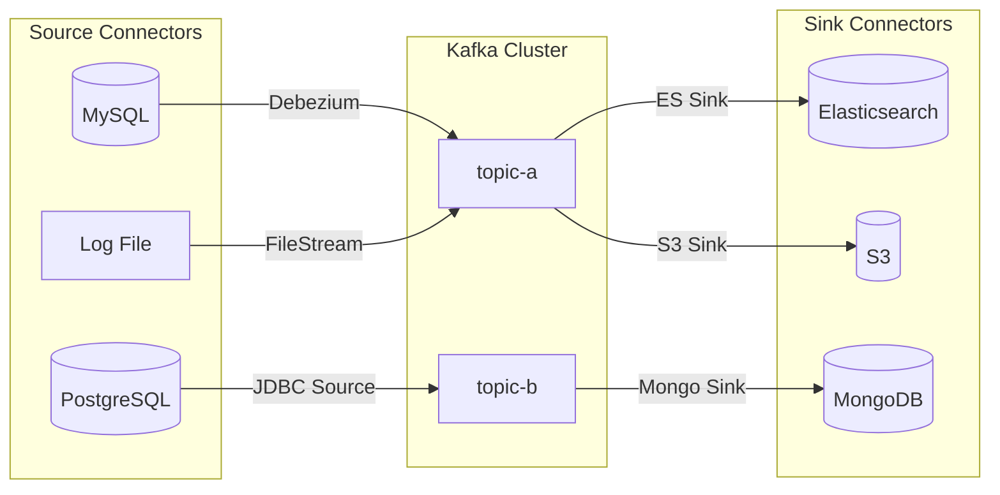
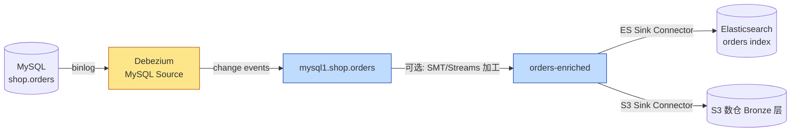
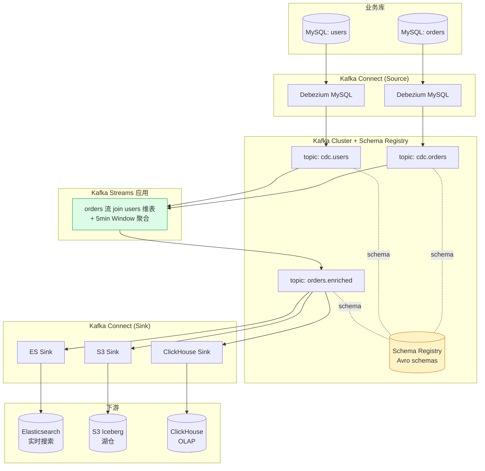

# 第 7 章 高级篇:Kafka 生态三大件

聊到这里,你应该已经掌握了 Broker、Topic、Producer、Consumer、ISR、事务这些"内功"。但 Kafka 真正在企业里跑起来,光有 Broker 还不够 —— 你需要 **流处理**、**数据集成**、**模式管理** 这三块拼图,才能凑成一套实时数据平台。

这一章我们就把 Kafka 官方/Confluent 生态里最重要的三件套讲透:

- **Kafka Streams**:轻量级流处理库,把消费者 + 状态 + 时间窗口打包到你自己的 JVM 进程里。
- **Kafka Connect**:数据集成框架,负责把数据库、文件系统、ES、S3 这些外部系统和 Kafka 之间的"搬运"工作标准化。
- **Schema Registry**:消息 Schema 的"中央户籍",解决 Avro/Protobuf 演进与兼容性问题。

如果你还没看过前几章,建议先回顾一下 [[06-事务与ExactlyOnce语义]] 和 [[05-存储与日志结构]],因为本章会反复用到事务与 offset 提交的相关知识。

---

## 一、Kafka Streams:藏在你应用里的流处理引擎

### 1.1 定位:它不是一个集群

很多新人一听到"流处理"就想到 Flink、Spark Streaming,然后下意识地问:"Kafka Streams 的 JobManager 在哪儿?TaskManager 怎么部署?"

> [!warning] 重要认知
> **Kafka Streams 没有任何独立的集群组件**。它就是一个 Java 库(Maven 依赖 `kafka-streams`),你把它嵌入到你自己的 Spring Boot 或者普通 Java 进程里,启动几个实例,它就靠 **Consumer Group 的 rebalance 机制** 自动做并行与容错。

这带来一个非常爽的体验:你的"流处理应用"和你的"业务 Web 应用"在部署形态上没有任何区别 —— 一个 Jar,一个 Docker 镜像,K8s Deployment 拉起来就完事。

> [!tip] 什么时候选 Kafka Streams,什么时候选 Flink?
> - 数据 **完全在 Kafka 里、处理逻辑不复杂、运维想简化** → Kafka Streams
> - 需要 **多源 Join(Kafka + MySQL + HDFS)、复杂状态、CEP、机器学习** → Flink
> - 已经有一套 Spark 离线体系,想复用 → Spark Structured Streaming

### 1.2 核心抽象:KStream / KTable / GlobalKTable

这三个东西是理解 Streams 的钥匙,务必嚼烂。

| 抽象 | 语义 | 类比 |
|---|---|---|
| **KStream** | 一条不可变的事件流,每条记录是独立的事实(append-only) | 数据库的 redo log、用户点击流 |
| **KTable** | 一个可变的"当前状态"快照,同 key 后到的记录会覆盖前者 | 数据库表、用户余额 |
| **GlobalKTable** | 全量广播到所有实例的 KTable,用于做"维表 Join" | 全量复制的字典表 |

> [!note] 双重性(Stream-Table Duality)
> KStream 和 KTable 可以互相转换:
> - `KStream.groupByKey().reduce(...)` → 得到 KTable(把流"压实"成最新状态)
> - `KTable.toStream()` → 把每一次状态变更作为事件流出去(就是 changelog)
>
> 这就是 Kafka Streams 最深刻的思想:**流和表是同一份数据的两种视图**。

### 1.3 Topology 拓扑:数据流是怎么跑起来的

Streams 应用的本质是一张有向无环图(Topology),由 **Source → Processor → Sink** 节点组成。



![[Pasted image 20260603141356.png]]

几个关键点:

1. **StateStore 默认基于 RocksDB**,放在本地磁盘,读写极快。
2. 每个 StateStore 都对应一个 **changelog topic**,这就是容错的秘密 —— 实例挂了,新实例从 changelog 重放即可恢复状态。
3. 并行度由输入 topic 的 partition 数决定,一个 partition 就是一个 task,task 不会跨实例迁移到一半。

### 1.4 时间窗口:Tumbling / Hopping / Session

> [!example] 三种窗口的直观差别
>
> 假设事件时间轴是 `0 1 2 3 4 5 6 7 8 9 10`:
>
> - **Tumbling(滚动)** 窗口大小 5:`[0,5) [5,10)`,不重叠、不遗漏。最常用,做"每 5 分钟 PV"。
> - **Hopping(跳跃)** 窗口大小 5、步长 2:`[0,5) [2,7) [4,9) ...`,有重叠,适合做"滑动平均"。
> - **Session(会话)** 没有固定边界,以"用户空闲超过 N 分钟"为切分,适合做"一次访问的行为路径"。

### 1.5 Stream-Stream Join vs Stream-Table Join

| 类型 | 是否需要窗口 | 典型场景 |
|---|---|---|
| Stream-Stream Join | **必须**,两边都是无界流,得用 window 限定 | 订单流 join 支付流,5 分钟内匹配 |
| Stream-Table Join | 不需要,Table 是"当前状态",随时可查 | 订单流 join 用户维表,补全用户城市 |
| Stream-GlobalTable Join | 不需要,且 **不要求 key 相同**(因为全量广播) | 订单流 join 全量商品类目表 |

### 1.6 完整代码:WordCount + Window 聚合

下面是一个稍微"超纲"的 WordCount —— 按 1 分钟滚动窗口统计词频,并启用 exactly-once。

```java
// pom.xml
// <dependency>
//   <groupId>org.apache.kafka</groupId>
//   <artifactId>kafka-streams</artifactId>
//   <version>3.7.0</version>
// </dependency>

import org.apache.kafka.common.serialization.Serdes;
import org.apache.kafka.streams.*;
import org.apache.kafka.streams.kstream.*;
import java.time.Duration;
import java.util.Arrays;
import java.util.Properties;

public class WindowedWordCount {
    public static void main(String[] args) {
        Properties props = new Properties();
        props.put(StreamsConfig.APPLICATION_ID_CONFIG, "windowed-wc-v1");
        props.put(StreamsConfig.BOOTSTRAP_SERVERS_CONFIG, "kafka:9092");
        props.put(StreamsConfig.DEFAULT_KEY_SERDE_CLASS_CONFIG, Serdes.String().getClass());
        props.put(StreamsConfig.DEFAULT_VALUE_SERDE_CLASS_CONFIG, Serdes.String().getClass());

        // 关键:端到端 exactly-once
        props.put(StreamsConfig.PROCESSING_GUARANTEE_CONFIG, StreamsConfig.EXACTLY_ONCE_V2);
        props.put(StreamsConfig.NUM_STANDBY_REPLICAS_CONFIG, 1); // 备份副本加速故障切换

        StreamsBuilder builder = new StreamsBuilder();

        KStream<String, String> textLines = builder.stream("text-input");

        KTable<Windowed<String>, Long> wordCounts = textLines
            .flatMapValues(value -> Arrays.asList(value.toLowerCase().split("\\W+")))
            .filter((k, word) -> word.length() > 1)
            .groupBy((k, word) -> word)
            .windowedBy(TimeWindows.ofSizeAndGrace(
                Duration.ofMinutes(1), Duration.ofSeconds(10))) // 允许 10s 延迟数据
            .count(Materialized.as("counts-store"));

        wordCounts.toStream()
            .map((wKey, cnt) -> KeyValue.pair(
                wKey.key() + "@" + wKey.window().startTime(),
                String.valueOf(cnt)))
            .to("wordcount-output");

        KafkaStreams streams = new KafkaStreams(builder.build(), props);
        Runtime.getRuntime().addShutdownHook(new Thread(streams::close));
        streams.start();
    }
}
```

> [!tip] 调试 Streams 应用的两个神器
> - `streams.cleanUp()` 在 **本地开发** 改了拓扑后调用,清掉本地 RocksDB 和 changelog 偏移
> - 通过 REST 或 `KafkaStreams#queryMetadataForKey` 做 **Interactive Queries**,直接查 StateStore,不用再起一个查询服务

### 1.7 端到端 exactly-once 的实现

`EXACTLY_ONCE_V2`(Kafka 2.5+ 推荐)本质上把"读取-处理-写入-提交 offset"打包进一个 Kafka 事务:



更深的事务原理见 [[06-事务与ExactlyOnce语义]]。

### 1.8 与 Flink / Spark Streaming 横向对比

| 维度 | Kafka Streams | Flink | Spark Structured Streaming |
|---|---|---|---|
| 部署形态 | 嵌入式库,无独立集群 | 独立集群(JM + TM) | 共用 Spark 集群 |
| 输入源 | **只能 Kafka** | 几乎所有(Kafka/JDBC/File...) | 几乎所有 |
| 延迟 | 毫秒级 | 毫秒级 | 微批,通常秒级(Continuous 模式可降低) |
| 状态后端 | RocksDB + Kafka changelog | RocksDB / 内存 + Checkpoint | 内存 + HDFS |
| Exactly-Once | ✓ 端到端(基于 Kafka 事务) | ✓ 端到端(2PC) | ✓ 端到端(幂等 sink) |
| 学习曲线 | 平缓,Java DSL | 较陡,概念多 | 中等,SQL 友好 |
| 运维成本 | 极低 | 中高 | 中 |

---

## 二、Kafka Connect:把数据"搬运"工作标准化

### 2.1 它解决什么问题?

公司里你大概率见过这种代码:写一个 Java 服务,定时从 MySQL 查增量数据,塞进 Kafka;再写一个,从 Kafka 消费,写进 Elasticsearch。三个月之后,这种"搬运工"服务能写一抽屉,而且每个都自己实现一套 offset 管理、重试、监控,惨不忍睹。

> [!question] Kafka Connect 的核心价值是什么?
> 把 **"外部系统 ↔ Kafka"** 之间的搬运工作抽象成统一框架,你只需要声明 JSON 配置,剩下的并行度、offset 管理、故障重启、metrics、REST 管控,Connect 框架全包了。

### 2.2 Source vs Sink



- **Source Connector**:外部 → Kafka(写入 topic)
- **Sink Connector**:Kafka → 外部(消费 topic)

### 2.3 Standalone vs Distributed 模式

| 模式 | 进程数 | 配置存储 | 适用场景 |
|---|---|---|---|
| Standalone | 单进程 | 本地 properties 文件 | 本地调试、跑一次性任务 |
| **Distributed** | 多进程集群,通过 group.id 协调 | 配置/offset/状态都存 Kafka 内部 topic | **生产环境唯一选择** |

Distributed 模式的核心是三个内部 topic:

- `connect-configs`(compacted):存所有 connector 的配置
- `connect-offsets`(compacted):存 source connector 的源端 offset(比如 binlog 位点)
- `connect-status`(compacted):存 connector 与 task 的状态

> [!warning] 这三个 topic 必须手动创建为 **compacted**,且 `replication.factor >= 3`,否则集群重启数据就丢了。

### 2.4 REST API 管理

Connect 集群所有操作都走 REST API(默认 8083 端口),没有任何 GUI 是"原生"的(Confluent Control Center / Kafka UI 是套壳)。

```bash
# 列出所有 connector
curl http://connect:8083/connectors

# 创建一个 Debezium MySQL Source
curl -X POST http://connect:8083/connectors \
  -H "Content-Type: application/json" \
  -d '{
    "name": "mysql-orders-cdc",
    "config": {
      "connector.class": "io.debezium.connector.mysql.MySqlConnector",
      "tasks.max": "1",
      "database.hostname": "mysql",
      "database.port": "3306",
      "database.user": "debezium",
      "database.password": "dbz",
      "database.server.id": "184054",
      "topic.prefix": "mysql1",
      "database.include.list": "shop",
      "table.include.list": "shop.orders",
      "schema.history.internal.kafka.bootstrap.servers": "kafka:9092",
      "schema.history.internal.kafka.topic": "schema-history.shop"
    }
  }'

# 查看状态
curl http://connect:8083/connectors/mysql-orders-cdc/status

# 重启失败的 task
curl -X POST http://connect:8083/connectors/mysql-orders-cdc/tasks/0/restart

# 删除
curl -X DELETE http://connect:8083/connectors/mysql-orders-cdc
```

### 2.5 实战:Debezium MySQL → Kafka → Elasticsearch

这是企业里 **最经典的实时数仓/搜索同步链路**。



> [!example] Debezium 一条 INSERT 事件长这样
> ```json
> {
>   "before": null,
>   "after": { "id": 1001, "user_id": 42, "amount": 199.00 },
>   "source": { "ts_ms": 1716800000123, "db": "shop", "table": "orders" },
>   "op": "c",
>   "ts_ms": 1716800000456
> }
> ```
> 对应 UPDATE 事件 `before` 和 `after` 都有;DELETE 事件 `after` 为 null,且会跟一条 tombstone(value=null)用于让 compacted topic 清掉这个 key。

### 2.6 SMT:Single Message Transform

SMT 是在 Connector 链路上做"轻量级"消息加工的机制,无需上 Streams/Flink。

常用 SMT:

| SMT | 作用 |
|---|---|
| `InsertField` | 给消息加一个固定字段(比如 source 名) |
| `RenameField` | 字段改名 |
| `ExtractField` | 提取嵌套字段到顶层 |
| `MaskField` | 脱敏(脱掉手机号、邮箱) |
| `RegexRouter` | 改 topic 名,比如把 `mysql1.shop.orders` 重写成 `orders` |
| `ReplaceField` | 黑/白名单字段 |

```json
"transforms": "unwrap,route",
"transforms.unwrap.type": "io.debezium.transforms.ExtractNewRecordState",
"transforms.route.type": "org.apache.kafka.connect.transforms.RegexRouter",
"transforms.route.regex": "mysql1\\.shop\\.(.*)",
"transforms.route.replacement": "$1"
```

> [!tip] SMT 是"逐条同步"的,不要在 SMT 里做 Join 或者重 IO。需要 Join 就上 Streams/Flink。

---

## 三、Schema Registry:消息格式的"户籍管理"

### 3.1 为什么需要 Schema Registry

> [!question] 不用 Schema Registry 行不行?
> 行,但你迟早被坑。考虑这个场景:
>
> 1. Producer V1 发的消息字段是 `{user, amount}`
> 2. Producer V2 改成了 `{user, amount, currency}`
> 3. Producer V3 干脆把 `amount` 改成了 `String`
>
> 下游 100 个 Consumer 怎么办?有的会反序列化报错,有的悄悄丢数据,排查起来欲哭无泪。

Schema Registry 把所有消息的 schema **集中存管**,并强制对每次 schema 变更做 **兼容性校验**,从根上杜绝"上游随手改一下,下游全线挂掉"的灾难。

### 3.2 消息线上格式

Confluent 序列化器把 schema id 嵌进 payload:

```
+----------------+---------------------+--------------------+
| Magic Byte (1) | Schema ID (4 bytes) | Avro Payload (...)|
|     = 0x00     |   big-endian int    |   实际二进制数据   |
+----------------+---------------------+--------------------+
```

Consumer 拿到消息,先取出 4 字节 schema id,去 Schema Registry 查到对应 schema,然后才反序列化 payload。这意味着 **payload 里不含字段名**,极度节省网络/磁盘空间。

> [!warning] 不要手撕这种格式
> 如果你绕过 `KafkaAvroSerializer` 自己写字节流,务必记得 magic byte;否则 Connect / ksqlDB 等下游会全部反序列化失败,且报错信息很迷惑(`Unknown magic byte`)。

### 3.3 兼容性策略

| 策略 | 谁先升级 | 允许的变更 | 典型场景 |
|---|---|---|---|
| **BACKWARD**(默认) | **Consumer 先升级** | 新 schema 可以读老数据:可删字段、可加 **有默认值** 的字段 | 最常用 |
| **FORWARD** | **Producer 先升级** | 老 schema 可以读新数据:可加字段、可删 **有默认值** 的字段 | 历史数据需要被新 Consumer 读 |
| **FULL** | 任意顺序 | BACKWARD ∩ FORWARD,只能加/删 **有默认值** 的字段 | 严苛环境(金融) |
| **NONE** | 无校验 | 想怎么改怎么改 | **生产禁用** |

每种策略还有 `_TRANSITIVE` 变种(BACKWARD_TRANSITIVE 等),表示 **新 schema 必须兼容所有历史版本**,而非仅最新一版。

> [!danger] 兼容性陷阱:加字段必须给默认值
> Avro 里加一个没有 default 的字段,即使是 BACKWARD 策略也会被拒。这条规则坑过无数新人。

### 3.4 完整 Avro Producer / Consumer 示例

**Schema 文件 `Order.avsc`:**

```json
{
  "type": "record",
  "namespace": "com.shop.events",
  "name": "Order",
  "fields": [
    {"name": "orderId", "type": "long"},
    {"name": "userId",  "type": "long"},
    {"name": "amount",  "type": "double"},
    {"name": "currency","type": "string", "default": "CNY"}
  ]
}
```

**Producer:**

```java
import io.confluent.kafka.serializers.KafkaAvroSerializer;
import io.confluent.kafka.serializers.AbstractKafkaSchemaSerDeConfig;
import org.apache.kafka.clients.producer.*;
import org.apache.avro.generic.GenericData;
import org.apache.avro.Schema;
import java.util.Properties;

public class AvroOrderProducer {
    public static void main(String[] args) throws Exception {
        Properties p = new Properties();
        p.put(ProducerConfig.BOOTSTRAP_SERVERS_CONFIG, "kafka:9092");
        p.put(ProducerConfig.KEY_SERIALIZER_CLASS_CONFIG,
              "org.apache.kafka.common.serialization.StringSerializer");
        p.put(ProducerConfig.VALUE_SERIALIZER_CLASS_CONFIG, KafkaAvroSerializer.class);
        p.put(AbstractKafkaSchemaSerDeConfig.SCHEMA_REGISTRY_URL_CONFIG,
              "http://schema-registry:8081");
        // 推荐:发送前自动注册并校验兼容性
        p.put(AbstractKafkaSchemaSerDeConfig.AUTO_REGISTER_SCHEMAS, true);

        Schema schema = new Schema.Parser().parse(
            AvroOrderProducer.class.getResourceAsStream("/Order.avsc"));

        try (Producer<String, GenericData.Record> producer = new KafkaProducer<>(p)) {
            GenericData.Record record = new GenericData.Record(schema);
            record.put("orderId", 1001L);
            record.put("userId",  42L);
            record.put("amount",  199.99);
            record.put("currency", "USD");

            producer.send(new ProducerRecord<>("orders", "1001", record)).get();
        }
    }
}
```

**Consumer(Python 版,看着轻松点):**

```python
# pip install confluent-kafka[avro]
from confluent_kafka import DeserializingConsumer
from confluent_kafka.schema_registry import SchemaRegistryClient
from confluent_kafka.schema_registry.avro import AvroDeserializer

sr = SchemaRegistryClient({"url": "http://schema-registry:8081"})

consumer = DeserializingConsumer({
    "bootstrap.servers": "kafka:9092",
    "group.id": "orders-py-consumer",
    "auto.offset.reset": "earliest",
    "key.deserializer": lambda v, ctx: v.decode() if v else None,
    "value.deserializer": AvroDeserializer(sr),  # 自动按 schema id 拉 schema
})

consumer.subscribe(["orders"])
while True:
    msg = consumer.poll(1.0)
    if msg is None: continue
    if msg.error(): print(msg.error()); continue
    order = msg.value()  # 已是 dict
    print(f"order={order['orderId']} user={order['userId']} amount={order['amount']}")
```

**Go 版的快速版本:**

```go
// github.com/confluentinc/confluent-kafka-go/v2/kafka
// github.com/confluentinc/confluent-kafka-go/v2/schemaregistry
// github.com/confluentinc/confluent-kafka-go/v2/schemaregistry/serde/avrov2
sr, _ := schemaregistry.NewClient(schemaregistry.NewConfig("http://schema-registry:8081"))
deser, _ := avrov2.NewDeserializer(sr, serde.ValueSerde, avrov2.NewDeserializerConfig())

for {
    msg, err := consumer.ReadMessage(-1)
    if err != nil { continue }
    var order Order
    _ = deser.DeserializeInto("orders", msg.Value, &order)
    fmt.Printf("%+v\n", order)
}
```

### 3.5 替代品:Apicurio Registry

Confluent Schema Registry 的协议是开放的,但 **JAR 是 Confluent Community License**,有商用条款限制。如果你公司法务严格,可以选 Red Hat 的 **Apicurio Registry**:

- 完全 Apache 2.0
- 兼容 Confluent API(就是把 URL 换一下,序列化器照用)
- 支持的格式更多:Avro / Protobuf / JSON Schema / OpenAPI / GraphQL / WSDL...
- 存储后端可插拔(Kafka / SQL / 文件)

---

## 四、三件套联动:做一套实时数仓

把前面所有东西串起来,看看一个典型的 **CDC + 流处理 + 数据湖** 架构怎么搭:



整条链路的特性:

- **CDC** 用 Debezium,无侵入,延迟亚秒
- **Schema** 用 Avro + Schema Registry,字段演进可控
- **流处理** 用 Kafka Streams,做 Join + 聚合,exactly-once
- **数据落地** 用 Connect Sink,扇出到搜索/湖/OLAP

> [!tip] 实战经验
> - **千万别在 Streams 里直接读写外部数据库**,会破坏 exactly-once 保证。需要的外部数据通过 Connect 同步到 Kafka,再 join。
> - 给每个 Connector 单独设置 `tasks.max`,Source 通常 = 表数/分片数,Sink 通常 = topic partition 数。
> - 监控指标重点关注 Connect 的 `connector-task-metrics` 和 Streams 的 **lag**(过去 1 分钟 < 1 万条算正常)。

---

## 五、常见面试题

> [!question] Q1:Kafka Streams 和 Flink 的最大区别?
> Kafka Streams 是 **嵌入式库**,没有独立集群,容错完全靠 Consumer Group 的 rebalance 和 changelog topic;Flink 是 **独立分布式计算引擎**,有 JobManager/TaskManager,支持任意数据源,checkpoint 机制更通用。简单场景选 Streams,复杂多源场景选 Flink。

> [!question] Q2:Kafka Streams 的 StateStore 怎么做容错?
> 每个 StateStore 背后对应一个 **changelog topic**(默认 compacted)。每次状态更新都会异步写入 changelog。当 task 迁移到新实例,新实例会先从 changelog 重放,把 RocksDB 状态恢复,再开始处理新数据。配合 `num.standby.replicas` 可以做热备,减少恢复时间。

> [!question] Q3:Kafka Connect Distributed 模式的"配置"存哪儿?
> 存在 3 个内部 compacted topic:`connect-configs`(配置)、`connect-offsets`(source 端 offset,如 binlog 位点)、`connect-status`(状态)。所以 Connect Worker 是无状态的,挂了重启或扩容只需要拉起新进程,自动从 topic 恢复。

> [!question] Q4:Schema Registry 的 BACKWARD 兼容是什么意思?
> 新 schema **能反序列化用老 schema 写的数据**。允许:删字段、加带 default 的字段。意味着 **Consumer 必须先升级**(因为新 Consumer 能读新老所有数据,但老 Consumer 看到新字段会困惑)。

> [!question] Q5:Avro 消息里为啥不带字段名?Consumer 怎么知道字段?
> 消息开头 1 字节 magic byte + 4 字节 schema id,Consumer 拿 id 去 Schema Registry 查到完整 schema,再按 schema 顺序解析 payload。这种设计让 Avro 二进制极度紧凑,字段数越多越省。

> [!question] Q6:为什么不在 Kafka Streams 里直接查 MySQL 补充字段?
> 1. **破坏 exactly-once**:外部 IO 不在 Kafka 事务里,失败重试会重复
> 2. **延迟不可控**:MySQL 一抖动,整个流处理 lag 爆炸
> 3. **没有 backpressure**:打爆 MySQL
>
> 正确做法:用 Debezium 把 MySQL 维表同步到 Kafka topic,在 Streams 里做 GlobalKTable join。

> [!question] Q7:SMT 能不能做 Join?
> 不能。SMT 是 **逐条无状态** 的转换,只能做字段层面的轻量修改。需要 Join 必须上 Kafka Streams / ksqlDB / Flink。

---

## 六、延伸阅读

- 官方文档:[Kafka Streams Developer Guide](https://kafka.apache.org/documentation/streams/)
- 官方文档:[Kafka Connect](https://kafka.apache.org/documentation/#connect)
- Confluent:[Schema Registry Compatibility](https://docs.confluent.io/platform/current/schema-registry/avro.html)
- 书籍:**《Kafka: The Definitive Guide, 2nd Edition》** —— 第 11~14 章
- 书籍:**《Designing Data-Intensive Applications》** —— 第 11 章 "Stream Processing"
- Debezium 实战:[debezium.io/documentation](https://debezium.io/documentation/)
- 替代方案:[Apicurio Registry](https://www.apicur.io/registry/)
- ksqlDB(Streams 的 SQL 化):[ksqldb.io](https://ksqldb.io/)

---

## 本系列其他章节

- [[01-基础-Kafka架构与核心概念]]
- [[02-Producer生产者深入]]
- [[03-Consumer消费者与消费组]]
- [[04-Broker与集群运维]]
- [[05-存储与日志结构]]
- [[06-事务与ExactlyOnce语义]]
- **[[07-高级-KafkaStreams与Connect与SchemaRegistry]]** ← 你在这里
- [[08-性能调优与监控告警]]
